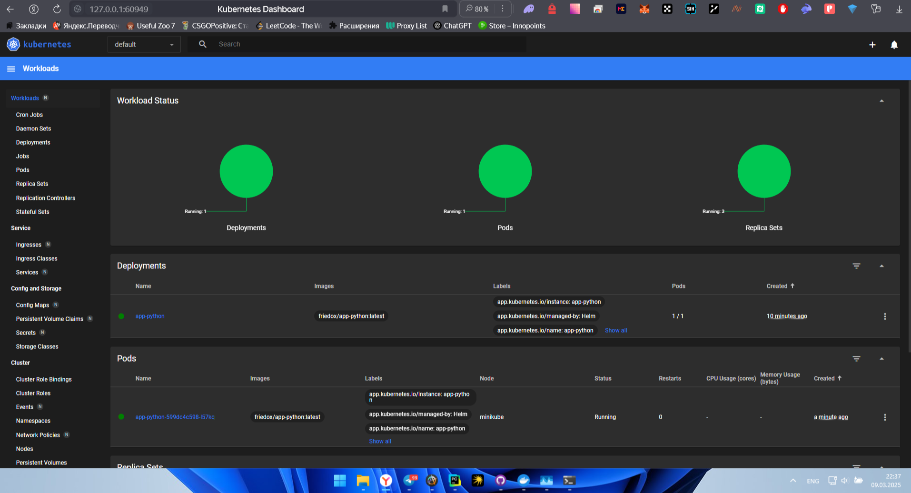

# Helm

Installing helm chart:

```bash
helm install app-python ./app-python
```

```text
NAME: app-python
LAST DEPLOYED: Sun Mar  9 22:26:49 2025
NAMESPACE: default
STATUS: deployed
REVISION: 1
NOTES:
1. Get the application URL by running these commands:
  export POD_NAME=$(kubectl get pods --namespace default -l "app.kubernetes.io/name=app-python,app.kubernetes.io/instance=app-python" -o jsonpath="{.items[0].metadata.name}")
  export CONTAINER_PORT=$(kubectl get pod --namespace default $POD_NAME -o jsonpath="{.spec.containers[0].ports[0].containerPort}")
  echo "Visit http://127.0.0.1:8080 to use your application"
  kubectl --namespace default port-forward $POD_NAME 8080:$CONTAINER_PORT
```

Minikube dashboard:



```bash
minikube service app-python
```

```text
|-----------|------------|-------------|--------------|
| NAMESPACE |    NAME    | TARGET PORT |     URL      |
|-----------|------------|-------------|--------------|
| default   | app-python |             | No node port |
|-----------|------------|-------------|--------------|
😿  service default/app-python has no node port
❗  Services [default/app-python] have type "ClusterIP" not meant to be exposed, however for local development minikube allows you to access this !
🏃  Starting tunnel for service app-python.
|-----------|------------|-------------|------------------------|
| NAMESPACE |    NAME    | TARGET PORT |          URL           |
|-----------|------------|-------------|------------------------|
| default   | app-python |             | http://127.0.0.1:60929 |
|-----------|------------|-------------|------------------------|
🎉  Opening service default/app-python in default browser...
❗  Because you are using a Docker driver on windows, the terminal needs to be open to run it.
```

```bash
kubectl get pods,svc
```

```text
NAME                              READY   STATUS    RESTARTS   AGE
pod/app-python-599dc4c598-l57kq   1/1     Running   0          3m22s

NAME                 TYPE        CLUSTER-IP      EXTERNAL-IP   PORT(S)    AGE
service/app-python   ClusterIP   10.101.228.35   <none>        5000/TCP   12m
service/kubernetes   ClusterIP   10.96.0.1       <none>        443/TCP    73m
```

## Task 2

Implemented hooks include `pre-install.yaml` and `post-install.yaml`.

Lint

```bash
helm lint ./app-python
```

```text
==> Linting ./app-python
[INFO] Chart.yaml: icon is recommended

1 chart(s) linted, 0 chart(s) failed
```

Dry run

```bash
helm install --dry-run helm-hooks ./app-python
```

```text
NAME: helm-hooks
LAST DEPLOYED: Sun Mar  9 23:09:23 2025
NAMESPACE: default
STATUS: pending-install
REVISION: 1
HOOKS:
---
# Source: app-python/templates/tests/test-connection.yaml
apiVersion: v1
kind: Pod
metadata:
  name: "helm-hooks-app-python-test-connection"
  labels:
    helm.sh/chart: app-python-0.1.0
    app.kubernetes.io/name: app-python
    app.kubernetes.io/instance: helm-hooks
    app.kubernetes.io/version: "1.16.0"
    app.kubernetes.io/managed-by: Helm
  annotations:
    "helm.sh/hook": test
spec:
  containers:
    - name: wget
      image: busybox
      command: ['wget']
      args: ['helm-hooks-app-python:5000']
  restartPolicy: Never
---
# Source: app-python/templates/post-install.yaml
apiVersion: batch/v1
kind: Job
metadata:
  name: post-install-hook
  annotations:
    "helm.sh/hook": post-install
spec:
  template:
    spec:
      restartPolicy: Never
      containers:
        - name: post-install-job
          image: busybox
          command: [ 'sh', '-c', 'echo The post-install hook is running && sleep 15' ]
---
# Source: app-python/templates/pre-install.yaml
apiVersion: batch/v1
kind: Job
metadata:
  name: preinstall-hook
  annotations:
    "helm.sh/hook": pre-install
spec:
  template:
    spec:
      restartPolicy: Never
      containers:
        - name: pre-install-job
          image: busybox
          command: [ 'sh', '-c', 'echo The pre-install hook is running && sleep 20' ]
MANIFEST:
---
# Source: app-python/templates/serviceaccount.yaml
apiVersion: v1
kind: ServiceAccount
metadata:
  name: helm-hooks-app-python
  labels:
    helm.sh/chart: app-python-0.1.0
    app.kubernetes.io/name: app-python
    app.kubernetes.io/instance: helm-hooks
    app.kubernetes.io/version: "1.16.0"
    app.kubernetes.io/managed-by: Helm
automountServiceAccountToken: true
---
# Source: app-python/templates/service.yaml
apiVersion: v1
kind: Service
metadata:
  name: helm-hooks-app-python
  labels:
    helm.sh/chart: app-python-0.1.0
    app.kubernetes.io/name: app-python
    app.kubernetes.io/instance: helm-hooks
    app.kubernetes.io/version: "1.16.0"
    app.kubernetes.io/managed-by: Helm
spec:
  type: ClusterIP
  ports:
    - port: 5000
      targetPort: http
      protocol: TCP
      name: http
  selector:
    app.kubernetes.io/name: app-python
    app.kubernetes.io/instance: helm-hooks
---
# Source: app-python/templates/deployment.yaml
apiVersion: apps/v1
kind: Deployment
metadata:
  name: helm-hooks-app-python
  labels:
    helm.sh/chart: app-python-0.1.0
    app.kubernetes.io/name: app-python
    app.kubernetes.io/instance: helm-hooks
    app.kubernetes.io/version: "1.16.0"
    app.kubernetes.io/managed-by: Helm
spec:
  replicas: 1
  selector:
    matchLabels:
      app.kubernetes.io/name: app-python
      app.kubernetes.io/instance: helm-hooks
  template:
    metadata:
      labels:
        helm.sh/chart: app-python-0.1.0
        app.kubernetes.io/name: app-python
        app.kubernetes.io/instance: helm-hooks
        app.kubernetes.io/version: "1.16.0"
        app.kubernetes.io/managed-by: Helm
    spec:
      serviceAccountName: helm-hooks-app-python
      containers:
        - name: app-python
          image: "friedox/app-python:latest"
          imagePullPolicy: IfNotPresent
          ports:
            - name: http
              containerPort: 5000
              protocol: TCP
          livenessProbe:
            httpGet:
              path: /
              port: http
          readinessProbe:
            httpGet:
              path: /
              port: http

NOTES:
1. Get the application URL by running these commands:
  export POD_NAME=$(kubectl get pods --namespace default -l "app.kubernetes.io/name=app-python,app.kubernetes.io/instance=helm-hooks" -o jsonpath="{.items[0].metadata.name}")
  export CONTAINER_PORT=$(kubectl get pod --namespace default $POD_NAME -o jsonpath="{.spec.containers[0].ports[0].containerPort}")
  echo "Visit http://127.0.0.1:8080 to use your application"
  kubectl --namespace default port-forward $POD_NAME 8080:$CONTAINER_PORT
```

Check hooks

```bash
kubectl get po
```

```text
 kubectl get po
NAME                                     READY   STATUS      RESTARTS   AGE
app-python-599dc4c598-l57kq              1/1     Running     0          33m
post-install-hook-d9zm7                  0/1     Completed   0          63s
preinstall-hook-hlkwh                    0/1     Completed   0          92s
```

Describe hooks

pre install

```bash
kubectl describe po preinstall-hook-hlkwh  
```

```text
Name:             preinstall-hook-hlkwh
Namespace:        default
Priority:         0
Service Account:  default
Node:             minikube/192.168.49.2
Start Time:       Sun, 09 Mar 2025 23:08:16 +0300
Labels:           batch.kubernetes.io/controller-uid=c0ea96fd-d042-48fd-9a1d-6777112210de
                  batch.kubernetes.io/job-name=preinstall-hook
                  controller-uid=c0ea96fd-d042-48fd-9a1d-6777112210de
                  job-name=preinstall-hook
Annotations:      <none>
Status:           Succeeded
IP:               10.244.0.91
IPs:
  IP:           10.244.0.91
Controlled By:  Job/preinstall-hook
Containers:
  pre-install-job:
    Container ID:  docker://6419494541f1f89720a99e206c3902ee14ed2e318cbb6045216ef6a5e8011f6b
    Image:         busybox
    Image ID:      docker-pullable://busybox@sha256:498a000f370d8c37927118ed80afe8adc38d1edcbfc071627d17b25c88efcab0
    Port:          <none>
    Host Port:     <none>
    Command:
      sh
      -c
      echo The pre-install hook is running && sleep 20
    State:          Terminated
      Reason:       Completed
      Exit Code:    0
      Started:      Sun, 09 Mar 2025 23:08:21 +0300
      Finished:     Sun, 09 Mar 2025 23:08:41 +0300
    Ready:          False
    Restart Count:  0
    Environment:    <none>
    Mounts:
      /var/run/secrets/kubernetes.io/serviceaccount from kube-api-access-vmgmf (ro)
Conditions:
  Type                        Status
  PodReadyToStartContainers   False
  Initialized                 True
  Ready                       False
  ContainersReady             False
  PodScheduled                True
Volumes:
  kube-api-access-vmgmf:
    Type:                    Projected (a volume that contains injected data from multiple sources)
    TokenExpirationSeconds:  3607
    ConfigMapName:           kube-root-ca.crt
    ConfigMapOptional:       <nil>
    DownwardAPI:             true
QoS Class:                   BestEffort
Node-Selectors:              <none>
Tolerations:                 node.kubernetes.io/not-ready:NoExecute op=Exists for 300s
                             node.kubernetes.io/unreachable:NoExecute op=Exists for 300s
Events:
  Type    Reason     Age    From               Message
  ----    ------     ----   ----               -------
  Normal  Scheduled  2m45s  default-scheduler  Successfully assigned default/preinstall-hook-hlkwh to minikube
  Normal  Pulling    2m44s  kubelet            Pulling image "busybox"
  Normal  Pulled     2m41s  kubelet            Successfully pulled image "busybox" in 3.356s (3.356s including waiting). Image size: 4269694 bytes.
  Normal  Created    2m41s  kubelet            Created container: pre-install-job
  Normal  Started    2m41s  kubelet            Started container pre-install-job
```

post install

```bash
kubectl describe po post-install-hook-d9zm7
```

```text
Name:             post-install-hook-d9zm7
Namespace:        default
Priority:         0
Service Account:  default
Node:             minikube/192.168.49.2
Start Time:       Sun, 09 Mar 2025 23:08:45 +0300
Labels:           batch.kubernetes.io/controller-uid=a29afec7-dfd0-4ed6-a128-8ee5836fab84
                  batch.kubernetes.io/job-name=post-install-hook
                  controller-uid=a29afec7-dfd0-4ed6-a128-8ee5836fab84
                  job-name=post-install-hook
Annotations:      <none>
Status:           Succeeded
IP:               10.244.0.93
IPs:
  IP:           10.244.0.93
Controlled By:  Job/post-install-hook
Containers:
  post-install-job:
    Container ID:  docker://53e22dab92668118b3eb66796f963f9ea563d5f283d4509e571ab43ddd9d5f7b
    Image:         busybox
    Image ID:      docker-pullable://busybox@sha256:498a000f370d8c37927118ed80afe8adc38d1edcbfc071627d17b25c88efcab0
    Port:          <none>
    Host Port:     <none>
    Command:
      sh
      -c
      echo The post-install hook is running && sleep 15
    State:          Terminated
      Reason:       Completed
      Exit Code:    0
      Started:      Sun, 09 Mar 2025 23:08:50 +0300
      Finished:     Sun, 09 Mar 2025 23:09:05 +0300
    Ready:          False
    Restart Count:  0
    Environment:    <none>
    Mounts:
      /var/run/secrets/kubernetes.io/serviceaccount from kube-api-access-96lfz (ro)
Conditions:
  Type                        Status
  PodReadyToStartContainers   False
  Initialized                 True
  Ready                       False
  ContainersReady             False
  PodScheduled                True
Volumes:
  kube-api-access-96lfz:
    Type:                    Projected (a volume that contains injected data from multiple sources)
    TokenExpirationSeconds:  3607
    ConfigMapName:           kube-root-ca.crt
    ConfigMapOptional:       <nil>
    DownwardAPI:             true
QoS Class:                   BestEffort
Node-Selectors:              <none>
Tolerations:                 node.kubernetes.io/not-ready:NoExecute op=Exists for 300s
                             node.kubernetes.io/unreachable:NoExecute op=Exists for 300s
Events:
  Type    Reason     Age    From               Message
  ----    ------     ----   ----               -------
  Normal  Scheduled  2m31s  default-scheduler  Successfully assigned default/post-install-hook-d9zm7 to minikube
  Normal  Pulling    2m29s  kubelet            Pulling image "busybox"
  Normal  Pulled     2m27s  kubelet            Successfully pulled image "busybox" in 2.073s (2.073s including waiting). Image size: 4269694 bytes.
  Normal  Created    2m27s  kubelet            Created container: post-install-job
  Normal  Started    2m27s  kubelet            Started container post-install-job
```

5.

```bash
kubectl get pods,svc
```

```text
NAME                                         READY   STATUS      RESTARTS   AGE
pod/app-python-599dc4c598-l57kq              1/1     Running     0          36m
pod/helm-hooks-app-python-8459dcdf7c-cfxjc   1/1     Running     0          4m28s
pod/post-install-hook-d9zm7                  0/1     Completed   0          4m28s
pod/preinstall-hook-hlkwh                    0/1     Completed   0          4m57s

NAME                            TYPE        CLUSTER-IP      EXTERNAL-IP   PORT(S)    AGE
service/app-python              ClusterIP   10.101.228.35   <none>        5000/TCP   46m
service/helm-hooks-app-python   ClusterIP   10.99.52.16     <none>        5000/TCP   4m28s
service/kubernetes              ClusterIP   10.96.0.1       <none>        443/TCP    107m
```