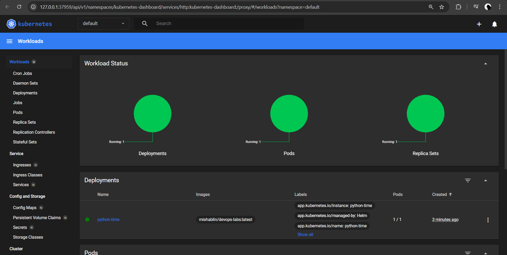

# Helm

Installing helm chart:

```bash
helm install python-time python-time/
```

```text
NAME: python-time
LAST DEPLOYED: Mon Feb 24 22:34:28 2025
NAMESPACE: default
STATUS: deployed
REVISION: 1
NOTES:
1. Get the application URL by running these commands:
  export POD_NAME=$(kubectl get pods --namespace default -l "app.kubernetes.io/name=python-time,app.kubernetes.io/instance=python-time" -o jsonpath="{.items[0].metadata.name}")
  export CONTAINER_PORT=$(kubectl get pod --namespace default $POD_NAME -o jsonpath="{.spec.containers[0].ports[0].containerPort}")
  echo "Visit http://127.0.0.1:8080 to use your application"
  kubectl --namespace default port-forward $POD_NAME 8080:$CONTAINER_PORT
```

Minikube dashboard:



```bash
minikube service python-time
```

Output:

```text
|-----------|-------------|-------------|--------------|
| NAMESPACE |    NAME     | TARGET PORT |     URL      |
|-----------|-------------|-------------|--------------|
| default   | python-time |             | No node port |
|-----------|-------------|-------------|--------------|
😿  service default/python-time has no node port
❗  Services [default/python-time] have type "ClusterIP" not meant to be exposed, however for local development minikube allows you to access this !
🏃  Starting tunnel for service python-time.
|-----------|-------------|-------------|------------------------|
| NAMESPACE |    NAME     | TARGET PORT |          URL           |
|-----------|-------------|-------------|------------------------|
| default   | python-time |             | http://127.0.0.1:33035 |
|-----------|-------------|-------------|------------------------|
🎉  Opening service default/python-time in default browser...
👉  http://127.0.0.1:33035
❗  Because you are using a Docker driver on linux, the terminal needs to be open to run it.
```

```bash
kubectl get pods,svc
```

Output:

```text
NAME                               READY   STATUS    RESTARTS   AGE
pod/python-time-6686549678-snrtr   1/1     Running   0          5m44s

NAME                  TYPE        CLUSTER-IP    EXTERNAL-IP   PORT(S)    AGE
service/kubernetes    ClusterIP   10.96.0.1     <none>        443/TCP    16m
service/python-time   ClusterIP   10.109.0.47   <none>        5000/TCP   5m44
```

## Task 2

Implemented hooks include `pre-install.yaml` and `post-install.yaml`.

Command:

```bash
helm lint python-time/
```

Outputs:

```text
==> Linting python-time/
[INFO] Chart.yaml: icon is recommended

1 chart(s) linted, 0 chart(s) failed
```

Command:

```bash
helm install --dry-run helm-hooks python-time/
```

Outputs:

```text
NAME: helm-hooks
LAST DEPLOYED: Mon Feb 24 23:39:19 2025
NAMESPACE: default
STATUS: pending-install
REVISION: 1
HOOKS:
---
# Source: python-time/templates/tests/test-connection.yaml
apiVersion: v1
kind: Pod
metadata:
  name: "helm-hooks-python-time-test-connection"
  labels:
    helm.sh/chart: python-time-0.1.0
    app.kubernetes.io/name: python-time
    app.kubernetes.io/instance: helm-hooks
    app.kubernetes.io/version: "1.16.0"
    app.kubernetes.io/managed-by: Helm
  annotations:
    "helm.sh/hook": test
spec:
  containers:
    - name: wget
      image: busybox
      command: ['wget']
      args: ['helm-hooks-python-time:5000']
  restartPolicy: Never
---
# Source: python-time/templates/post-install.yaml
apiVersion: batch/v1
kind: Job
metadata:
  name: post-install-hook
  annotations:
    "helm.sh/hook": post-install
    "helm.sh/hook-delete-policy": hook-succeeded
spec:
  template:
    spec:
      restartPolicy: Never
      containers:
        - name: post-install-job
          image: busybox
          command: [ 'sh', '-c', 'echo The post-install hook is running && sleep 15' ]
---
# Source: python-time/templates/pre-install.yaml
apiVersion: v1
kind: Job
metadata:
  name: preinstall-hook
  annotations:
    "helm.sh/hook": pre-install
    "helm.sh/hook-delete-policy": hook-succeeded
spec:
  template:
    spec:
      restartPolicy: Never
      containers:
        - name: pre-install-job
          image: busybox
          command: [ 'sh', '-c', 'echo The pre-install hook is running && sleep 20' ]
MANIFEST:
---
# Source: python-time/templates/serviceaccount.yaml
apiVersion: v1
kind: ServiceAccount
metadata:
  name: helm-hooks-python-time
  labels:
    helm.sh/chart: python-time-0.1.0
    app.kubernetes.io/name: python-time
    app.kubernetes.io/instance: helm-hooks
    app.kubernetes.io/version: "1.16.0"
    app.kubernetes.io/managed-by: Helm
automountServiceAccountToken: true
---
# Source: python-time/templates/service.yaml
apiVersion: v1
kind: Service
metadata:
  name: helm-hooks-python-time
  labels:
    helm.sh/chart: python-time-0.1.0
    app.kubernetes.io/name: python-time
    app.kubernetes.io/instance: helm-hooks
    app.kubernetes.io/version: "1.16.0"
    app.kubernetes.io/managed-by: Helm
spec:
  type: ClusterIP
  ports:
    - port: 5000
      targetPort: http
      protocol: TCP
      name: http
  selector:
    app.kubernetes.io/name: python-time
    app.kubernetes.io/instance: helm-hooks
---
# Source: python-time/templates/deployment.yaml
apiVersion: apps/v1
kind: Deployment
metadata:
  name: helm-hooks-python-time
  labels:
    helm.sh/chart: python-time-0.1.0
    app.kubernetes.io/name: python-time
    app.kubernetes.io/instance: helm-hooks
    app.kubernetes.io/version: "1.16.0"
    app.kubernetes.io/managed-by: Helm
spec:
  replicas: 1
  selector:
    matchLabels:
      app.kubernetes.io/name: python-time
      app.kubernetes.io/instance: helm-hooks
  template:
    metadata:
      labels:
        helm.sh/chart: python-time-0.1.0
        app.kubernetes.io/name: python-time
        app.kubernetes.io/instance: helm-hooks
        app.kubernetes.io/version: "1.16.0"
        app.kubernetes.io/managed-by: Helm
    spec:
      serviceAccountName: helm-hooks-python-time
      containers:
        - name: python-time
          image: "mishablin/devops-labs:latest"
          imagePullPolicy: IfNotPresent
          ports:
            - name: http
              containerPort: 5000
              protocol: TCP
          livenessProbe:
            httpGet:
              path: /
              port: http
          readinessProbe:
            httpGet:
              path: /
              port: http

NOTES:
1. Get the application URL by running these commands:
  export POD_NAME=$(kubectl get pods --namespace default -l "app.kubernetes.io/name=python-time,app.kubernetes.io/instance=helm-hooks" -o jsonpath="{.items[0].metadata.name}")
  export CONTAINER_PORT=$(kubectl get pod --namespace default $POD_NAME -o jsonpath="{.spec.containers[0].ports[0].containerPort}")
  echo "Visit http://127.0.0.1:8080 to use your application"
  kubectl --namespace default port-forward $POD_NAME 8080:$CONTAINER_PORT
```

Command:

```bash
kubectl get po
```

Outputs:

```text
NAME                           READY   STATUS      RESTARTS   AGE
post-install-hook-g7nxh        0/1     Completed   0          31s
preinstall-hook-v9bc5          0/1     Completed   0          59s
python-time-6686549678-pbjqf   1/1     Running     0          31s
```

Command:

```bash
kubectl describe po preinstall-hook-v9bc5
```

Outputs:

```text
Name:             preinstall-hook-v9bc5
Namespace:        default
Priority:         0
Service Account:  default
Node:             minikube/192.168.49.2
Start Time:       Mon, 24 Feb 2025 23:45:56 +0300
Labels:           batch.kubernetes.io/controller-uid=ca7115f3-74b4-47d0-95ea-114e74ac6647
                  batch.kubernetes.io/job-name=preinstall-hook
                  controller-uid=ca7115f3-74b4-47d0-95ea-114e74ac6647
                  job-name=preinstall-hook
Annotations:      <none>
Status:           Succeeded
IP:               10.244.0.16
IPs:
  IP:           10.244.0.16
Controlled By:  Job/preinstall-hook
Containers:
  pre-install-job:
    Container ID:  docker://5f86ea0e22e1bceee3b58afab048a54ab1c694f1f7e57eb66c4134551c08301e
    Image:         busybox
    Image ID:      docker-pullable://busybox@sha256:498a000f370d8c37927118ed80afe8adc38d1edcbfc071627d17b25c88efcab0
    Port:          <none>
    Host Port:     <none>
    Command:
      sh
      -c
      echo The pre-install hook is running && sleep 20
    State:          Terminated
      Reason:       Completed
      Exit Code:    0
      Started:      Mon, 24 Feb 2025 23:45:58 +0300
      Finished:     Mon, 24 Feb 2025 23:46:21 +0300
    Ready:          False
    Restart Count:  0
    Environment:    <none>
    Mounts:
      /var/run/secrets/kubernetes.io/serviceaccount from kube-api-access-l5zl7 (ro)
Conditions:
  Type                        Status
  PodReadyToStartContainers   False
  Initialized                 True
  Ready                       False
  ContainersReady             False
  PodScheduled                True
Volumes:
  kube-api-access-l5zl7:
    Type:                    Projected (a volume that contains injected data from multiple sources)
    TokenExpirationSeconds:  3607
    ConfigMapName:           kube-root-ca.crt
    ConfigMapOptional:       <nil>
    DownwardAPI:             true
QoS Class:                   BestEffort
Node-Selectors:              <none>
Tolerations:                 node.kubernetes.io/not-ready:NoExecute op=Exists for 300s
                             node.kubernetes.io/unreachable:NoExecute op=Exists for 300s
Events:
  Type    Reason     Age   From               Message
  ----    ------     ----  ----               -------
  Normal  Scheduled  105s  default-scheduler  Successfully assigned default/preinstall-hook-v9bc5 to minikube
  Normal  Pulling    105s  kubelet            Pulling image "busybox"
  Normal  Pulled     103s  kubelet            Successfully pulled image "busybox" in 1.518s (1.518s including waiting). Image size: 4269694 bytes.
  Normal  Created    103s  kubelet            Created container: pre-install-job
  Normal  Started    103s  kubelet            Started container pre-install-job
```

Command:

```bash
kubectl describe po post-install-hook-g7nxh
```

```text
Name:             post-install-hook-g7nxh
Namespace:        default
Priority:         0
Service Account:  default
Node:             minikube/192.168.49.2
Start Time:       Mon, 24 Feb 2025 23:46:24 +0300
Labels:           batch.kubernetes.io/controller-uid=666a1617-a1ef-4d46-b76e-75eceab530e3
                  batch.kubernetes.io/job-name=post-install-hook
                  controller-uid=666a1617-a1ef-4d46-b76e-75eceab530e3
                  job-name=post-install-hook
Annotations:      <none>
Status:           Succeeded
IP:               10.244.0.18
IPs:
  IP:           10.244.0.18
Controlled By:  Job/post-install-hook
Containers:
  post-install-job:
    Container ID:  docker://abed90b1191e575c06ecc8baa388de0f70c3ea07d0d245809d17f83d809d3781
    Image:         busybox
    Image ID:      docker-pullable://busybox@sha256:498a000f370d8c37927118ed80afe8adc38d1edcbfc071627d17b25c88efcab0
    Port:          <none>
    Host Port:     <none>
    Command:
      sh
      -c
      echo The post-install hook is running && sleep 15
    State:          Terminated
      Reason:       Completed
      Exit Code:    0
      Started:      Mon, 24 Feb 2025 23:46:26 +0300
      Finished:     Mon, 24 Feb 2025 23:46:44 +0300
    Ready:          False
    Restart Count:  0
    Environment:    <none>
    Mounts:
      /var/run/secrets/kubernetes.io/serviceaccount from kube-api-access-g7qv9 (ro)
Conditions:
  Type                        Status
  PodReadyToStartContainers   False
  Initialized                 True
  Ready                       False
  ContainersReady             False
  PodScheduled                True
Volumes:
  kube-api-access-g7qv9:
    Type:                    Projected (a volume that contains injected data from multiple sources)
    TokenExpirationSeconds:  3607
    ConfigMapName:           kube-root-ca.crt
    ConfigMapOptional:       <nil>
    DownwardAPI:             true
QoS Class:                   BestEffort
Node-Selectors:              <none>
Tolerations:                 node.kubernetes.io/not-ready:NoExecute op=Exists for 300s
                             node.kubernetes.io/unreachable:NoExecute op=Exists for 300s
Events:
  Type    Reason     Age    From               Message
  ----    ------     ----   ----               -------
  Normal  Scheduled  2m11s  default-scheduler  Successfully assigned default/post-install-hook-g7nxh to minikube
  Normal  Pulling    2m10s  kubelet            Pulling image "busybox"
  Normal  Pulled     2m9s   kubelet            Successfully pulled image "busybox" in 1.355s (1.355s including waiting). Image size: 4269694 bytes.
  Normal  Created    2m9s   kubelet            Created container: post-install-job
  Normal  Started    2m9s   kubelet            Started container post-install-job
```

Command:

(Without deletion policy)

```bash
kubectl get pods,svc
```

```text
NAME                               READY   STATUS      RESTARTS   AGE
pod/post-install-hook-g7nxh        0/1     Completed   0          2m52s
pod/preinstall-hook-v9bc5          0/1     Completed   0          3m20s
pod/python-time-6686549678-pbjqf   1/1     Running     0          2m52s

NAME                  TYPE        CLUSTER-IP    EXTERNAL-IP   PORT(S)    AGE
service/kubernetes    ClusterIP   10.96.0.1     <none>        443/TCP    75m
service/python-time   ClusterIP   10.97.141.0   <none>        5000/TCP   2m52s
```

Have a nice day!
