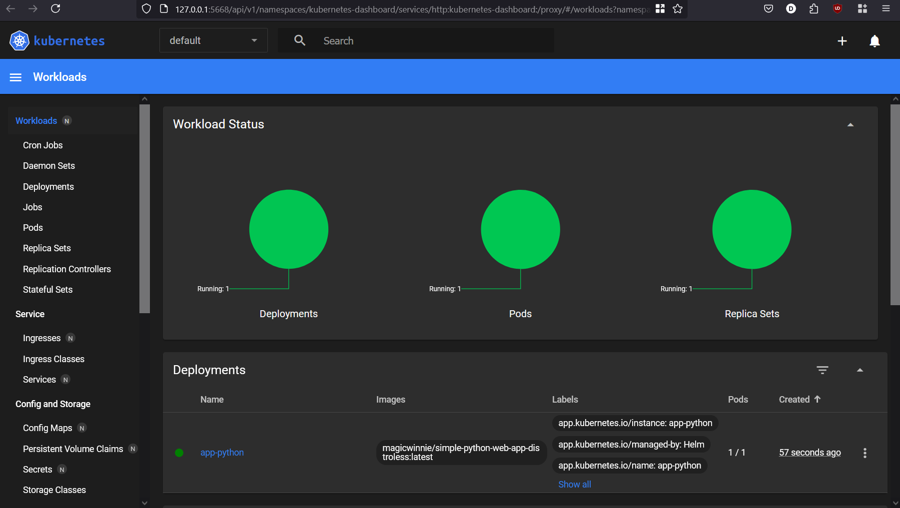
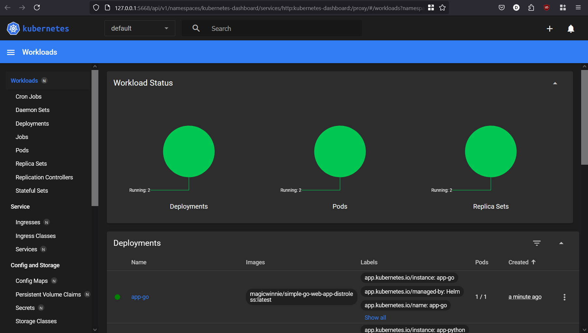

# Helm

## Task 1

### Install Helm Chart

```shell
>helm install --name-template=app-python app-python
NAME: app-python
LAST DEPLOYED: Tue Feb 25 21:38:37 2025
NAMESPACE: default
STATUS: deployed
REVISION: 1
NOTES:
1. Get the application URL by running these commands:
  export POD_NAME=$(kubectl get pods --namespace default -l "app.kubernetes.io/name=app-python,app.kubernetes.io/instance=app-python" -o jsonpath="{.items[0].metadata.name}")
  export CONTAINER_PORT=$(kubectl get pod --namespace default $POD_NAME -o jsonpath="{.spec.containers[0].ports[0].containerPort}")
  echo "Visit http://127.0.0.1:8080 to use your application"
  kubectl --namespace default port-forward $POD_NAME 8080:$CONTAINER_PORT
```

Verify in dashboard:



### Access Application

```shell
>minikube service app-python
|-----------|------------|-------------|--------------|
| NAMESPACE |    NAME    | TARGET PORT |     URL      |
|-----------|------------|-------------|--------------|
| default   | app-python |             | No node port |
|-----------|------------|-------------|--------------|
😿  service default/app-python has no node port
❗  Services [default/app-python] have type "ClusterIP" not meant to be exposed, however for local development minikube allows you to access this !
🏃  Starting tunnel for service app-python.
|-----------|------------|-------------|-----------------------|
| NAMESPACE |    NAME    | TARGET PORT |          URL          |
|-----------|------------|-------------|-----------------------|
| default   | app-python |             | http://127.0.0.1:5844 |
|-----------|------------|-------------|-----------------------|
🎉  Opening service default/app-python in default browser...
❗  Because you are using a Docker driver on windows, the terminal needs to be open to run it.
```

### Info about Application

```shell
>kubectl get pods,svc
NAME                              READY   STATUS    RESTARTS   AGE
pod/app-python-7b5c759b84-9j5hz   1/1     Running   0          4m5s

NAME                 TYPE        CLUSTER-IP       EXTERNAL-IP   PORT(S)    AGE
service/app-python   ClusterIP   10.110.128.114   <none>        8000/TCP   4m5s
service/kubernetes   ClusterIP   10.96.0.1        <none>        443/TCP    135m
```

## Task 2

### Troubleshoot

```shell
>helm lint app-python
==> Linting app-python
[INFO] Chart.yaml: icon is recommended

1 chart(s) linted, 0 chart(s) failed
```

```shell
>helm install --dry-run helm-hooks app-python
NAME: helm-hooks
LAST DEPLOYED: Tue Feb 25 21:50:12 2025
NAMESPACE: default
STATUS: pending-install
REVISION: 1
HOOKS:
---
# Source: app-python/templates/post-install-hook.yaml
apiVersion: v1
kind: Pod
metadata:
  name: postinstall-hook
  annotations:
    "helm.sh/hook": "post-install"
spec:
  containers:
    - name: post-install-container
      image: busybox
      imagePullPolicy: Always
      command: ["sh", "-c", "echo The post-install hook is running && sleep 15"]
      resources:
        requests:
          cpu: 100m
          memory: 128Mi
        limits:
          cpu: 300m
          memory: 512Mi
  restartPolicy: Never
  terminationGracePeriodSeconds: 0
---
# Source: app-python/templates/pre-install-hook.yaml
apiVersion: v1
kind: Pod
metadata:
  name: preinstall-hook
  annotations:
    "helm.sh/hook": "pre-install"
spec:
  containers:
    - name: pre-install-container
      image: busybox
      imagePullPolicy: IfNotPresent
      command: ["sh", "-c", "echo The pre-install hook is running && sleep 20"]
      resources:
        requests:
          cpu: 100m
          memory: 128Mi
        limits:
          cpu: 300m
          memory: 512Mi
  restartPolicy: Never
  terminationGracePeriodSeconds: 0
---
# Source: app-python/templates/tests/test-connection.yaml
apiVersion: v1
kind: Pod
metadata:
  name: "helm-hooks-app-python-test-connection"
  labels:
    helm.sh/chart: app-python-0.1.0
    app.kubernetes.io/name: app-python
    app.kubernetes.io/instance: helm-hooks
    app.kubernetes.io/version: "1.16.0"
    app.kubernetes.io/managed-by: Helm
  annotations:
    "helm.sh/hook": test
spec:
  containers:
    - name: wget
      image: busybox
      command: ['wget']
      args: ['helm-hooks-app-python:8000']
  restartPolicy: Never
MANIFEST:
---
# Source: app-python/templates/serviceaccount.yaml
apiVersion: v1
kind: ServiceAccount
metadata:
  name: helm-hooks-app-python
  labels:
    helm.sh/chart: app-python-0.1.0
    app.kubernetes.io/name: app-python
    app.kubernetes.io/instance: helm-hooks
    app.kubernetes.io/version: "1.16.0"
    app.kubernetes.io/managed-by: Helm
automountServiceAccountToken: true
---
# Source: app-python/templates/service.yaml
apiVersion: v1
kind: Service
metadata:
  name: helm-hooks-app-python
  labels:
    helm.sh/chart: app-python-0.1.0
    app.kubernetes.io/name: app-python
    app.kubernetes.io/instance: helm-hooks
    app.kubernetes.io/version: "1.16.0"
    app.kubernetes.io/managed-by: Helm
spec:
  type: ClusterIP
  ports:
    - port: 8000
      targetPort: http
      protocol: TCP
      name: http
  selector:
    app.kubernetes.io/name: app-python
    app.kubernetes.io/instance: helm-hooks
---
# Source: app-python/templates/deployment.yaml
apiVersion: apps/v1
kind: Deployment
metadata:
  name: helm-hooks-app-python
  labels:
    helm.sh/chart: app-python-0.1.0
    app.kubernetes.io/name: app-python
    app.kubernetes.io/instance: helm-hooks
    app.kubernetes.io/version: "1.16.0"
    app.kubernetes.io/managed-by: Helm
spec:
  replicas: 1
  selector:
    matchLabels:
      app.kubernetes.io/name: app-python
      app.kubernetes.io/instance: helm-hooks
  template:
    metadata:
      labels:
        helm.sh/chart: app-python-0.1.0
        app.kubernetes.io/name: app-python
        app.kubernetes.io/instance: helm-hooks
        app.kubernetes.io/version: "1.16.0"
        app.kubernetes.io/managed-by: Helm
    spec:
      serviceAccountName: helm-hooks-app-python
      containers:
        - name: app-python
          image: "magicwinnie/simple-python-web-app-distroless:latest"
          imagePullPolicy: IfNotPresent
          ports:
            - name: http
              containerPort: 8000
              protocol: TCP
          livenessProbe:
            httpGet:
              path: /
              port: http
          readinessProbe:
            httpGet:
              path: /
              port: http

NOTES:
1. Get the application URL by running these commands:
  export POD_NAME=$(kubectl get pods --namespace default -l "app.kubernetes.io/name=app-python,app.kubernetes.io/instance=helm-hooks" -o jsonpath="{.items[0].metadata.name}")
  export CONTAINER_PORT=$(kubectl get pod --namespace default $POD_NAME -o jsonpath="{.spec.containers[0].ports[0].containerPort}")
  echo "Visit http://127.0.0.1:8080 to use your application"
  kubectl --namespace default port-forward $POD_NAME 8080:$CONTAINER_PORT
```

```shell
>kubectl get po
NAME                          READY   STATUS    RESTARTS   AGE
app-python-7b5c759b84-9j5hz   1/1     Running   0          12m
```

### Output

```shell
>kubectl get po
NAME                          READY   STATUS      RESTARTS   AGE
app-python-7b5c759b84-jwdgn   1/1     Running     0          33s
postinstall-hook              0/1     Completed   0          33s
preinstall-hook               0/1     Completed   0          61s
```

```shell
>kubectl describe po preinstall-hook
Name:             preinstall-hook
Namespace:        default
Priority:         0
Service Account:  default
Node:             minikube/192.168.49.2
Start Time:       Tue, 25 Feb 2025 21:55:53 +0300
Labels:           <none>
Annotations:      helm.sh/hook: pre-install
Status:           Succeeded
IP:               10.244.0.25
IPs:
  IP:  10.244.0.25
Containers:
  pre-install-container:
    Container ID:  docker://aee953cbd57724aa9d6ef108181abaa5dcc69c4355b354766f316a6f26ce94a3
    Image:         busybox
    Image ID:      docker-pullable://busybox@sha256:498a000f370d8c37927118ed80afe8adc38d1edcbfc071627d17b25c88efcab0
    Port:          <none>
    Host Port:     <none>
    Command:
      sh
      -c
      echo The pre-install hook is running && sleep 20
    State:          Terminated
      Reason:       Completed
      Exit Code:    0
      Started:      Tue, 25 Feb 2025 21:55:58 +0300
      Finished:     Tue, 25 Feb 2025 21:56:18 +0300
    Ready:          False
    Restart Count:  0
    Limits:
      cpu:     300m
      memory:  512Mi
    Requests:
      cpu:        100m
      memory:     128Mi
    Environment:  <none>
    Mounts:
      /var/run/secrets/kubernetes.io/serviceaccount from kube-api-access-rgh5x (ro)
Conditions:
  Type                        Status
  PodReadyToStartContainers   False
  Initialized                 True
  Ready                       False
  ContainersReady             False
  PodScheduled                True
Volumes:
  kube-api-access-rgh5x:
    Type:                    Projected (a volume that contains injected data from multiple sources)
    TokenExpirationSeconds:  3607
    ConfigMapName:           kube-root-ca.crt
    ConfigMapOptional:       <nil>
    DownwardAPI:             true
QoS Class:                   Burstable
Node-Selectors:              <none>
Tolerations:                 node.kubernetes.io/not-ready:NoExecute op=Exists for 300s
                             node.kubernetes.io/unreachable:NoExecute op=Exists for 300s
Events:
  Type    Reason     Age   From               Message
  ----    ------     ----  ----               -------
  Normal  Scheduled  93s   default-scheduler  Successfully assigned default/preinstall-hook to minikube
  Normal  Pulling    92s   kubelet            Pulling image "busybox"
  Normal  Pulled     88s   kubelet            Successfully pulled image "busybox" in 4.25s (4.25s including waiting). Image size: 4269694 bytes.
  Normal  Created    88s   kubelet            Created container: pre-install-container
  Normal  Started    88s   kubelet            Started container pre-install-container
```

```shell
>kubectl describe po postinstall-hook
Name:             postinstall-hook
Namespace:        default
Priority:         0
Service Account:  default
Node:             minikube/192.168.49.2
Start Time:       Tue, 25 Feb 2025 21:56:21 +0300
Labels:           <none>
Annotations:      helm.sh/hook: post-install
Status:           Succeeded
IP:               10.244.0.27
IPs:
  IP:  10.244.0.27
Containers:
  post-install-container:
    Container ID:  docker://8805b1e1c9fbd54e597a0a68117e41af6ec3eb2b8b3764845998cb4a8da468ee
    Image:         busybox
    Image ID:      docker-pullable://busybox@sha256:498a000f370d8c37927118ed80afe8adc38d1edcbfc071627d17b25c88efcab0
    Port:          <none>
    Host Port:     <none>
    Command:
      sh
      -c
      echo The post-install hook is running && sleep 15
    State:          Terminated
      Reason:       Completed
      Exit Code:    0
      Started:      Tue, 25 Feb 2025 21:56:24 +0300
      Finished:     Tue, 25 Feb 2025 21:56:39 +0300
    Ready:          False
    Restart Count:  0
    Limits:
      cpu:     300m
      memory:  512Mi
    Requests:
      cpu:        100m
      memory:     128Mi
    Environment:  <none>
    Mounts:
      /var/run/secrets/kubernetes.io/serviceaccount from kube-api-access-pcx7b (ro)
Conditions:
  Type                        Status
  PodReadyToStartContainers   False
  Initialized                 True
  Ready                       False
  ContainersReady             False
  PodScheduled                True
Volumes:
  kube-api-access-pcx7b:
    Type:                    Projected (a volume that contains injected data from multiple sources)
    TokenExpirationSeconds:  3607
    ConfigMapName:           kube-root-ca.crt
    ConfigMapOptional:       <nil>
    DownwardAPI:             true
QoS Class:                   Burstable
Node-Selectors:              <none>
Tolerations:                 node.kubernetes.io/not-ready:NoExecute op=Exists for 300s
                             node.kubernetes.io/unreachable:NoExecute op=Exists for 300s
Events:
  Type    Reason     Age    From               Message
  ----    ------     ----   ----               -------
  Normal  Scheduled  2m10s  default-scheduler  Successfully assigned default/postinstall-hook to minikube
  Normal  Pulling    2m9s   kubelet            Pulling image "busybox"
  Normal  Pulled     2m7s   kubelet            Successfully pulled image "busybox" in 1.85s (1.85s including waiting). Image size: 4269694 bytes.
  Normal  Created    2m7s   kubelet            Created container: post-install-container
  Normal  Started    2m7s   kubelet            Started container post-install-container
```

### Hook Delete

Added `"helm.sh/hook-delete-policy": "hook-succeeded"` to annotations in hooks.

```shell
>kubectl get po
NAME                          READY   STATUS    RESTARTS   AGE
app-python-7b5c759b84-sck42   1/1     Running   0          36s
```

```shell
>kubectl describe po preinstall-hook
Error from server (NotFound): pods "preinstall-hook" not found
```

```shell
>kubectl describe po postinstall-hook
Error from server (NotFound): pods "postinstall-hook" not found
```

## Bonus Task

### Install Helm Chart for Bonus

```shell
>helm install --name-template=app-go app-go
NAME: app-go
LAST DEPLOYED: Tue Feb 25 22:16:06 2025
NAMESPACE: default
STATUS: deployed
REVISION: 1
NOTES:
1. Get the application URL by running these commands:
  export POD_NAME=$(kubectl get pods --namespace default -l "app.kubernetes.io/name=app-go,app.kubernetes.io/instance=app-go" -o jsonpath="{.items[0].metadata.name}")
  export CONTAINER_PORT=$(kubectl get pod --namespace default $POD_NAME -o jsonpath="{.spec.containers[0].ports[0].containerPort}")
  echo "Visit http://127.0.0.1:8080 to use your application"
  kubectl --namespace default port-forward $POD_NAME 8080:$CONTAINER_PORT
```

Verify in dashboard:



### Access Bonus Application

```shell
>minikube service app-go
|-----------|--------|-------------|--------------|
| NAMESPACE |  NAME  | TARGET PORT |     URL      |
|-----------|--------|-------------|--------------|
| default   | app-go |             | No node port |
|-----------|--------|-------------|--------------|
😿  service default/app-go has no node port
❗  Services [default/app-go] have type "ClusterIP" not meant to be exposed, however for local development minikube allows you to access this !
🏃  Starting tunnel for service app-go.
|-----------|--------|-------------|-----------------------|
| NAMESPACE |  NAME  | TARGET PORT |          URL          |
|-----------|--------|-------------|-----------------------|
| default   | app-go |             | http://127.0.0.1:6801 |
|-----------|--------|-------------|-----------------------|
🎉  Opening service default/app-go in default browser...
❗  Because you are using a Docker driver on windows, the terminal needs to be open to run it.
```

### Info about Bonus Application

```shell
>kubectl get pods,svc
NAME                              READY   STATUS    RESTARTS   AGE
pod/app-go-6878c79c8d-rfpvm       1/1     Running   0          2m37s
pod/app-python-7b5c759b84-sck42   1/1     Running   0          9m22s

NAME                 TYPE        CLUSTER-IP       EXTERNAL-IP   PORT(S)    AGE
service/app-go       ClusterIP   10.105.174.243   <none>        8080/TCP   2m38s
service/app-python   ClusterIP   10.110.184.25    <none>        8000/TCP   9m22s
service/kubernetes   ClusterIP   10.96.0.1        <none>        443/TCP    171m
```

### Helm Library

#### Update Dependency

```shell
>helm dependency update app-python
Hang tight while we grab the latest from your chart repositories...
...Successfully got an update from the "bitnami" chart repository
Update Complete. ⎈Happy Helming!⎈
Saving 1 charts
Deleting outdated charts
```

```shell
>helm dependency update app-go
Hang tight while we grab the latest from your chart repositories...
...Successfully got an update from the "bitnami" chart repository
Update Complete. ⎈Happy Helming!⎈
Saving 1 charts
Deleting outdated charts
```

```shell
>helm install --name-template=app-python app-python
NAME: app-python
LAST DEPLOYED: Tue Feb 25 22:39:05 2025
NAMESPACE: default
STATUS: deployed
REVISION: 1
NOTES:
1. Get the application URL by running these commands:
  export POD_NAME=$(kubectl get pods --namespace default -l "app.kubernetes.io/name=app-python,app.kubernetes.io/instance=app-python" -o jsonpath="{.items[0].metadata.name}")
  export CONTAINER_PORT=$(kubectl get pod --namespace default $POD_NAME -o jsonpath="{.spec.containers[0].ports[0].containerPort}")
  echo "Visit http://127.0.0.1:8080 to use your application"
  kubectl --namespace default port-forward $POD_NAME 8080:$CONTAINER_PORT
```

```shell
>helm install --name-template=app-go app-go
NAME: app-go
LAST DEPLOYED: Tue Feb 25 22:41:41 2025
NAMESPACE: default
STATUS: deployed
REVISION: 1
NOTES:
1. Get the application URL by running these commands:
  export POD_NAME=$(kubectl get pods --namespace default -l "app.kubernetes.io/name=app-go,app.kubernetes.io/instance=app-go" -o jsonpath="{.items[0].metadata.name}")
  export CONTAINER_PORT=$(kubectl get pod --namespace default $POD_NAME -o jsonpath="{.spec.containers[0].ports[0].containerPort}")
  echo "Visit http://127.0.0.1:8080 to use your application"
  kubectl --namespace default port-forward $POD_NAME 8080:$CONTAINER_PORT
```
