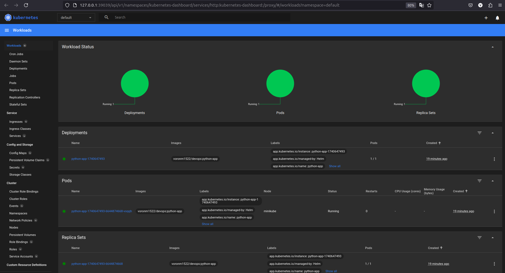
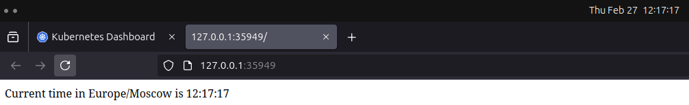

# Helm

## Task 1

In this task I:

- Installed `Helm`
- Created chart using `helm create python-app`
- Modified `values.yaml`, replaced `image.repository`, `image.tag` and `service.port` with my values
- Installed  Helm chart and checked services' health
  
- Accessed my app

  ```sh
  vm@vm /m/v/d/h/V/U/L/P/D/S/k8s (lab10)> minikube service python-app-1740647493
  |-----------|-----------------------|-------------|--------------|
  | NAMESPACE |         NAME          | TARGET PORT |     URL      |
  |-----------|-----------------------|-------------|--------------|
  | default   | python-app-1740647493 |             | No node port |
  |-----------|-----------------------|-------------|--------------|
  😿  service default/python-app-1740647493 has no node port
  ❗  Services [default/python-app-1740647493] have type "ClusterIP" not meant to be exposed, however for local development minikube allows you to access this !
  🏃  Starting tunnel for service python-app-1740647493.
  |-----------|-----------------------|-------------|------------------------|
  | NAMESPACE |         NAME          | TARGET PORT |          URL           |
  |-----------|-----------------------|-------------|------------------------|
  | default   | python-app-1740647493 |             | http://127.0.0.1:35949 |
  |-----------|-----------------------|-------------|------------------------|
  🎉  Opening service default/python-app-1740647493 in default browser...
  ```

  
- Provided required outputs

  ```sh
  vm@vm /m/v/d/h/V/U/L/P/D/S/k8s (lab10)> kubectl get pods,svc
  NAME                                         READY   STATUS    RESTARTS   AGE
  pod/python-app-1740647493-6644874668-vsqqh   1/1     Running   0          19m

  NAME                            TYPE        CLUSTER-IP      EXTERNAL-IP   PORT(S)    AGE
  service/kubernetes              ClusterIP   10.96.0.1       <none>        443/TCP    11h
  service/python-app-1740647493   ClusterIP   10.111.189.12   <none>        5000/TCP   19m
  ```

## Task 2
