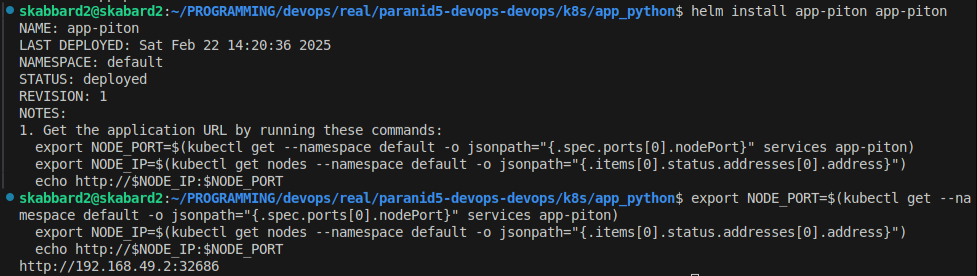
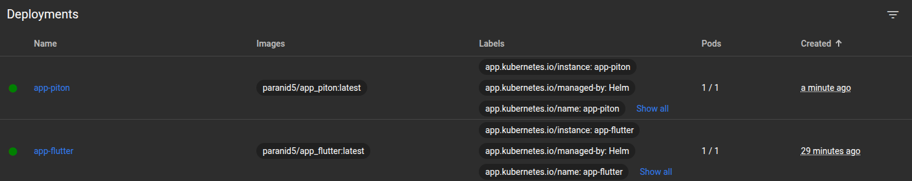
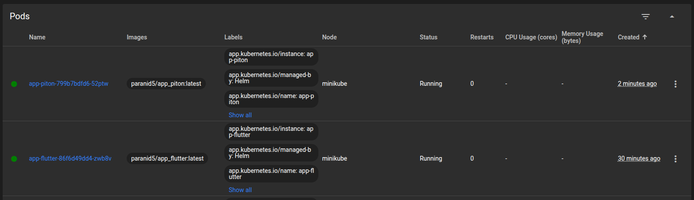
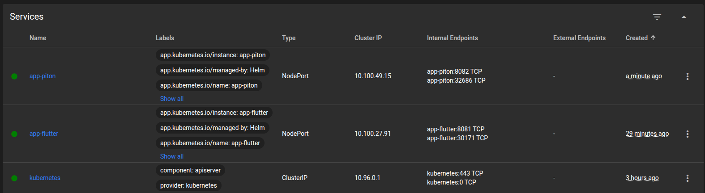
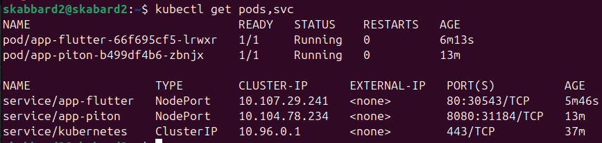
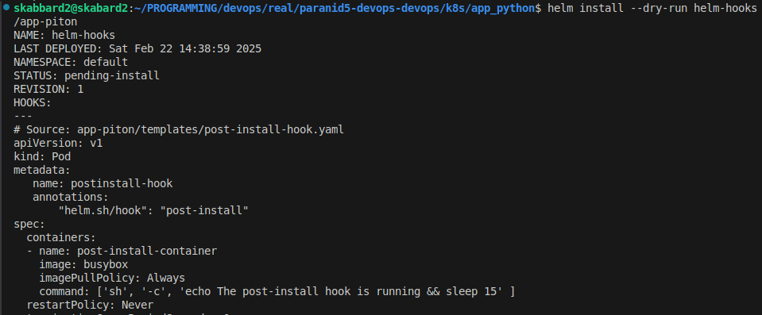
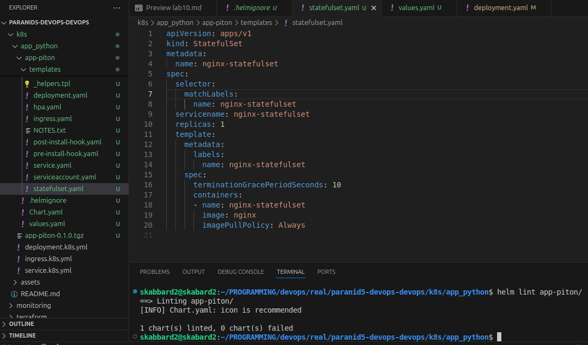
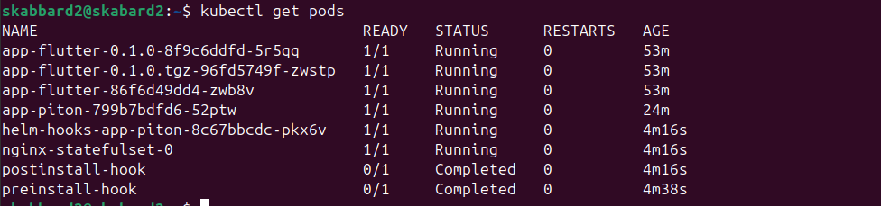
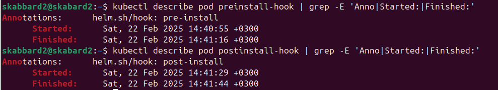
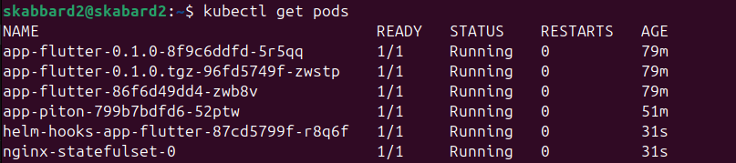

# Helm Setup

1. Installing helm



2. Accessing dashboard

> minikube dashboard
>
> minikube service --all

* Deployments


* Pods


* Services


3. Checking all pods and services



4. Installing hooks



5. Lint with hooks



6. Get all pods (with hooks)



7. Describe hooks



8. Add delete policy

```yml
annotations:
    "helm.sh/hook-delete-policy": hook-succeeded
```

9. Checking if delete policy is applied (pre and post install hooks must not be listed)


