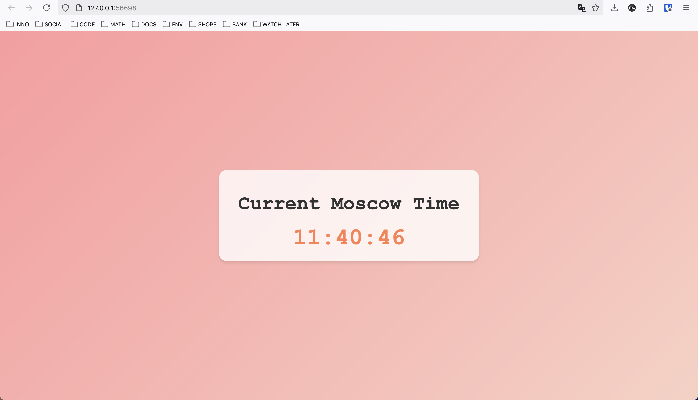

# Helm

## Installing chart for `moscow-time` application

```bash
➜  k8s git:(lab-10) ✗ helm install --name-template=moscow-time moscow-time
NAME: moscow-time
LAST DEPLOYED: Sat Feb 22 12:13:04 2025
NAMESPACE: default
STATUS: deployed
REVISION: 1
NOTES:
1. Get the application URL by running these commands:
  export POD_NAME=$(kubectl get pods --namespace default -l "app.kubernetes.io/name=moscow-time,app.kubernetes.io/instance=moscow-time" -o jsonpath="{.items[0].metadata.name}")
  export CONTAINER_PORT=$(kubectl get pod --namespace default $POD_NAME -o jsonpath="{.spec.containers[0].ports[0].containerPort}")
  echo "Visit http://127.0.0.1:8080 to use your application"
  kubectl --namespace default port-forward $POD_NAME 8080:$CONTAINER_PORT
➜  k8s git:(lab-10) ✗ kubectl get po,svc
NAME                              READY   STATUS    RESTARTS   AGE
pod/moscow-time-b985fc6f8-2j7hm   1/1     Running   0          3s
pod/moscow-time-b985fc6f8-6dkrq   1/1     Running   0          3s
pod/moscow-time-b985fc6f8-9f6bw   1/1     Running   0          3s

NAME                  TYPE        CLUSTER-IP     EXTERNAL-IP   PORT(S)    AGE
service/kubernetes    ClusterIP   10.96.0.1      <none>        443/TCP    14h
service/moscow-time   ClusterIP   10.106.3.254   <none>        8000/TCP   3s
➜  k8s git:(lab-10) ✗ minikube service moscow-time
|-----------|-------------|-------------|--------------|
| NAMESPACE |    NAME     | TARGET PORT |     URL      |
|-----------|-------------|-------------|--------------|
| default   | moscow-time |             | No node port |
|-----------|-------------|-------------|--------------|
😿  service default/moscow-time has no node port
❗  Services [default/moscow-time] have type "ClusterIP" not meant to be exposed, however for local development minikube allows you to access this !
🏃  Starting tunnel for service moscow-time.
|-----------|-------------|-------------|------------------------|
| NAMESPACE |    NAME     | TARGET PORT |          URL           |
|-----------|-------------|-------------|------------------------|
| default   | moscow-time |             | http://127.0.0.1:60710 |
|-----------|-------------|-------------|------------------------|
🎉  Opening service default/moscow-time in default browser...
❗  Because you are using a Docker driver on darwin, the terminal needs to be open to run it.
```



## Helm Hooks

### Troubleshooting

```bash
➜  k8s git:(lab-10) ✗ helm lint moscow-time
==> Linting moscow-time
[INFO] Chart.yaml: icon is recommended

1 chart(s) linted, 0 chart(s) failed
➜  k8s git:(lab-10) ✗ helm install --dry-run helm-hooks moscow-time
NAME: helm-hooks
LAST DEPLOYED: Sat Feb 22 12:52:37 2025
NAMESPACE: default
STATUS: pending-install
REVISION: 1
HOOKS:
---
# Source: moscow-time/templates/post-install-hook.yml
apiVersion: v1
kind: Pod
metadata:
   name: postinstall-hook
   annotations:
       "helm.sh/hook": "post-install"
       "helm.sh/hook-delete-policy": "hook-succeeded"
spec:
  containers:
  - name: post-install-container
    image: busybox
    imagePullPolicy: Always
    command: ['sh', '-c', 'echo The post-install hook is running && sleep 15' ]
  restartPolicy: Never
  terminationGracePeriodSeconds: 0
---
# Source: moscow-time/templates/pre-install-hook.yml
apiVersion: v1
kind: Pod
metadata:
   name: preinstall-hook
   annotations:
       "helm.sh/hook": "pre-install"
       "helm.sh/hook-delete-policy": "hook-succeeded"
spec:
  containers:
  - name: pre-install-container
    image: busybox
    imagePullPolicy: IfNotPresent
    command: ['sh', '-c', 'echo The pre-install hook is running && sleep 20' ]
  restartPolicy: Never
  terminationGracePeriodSeconds: 0
---
# Source: moscow-time/templates/tests/test-connection.yaml
apiVersion: v1
kind: Pod
metadata:
  name: "helm-hooks-moscow-time-test-connection"
  labels:
    helm.sh/chart: moscow-time-0.1.0
    app.kubernetes.io/name: moscow-time
    app.kubernetes.io/instance: helm-hooks
    app.kubernetes.io/version: "1.16.0"
    app.kubernetes.io/managed-by: Helm
  annotations:
    "helm.sh/hook": test
spec:
  containers:
    - name: wget
      image: busybox
      command: ['wget']
      args: ['helm-hooks-moscow-time:8000']
  restartPolicy: Never
MANIFEST:
---
# Source: moscow-time/templates/serviceaccount.yaml
apiVersion: v1
kind: ServiceAccount
metadata:
  name: helm-hooks-moscow-time
  labels:
    helm.sh/chart: moscow-time-0.1.0
    app.kubernetes.io/name: moscow-time
    app.kubernetes.io/instance: helm-hooks
    app.kubernetes.io/version: "1.16.0"
    app.kubernetes.io/managed-by: Helm
automountServiceAccountToken: true
---
# Source: moscow-time/templates/service.yaml
apiVersion: v1
kind: Service
metadata:
  name: helm-hooks-moscow-time
  labels:
    helm.sh/chart: moscow-time-0.1.0
    app.kubernetes.io/name: moscow-time
    app.kubernetes.io/instance: helm-hooks
    app.kubernetes.io/version: "1.16.0"
    app.kubernetes.io/managed-by: Helm
spec:
  type: ClusterIP
  ports:
    - port: 8000
      targetPort: http
      protocol: TCP
      name: http
  selector:
    app.kubernetes.io/name: moscow-time
    app.kubernetes.io/instance: helm-hooks
---
# Source: moscow-time/templates/deployment.yaml
apiVersion: apps/v1
kind: Deployment
metadata:
  name: helm-hooks-moscow-time
  labels:
    helm.sh/chart: moscow-time-0.1.0
    app.kubernetes.io/name: moscow-time
    app.kubernetes.io/instance: helm-hooks
    app.kubernetes.io/version: "1.16.0"
    app.kubernetes.io/managed-by: Helm
spec:
  replicas: 3
  selector:
    matchLabels:
      app.kubernetes.io/name: moscow-time
      app.kubernetes.io/instance: helm-hooks
  template:
    metadata:
      labels:
        helm.sh/chart: moscow-time-0.1.0
        app.kubernetes.io/name: moscow-time
        app.kubernetes.io/instance: helm-hooks
        app.kubernetes.io/version: "1.16.0"
        app.kubernetes.io/managed-by: Helm
    spec:
      serviceAccountName: helm-hooks-moscow-time
      containers:
        - name: moscow-time
          image: "m0t9docker/pyapp:latest"
          imagePullPolicy: IfNotPresent
          ports:
            - name: http
              containerPort: 8000
              protocol: TCP
          livenessProbe:
            httpGet:
              path: /
              port: http
          readinessProbe:
            httpGet:
              path: /
              port: http

NOTES:
1. Get the application URL by running these commands:
  export POD_NAME=$(kubectl get pods --namespace default -l "app.kubernetes.io/name=moscow-time,app.kubernetes.io/instance=helm-hooks" -o jsonpath="{.items[0].metadata.name}")
  export CONTAINER_PORT=$(kubectl get pod --namespace default $POD_NAME -o jsonpath="{.spec.containers[0].ports[0].containerPort}")
  echo "Visit http://127.0.0.1:8080 to use your application"
  kubectl --namespace default port-forward $POD_NAME 8080:$CONTAINER_PORT
➜  k8s git:(lab-10) ✗ kubectl get po
No resources found in default namespace.
```

### Without deletion policy

Without deletion policy in Helm Hooks one can clearly see that preinstall-hook works exactly
20 seconds and post-install one — 15 seconds.

```bash
➜  k8s git:(lab-10) ✗ helm install --name-template=moscow-time moscow-time
NAME: moscow-time
LAST DEPLOYED: Sat Feb 22 12:46:32 2025
NAMESPACE: default
STATUS: deployed
REVISION: 1
NOTES:
1. Get the application URL by running these commands:
  export POD_NAME=$(kubectl get pods --namespace default -l "app.kubernetes.io/name=moscow-time,app.kubernetes.io/instance=moscow-time" -o jsonpath="{.items[0].metadata.name}")
  export CONTAINER_PORT=$(kubectl get pod --namespace default $POD_NAME -o jsonpath="{.spec.containers[0].ports[0].containerPort}")
  echo "Visit http://127.0.0.1:8080 to use your application"
  kubectl --namespace default port-forward $POD_NAME 8080:$CONTAINER_PORT
➜  k8s git:(lab-10) ✗ kubectl get po
NAME                          READY   STATUS      RESTARTS   AGE
moscow-time-b985fc6f8-7csx4   1/1     Running     0          41s
moscow-time-b985fc6f8-djmr6   1/1     Running     0          41s
moscow-time-b985fc6f8-xzffh   1/1     Running     0          41s
postinstall-hook              0/1     Completed   0          41s
preinstall-hook               0/1     Completed   0          63s
➜  k8s git:(lab-10) ✗ kubectl describe pod preinstall-hook
Name:             preinstall-hook
Namespace:        default
Priority:         0
Service Account:  default
Node:             minikube/192.168.49.2
Start Time:       Sat, 22 Feb 2025 12:46:32 +0300
Labels:           <none>
Annotations:      helm.sh/hook: pre-install
Status:           Succeeded
IP:               10.244.0.61
IPs:
  IP:  10.244.0.61
Containers:
  pre-install-container:
    Container ID:  docker://29288a47ac3592745828108f0c9c21587a75bfc634498e84513779b2916508ea
    Image:         busybox
    Image ID:      docker-pullable://busybox@sha256:498a000f370d8c37927118ed80afe8adc38d1edcbfc071627d17b25c88efcab0
    Port:          <none>
    Host Port:     <none>
    Command:
      sh
      -c
      echo The pre-install hook is running && sleep 20
    State:          Terminated
      Reason:       Completed
      Exit Code:    0
      Started:      Sat, 22 Feb 2025 12:46:33 +0300
      Finished:     Sat, 22 Feb 2025 12:46:53 +0300
    Ready:          False
    Restart Count:  0
    Environment:    <none>
    Mounts:
      /var/run/secrets/kubernetes.io/serviceaccount from kube-api-access-thtdz (ro)
Conditions:
  Type                        Status
  PodReadyToStartContainers   False
  Initialized                 True
  Ready                       False
  ContainersReady             False
  PodScheduled                True
Volumes:
  kube-api-access-thtdz:
    Type:                    Projected (a volume that contains injected data from multiple sources)
    TokenExpirationSeconds:  3607
    ConfigMapName:           kube-root-ca.crt
    ConfigMapOptional:       <nil>
    DownwardAPI:             true
QoS Class:                   BestEffort
Node-Selectors:              <none>
Tolerations:                 node.kubernetes.io/not-ready:NoExecute op=Exists for 300s
                             node.kubernetes.io/unreachable:NoExecute op=Exists for 300s
Events:
  Type    Reason     Age   From               Message
  ----    ------     ----  ----               -------
  Normal  Scheduled  71s   default-scheduler  Successfully assigned default/preinstall-hook to minikube
  Normal  Pulled     70s   kubelet            Container image "busybox" already present on machine
  Normal  Created    70s   kubelet            Created container: pre-install-container
  Normal  Started    70s   kubelet            Started container pre-install-container
➜  k8s git:(lab-10) ✗ kubectl describe pod postinstall-hook
Name:             postinstall-hook
Namespace:        default
Priority:         0
Service Account:  default
Node:             minikube/192.168.49.2
Start Time:       Sat, 22 Feb 2025 12:46:54 +0300
Labels:           <none>
Annotations:      helm.sh/hook: post-install
Status:           Succeeded
IP:               10.244.0.65
IPs:
  IP:  10.244.0.65
Containers:
  post-install-container:
    Container ID:  docker://b9791cbb95e75f0c395492ff025cc45fa9a71c47bde49d5ac159895f22f08343
    Image:         busybox
    Image ID:      docker-pullable://busybox@sha256:498a000f370d8c37927118ed80afe8adc38d1edcbfc071627d17b25c88efcab0
    Port:          <none>
    Host Port:     <none>
    Command:
      sh
      -c
      echo The post-install hook is running && sleep 15
    State:          Terminated
      Reason:       Completed
      Exit Code:    0
      Started:      Sat, 22 Feb 2025 12:46:57 +0300
      Finished:     Sat, 22 Feb 2025 12:47:12 +0300
    Ready:          False
    Restart Count:  0
    Environment:    <none>
    Mounts:
      /var/run/secrets/kubernetes.io/serviceaccount from kube-api-access-h2jv7 (ro)
Conditions:
  Type                        Status
  PodReadyToStartContainers   False
  Initialized                 True
  Ready                       False
  ContainersReady             False
  PodScheduled                True
Volumes:
  kube-api-access-h2jv7:
    Type:                    Projected (a volume that contains injected data from multiple sources)
    TokenExpirationSeconds:  3607
    ConfigMapName:           kube-root-ca.crt
    ConfigMapOptional:       <nil>
    DownwardAPI:             true
QoS Class:                   BestEffort
Node-Selectors:              <none>
Tolerations:                 node.kubernetes.io/not-ready:NoExecute op=Exists for 300s
                             node.kubernetes.io/unreachable:NoExecute op=Exists for 300s
Events:
  Type    Reason     Age   From               Message
  ----    ------     ----  ----               -------
  Normal  Scheduled  52s   default-scheduler  Successfully assigned default/postinstall-hook to minikube
  Normal  Pulling    51s   kubelet            Pulling image "busybox"
  Normal  Pulled     49s   kubelet            Successfully pulled image "busybox" in 1.82s (1.82s including waiting). Image size: 4042190 bytes.
  Normal  Created    49s   kubelet            Created container: post-install-container
  Normal  Started    49s   kubelet            Started container post-install-container
```

### With deletion policy

It is complex to display interesting output of the  `kubectl describe pod` here, so I
used `kubectl logs` together with it to prove that hooks work.

```bash
➜  k8s git:(lab-10) ✗ helm install --name-template=moscow-time moscow-time
NAME: moscow-time
LAST DEPLOYED: Sat Feb 22 12:39:21 2025
NAMESPACE: default
STATUS: deployed
REVISION: 1
NOTES:
1. Get the application URL by running these commands:
  export POD_NAME=$(kubectl get pods --namespace default -l "app.kubernetes.io/name=moscow-time,app.kubernetes.io/instance=moscow-time" -o jsonpath="{.items[0].metadata.name}")
  export CONTAINER_PORT=$(kubectl get pod --namespace default $POD_NAME -o jsonpath="{.spec.containers[0].ports[0].containerPort}")
  echo "Visit http://127.0.0.1:8080 to use your application"
  kubectl --namespace default port-forward $POD_NAME 8080:$CONTAINER_PORT
➜  S25-core-course-labs git:(lab-10) ✗ kubectl get po
NAME              READY   STATUS    RESTARTS   AGE
preinstall-hook   1/1     Running   0          6s
➜  S25-core-course-labs git:(lab-10) ✗ kubectl describe pod preinstall-hook
Name:             preinstall-hook
Namespace:        default
Priority:         0
Service Account:  default
Node:             minikube/192.168.49.2
Start Time:       Sat, 22 Feb 2025 12:43:44 +0300
Labels:           <none>
Annotations:      helm.sh/hook: pre-install
                  helm.sh/hook-delete-policy: hook-succeeded
Status:           Running
IP:               10.244.0.56
IPs:
  IP:  10.244.0.56
Containers:
  pre-install-container:
    Container ID:  docker://c8ef4e552a22c31200e041cdf4d73e7625b882bcba80088a923bda39d5155e41
    Image:         busybox
    Image ID:      docker-pullable://busybox@sha256:498a000f370d8c37927118ed80afe8adc38d1edcbfc071627d17b25c88efcab0
    Port:          <none>
    Host Port:     <none>
    Command:
      sh
      -c
      echo The pre-install hook is running && sleep 20
    State:          Running
      Started:      Sat, 22 Feb 2025 12:43:45 +0300
    Ready:          True
    Restart Count:  0
    Environment:    <none>
    Mounts:
      /var/run/secrets/kubernetes.io/serviceaccount from kube-api-access-r79nh (ro)
Conditions:
  Type                        Status
  PodReadyToStartContainers   True
  Initialized                 True
  Ready                       True
  ContainersReady             True
  PodScheduled                True
Volumes:
  kube-api-access-r79nh:
    Type:                    Projected (a volume that contains injected data from multiple sources)
    TokenExpirationSeconds:  3607
    ConfigMapName:           kube-root-ca.crt
    ConfigMapOptional:       <nil>
    DownwardAPI:             true
QoS Class:                   BestEffort
Node-Selectors:              <none>
Tolerations:                 node.kubernetes.io/not-ready:NoExecute op=Exists for 300s
                             node.kubernetes.io/unreachable:NoExecute op=Exists for 300s
Events:
  Type    Reason     Age   From               Message
  ----    ------     ----  ----               -------
  Normal  Scheduled  13s   default-scheduler  Successfully assigned default/preinstall-hook to minikube
  Normal  Pulled     12s   kubelet            Container image "busybox" already present on machine
  Normal  Created    12s   kubelet            Created container: pre-install-container
  Normal  Started    12s   kubelet            Started container pre-install-container
➜  S25-core-course-labs git:(lab-10) ✗ kubectl logs -f preinstall-hook
The pre-install hook is running
➜  S25-core-course-labs git:(lab-10) ✗ kubectl describe pod postinstall-hook
Name:             postinstall-hook
Namespace:        default
Priority:         0
Service Account:  default
Node:             minikube/192.168.49.2
Start Time:       Sat, 22 Feb 2025 12:44:07 +0300
Labels:           <none>
Annotations:      helm.sh/hook: post-install
                  helm.sh/hook-delete-policy: hook-succeeded
Status:           Pending
IP:
IPs:              <none>
Containers:
  post-install-container:
    Container ID:
    Image:         busybox
    Image ID:
    Port:          <none>
    Host Port:     <none>
    Command:
      sh
      -c
      echo The post-install hook is running && sleep 15
    State:          Waiting
      Reason:       ContainerCreating
    Ready:          False
    Restart Count:  0
    Environment:    <none>
    Mounts:
      /var/run/secrets/kubernetes.io/serviceaccount from kube-api-access-sdqxk (ro)
Conditions:
  Type                        Status
  PodReadyToStartContainers   False
  Initialized                 True
  Ready                       False
  ContainersReady             False
  PodScheduled                True
Volumes:
  kube-api-access-sdqxk:
    Type:                    Projected (a volume that contains injected data from multiple sources)
    TokenExpirationSeconds:  3607
    ConfigMapName:           kube-root-ca.crt
    ConfigMapOptional:       <nil>
    DownwardAPI:             true
QoS Class:                   BestEffort
Node-Selectors:              <none>
Tolerations:                 node.kubernetes.io/not-ready:NoExecute op=Exists for 300s
                             node.kubernetes.io/unreachable:NoExecute op=Exists for 300s
Events:
  Type    Reason     Age   From               Message
  ----    ------     ----  ----               -------
  Normal  Scheduled  1s    default-scheduler  Successfully assigned default/postinstall-hook to minikube
  Normal  Pulling    1s    kubelet            Pulling image "busybox"
➜  S25-core-course-labs git:(lab-10) ✗ kubectl logs -f postinstall-hook
The post-install hook is running
➜  S25-core-course-labs git:(lab-10) ✗ kubectl get po
NAME                          READY   STATUS    RESTARTS   AGE
moscow-time-b985fc6f8-fsjsh   1/1     Running   0          30s
moscow-time-b985fc6f8-gv957   1/1     Running   0          30s
moscow-time-b985fc6f8-jl4dl   1/1     Running   0          30s
```
