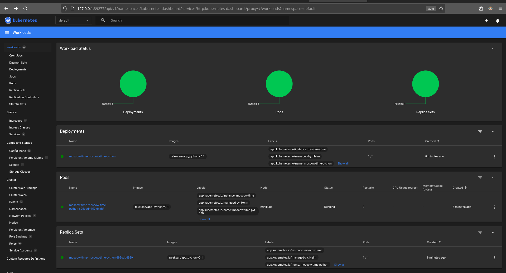
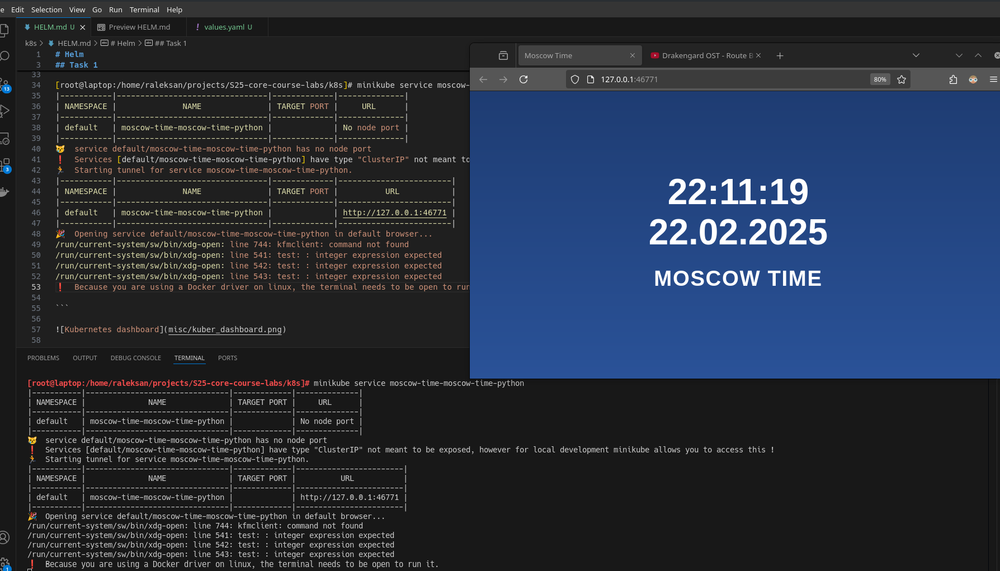
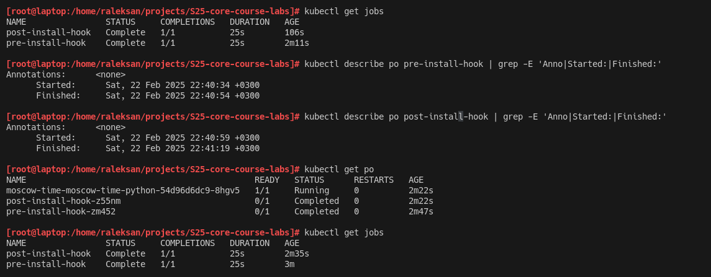
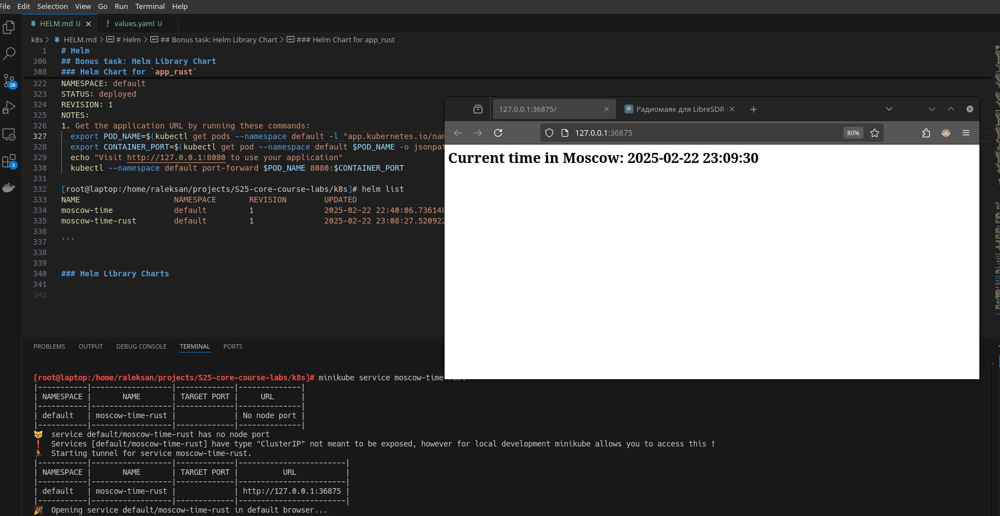

# Helm

## Task 1: Helm Setup and Chart Creation

Create `helm` chart for `app_python`:

```bash
[root@laptop:/home/raleksan/projects/S25-core-course-labs/k8s]# helm create moscow-time-python
Creating moscow-time-python

[root@laptop:/home/raleksan/projects/S25-core-course-labs/k8s]# helm install moscow-time moscow-time-python/
NAME: moscow-time
LAST DEPLOYED: Sat Feb 22 21:54:49 2025
NAMESPACE: default
STATUS: deployed
REVISION: 1
NOTES:
1. Get the application URL by running these commands:
  export POD_NAME=$(kubectl get pods --namespace default -l "app.kubernetes.io/name=moscow-time-python,app.kubernetes.io/instance=moscow-time" -o jsonpath="{.items[0].metadata.name}")
  export CONTAINER_PORT=$(kubectl get pod --namespace default $POD_NAME -o jsonpath="{.spec.containers[0].ports[0].containerPort}")
  echo "Visit http://127.0.0.1:8080 to use your application"
  kubectl --namespace default port-forward $POD_NAME 8080:$CONTAINER_PORT

[root@laptop:/home/raleksan/projects/S25-core-course-labs/k8s]# helm list
NAME            NAMESPACE       REVISION        UPDATED                                 STATUS          CHART                           APP VERSION
moscow-time     default         1               2025-02-22 21:54:49.477444596 +0300 MSK deployed        moscow-time-python-0.1.0        1.16.0     
```

Show dashboard:

```bash
[root@laptop:/home/raleksan/projects/S25-core-course-labs/k8s]# minikube dashboard
🤔  Verifying dashboard health ...
🚀  Launching proxy ...
🤔  Verifying proxy health ...
http://127.0.0.1:39435/api/v1/namespaces/kubernetes-dashboard/services/http:kubernetes-dashboard:/proxy/
```



Get access to application service:

```bash
[root@laptop:/home/raleksan/projects/S25-core-course-labs/k8s]# minikube service moscow-time-moscow-time-python
|-----------|--------------------------------|-------------|--------------|
| NAMESPACE |              NAME              | TARGET PORT |     URL      |
|-----------|--------------------------------|-------------|--------------|
| default   | moscow-time-moscow-time-python |             | No node port |
|-----------|--------------------------------|-------------|--------------|
😿  service default/moscow-time-moscow-time-python has no node port
❗  Services [default/moscow-time-moscow-time-python] have type "ClusterIP" not meant to be exposed, however for local development minikube allows you to access this !
🏃  Starting tunnel for service moscow-time-moscow-time-python.
|-----------|--------------------------------|-------------|------------------------|
| NAMESPACE |              NAME              | TARGET PORT |          URL           |
|-----------|--------------------------------|-------------|------------------------|
| default   | moscow-time-moscow-time-python |             | http://127.0.0.1:46771 |
|-----------|--------------------------------|-------------|------------------------|
🎉  Opening service default/moscow-time-moscow-time-python in default browser...
/run/current-system/sw/bin/xdg-open: line 744: kfmclient: command not found
/run/current-system/sw/bin/xdg-open: line 541: test: : integer expression expected
/run/current-system/sw/bin/xdg-open: line 542: test: : integer expression expected
/run/current-system/sw/bin/xdg-open: line 543: test: : integer expression expected
❗  Because you are using a Docker driver on linux, the terminal needs to be open to run it.

```



Get `kubectl` statistics:

```bash

[root@laptop:/home/raleksan/projects/S25-core-course-labs/k8s]# kubectl get po,svc
NAME                                                  READY   STATUS              RESTARTS   AGE
pod/moscow-time-moscow-time-python-695cdd4959-dnxh7   0/1     ContainerCreating   0          23s

NAME                                     TYPE        CLUSTER-IP      EXTERNAL-IP   PORT(S)    AGE
service/kubernetes                       ClusterIP   10.96.0.1       <none>        443/TCP    8m13s
service/moscow-time-moscow-time-python   ClusterIP   10.96.254.176   <none>        8000/TCP   23s
```

## Task 2: Helm Chart Hooks

Add `pre-install` and `post-install` hooks into `moscow-time-python/templates` and lint configuration:

```bash
[root@laptop:/home/raleksan/projects/S25-core-course-labs/k8s]# helm lint moscow-time-python/
==> Linting moscow-time-python/
[INFO] Chart.yaml: icon is recommended

1 chart(s) linted, 0 chart(s) failed


[root@laptop:/home/raleksan/projects/S25-core-course-labs/k8s]# helm lint moscow-time-python/
==> Linting moscow-time-python/
[INFO] Chart.yaml: icon is recommended

1 chart(s) linted, 0 chart(s) failed
```

Apply hooks (no auto-deletion):

```bash
[root@laptop:/home/raleksan/projects/S25-core-course-labs/k8s]# helm install --dry-run helm-hooks moscow-time-python/
NAME: helm-hooks
LAST DEPLOYED: Sat Feb 22 22:22:51 2025
NAMESPACE: default
STATUS: pending-install
REVISION: 1
HOOKS:
---
# Source: moscow-time-python/templates/tests/test-connection.yaml
apiVersion: v1
kind: Pod
metadata:
  name: "helm-hooks-moscow-time-python-test-connection"
  labels:
    helm.sh/chart: moscow-time-python-0.1.0
    app.kubernetes.io/name: moscow-time-python
    app.kubernetes.io/instance: helm-hooks
    app.kubernetes.io/version: "1.16.0"
    app.kubernetes.io/managed-by: Helm
  annotations:
    "helm.sh/hook": test
spec:
  containers:
    - name: wget
      image: busybox
      command: ['wget']
      args: ['helm-hooks-moscow-time-python:8000']
  restartPolicy: Never
---
# Source: moscow-time-python/templates/post-install-hook.yaml
apiVersion: batch/v1
kind: Job
metadata:
  name: post-install-hook
  annotations:
    "helm.sh/hook": post-install
    "helm.sh/hook-delete-policy": hook-succeeded
spec:
  template:
    spec:
      restartPolicy: Never
      containers:
        - name: post-install-job
          image: busybox
          command: ["sh", "-c", "echo Post-install hook running; sleep 20"]
---
# Source: moscow-time-python/templates/pre-install-hook.yaml
apiVersion: batch/v1
kind: Job
metadata:
  name: pre-install-hook
  annotations:
    "helm.sh/hook": pre-install
    "helm.sh/hook-delete-policy": hook-succeeded
spec:
  template:
    spec:
      restartPolicy: Never
      containers:
        - name: pre-install-job
          image: busybox
          command: ["sh", "-c", "echo Pre-install hook running; sleep 20"]
MANIFEST:
---
# Source: moscow-time-python/templates/serviceaccount.yaml
apiVersion: v1
kind: ServiceAccount
metadata:
  name: helm-hooks-moscow-time-python
  labels:
    helm.sh/chart: moscow-time-python-0.1.0
    app.kubernetes.io/name: moscow-time-python
    app.kubernetes.io/instance: helm-hooks
    app.kubernetes.io/version: "1.16.0"
    app.kubernetes.io/managed-by: Helm
automountServiceAccountToken: true
---
# Source: moscow-time-python/templates/service.yaml
apiVersion: v1
kind: Service
metadata:
  name: helm-hooks-moscow-time-python
  labels:
    helm.sh/chart: moscow-time-python-0.1.0
    app.kubernetes.io/name: moscow-time-python
    app.kubernetes.io/instance: helm-hooks
    app.kubernetes.io/version: "1.16.0"
    app.kubernetes.io/managed-by: Helm
spec:
  type: ClusterIP
  ports:
    - port: 8000
      targetPort: http
      protocol: TCP
      name: http
  selector:
    app.kubernetes.io/name: moscow-time-python
    app.kubernetes.io/instance: helm-hooks
---
# Source: moscow-time-python/templates/deployment.yaml
apiVersion: apps/v1
kind: Deployment
metadata:
  name: helm-hooks-moscow-time-python
  labels:
    helm.sh/chart: moscow-time-python-0.1.0
    app.kubernetes.io/name: moscow-time-python
    app.kubernetes.io/instance: helm-hooks
    app.kubernetes.io/version: "1.16.0"
    app.kubernetes.io/managed-by: Helm
spec:
  replicas: 1
  selector:
    matchLabels:
      app.kubernetes.io/name: moscow-time-python
      app.kubernetes.io/instance: helm-hooks
  template:
    metadata:
      labels:
        helm.sh/chart: moscow-time-python-0.1.0
        app.kubernetes.io/name: moscow-time-python
        app.kubernetes.io/instance: helm-hooks
        app.kubernetes.io/version: "1.16.0"
        app.kubernetes.io/managed-by: Helm
    spec:
      serviceAccountName: helm-hooks-moscow-time-python
      securityContext:
        {}
      containers:
        - name: moscow-time-python
          securityContext:
            {}
          image: "raleksan/app_python:v0.1"
          imagePullPolicy: IfNotPresent
          ports:
            - name: http
              containerPort: 8000
              protocol: TCP
          livenessProbe:
            null
          readinessProbe:
            null
          resources:
            {}

NOTES:
1. Get the application URL by running these commands:
  export POD_NAME=$(kubectl get pods --namespace default -l "app.kubernetes.io/name=moscow-time-python,app.kubernetes.io/instance=helm-hooks" -o jsonpath="{.items[0].metadata.name}")
  export CONTAINER_PORT=$(kubectl get pod --namespace default $POD_NAME -o jsonpath="{.spec.containers[0].ports[0].containerPort}")
  echo "Visit http://127.0.0.1:8080 to use your application"
  kubectl --namespace default port-forward $POD_NAME 8080:$CONTAINER_PORT

```

Take statistics:

```bash
[root@laptop:/home/raleksan/projects/S25-core-course-labs]# kubectl get pods,svc
NAME                                                  READY   STATUS      RESTARTS   AGE
pod/moscow-time-moscow-time-python-54d96d6dc9-8hgv5   1/1     Running     0          5m36s
pod/post-install-hook-z55nm                           0/1     Completed   0          5m36s
pod/pre-install-hook-zm452                            0/1     Completed   0          6m1s

NAME                                     TYPE        CLUSTER-IP       EXTERNAL-IP   PORT(S)    AGE
service/kubernetes                       ClusterIP   10.96.0.1        <none>        443/TCP    59m
service/moscow-time-moscow-time-python   ClusterIP   10.106.239.128   <none>        8000/TCP   5m36s
```

Explore hooks in details:

```bash

[root@laptop:/home/raleksan/projects/S25-core-course-labs]# kubectl get po
NAME                                              READY   STATUS      RESTARTS   AGE
moscow-time-moscow-time-python-54d96d6dc9-8hgv5   1/1     Running     0          2m22s
post-install-hook-z55nm                           0/1     Completed   0          2m22s
pre-install-hook-zm452                            0/1     Completed   0          2m47s

[root@laptop:/home/raleksan/projects/S25-core-course-labs]# kubectl get jobs
NAME                STATUS     COMPLETIONS   DURATION   AGE
post-install-hook   Complete   1/1           25s        106s
pre-install-hook    Complete   1/1           25s        2m11s

[root@laptop:/home/raleksan/projects/S25-core-course-labs]# kubectl describe po pre-install-hook | grep -E 'Anno|Started:|Finished:'
Annotations:      <none>
      Started:      Sat, 22 Feb 2025 22:40:34 +0300
      Finished:     Sat, 22 Feb 2025 22:40:54 +0300

[root@laptop:/home/raleksan/projects/S25-core-course-labs]# kubectl describe po post-install-hook | grep -E 'Anno|Started:|Finished:'
Annotations:      <none>
      Started:      Sat, 22 Feb 2025 22:40:59 +0300
      Finished:     Sat, 22 Feb 2025 22:41:19 +0300

```

also image for hooks



To implement 'hooks deletioin policy' I add `"helm.sh/hook-delete-policy": hook-succeeded` for every hook

```yaml
  annotations:
    # ...
    "helm.sh/hook-delete-policy": hook-succeeded
```

Run with enabled deletion policy:

```bash
[root@laptop:/home/raleksan/projects/S25-core-course-labs/k8s]# kubectl get po
NAME                                              READY   STATUS      RESTARTS   AGE
moscow-time-moscow-time-python-54d96d6dc9-8hgv5   1/1     Running     0          10m
```

## Bonus task: Helm Library Chart

### Helm Chart for `app_rust`

Create new Helm Chart for `app_rust`

```bash
helm create moscow-time-rust
```

modify `variables` and install

```bash
[root@laptop:/home/raleksan/projects/S25-core-course-labs/k8s]# helm install moscow-time-rust moscow-time-rust/
NAME: moscow-time-rust
LAST DEPLOYED: Sat Feb 22 23:08:27 2025
NAMESPACE: default
STATUS: deployed
REVISION: 1
NOTES:
1. Get the application URL by running these commands:
  export POD_NAME=$(kubectl get pods --namespace default -l "app.kubernetes.io/name=moscow-time-rust,app.kubernetes.io/instance=moscow-time-rust" -o jsonpath="{.items[0].metadata.name}")
  export CONTAINER_PORT=$(kubectl get pod --namespace default $POD_NAME -o jsonpath="{.spec.containers[0].ports[0].containerPort}")
  echo "Visit http://127.0.0.1:8080 to use your application"
  kubectl --namespace default port-forward $POD_NAME 8080:$CONTAINER_PORT

[root@laptop:/home/raleksan/projects/S25-core-course-labs/k8s]# helm list
NAME                    NAMESPACE       REVISION        UPDATED                                 STATUS          CHART                           APP VERSION
moscow-time             default         1               2025-02-22 22:40:06.736148693 +0300 MSK deployed        moscow-time-python-0.1.0        1.16.0     
moscow-time-rust        default         1               2025-02-22 23:08:27.520922636 +0300 MSK deployed        moscow-time-rust-0.1.0          1.16.0    

```

Open service with application



### Helm Library Charts

Create library with

```bash
helm create raleksan-library
```

Remove unused (for library) files

```bash
rm -rf raleksan-library/templates/*
rm -f raleksan-library/values.yaml
```

Modify `Chart.yaml`

```yaml
apiVersion: v2
name: raleksan-library
version: 1.0.0
type: library
description: A reusable library chart for Kubernetes applicationss
```

Add `_labels.tpl`

```tpl
{{- define "my-library.labels" -}}
app.kubernetes.io/name: {{ .Chart.Name }}
app.kubernetes.io/instance: {{ .Release.Name }}
{{- end }}
```

Integrate library as dependency to other charts:

```yaml
dependencies:
  - name: raleksan-library
    version: "1.0.0"
    repository: "file://../raleksan-library"
```

Modify deployment:

```yaml
apiVersion: apps/v1
kind: Deployment
metadata:
  name: {{ .Release.Name }}
  labels:
    {{ include "my-library.labels" . | nindent 4 }}  # Use labels from library
spec:
  replicas: 1
  selector:
    matchLabels:
      {{ include "my-library.labels" . | nindent 6 }}
  template:
    metadata:
      labels:
        {{ include "my-library.labels" . | nindent 8 }}
    spec:
      containers:
        - name: {{ .Chart.Name }}
          image: "{{ .Values.image.repository }}:{{ .Values.image.tag }}"
          ports:
            - containerPort: 80
```

Update dependecy:

```bash
[root@laptop:/home/raleksan/projects/S25-core-course-labs/k8s]# helm dependency update moscow-time-python/
Saving 1 charts
Deleting outdated charts

[root@laptop:/home/raleksan/projects/S25-core-course-labs/k8s]# helm dependency update moscow-time-rust/
Saving 1 charts
Deleting outdated charts
```

Install with `helm`:

```bash

[root@laptop:/home/raleksan/projects/S25-core-course-labs/k8s]# helm install moscow-time-python moscow-time-python/
NAME: moscow-time-python
LAST DEPLOYED: Sat Feb 22 23:42:03 2025
NAMESPACE: default
STATUS: deployed
REVISION: 1
NOTES:
1. Get the application URL by running these commands:
  export POD_NAME=$(kubectl get pods --namespace default -l "app.kubernetes.io/name=moscow-time-python,app.kubernetes.io/instance=moscow-time-python" -o jsonpath="{.items[0].metadata.name}")
  export CONTAINER_PORT=$(kubectl get pod --namespace default $POD_NAME -o jsonpath="{.spec.containers[0].ports[0].containerPort}")
  echo "Visit http://127.0.0.1:8080 to use your application"
  kubectl --namespace default port-forward $POD_NAME 8080:$CONTAINER_PORT

[root@laptop:/home/raleksan/projects/S25-core-course-labs/k8s]# helm install moscow-time-rust moscow-time-rust/
NAME: moscow-time-rust
LAST DEPLOYED: Sat Feb 22 23:43:21 2025
NAMESPACE: default
STATUS: deployed
REVISION: 1
NOTES:
1. Get the application URL by running these commands:
  export POD_NAME=$(kubectl get pods --namespace default -l "app.kubernetes.io/name=moscow-time-rust,app.kubernetes.io/instance=moscow-time-rust" -o jsonpath="{.items[0].metadata.name}")
  export CONTAINER_PORT=$(kubectl get pod --namespace default $POD_NAME -o jsonpath="{.spec.containers[0].ports[0].containerPort}")
  echo "Visit http://127.0.0.1:8080 to use your application"
  kubectl --namespace default port-forward $POD_NAME 8080:$CONTAINER_PORT
```

Installations results:

```bash
[root@laptop:/home/raleksan/projects/S25-core-course-labs/k8s]# kubectl get svc,pods
NAME                         TYPE        CLUSTER-IP      EXTERNAL-IP   PORT(S)    AGE
service/kubernetes           ClusterIP   10.96.0.1       <none>        443/TCP    117m
service/moscow-time-python   ClusterIP   10.111.235.96   <none>        8000/TCP   84s
service/moscow-time-rust     ClusterIP   10.103.169.73   <none>        8000/TCP   46s

NAME                                     READY   STATUS    RESTARTS   AGE
pod/moscow-time-python-f75c77d7c-nfd4s   1/1     Running   0          84s
pod/moscow-time-rust-868565ccbf-dkhgj    1/1     Running   0          46s
```
