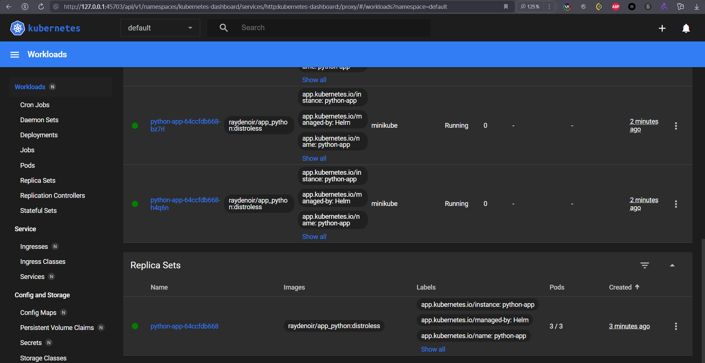
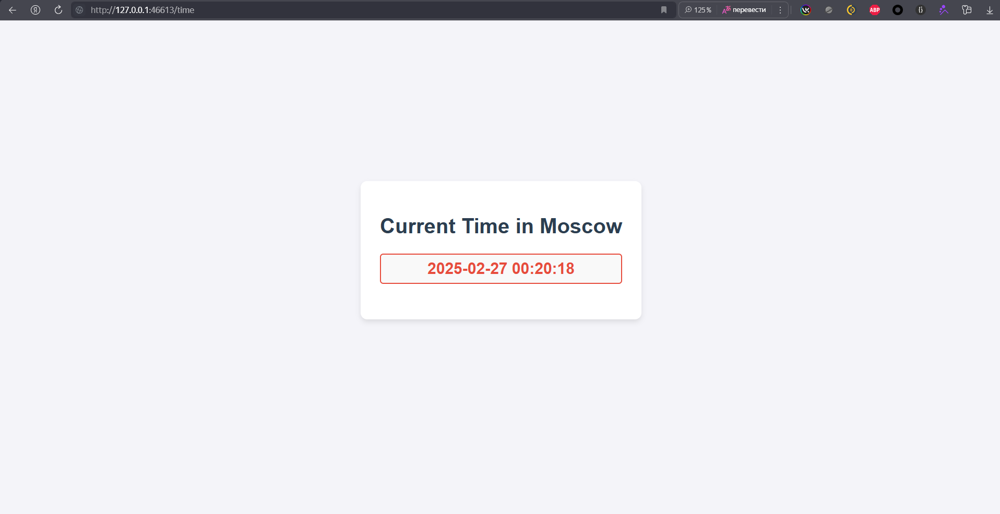

# Helm Report

## Helm Setup and Chart Creation

Install app:

```bash
helm create python-app
helm install python-app python-app
```



Results of `minikube service python-app`:

```text
|-----------|------------|-------------|--------------|
| NAMESPACE |    NAME    | TARGET PORT |     URL      |
|-----------|------------|-------------|--------------|
| default   | python-app |             | No node port |
|-----------|------------|-------------|--------------|
😿  service default/python-app has no node port
❗  Services [default/python-app] have type "ClusterIP" not meant to be exposed, however for local development minikube allows you to access this !
🏃  Starting tunnel for service python-app.
|-----------|------------|-------------|------------------------|
| NAMESPACE |    NAME    | TARGET PORT |          URL           |
|-----------|------------|-------------|------------------------|
| default   | python-app |             | http://127.0.0.1:46613 |
|-----------|------------|-------------|------------------------|
🎉  Opening service default/python-app in default browser...
👉  http://127.0.0.1:46613
❗  Because you are using a Docker driver on linux, the terminal needs to be open to run it.
```



Output of `kubectl get pods,svc`:

```text
NAME                              READY   STATUS    RESTARTS   AGE
pod/python-app-64ccfdb668-bxq2k   1/1     Running   0          29m
pod/python-app-64ccfdb668-bz7rl   1/1     Running   0          29m
pod/python-app-64ccfdb668-h4q6n   1/1     Running   0          29m

NAME                         TYPE        CLUSTER-IP       EXTERNAL-IP   PORT(S)          AGE
service/kubernetes           ClusterIP   10.96.0.1        <none>        443/TCP          121m
service/python-app           ClusterIP   10.105.192.199   <none>        8000/TCP         29m
service/python-app-service   NodePort    10.98.88.79      <none>        8000:30769/TCP   41m
```

## Helm Chart Hooks

### Troubleshoot Hooks

```bash
helm lint python-app
helm install --dry-run helm-hooks python-app
kubectl get po
```

Output of `kubectl get po`:

```text
NAME                                     READY   STATUS      RESTARTS   AGE
helm-hooks-python-app-68dbc864bc-5xnzp   1/1     Running     0          42s
helm-hooks-python-app-68dbc864bc-7f9sf   1/1     Running     0          42s
helm-hooks-python-app-68dbc864bc-k9nqv   1/1     Running     0          42s
python-app-postinstall                   0/1     Completed   0          42s
python-app-preinstall                    0/1     Completed   0          69s
```

Output of `kubectl describe po python-app-preinstall`:

```text
Name:             python-app-preinstall
Namespace:        default
Priority:         0
Service Account:  default
Node:             minikube/192.168.49.2
Start Time:       Thu, 27 Feb 2025 00:55:46 +0300
Labels:           <none>
Annotations:      helm.sh/hook: pre-install
Status:           Succeeded
IP:               10.244.0.28
IPs:
  IP:  10.244.0.28
Containers:
  preinstall:
    Container ID:  docker://b8797d17979ebd36a58392bac819fbea98b6cc5ae29b829d3daa1ee9c4bc4b16
    Image:         busybox
    Image ID:      docker-pullable://busybox@sha256:498a000f370d8c37927118ed80afe8adc38d1edcbfc071627d17b25c88efcab0
    Port:          <none>
    Host Port:     <none>
    Command:
      sh
      -c
      echo Pre-install hook running... && sleep 20
    State:          Terminated
      Reason:       Completed
      Exit Code:    0
      Started:      Thu, 27 Feb 2025 00:55:51 +0300
      Finished:     Thu, 27 Feb 2025 00:56:11 +0300
    Ready:          False
    Restart Count:  0
    Environment:    <none>
    Mounts:
      /var/run/secrets/kubernetes.io/serviceaccount from kube-api-access-t7b5h (ro)
Conditions:
  Type                        Status
  PodReadyToStartContainers   False 
  Initialized                 True 
  Ready                       False 
  ContainersReady             False 
  PodScheduled                True 
Volumes:
  kube-api-access-t7b5h:
    Type:                    Projected (a volume that contains injected data from multiple sources)
    TokenExpirationSeconds:  3607
    ConfigMapName:           kube-root-ca.crt
    ConfigMapOptional:       <nil>
    DownwardAPI:             true
QoS Class:                   BestEffort
Node-Selectors:              <none>
Tolerations:                 node.kubernetes.io/not-ready:NoExecute op=Exists for 300s
                             node.kubernetes.io/unreachable:NoExecute op=Exists for 300s
Events:
  Type    Reason     Age   From               Message
  ----    ------     ----  ----               -------
  Normal  Scheduled  98s   default-scheduler  Successfully assigned default/python-app-preinstall to minikube
  Normal  Pulling    97s   kubelet            Pulling image "busybox"
  Normal  Pulled     93s   kubelet            Successfully pulled image "busybox" in 4.236s (4.236s including waiting). Image size: 4269694 bytes.
  Normal  Created    93s   kubelet            Created container: preinstall
  Normal  Started    93s   kubelet            Started container preinstall
```

Output of `kubectl describe po python-app-postinstall`:

```text
Name:             python-app-postinstall
Namespace:        default
Priority:         0
Service Account:  default
Node:             minikube/192.168.49.2
Start Time:       Thu, 27 Feb 2025 00:56:13 +0300
Labels:           <none>
Annotations:      helm.sh/hook: post-install
Status:           Succeeded
IP:               10.244.0.32
IPs:
  IP:  10.244.0.32
Containers:
  postinstall:
    Container ID:  docker://e82b4f2925f48758c209b974fa5020cf735dbd4c20ccfd739af266702a44ddee
    Image:         busybox
    Image ID:      docker-pullable://busybox@sha256:498a000f370d8c37927118ed80afe8adc38d1edcbfc071627d17b25c88efcab0
    Port:          <none>
    Host Port:     <none>
    Command:
      sh
      -c
      echo Post-install hook running... && sleep 20
    State:          Terminated
      Reason:       Completed
      Exit Code:    0
      Started:      Thu, 27 Feb 2025 00:56:16 +0300
      Finished:     Thu, 27 Feb 2025 00:56:36 +0300
    Ready:          False
    Restart Count:  0
    Environment:    <none>
    Mounts:
      /var/run/secrets/kubernetes.io/serviceaccount from kube-api-access-lxq8d (ro)
Conditions:
  Type                        Status
  PodReadyToStartContainers   False 
  Initialized                 True 
  Ready                       False 
  ContainersReady             False 
  PodScheduled                True 
Volumes:
  kube-api-access-lxq8d:
    Type:                    Projected (a volume that contains injected data from multiple sources)
    TokenExpirationSeconds:  3607
    ConfigMapName:           kube-root-ca.crt
    ConfigMapOptional:       <nil>
    DownwardAPI:             true
QoS Class:                   BestEffort
Node-Selectors:              <none>
Tolerations:                 node.kubernetes.io/not-ready:NoExecute op=Exists for 300s
                             node.kubernetes.io/unreachable:NoExecute op=Exists for 300s
Events:
  Type    Reason     Age    From               Message
  ----    ------     ----   ----               -------
  Normal  Scheduled  2m10s  default-scheduler  Successfully assigned default/python-app-postinstall to minikube
  Normal  Pulling    2m9s   kubelet            Pulling image "busybox"
  Normal  Pulled     2m7s   kubelet            Successfully pulled image "busybox" in 1.799s (1.799s including waiting). Image size: 4269694 bytes.
  Normal  Created    2m7s   kubelet            Created container: postinstall
  Normal  Started    2m7s   kubelet            Started container postinstall
```

### Hook Delete Policy:

Add `"helm.sh/hook-delete-policy": hook-succeeded` to both hooks.