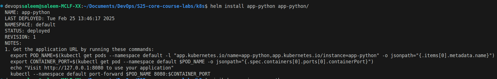
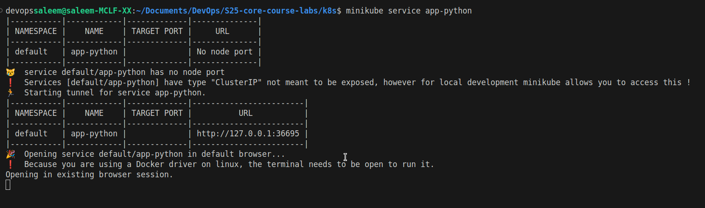
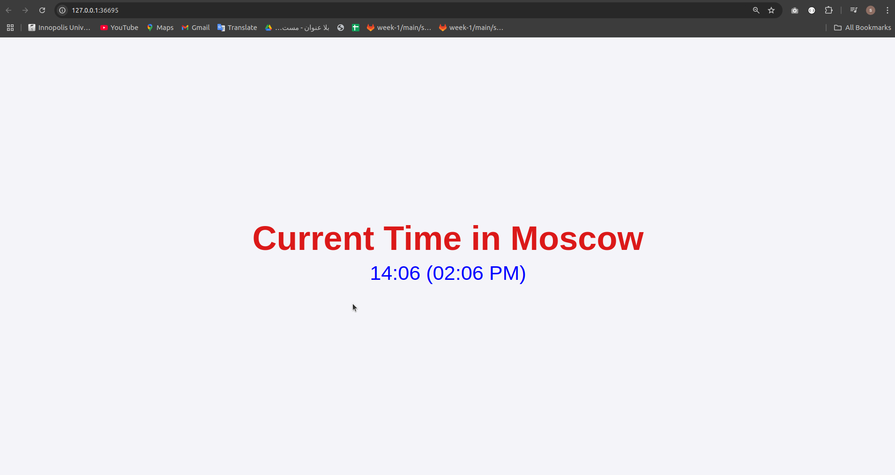
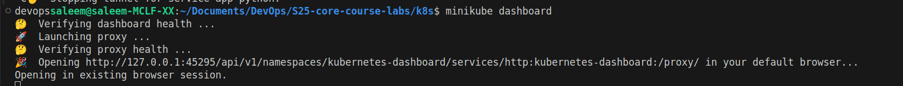
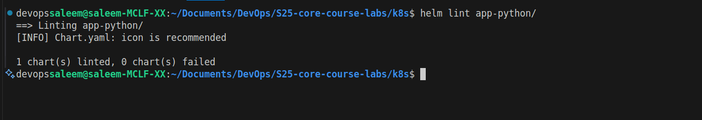
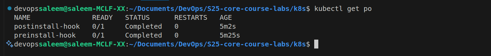
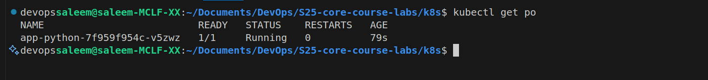
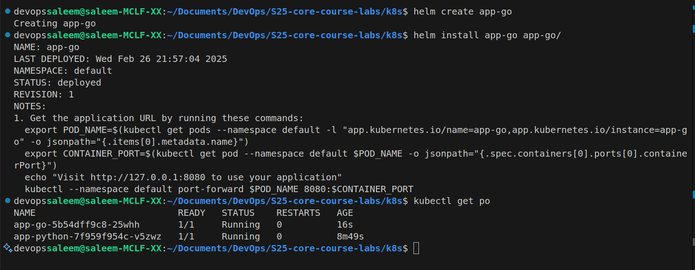
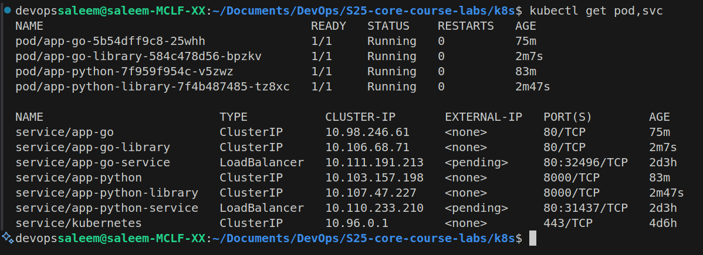
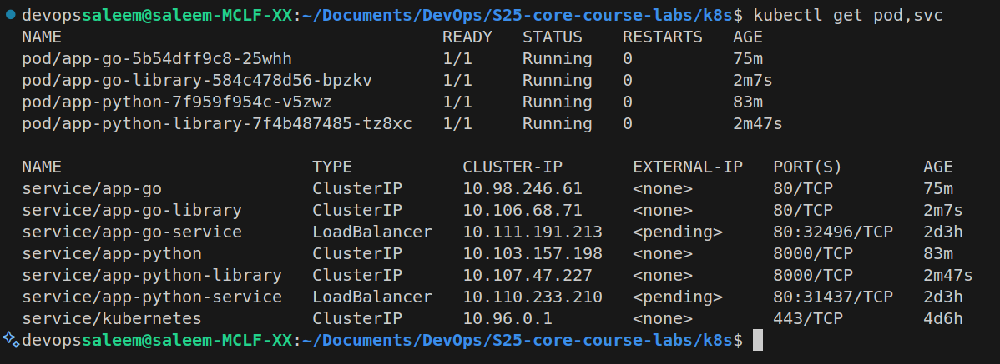

# HELM

## Table of contents

- [HELM](#helm)
  - [Table of contents](#table-of-contents)
  - [Creating a Helm chart for the Python app](#creating-a-helm-chart-for-the-python-app)
  - [Linting and Dry Running](#linting-and-dry-running)
  - [`describe`ing preinstall-hook and postinstall-hook](describeing-preinstall-hook-and-postinstall-hook)
  - [Adding delete policy](#adding-delete-policy)
  - [Chart for Secondary App](#chart-for-secondary-app)
  - [Library chart](#library-chart)

## Creating a Helm chart for the Python app

- After installing Helm, i created a template Helm chart for the Python app using `helm create app-python` command.

- Afterwards, I modified the `values.yaml` as require in the assignment

- Then i ran the `helm install` command to deploy the Python app.

  - 

  - 

- The service was created successfully and I was able to access the Python app using the external IP address.

  - 

    - 

- This can be checked by using `kubectl get po,svc` command also.

  - 

- Also can be checked using dashboard

  - 

  - 

## Linting and Dry Running

- Using `helm lint`, I checked the Helm chart for any syntax errors.
  - 

- Using `helm install --dry-run`, I checked the Helm chart for any errors.

<details>
<summary>output</summary>

```cmd

devopssaleem@saleem-MCLF-XX:~/Documents/DevOps/S25-core-course-labs/k8s$ helm install --dry-run helm-hooks app-python
NAME: helm-hooks
LAST DEPLOYED: Wed Feb 26 21:26:46 2025
NAMESPACE: default
STATUS: pending-install
REVISION: 1
HOOKS:
---
# Source: app-python/templates/post-install.yml
apiVersion: v1
kind: Pod
metadata:
   name: postinstall-hook
   annotations:
       "helm.sh/hook": "post-install"
       
spec:
  containers:
  - name: post-install-container
    image: busybox
    imagePullPolicy: Always
    command: ['sh', '-c', 'echo The post-install hook is running && sleep 15' ]
  restartPolicy: Never
  terminationGracePeriodSeconds: 0
---
# Source: app-python/templates/pre-install.yml
apiVersion: v1
kind: Pod
metadata:
   name: preinstall-hook
   annotations:
       "helm.sh/hook": "pre-install"

spec:
  containers:
  - name: pre-install-container
    image: busybox
    imagePullPolicy: IfNotPresent
    command: ['sh', '-c', 'echo The pre-install hook is running && sleep 20' ]
  restartPolicy: Never
  terminationGracePeriodSeconds: 0
---
# Source: app-python/templates/tests/test-connection.yaml
apiVersion: v1
kind: Pod
metadata:
  name: "helm-hooks-app-python-test-connection"
  labels:
    helm.sh/chart: app-python-0.1.0
    app.kubernetes.io/name: app-python
    app.kubernetes.io/instance: helm-hooks
    app.kubernetes.io/version: "1.16.0"
    app.kubernetes.io/managed-by: Helm
  annotations:
    "helm.sh/hook": test
spec:
  containers:
    - name: wget
      image: busybox
      command: ['wget']
      args: ['helm-hooks-app-python:8000']
  restartPolicy: Never
MANIFEST:
---
# Source: app-python/templates/serviceaccount.yaml
apiVersion: v1
kind: ServiceAccount
metadata:
  name: helm-hooks-app-python
  labels:
    helm.sh/chart: app-python-0.1.0
    app.kubernetes.io/name: app-python
    app.kubernetes.io/instance: helm-hooks
    app.kubernetes.io/version: "1.16.0"
    app.kubernetes.io/managed-by: Helm
automountServiceAccountToken: true
---
# Source: app-python/templates/service.yaml
apiVersion: v1
kind: Service
metadata:
  name: helm-hooks-app-python
  labels:
    helm.sh/chart: app-python-0.1.0
    app.kubernetes.io/name: app-python
    app.kubernetes.io/instance: helm-hooks
    app.kubernetes.io/version: "1.16.0"
    app.kubernetes.io/managed-by: Helm
spec:
  type: ClusterIP
  ports:
    - port: 8000
      targetPort: http
      protocol: TCP
      name: http
  selector:
    app.kubernetes.io/name: app-python
    app.kubernetes.io/instance: helm-hooks
---
# Source: app-python/templates/deployment.yaml
apiVersion: apps/v1
kind: Deployment
metadata:
  name: helm-hooks-app-python
  labels:
    helm.sh/chart: app-python-0.1.0
    app.kubernetes.io/name: app-python
    app.kubernetes.io/instance: helm-hooks
    app.kubernetes.io/version: "1.16.0"
    app.kubernetes.io/managed-by: Helm
spec:
  replicas: 1
  selector:
    matchLabels:
      app.kubernetes.io/name: app-python
      app.kubernetes.io/instance: helm-hooks
  template:
    metadata:
      labels:
        helm.sh/chart: app-python-0.1.0
        app.kubernetes.io/name: app-python
        app.kubernetes.io/instance: helm-hooks
        app.kubernetes.io/version: "1.16.0"
        app.kubernetes.io/managed-by: Helm
    spec:
      serviceAccountName: helm-hooks-app-python
      containers:
        - name: app-python
          image: "saleemasekrea/app_python:latest"
          imagePullPolicy: IfNotPresent
          ports:
            - name: http
              containerPort: 8000
              protocol: TCP
          livenessProbe:
            httpGet:
              path: /
              port: http
          readinessProbe:
            httpGet:
              path: /
              port: http

NOTES:
1. Get the application URL by running these commands:
  export POD_NAME=$(kubectl get pods --namespace default -l "app.kubernetes.io/name=app-python,app.kubernetes.io/instance=helm-hooks" -o jsonpath="{.items[0].metadata.name}")
  export CONTAINER_PORT=$(kubectl get pod --namespace default $POD_NAME -o jsonpath="{.spec.containers[0].ports[0].containerPort}")
  echo "Visit http://127.0.0.1:8080 to use your application"
  kubectl --namespace default port-forward $POD_NAME 8080:$CONTAINER_PORT

```

</details>

## `describe`ing preinstall-hook and postinstall-hook

- The following was used for preinstall-hook and postinstall-hook before adding any delete policy.

- Using `kubectl get po` command, I checked the status of the pods.

  - 

- `kubectl describe pod preinstall-hook`

  - <details>

    ```cmd
    devopssaleem@saleem-MCLF-XX:~/Documents/DevOps/S25-core-course-labs/k8s$ kubectl describe pod preinstall-hook
    Name:             preinstall-hook
    Namespace:        default
    Priority:         0
    Service Account:  default
    Node:             minikube/192.168.49.2
    Start Time:       Wed, 26 Feb 2025 21:25:10 +0300
    Labels:           <none>
    Annotations:      helm.sh/hook: pre-install
    Status:           Succeeded
    IP:               10.244.0.88
    IPs:
      IP:  10.244.0.88
    Containers:
      pre-install-container:
        Container ID:  docker://1c675b5d41a694ce7975087d4ea723d8ccd4fa5a3e3976eef9da3b1b2cbaa0e9
        Image:         busybox
        Image ID:      docker-pullable://busybox@sha256:498a000f370d8c37927118ed80afe8adc38d1edcbfc071627d17b25c88efcab0
        Port:          <none>
        Host Port:     <none>
        Command:
          sh
          -c
          echo The pre-install hook is running && sleep 20
        State:          Terminated
          Reason:       Completed
          Exit Code:    0
          Started:      Wed, 26 Feb 2025 21:25:11 +0300
          Finished:     Wed, 26 Feb 2025 21:25:31 +0300
        Ready:          False
        Restart Count:  0
        Environment:    <none>
        Mounts:
          /var/run/secrets/kubernetes.io/serviceaccount from kube-api-access-blbcg (ro)
    Conditions:
      Type                        Status
      PodReadyToStartContainers   False 
      Initialized                 True 
      Ready                       False 
      ContainersReady             False 
      PodScheduled                True 
    Volumes:
      kube-api-access-blbcg:
        Type:                    Projected (a volume that contains injected data from multiple sources)
        TokenExpirationSeconds:  3607
        ConfigMapName:           kube-root-ca.crt
        ConfigMapOptional:       <nil>
        DownwardAPI:             true
    QoS Class:                   BestEffort
    Node-Selectors:              <none>
    Tolerations:                 node.kubernetes.io/not-ready:NoExecute op=Exists for 300s
                                node.kubernetes.io/unreachable:NoExecute op=Exists for 300s
    Events:
      Type    Reason     Age    From               Message
      ----    ------     ----   ----               -------
      Normal  Scheduled  7m58s  default-scheduler  Successfully assigned default/preinstall-hook to minikube
      Normal  Pulled     7m58s  kubelet            Container image "busybox" already present on machine
      Normal  Created    7m58s  kubelet            Created container: pre-install-container
      Normal  Started    7m58s  kubelet            Started container pre-install-container
    ```

  </details>

- `kubectl describe pod postinstall-hook`

  - <details>

      ```cmd
      devopssaleem@saleem-MCLF-XX:~/Documents/DevOps/S25-core-course-labs/k8s$ kubectl describe pod postinstall-hook
      Name:             postinstall-hook
      Namespace:        default
      Priority:         0
      Service Account:  default
      Node:             minikube/192.168.49.2
      Start Time:       Wed, 26 Feb 2025 21:25:33 +0300
      Labels:           <none>
      Annotations:      helm.sh/hook: post-install
      Status:           Succeeded
      IP:               10.244.0.90
      IPs:
        IP:  10.244.0.90
      Containers:
        post-install-container:
          Container ID:  docker://743f4944d3660b15b2d5d417ac8d9c8ba770e8b513392b7422236c9c93b34a0c
          Image:         busybox
          Image ID:      docker-pullable://busybox@sha256:498a000f370d8c37927118ed80afe8adc38d1edcbfc071627d17b25c88efcab0
          Port:          <none>
          Host Port:     <none>
          Command:
            sh
            -c
            echo The post-install hook is running && sleep 15
          State:          Terminated
            Reason:       Completed
            Exit Code:    0
            Started:      Wed, 26 Feb 2025 21:25:36 +0300
            Finished:     Wed, 26 Feb 2025 21:25:51 +0300
          Ready:          False
          Restart Count:  0
          Environment:    <none>
          Mounts:
            /var/run/secrets/kubernetes.io/serviceaccount from kube-api-access-cvlmz (ro)
      Conditions:
        Type                        Status
        PodReadyToStartContainers   False 
        Initialized                 True 
        Ready                       False 
        ContainersReady             False 
        PodScheduled                True 
      Volumes:
        kube-api-access-cvlmz:
          Type:                    Projected (a volume that contains injected data from multiple sources)
          TokenExpirationSeconds:  3607
          ConfigMapName:           kube-root-ca.crt
          ConfigMapOptional:       <nil>
          DownwardAPI:             true
      QoS Class:                   BestEffort
      Node-Selectors:              <none>
      Tolerations:                 node.kubernetes.io/not-ready:NoExecute op=Exists for 300s
                                  node.kubernetes.io/unreachable:NoExecute op=Exists for 300s
      Events:
        Type    Reason     Age   From               Message
        ----    ------     ----  ----               -------
        Normal  Scheduled  10m   default-scheduler  Successfully assigned default/postinstall-hook to minikube
        Normal  Pulling    10m   kubelet            Pulling image "busybox"
        Normal  Pulled     10m   kubelet            Successfully pulled image "busybox" in 2.894s (2.894s including waiting). Image size: 4269694 bytes.
        Normal  Created    10m   kubelet            Created container: post-install-container
        Normal  Started    10m   kubelet            Started container post-install-container
    ```

    </details>

## Adding delete policy

- In the `post-install-hook` and `pre-install-hook`, I added `"helm.sh/hook-delete-policy": hook-succeeded` annotation to delete the pods after the hooks have run successfully.

- When I run the `helm install` command, the pods are deleted after the hooks have run successfully.

- In the screenshot below, it can be seen that `preinstall-hook` is deleted and only application pod and `postinstall-hook` are running. postinstall-hook is also deleted after it finishes running.

  - 

## Chart for Secondary App

- The same procedures were followed for the `app_go` application.

  - 

## Library chart

- Follwing The Best Practices :

- I created a library chart that contains some common boilerplate code for the Python app and the Go app.

- Afterward, dependencies were added inside `Chart.yaml` file and `helm dependency update` command was run.

  - 

- Running `helm install` command for the library chart was successful.

  - 

- Afterwards `minikube service` and `kubectl get svc` commands were run to start and check the services.

  - 
  - 
