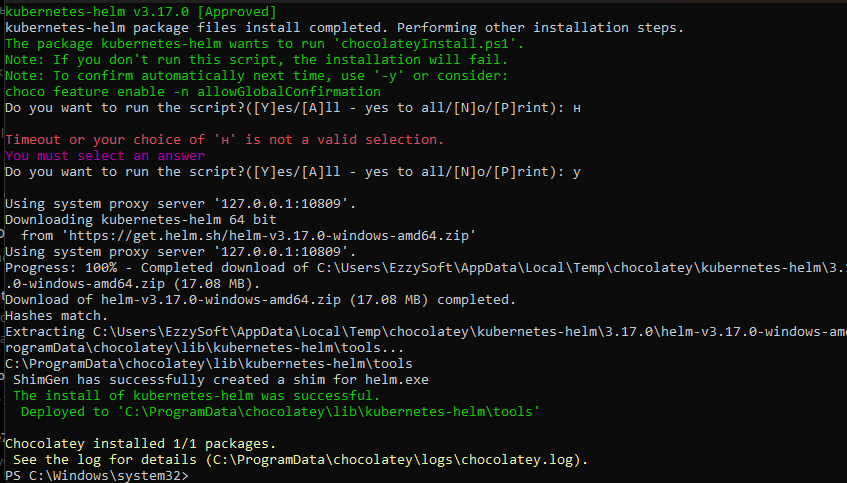
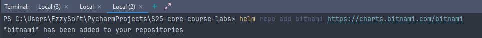
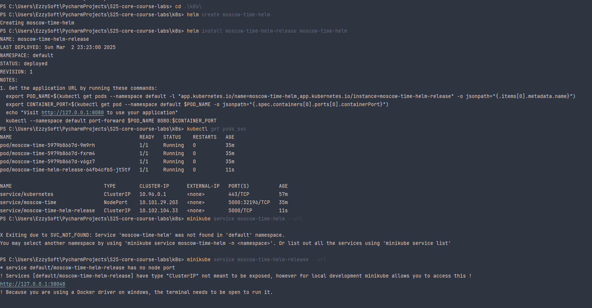
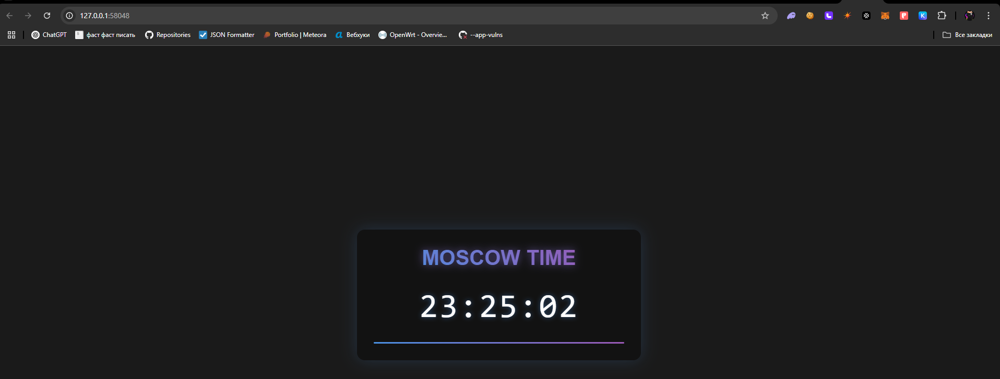
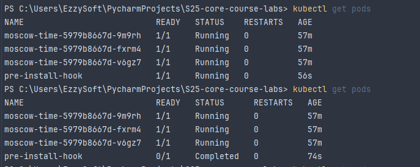

#### Installed Helm and chart





#### Installed Helm Release





#### Output

```bash
PS C:\Users\EzzySoft\PycharmProjects\S25-core-course-labs> kubectl get pods,svc
NAME                                           READY   STATUS    RESTARTS   AGE
pod/moscow-time-5979b8667d-9m9rh               1/1     Running   0          38m
pod/moscow-time-5979b8667d-fxrm4               1/1     Running   0          38m
pod/moscow-time-5979b8667d-v6gz7               1/1     Running   0          38m
pod/moscow-time-helm-release-64fb4cfb5-jt5tf   1/1     Running   0          2m36s

NAME                               TYPE        CLUSTER-IP      EXTERNAL-IP   PORT(S)          AGE
service/kubernetes                 ClusterIP   10.96.0.1       <none>        443/TCP          59m
service/moscow-time                NodePort    10.101.29.203   <none>        5000:32196/TCP   37m
service/moscow-time-helm-release   ClusterIP   10.102.104.33   <none>        5000/TCP         2m36s
```

#### Example how pre-install hook works




---

#### Descriptions of pre- and post install hooks

```bash
PS C:\Users\EzzySoft\PycharmProjects\S25-core-course-labs\k8s> kubectl get po                                                                      
NAME                                       READY   STATUS              RESTARTS   AGE
moscow-time-5979b8667d-9m9rh               1/1     Running             0          67m
moscow-time-5979b8667d-fxrm4               1/1     Running             0          67m
moscow-time-5979b8667d-v6gz7               1/1     Running             0          67m
moscow-time-helm-release-64fb4cfb5-7cb2n   1/1     Terminating         0          3m46s
pre-install-hook                           0/1     ContainerCreating   0          4s
PS C:\Users\EzzySoft\PycharmProjects\S25-core-course-labs\k8s> kubectl describe po pre-install-hook
Name:             pre-install-hook
Namespace:        default
Priority:         0
Service Account:  default
Node:             minikube/192.168.49.2
Start Time:       Sun, 02 Mar 2025 23:55:29 +0300
Labels:           <none>
Annotations:      helm.sh/hook: pre-install
                  helm.sh/hook-delete-policy: hook-succeeded
Status:           Pending
IP:
IPs:              <none>
Containers:
  pre-install:
    Container ID:
    Image:         busybox
    Image ID:
    Port:          <none>
    Host Port:     <none>
    Command:
      sh
      -c
      sleep 20
    State:          Waiting
      Reason:       ContainerCreating
    Ready:          False
    Restart Count:  0
    Environment:    <none>
    Mounts:
      /var/run/secrets/kubernetes.io/serviceaccount from kube-api-access-ft7bj (ro)
Conditions:
  Type                        Status
  PodReadyToStartContainers   False
  Initialized                 True
  Ready                       False
  ContainersReady             False
  PodScheduled                True
Volumes:
  kube-api-access-ft7bj:
    Type:                    Projected (a volume that contains injected data from multiple sources)
    TokenExpirationSeconds:  3607
    ConfigMapName:           kube-root-ca.crt
    ConfigMapOptional:       <nil>
    DownwardAPI:             true
QoS Class:                   BestEffort
Node-Selectors:              <none>
Tolerations:                 node.kubernetes.io/not-ready:NoExecute op=Exists for 300s
                             node.kubernetes.io/unreachable:NoExecute op=Exists for 300s
Events:
  Type    Reason     Age   From               Message
  ----    ------     ----  ----               -------
  Normal  Scheduled  8s    default-scheduler  Successfully assigned default/pre-install-hook to minikube
  Normal  Pulling    8s    kubelet            Pulling image "busybox"


------------------------------


PS C:\Users\EzzySoft\PycharmProjects\S25-core-course-labs\k8s> kubectl describe po post-install-hook
Name:             post-install-hook
Namespace:        default
Priority:         0
Service Account:  default
Node:             minikube/192.168.49.2
Start Time:       Sun, 02 Mar 2025 23:56:26 +0300
Labels:           <none>
Annotations:      helm.sh/hook: post-install
                  helm.sh/hook-delete-policy: hook-succeeded
Status:           Pending
IP:
IPs:              <none>
Containers:
  post-install:
    Container ID:
    Image:         busybox
    Image ID:
    Port:          <none>
    Host Port:     <none>
    Command:
      sh
      -c
      sleep 20
    State:          Waiting
      Reason:       ContainerCreating
    Ready:          False
    Restart Count:  0
    Environment:    <none>
    Mounts:
      /var/run/secrets/kubernetes.io/serviceaccount from kube-api-access-m4jt2 (ro)
Conditions:
  Type                        Status
  PodReadyToStartContainers   False
  Initialized                 True
  Ready                       False
  ContainersReady             False
  PodScheduled                True
Volumes:
  kube-api-access-m4jt2:
    Type:                    Projected (a volume that contains injected data from multiple sources)
    TokenExpirationSeconds:  3607
    ConfigMapName:           kube-root-ca.crt
    ConfigMapOptional:       <nil>
    DownwardAPI:             true
QoS Class:                   BestEffort
Node-Selectors:              <none>
Tolerations:                 node.kubernetes.io/not-ready:NoExecute op=Exists for 300s
                             node.kubernetes.io/unreachable:NoExecute op=Exists for 300s
Events:
  Type    Reason     Age   From               Message
  ----    ------     ----  ----               -------
  Normal  Scheduled  6s    default-scheduler  Successfully assigned default/post-install-hook to minikube
  Normal  Pulling    5s    kubelet            Pulling image "busybox"

```

---


Here post-install hook not deleted yet due recent installation:

```bash

PS C:\Users\EzzySoft\PycharmProjects\S25-core-course-labs\k8s> kubectl get pods,svc
NAME                                           READY   STATUS    RESTARTS   AGE
pod/moscow-time-5979b8667d-9m9rh               1/1     Running   0          69m
pod/moscow-time-5979b8667d-fxrm4               1/1     Running   0          69m
pod/moscow-time-5979b8667d-v6gz7               1/1     Running   0          69m
pod/moscow-time-helm-release-64fb4cfb5-9l8zl   1/1     Running   0          40s
pod/post-install-hook                          1/1     Running   0          40s

NAME                               TYPE        CLUSTER-IP       EXTERNAL-IP   PORT(S)          AGE
service/kubernetes                 ClusterIP   10.96.0.1        <none>        443/TCP          91m
service/moscow-time                NodePort    10.101.29.203    <none>        5000:32196/TCP   69m
service/moscow-time-helm-release   ClusterIP   10.111.219.203   <none>        5000/TCP         40s
```
