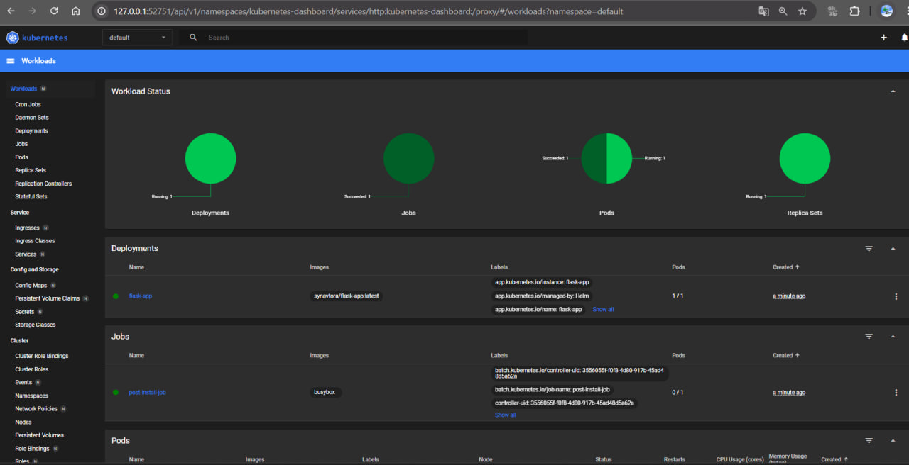

# HELM

## Task 1

### 1. Creating flask-app

```bash
helm create flask-app
```

### 2. Updating the generated file `flask-app/values.yaml`:

```bash
image:
  repository: synavtora/flask-app
  tag: "latest"

---

service:
  port: 5000
```

### 3. `helm install`:

```bash
D:\app_python\app_python\k8s>helm install flask-app ./flask-app
NAME: flask-app
LAST DEPLOYED: Mon Mar  3 16:07:22 2025
NAMESPACE: default
STATUS: deployed
REVISION: 1
NOTES:
1. Get the application URL by running these commands:
  export POD_NAME=$(kubectl get pods --namespace default -l "app.kubernetes.io/name=flask-app,app.kubernetes.io/instance=flask-app" -o jsonpath="{.items[0].metadata.name}")
  export CONTAINER_PORT=$(kubectl get pod --namespace default $POD_NAME -o jsonpath="{.spec.containers[0].ports[0].containerPort}")
  echo "Visit http://127.0.0.1:8080 to use your application"
  kubectl --namespace default port-forward $POD_NAME 8080:$CONTAINER_PORT
```

### 4. Checking the minikube dashboard:
```bash
D:\app_python\app_python\k8s>minikube dashboard
* Verifying dashboard health ...
* Launching proxy ...
* Verifying proxy health ...
* Opening http://127.0.0.1:52751/api/v1/namespaces/kubernetes-dashboard/services/http:kubernetes-dashboard:/proxy/ in your default browser...
```

The screenshot of openned dashboard:



`minikube service flask-app`:

```bash
D:\app_python\app_python\k8s>helm install flask-app ./flask-app
NAME: flask-app
LAST DEPLOYED: Mon Mar  3 16:07:22 2025
NAMESPACE: default
STATUS: deployed
REVISION: 1
NOTES:
1. Get the application URL by running these commands:
  export POD_NAME=$(kubectl get pods --namespace default -l "app.kubernetes.io/name=flask-app,app.kubernetes.io/instance=flask-app" -o jsonpath="{.items[0].metadata.name}")
  export CONTAINER_PORT=$(kubectl get pod --namespace default $POD_NAME -o jsonpath="{.spec.containers[0].ports[0].containerPort}")
  echo "Visit http://127.0.0.1:8080 to use your application"
  kubectl --namespace default port-forward $POD_NAME 8080:$CONTAINER_PORT

D:\app_python\app_python\k8s>minikube service flask-app
|-----------|-----------|-------------|--------------|
| NAMESPACE |   NAME    | TARGET PORT |     URL      |
|-----------|-----------|-------------|--------------|
| default   | flask-app |             | No node port |
|-----------|-----------|-------------|--------------|
* service default/flask-app has no node port
! Services [default/flask-app] have type "ClusterIP" not meant to be exposed, however for local development minikube allows you to access this !
* Starting tunnel for service flask-app.
|-----------|-----------|-------------|------------------------|
| NAMESPACE |   NAME    | TARGET PORT |          URL           |
|-----------|-----------|-------------|------------------------|
| default   | flask-app |             | http://127.0.0.1:53720 |
|-----------|-----------|-------------|------------------------|
* Opening service default/flask-app in default browser...
! Because you are using a Docker driver on windows, the terminal needs to be open to run it.
```
The page with app has opened

### 5. `kubectl get pods,svc`:

```bash
D:\app_python\app_python\k8s>kubectl get pods,svc
NAME                             READY   STATUS    RESTARTS   AGE
pod/flask-app-6c5b565dfc-xp792   1/1     Running   0          89s

NAME                 TYPE        CLUSTER-IP       EXTERNAL-IP   PORT(S)    AGE
service/flask-app    ClusterIP   10.100.214.225   <none>        5000/TCP   89s
service/kubernetes   ClusterIP   10.96.0.1        <none>        443/TCP    89m
```

## Task 2

### 1. Validating Helm chart
```bash
D:\app_python\app_python\k8s>helm lint chart-2/
==> Linting flask-app
[INFO] Chart.yaml: icon is recommended

1 chart(s) linted, 0 chart(s) failed
```

### 2. Pre-install/post-install hooks:

```bash
D:\app_python\app_python\k8s>helm install --dry-run helm-hooks ./chart-2
NAME: helm-hooks
LAST DEPLOYED: Mon Mar  3 16:58:49 2025
NAMESPACE: default
STATUS: pending-install
REVISION: 1
HOOKS:
---
# Source: chart-2/templates/post-install-hook.yaml
apiVersion: v1
kind: Pod
metadata:
   name: postinstall-hook
   annotations:
       "helm.sh/hook": "post-install"
spec:
  containers:
  - name: post-install-container
    image: busybox
    imagePullPolicy: Always
    command: ['sh', '-c', 'echo The post-install hook is running && sleep 15' ]
  restartPolicy: Never
  terminationGracePeriodSeconds: 0
---
# Source: chart-2/templates/pre-install-hook.yaml
apiVersion: v1
kind: Pod
metadata:
   name: preinstall-hook
   annotations:
       "helm.sh/hook": "pre-install"
spec:
  containers:
  - name: pre-install-container
    image: busybox
    imagePullPolicy: IfNotPresent
    command: ['sh', '-c', 'echo The pre-install hook is running && sleep 20' ]
  restartPolicy: Never
  terminationGracePeriodSeconds: 0
---
# Source: chart-2/templates/tests/test-connection.yaml
apiVersion: v1
kind: Pod
metadata:
  name: "helm-hooks-chart-2-test-connection"
  labels:
    helm.sh/chart: chart-2-0.1.0
    app.kubernetes.io/name: chart-2
    app.kubernetes.io/instance: helm-hooks
    app.kubernetes.io/version: "1.16.0"
    app.kubernetes.io/managed-by: Helm
  annotations:
    "helm.sh/hook": test
spec:
  containers:
    - name: wget
      image: busybox
      command: ['wget']
      args: ['helm-hooks-chart-2:5000']
  restartPolicy: Never
MANIFEST:
---
# Source: chart-2/templates/serviceaccount.yaml
apiVersion: v1
kind: ServiceAccount
metadata:
  name: helm-hooks-chart-2
  labels:
    helm.sh/chart: chart-2-0.1.0
    app.kubernetes.io/name: chart-2
    app.kubernetes.io/instance: helm-hooks
    app.kubernetes.io/version: "1.16.0"
    app.kubernetes.io/managed-by: Helm
automountServiceAccountToken: true
---
# Source: chart-2/templates/service.yaml
apiVersion: v1
kind: Service
metadata:
  name: helm-hooks-chart-2
  labels:
    helm.sh/chart: chart-2-0.1.0
    app.kubernetes.io/name: chart-2
    app.kubernetes.io/instance: helm-hooks
    app.kubernetes.io/version: "1.16.0"
    app.kubernetes.io/managed-by: Helm
spec:
  type: ClusterIP
  ports:
    - port: 5000
      targetPort: http
      protocol: TCP
      name: http
  selector:
    app.kubernetes.io/name: chart-2
    app.kubernetes.io/instance: helm-hooks
---
# Source: chart-2/templates/deployment.yaml
apiVersion: apps/v1
kind: Deployment
metadata:
  name: helm-hooks-chart-2
  labels:
    helm.sh/chart: chart-2-0.1.0
    app.kubernetes.io/name: chart-2
    app.kubernetes.io/instance: helm-hooks
    app.kubernetes.io/version: "1.16.0"
    app.kubernetes.io/managed-by: Helm
spec:
  replicas: 1
  selector:
    matchLabels:
      app.kubernetes.io/name: chart-2
      app.kubernetes.io/instance: helm-hooks
  template:
    metadata:
      labels:
        helm.sh/chart: chart-2-0.1.0
        app.kubernetes.io/name: chart-2
        app.kubernetes.io/instance: helm-hooks
        app.kubernetes.io/version: "1.16.0"
        app.kubernetes.io/managed-by: Helm
    spec:
      serviceAccountName: helm-hooks-chart-2
      containers:
        - name: chart-2
          image: "synavtora/flask-app:latest"
          imagePullPolicy: IfNotPresent
          ports:
            - name: http
              containerPort: 5000
              protocol: TCP
          livenessProbe:
            httpGet:
              path: /
              port: http
          readinessProbe:
            httpGet:
              path: /
              port: http

NOTES:
1. Get the application URL by running these commands:
  export POD_NAME=$(kubectl get pods --namespace default -l "app.kubernetes.io/name=chart-2,app.kubernetes.io/instance=helm-hooks" -o jsonpath="{.items[0].metadata.name}")
  export CONTAINER_PORT=$(kubectl get pod --namespace default $POD_NAME -o jsonpath="{.spec.containers[0].ports[0].containerPort}")
  echo "Visit http://127.0.0.1:8080 to use your application"
  kubectl --namespace default port-forward $POD_NAME 8080:$CONTAINER_PORT
```

### 3. Checking if hooks are on

```bash
D:\app_python\app_python\k8s>kubectl get pods
NAME                                  READY   STATUS      RESTARTS   AGE
helm-hooks-chart-2-7b74f45db9-tghwj   1/1     Running     0          2m
postinstall-hook                      0/1     Completed   0          2m
preinstall-hook                       0/1     Completed   0          2m22s
```

### 4. Hooks description:
```bash
D:\app_python\app_python\k8s>kubectl describe po preinstall-hook
Name:             preinstall-hook
Namespace:        default
Priority:         0
Service Account:  default
Node:             minikube/192.168.49.2
Start Time:       Mon, 03 Mar 2025 16:57:10 +0300
Labels:           <none>
Annotations:      helm.sh/hook: pre-install
Status:           Succeeded
IP:               10.244.0.59
IPs:
  IP:  10.244.0.59
Containers:
  pre-install-container:
    Container ID:  docker://8c02fbeb25100118fa6b280eb9b6689cd8cb22b5023055c4ece1b23baf7ba0ec
    Image:         busybox
    Image ID:      docker-pullable://busybox@sha256:498a000f370d8c37927118ed80afe8adc38d1edcbfc071627d17b25c88efcab0
    Port:          <none>
    Host Port:     <none>
    Command:
      sh
      -c
      echo The pre-install hook is running && sleep 20
    State:          Terminated
      Reason:       Completed
      Exit Code:    0
      Started:      Mon, 03 Mar 2025 16:57:11 +0300
      Finished:     Mon, 03 Mar 2025 16:57:29 +0300
    Ready:          False
    Restart Count:  0
    Environment:    <none>
    Mounts:
      /var/run/secrets/kubernetes.io/serviceaccount from kube-api-access-5zl9n (ro)
Conditions:
  Type                        Status
  PodReadyToStartContainers   False
  Initialized                 True
  Ready                       False
  ContainersReady             False
  PodScheduled                True
Volumes:
  kube-api-access-5zl9n:
    Type:                    Projected (a volume that contains injected data from multiple sources)
    TokenExpirationSeconds:  3607
    ConfigMapName:           kube-root-ca.crt
    ConfigMapOptional:       <nil>
    DownwardAPI:             true
QoS Class:                   BestEffort
Node-Selectors:              <none>
Tolerations:                 node.kubernetes.io/not-ready:NoExecute op=Exists for 300s
                             node.kubernetes.io/unreachable:NoExecute op=Exists for 300s
Events:
  Type    Reason     Age    From               Message
  ----    ------     ----   ----               -------
  Normal  Scheduled  3m49s  default-scheduler  Successfully assigned default/preinstall-hook to minikube
  Normal  Pulled     3m48s  kubelet            Container image "busybox" already present on machine
  Normal  Created    3m48s  kubelet            Created container: pre-install-container
  Normal  Started    3m48s  kubelet            Started container pre-install-container

D:\app_python\app_python\k8s>kubectl describe po postinstall-hook
Name:             postinstall-hook
Namespace:        default
Priority:         0
Service Account:  default
Node:             minikube/192.168.49.2
Start Time:       Mon, 03 Mar 2025 16:57:32 +0300
Labels:           <none>
Annotations:      helm.sh/hook: post-install
Status:           Succeeded
IP:               10.244.0.61
IPs:
  IP:  10.244.0.61
Containers:
  post-install-container:
    Container ID:  docker://02be03294d2b8d35604b91ec1bf4b9b525ac768d233e70fbe7dbe4e38be891e3
    Image:         busybox
    Image ID:      docker-pullable://busybox@sha256:498a000f370d8c37927118ed80afe8adc38d1edcbfc071627d17b25c88efcab0
    Port:          <none>
    Host Port:     <none>
    Command:
      sh
      -c
      echo The post-install hook is running && sleep 15
    State:          Terminated
      Reason:       Completed
      Exit Code:    0
      Started:      Mon, 03 Mar 2025 16:57:37 +0300
      Finished:     Mon, 03 Mar 2025 16:57:52 +0300
    Ready:          False
    Restart Count:  0
    Environment:    <none>
    Mounts:
      /var/run/secrets/kubernetes.io/serviceaccount from kube-api-access-qszh9 (ro)
Conditions:
  Type                        Status
  PodReadyToStartContainers   False
  Initialized                 True
  Ready                       False
  ContainersReady             False
  PodScheduled                True
Volumes:
  kube-api-access-qszh9:
    Type:                    Projected (a volume that contains injected data from multiple sources)
    TokenExpirationSeconds:  3607
    ConfigMapName:           kube-root-ca.crt
    ConfigMapOptional:       <nil>
    DownwardAPI:             true
QoS Class:                   BestEffort
Node-Selectors:              <none>
Tolerations:                 node.kubernetes.io/not-ready:NoExecute op=Exists for 300s
                             node.kubernetes.io/unreachable:NoExecute op=Exists for 300s
Events:
  Type    Reason     Age    From               Message
  ----    ------     ----   ----               -------
  Normal  Scheduled  3m40s  default-scheduler  Successfully assigned default/postinstall-hook to minikube
  Normal  Pulling    3m38s  kubelet            Pulling image "busybox"
  Normal  Pulled     3m35s  kubelet            Successfully pulled image "busybox" in 3.09s (3.09s including waiting). Image size: 4269694 bytes.
  Normal  Created    3m35s  kubelet            Created container: post-install-container
  Normal  Started    3m35s  kubelet            Started container post-install-container
```