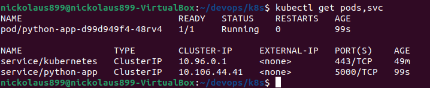
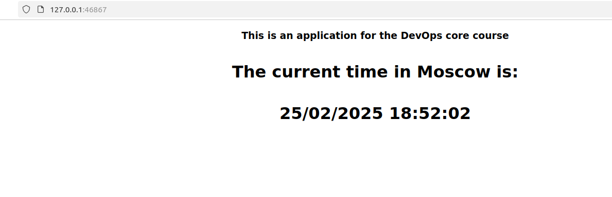
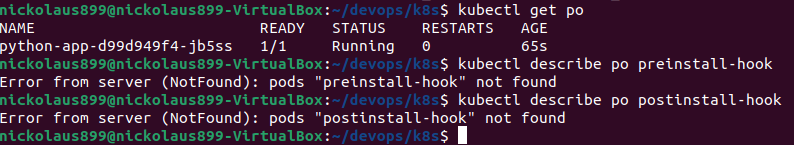
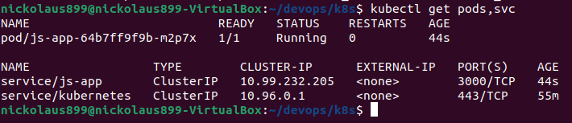
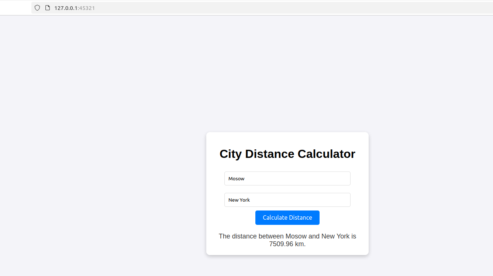
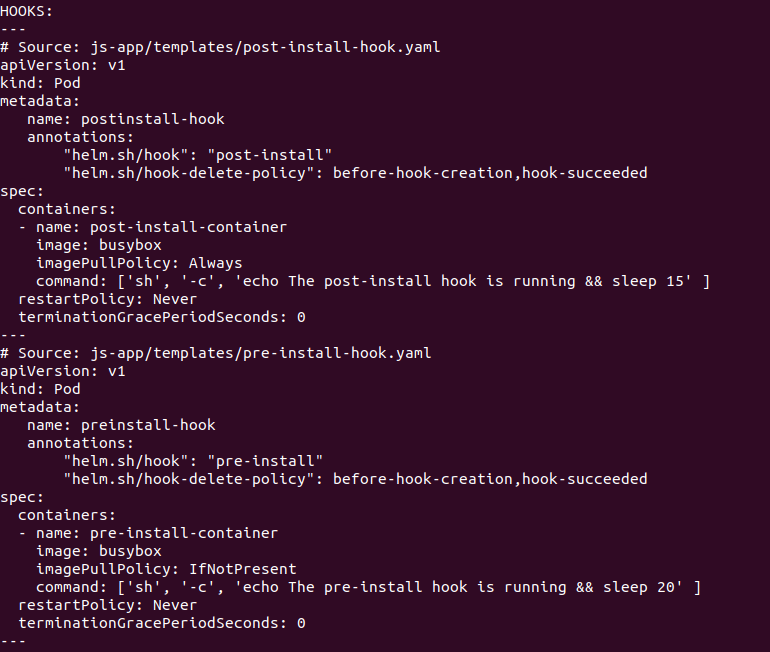
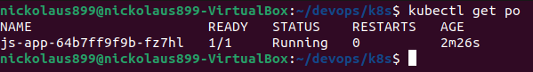

# Helm

Replace image in `values.yaml`
```
image:
  repository: nickolaus899/python-msk-time
  tag: latest
```

#### Then, install to python-app with the command:
```
helm install python-app ./python-app
```

```
NAME: python-app
LAST DEPLOYED: Tue Feb 25 18:51:47 2025
NAMESPACE: default
STATUS: deployed
REVISION: 1
NOTES:
1. Get the application URL by running these commands:
  export POD_NAME=$(kubectl get pods --namespace default -l "app.kubernetes.io/name=python-app,app.kubernetes.io/instance=python-app" -o jsonpath="{.items[0].metadata.name}")
  export CONTAINER_PORT=$(kubectl get pod --namespace default $POD_NAME -o jsonpath="{.spec.containers[0].ports[0].containerPort}")
  echo "Visit http://127.0.0.1:8080 to use your application"
  kubectl --namespace default port-forward $POD_NAME 8080:$CONTAINER_PORT
```

#### Check that everything works




#### Start service

```
|-----------|------------|-------------|--------------|
| NAMESPACE |    NAME    | TARGET PORT |     URL      |
|-----------|------------|-------------|--------------|
| default   | python-app |             | No node port |
|-----------|------------|-------------|--------------|
😿  service default/python-app has no node port
❗  Services [default/python-app] have type "ClusterIP" not meant to be exposed, however for local development minikube allows you to access this !
🏃  Starting tunnel for service python-app.
|-----------|------------|-------------|------------------------|
| NAMESPACE |    NAME    | TARGET PORT |          URL           |
|-----------|------------|-------------|------------------------|
| default   | python-app |             | http://127.0.0.1:46867 |
|-----------|------------|-------------|------------------------|
🎉  Opening service default/python-app in default browser...
/usr/bin/xdg-open: 882: www-browser: not found
/usr/bin/xdg-open: 882: links2: not found
/usr/bin/xdg-open: 882: elinks: not found
/usr/bin/xdg-open: 882: links: not found
/usr/bin/xdg-open: 882: lynx: not found
/usr/bin/xdg-open: 882: w3m: not found
xdg-open: no method available for opening 'http://127.0.0.1:46867'
```



# Chart Hooks

Configured `pre-install` and `post-install` Hooks. When I executed
dry run I could see two hooks that appeared there.

So, the result of `kubectl get po` is the following:
```
NAME                         READY   STATUS      RESTARTS   AGE
postinstall-hook             0/1     Completed   0          28s
preinstall-hook              0/1     Completed   0          51s
python-app-d99d949f4-ht7kw   1/1     Running     0          28s
```

And here are outputs of describing these hooks:
### `preinstall`
```
Name:             preinstall-hook
Namespace:        default
Priority:         0
Service Account:  default
Node:             minikube/192.168.49.2
Start Time:       Wed, 26 Feb 2025 17:08:47 +0300
Labels:           <none>
Annotations:      helm.sh/hook: pre-install
Status:           Succeeded
IP:               10.244.0.31
IPs:
  IP:  10.244.0.31
Containers:
  pre-install-container:
    Container ID:  docker://d1dcbf11f8d6ee142f299d63f049905d41ac2387f946073332398ae98701f591
    Image:         busybox
    Image ID:      docker-pullable://busybox@sha256:498a000f370d8c37927118ed80afe8adc38d1edcbfc071627d17b25c88efcab0
    Port:          <none>
    Host Port:     <none>
    Command:
      sh
      -c
      echo The pre-install hook is running && sleep 20
    State:          Terminated
      Reason:       Completed
      Exit Code:    0
      Started:      Wed, 26 Feb 2025 17:08:48 +0300
      Finished:     Wed, 26 Feb 2025 17:09:08 +0300
    Ready:          False
    Restart Count:  0
    Environment:    <none>
    Mounts:
      /var/run/secrets/kubernetes.io/serviceaccount from kube-api-access-n9zs7 (ro)
Conditions:
  Type                        Status
  PodReadyToStartContainers   False 
  Initialized                 True 
  Ready                       False 
  ContainersReady             False 
  PodScheduled                True 
Volumes:
  kube-api-access-n9zs7:
    Type:                    Projected (a volume that contains injected data from multiple sources)
    TokenExpirationSeconds:  3607
    ConfigMapName:           kube-root-ca.crt
    ConfigMapOptional:       <nil>
    DownwardAPI:             true
QoS Class:                   BestEffort
Node-Selectors:              <none>
Tolerations:                 node.kubernetes.io/not-ready:NoExecute op=Exists for 300s
                             node.kubernetes.io/unreachable:NoExecute op=Exists for 300s
Events:
  Type    Reason     Age    From               Message
  ----    ------     ----   ----               -------
  Normal  Scheduled  2m30s  default-scheduler  Successfully assigned default/preinstall-hook to minikube
  Normal  Pulled     2m29s  kubelet            Container image "busybox" already present on machine
  Normal  Created    2m29s  kubelet            Created container: pre-install-container
  Normal  Started    2m29s  kubelet            Started container pre-install-container

```

### `postinstall`
```
Name:             postinstall-hook
Namespace:        default
Priority:         0
Service Account:  default
Node:             minikube/192.168.49.2
Start Time:       Wed, 26 Feb 2025 17:09:10 +0300
Labels:           <none>
Annotations:      helm.sh/hook: post-install
Status:           Succeeded
IP:               10.244.0.33
IPs:
  IP:  10.244.0.33
Containers:
  post-install-container:
    Container ID:  docker://e0d08150b642211c3b99fad3e07a9cb7da8345ee6f6147cbc76a55595e0a6c1e
    Image:         busybox
    Image ID:      docker-pullable://busybox@sha256:498a000f370d8c37927118ed80afe8adc38d1edcbfc071627d17b25c88efcab0
    Port:          <none>
    Host Port:     <none>
    Command:
      sh
      -c
      echo The post-install hook is running && sleep 15
    State:          Terminated
      Reason:       Completed
      Exit Code:    0
      Started:      Wed, 26 Feb 2025 17:09:14 +0300
      Finished:     Wed, 26 Feb 2025 17:09:30 +0300
    Ready:          False
    Restart Count:  0
    Environment:    <none>
    Mounts:
      /var/run/secrets/kubernetes.io/serviceaccount from kube-api-access-68r8c (ro)
Conditions:
  Type                        Status
  PodReadyToStartContainers   False 
  Initialized                 True 
  Ready                       False 
  ContainersReady             False 
  PodScheduled                True 
Volumes:
  kube-api-access-68r8c:
    Type:                    Projected (a volume that contains injected data from multiple sources)
    TokenExpirationSeconds:  3607
    ConfigMapName:           kube-root-ca.crt
    ConfigMapOptional:       <nil>
    DownwardAPI:             true
QoS Class:                   BestEffort
Node-Selectors:              <none>
Tolerations:                 node.kubernetes.io/not-ready:NoExecute op=Exists for 300s
                             node.kubernetes.io/unreachable:NoExecute op=Exists for 300s
Events:
  Type    Reason     Age    From               Message
  ----    ------     ----   ----               -------
  Normal  Scheduled  2m57s  default-scheduler  Successfully assigned default/postinstall-hook to minikube
  Normal  Pulling    2m56s  kubelet            Pulling image "busybox"
  Normal  Pulled     2m53s  kubelet            Successfully pulled image "busybox" in 1.507s (3.053s including waiting). Image size: 4269694 bytes.
  Normal  Created    2m53s  kubelet            Created container: post-install-container
  Normal  Started    2m52s  kubelet            Started container post-install-container
```


## Deletion of hooks
We need to extend annotation of both hooks to add deletion policy
`before-hook-creation` and `hook-succeeded`



# Bonus

### Do the same steps for bonus task
```
helm install js-app ./js-app
```

```
NAME: js-app
LAST DEPLOYED: Tue Feb 25 18:58:20 2025
NAMESPACE: default
STATUS: deployed
REVISION: 1
NOTES:
1. Get the application URL by running these commands:
  export POD_NAME=$(kubectl get pods --namespace default -l "app.kubernetes.io/name=js-app,app.kubernetes.io/instance=js-app" -o jsonpath="{.items[0].metadata.name}")
  export CONTAINER_PORT=$(kubectl get pod --namespace default $POD_NAME -o jsonpath="{.spec.containers[0].ports[0].containerPort}")
  echo "Visit http://127.0.0.1:8080 to use your application"
  kubectl --namespace default port-forward $POD_NAME 8080:$CONTAINER_PORT

```



```
|-----------|--------|-------------|--------------|
| NAMESPACE |  NAME  | TARGET PORT |     URL      |
|-----------|--------|-------------|--------------|
| default   | js-app |             | No node port |
|-----------|--------|-------------|--------------|
😿  service default/js-app has no node port
❗  Services [default/js-app] have type "ClusterIP" not meant to be exposed, however for local development minikube allows you to access this !
🏃  Starting tunnel for service js-app.
|-----------|--------|-------------|------------------------|
| NAMESPACE |  NAME  | TARGET PORT |          URL           |
|-----------|--------|-------------|------------------------|
| default   | js-app |             | http://127.0.0.1:45321 |
|-----------|--------|-------------|------------------------|
🎉  Opening service default/js-app in default browser...
/usr/bin/xdg-open: 882: www-browser: not found
/usr/bin/xdg-open: 882: links2: not found
/usr/bin/xdg-open: 882: elinks: not found
/usr/bin/xdg-open: 882: links: not found
/usr/bin/xdg-open: 882: lynx: not found
/usr/bin/xdg-open: 882: w3m: not found
xdg-open: no method available for opening 'http://127.0.0.1:45321'
```



#### After that, we add hooks with already configured deletion policy





## Library Charts

Created and configured, `library` dependency was added to the both apps
