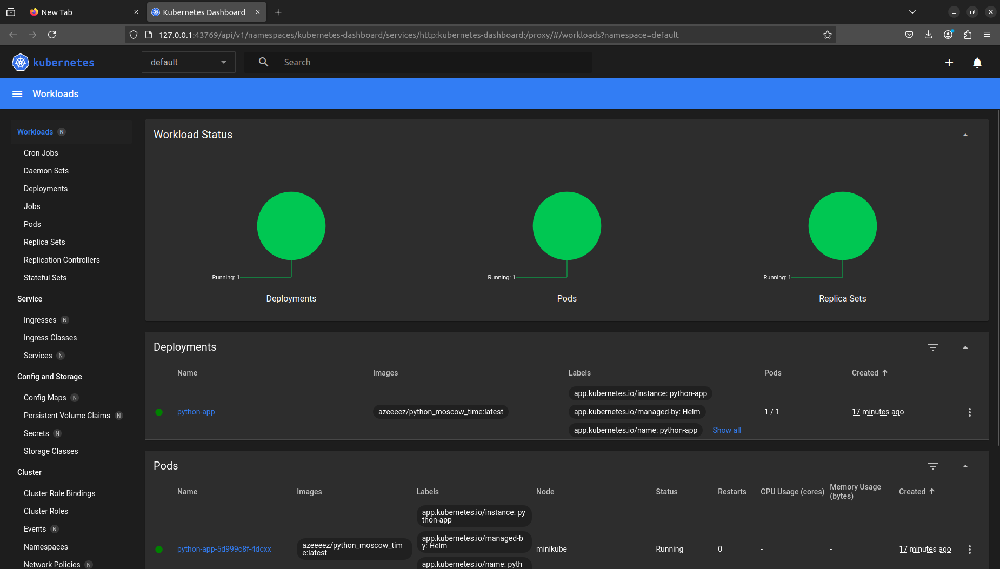
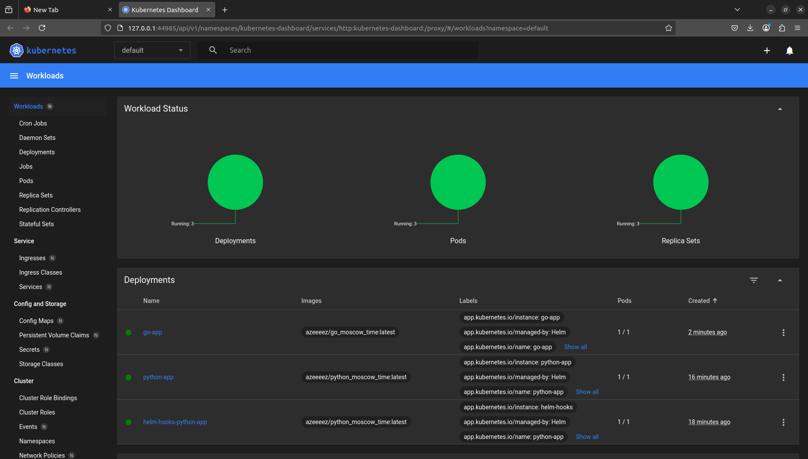

# Helm

## Task 1

**Installing Helm chart**

```bash
azeeez@azeeez:~/Desktop/courses/devops/kdi/S25-core-course-labs/k8s$ helm install python-app ./python-app
NAME: python-app
LAST DEPLOYED: Wed Feb 26 23:54:42 2025
NAMESPACE: default
STATUS: deployed
REVISION: 1
NOTES:
1. Get the application URL by running these commands:
  export POD_NAME=$(kubectl get pods --namespace default -l "app.kubernetes.io/name=python-app,app.kubernetes.io/instance=python-app" -o jsonpath="{.items[0].metadata.name}")
  export CONTAINER_PORT=$(kubectl get pod --namespace default $POD_NAME -o jsonpath="{.spec.containers[0].ports[0].containerPort}")
  echo "Visit http://127.0.0.1:8080 to use your application"
  kubectl --namespace default port-forward $POD_NAME 8080:$CONTAINER_PORT
```

**Chart screenshot**



**Running** `minikube service python-app`:

```bash
azeeez@azeeez:~/Desktop/courses/devops/kdi/S25-core-course-labs/k8s$ minikube service python-app
|-----------|------------|-------------|--------------|
| NAMESPACE |    NAME    | TARGET PORT |     URL      |
|-----------|------------|-------------|--------------|
| default   | python-app |             | No node port |
|-----------|------------|-------------|--------------|
😿  service default/python-app has no node port
❗  Services [default/python-app] have type "ClusterIP" not meant to be exposed, however for local development minikube allows you to access this !
🏃  Starting tunnel for service python-app.
|-----------|------------|-------------|------------------------|
| NAMESPACE |    NAME    | TARGET PORT |          URL           |
|-----------|------------|-------------|------------------------|
| default   | python-app |             | http://127.0.0.1:37903 |
|-----------|------------|-------------|------------------------|
🎉  Opening service default/python-app in default browser...
❗  Because you are using a Docker driver on linux, the terminal needs to be open to run it.
Gtk-Message: 00:05:56.755: Not loading module "atk-bridge": The functionality is provided by GTK natively. Please try to not load it.
^C✋  Stopping tunnel for service python-app.
```

**Running** `kubectl get pods,svc`:

```bash
azeeez@azeeez:~/Desktop/courses/devops/kdi/S25-core-course-labs/k8s$ kubectl get pods,svc
NAME                            READY   STATUS    RESTARTS   AGE
pod/python-app-5d999c8f-4dcxx   1/1     Running   0          8m45s

NAME                 TYPE        CLUSTER-IP      EXTERNAL-IP   PORT(S)    AGE
service/kubernetes   ClusterIP   10.96.0.1       <none>        443/TCP    88m
service/python-app   ClusterIP   10.105.59.166   <none>        5000/TCP   8m45s
```

## Task 2

**Running** `kubectl get po`:

```bash
azeeez@azeeez:~/Desktop/courses/devops/kdi/S25-core-course-labs/k8s$ kubectl get po
NAME                                     READY   STATUS      RESTARTS   AGE
helm-hooks-python-app-6c6549f986-946cd   1/1     Running     0          4m31s
postinstall-hook                         0/1     Completed   0          2m47s
preinstall-hook                          0/1     Completed   0          3m10s
python-app-5d999c8f-m4zhr                1/1     Running     0          2m47s
```

**Running** `kubectl describe po preinstall-hook`:

```bash
azeeez@azeeez:~/Desktop/courses/devops/kdi/S25-core-course-labs/k8s$ kubectl describe po preinstall-hook
Name:             preinstall-hook
Namespace:        default
Priority:         0
Service Account:  default
Node:             minikube/192.168.49.2
Start Time:       Thu, 27 Feb 2025 00:43:46 +0300
Labels:           <none>
Annotations:      helm.sh/hook: pre-install
Status:           Succeeded
IP:               10.244.0.23
IPs:
  IP:  10.244.0.23
Containers:
  pre-install-container:
    Container ID:  docker://00009e81374e4cc69eb1ebc7e4c485193e157f14e9a1103c3e221a00505afcd0
    Image:         busybox
    Image ID:      docker-pullable://busybox@sha256:498a000f370d8c37927118ed80afe8adc38d1edcbfc071627d17b25c88efcab0
    Port:          <none>
    Host Port:     <none>
    Command:
      sh
      -c
      echo The pre-install hook is running && sleep 20
    State:          Terminated
      Reason:       Completed
      Exit Code:    0
      Started:      Thu, 27 Feb 2025 00:43:47 +0300
      Finished:     Thu, 27 Feb 2025 00:44:07 +0300
    Ready:          False
    Restart Count:  0
    Environment:    <none>
    Mounts:
      /var/run/secrets/kubernetes.io/serviceaccount from kube-api-access-kvjbf (ro)
Conditions:
  Type                        Status
  PodReadyToStartContainers   False 
  Initialized                 True 
  Ready                       False 
  ContainersReady             False 
  PodScheduled                True 
Volumes:
  kube-api-access-kvjbf:
    Type:                    Projected (a volume that contains injected data from multiple sources)
    TokenExpirationSeconds:  3607
    ConfigMapName:           kube-root-ca.crt
    ConfigMapOptional:       <nil>
    DownwardAPI:             true
QoS Class:                   BestEffort
Node-Selectors:              <none>
Tolerations:                 node.kubernetes.io/not-ready:NoExecute op=Exists for 300s
                             node.kubernetes.io/unreachable:NoExecute op=Exists for 300s
Events:
  Type    Reason     Age    From               Message
  ----    ------     ----   ----               -------
  Normal  Scheduled  4m21s  default-scheduler  Successfully assigned default/preinstall-hook to minikube
  Normal  Pulled     4m20s  kubelet            Container image "busybox" already present on machine
  Normal  Created    4m20s  kubelet            Created container: pre-install-container
  Normal  Started    4m20s  kubelet            Started container pre-install-container
```

**Running** `kubectl describe po postinstall-hook`:

```bash
azeeez@azeeez:~/Desktop/courses/devops/kdi/S25-core-course-labs/k8s$ kubectl describe po postinstall-hook
Name:             postinstall-hook
Namespace:        default
Priority:         0
Service Account:  default
Node:             minikube/192.168.49.2
Start Time:       Thu, 27 Feb 2025 00:44:09 +0300
Labels:           <none>
Annotations:      helm.sh/hook: post-install
Status:           Succeeded
IP:               10.244.0.25
IPs:
  IP:  10.244.0.25
Containers:
  post-install-container:
    Container ID:  docker://f234689feacac51bc423b77565a5642174e097432b57fdd0b2daf63efd239eaf
    Image:         busybox
    Image ID:      docker-pullable://busybox@sha256:498a000f370d8c37927118ed80afe8adc38d1edcbfc071627d17b25c88efcab0
    Port:          <none>
    Host Port:     <none>
    Command:
      sh
      -c
      echo The post-install hook is running && sleep 15
    State:          Terminated
      Reason:       Completed
      Exit Code:    0
      Started:      Thu, 27 Feb 2025 00:44:12 +0300
      Finished:     Thu, 27 Feb 2025 00:44:27 +0300
    Ready:          False
    Restart Count:  0
    Environment:    <none>
    Mounts:
      /var/run/secrets/kubernetes.io/serviceaccount from kube-api-access-g6llx (ro)
Conditions:
  Type                        Status
  PodReadyToStartContainers   False 
  Initialized                 True 
  Ready                       False 
  ContainersReady             False 
  PodScheduled                True 
Volumes:
  kube-api-access-g6llx:
    Type:                    Projected (a volume that contains injected data from multiple sources)
    TokenExpirationSeconds:  3607
    ConfigMapName:           kube-root-ca.crt
    ConfigMapOptional:       <nil>
    DownwardAPI:             true
QoS Class:                   BestEffort
Node-Selectors:              <none>
Tolerations:                 node.kubernetes.io/not-ready:NoExecute op=Exists for 300s
                             node.kubernetes.io/unreachable:NoExecute op=Exists for 300s
Events:
  Type    Reason     Age    From               Message
  ----    ------     ----   ----               -------
  Normal  Scheduled  4m49s  default-scheduler  Successfully assigned default/postinstall-hook to minikube
  Normal  Pulling    4m48s  kubelet            Pulling image "busybox"
  Normal  Pulled     4m46s  kubelet            Successfully pulled image "busybox" in 1.562s (1.562s including waiting). Image size: 4269694 bytes.
  Normal  Created    4m46s  kubelet            Created container: post-install-container
  Normal  Started    4m46s  kubelet            Started container post-install-container
```

## Bonus task

**Installing go-app**

```bash
azeeez@azeeez:~/Desktop/courses/devops/kdi/S25-core-course-labs/k8s$ helm install go-app ./go-app
NAME: go-app
LAST DEPLOYED: Thu Feb 27 00:58:02 2025
NAMESPACE: default
STATUS: deployed
REVISION: 1
NOTES:
1. Get the application URL by running these commands:
  export POD_NAME=$(kubectl get pods --namespace default -l "app.kubernetes.io/name=go-app,app.kubernetes.io/instance=go-app" -o jsonpath="{.items[0].metadata.name}")
  export CONTAINER_PORT=$(kubectl get pod --namespace default $POD_NAME -o jsonpath="{.spec.containers[0].ports[0].containerPort}")
  echo "Visit http://127.0.0.1:8080 to use your application"
  kubectl --namespace default port-forward $POD_NAME 8080:$CONTAINER_PORT
```

**Chart screenshot**



**Running** `minikube service go-app`:

```bash
azeeez@azeeez:~/Desktop/courses/devops/kdi/S25-core-course-labs/k8s$ minikube service go-app
|-----------|--------|-------------|--------------|
| NAMESPACE |  NAME  | TARGET PORT |     URL      |
|-----------|--------|-------------|--------------|
| default   | go-app |             | No node port |
|-----------|--------|-------------|--------------|
😿  service default/go-app has no node port
❗  Services [default/go-app] have type "ClusterIP" not meant to be exposed, however for local development minikube allows you to access this !
🏃  Starting tunnel for service go-app.
|-----------|--------|-------------|------------------------|
| NAMESPACE |  NAME  | TARGET PORT |          URL           |
|-----------|--------|-------------|------------------------|
| default   | go-app |             | http://127.0.0.1:42027 |
|-----------|--------|-------------|------------------------|
🎉  Opening service default/go-app in default browser...
❗  Because you are using a Docker driver on linux, the terminal needs to be open to run it.
```

**I used this library from tutorial**:

```bash
{{- define "library-chart.labels" -}}
{{- if .Chart.AppVersion }}
app.kubernetes.io/version: {{ .Chart.AppVersion | quote }}
{{- end }}
app.kubernetes.io/managed-by: {{ .Release.Service }}
app.kubernetes.io/instance: {{ .Release.Name }}
{{- end }}
```
