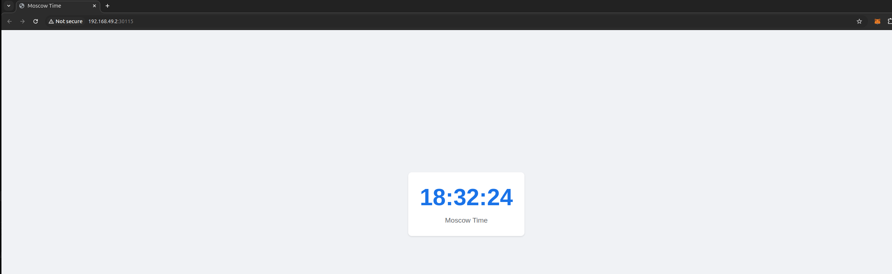

# Helm Implementation Report

## Task 1: Helm Setup and Chart Creation

### Chart Structure
Created Helm chart for Moscow Time application with standard structure:

```
moscow-time-app/
├── Chart.yaml
├── templates/
│   ├── deployment.yaml
│   ├── hpa.yaml
│   ├── ingress.yaml
│   ├── service.yaml
│   ├── serviceaccount.yaml
│   └── tests/
│       └── test-connection.yaml
└── values.yaml
```

### Helm Installation Output
```bash
NAME: moscow-time-app
LAST DEPLOYED: Fri Feb 28 20:05:53 2025
NAMESPACE: default
STATUS: deployed
REVISION: 1
```

### Kubectl Output

```bash
$ kubectl get pods,svc
NAME                                   READY   STATUS    RESTARTS   AGE
pod/moscow-time-app-79f8d4856f-drph8   1/1     Running   0          9m45s
pod/moscow-time-app-79f8d4856f-lc8vz   1/1     Running   0          9m45s
pod/moscow-time-app-79f8d4856f-svcpp   1/1     Running   0          9m45s

NAME                      TYPE           CLUSTER-IP       EXTERNAL-IP   PORT(S)          AGE
service/kubernetes        ClusterIP      10.96.0.1        <none>        443/TCP          3h21m
service/moscow-time-app   LoadBalancer   10.110.211.125   <pending>     8000:31808/TCP   9m45s
```



## Task 2: Helm Chart Hooks

### Chart Hooks Implementation

Created pre-install and post-install hooks:

**Pre-Install Hook (00-pre-install-hook.yaml)**
```yaml
apiVersion: batch/v1
kind: Job
metadata:
  name: "{{ .Release.Name }}-pre-install-job"
  labels:
    app: moscow-time-app
    role: pre-install-hook
  annotations:
    "helm.sh/hook": pre-install
    "helm.sh/hook-weight": "-5"
    "helm.sh/hook-delete-policy": hook-succeeded
spec:
  template:
    metadata:
      labels:
        app: moscow-time-app
        role: pre-install-hook
    spec:
      restartPolicy: Never
      containers:
      - name: pre-install-hook
        image: busybox
        command: ['sh', '-c', 'echo Pre-install hook running; sleep 60; echo Pre-install hook completed']
```

**Post-Install Hook (zz-post-install-hook.yaml)**
```yaml
apiVersion: batch/v1
kind: Job
metadata:
  name: "{{ .Release.Name }}-post-install-job"
  labels:
    app: moscow-time-app
    role: post-install-hook
  annotations:
    "helm.sh/hook": post-install
    "helm.sh/hook-weight": "5"
    "helm.sh/hook-delete-policy": hook-succeeded
spec:
  template:
    metadata:
      labels:
        app: moscow-time-app
        role: post-install-hook
    spec:
      restartPolicy: Never
      containers:
      - name: post-install-hook
        image: busybox
        command: ['sh', '-c', 'echo Post-install hook running; sleep 60; echo Post-install hook completed']
```

### Helm Lint Output
```bash
==> Linting ./moscow-time-app
[INFO] Chart.yaml: icon is recommended

1 chart(s) linted, 0 chart(s) failed
```

### Kubectl Output

```bash
$ kubectl get po
NAME                               READY   STATUS    RESTARTS   AGE
moscow-time-app-79f8d4856f-drph8   1/1     Running   0          8m5s
moscow-time-app-79f8d4856f-lc8vz   1/1     Running   0          8m5s
moscow-time-app-79f8d4856f-svcpp   1/1     Running   0          8m5s
```

### Helm Debug Output

Pre-Install Hook Execution:
```
client.go:720: [debug] Watching for changes to Job moscow-time-app-pre-install-job with timeout of 5m0s
client.go:748: [debug] Add/Modify event for moscow-time-app-pre-install-job: ADDED
client.go:787: [debug] moscow-time-app-pre-install-job: Jobs active: 0, jobs failed: 0, jobs succeeded: 0
client.go:748: [debug] Add/Modify event for moscow-time-app-pre-install-job: MODIFIED
client.go:787: [debug] moscow-time-app-pre-install-job: Jobs active: 1, jobs failed: 0, jobs succeeded: 0
client.go:748: [debug] Add/Modify event for moscow-time-app-pre-install-job: MODIFIED
client.go:787: [debug] moscow-time-app-pre-install-job: Jobs active: 0, jobs failed: 0, jobs succeeded: 0
client.go:486: [debug] Starting delete for "moscow-time-app-pre-install-job" Job
```

Post-Install Hook Execution:
```
client.go:720: [debug] Watching for changes to Job moscow-time-app-post-install-job with timeout of 5m0s
client.go:748: [debug] Add/Modify event for moscow-time-app-post-install-job: ADDED
client.go:787: [debug] moscow-time-app-post-install-job: Jobs active: 0, jobs failed: 0, jobs succeeded: 0
client.go:748: [debug] Add/Modify event for moscow-time-app-post-install-job: MODIFIED
client.go:787: [debug] moscow-time-app-post-install-job: Jobs active: 1, jobs failed: 0, jobs succeeded: 0
client.go:748: [debug] Add/Modify event for moscow-time-app-post-install-job: MODIFIED
client.go:787: [debug] moscow-time-app-post-install-job: Jobs active: 0, jobs failed: 0, jobs succeeded: 0
client.go:486: [debug] Starting delete for "moscow-time-app-post-install-job" Job
```

### Hook Delete Policy Implementation
Both hooks were configured with the `hook-succeeded` delete policy:
```yaml
annotations:
  "helm.sh/hook-delete-policy": hook-succeeded
```

This policy automatically removes hook jobs after successful completion, preventing resource accumulation and keeping the Kubernetes environment clean