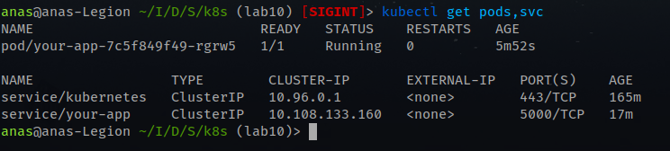
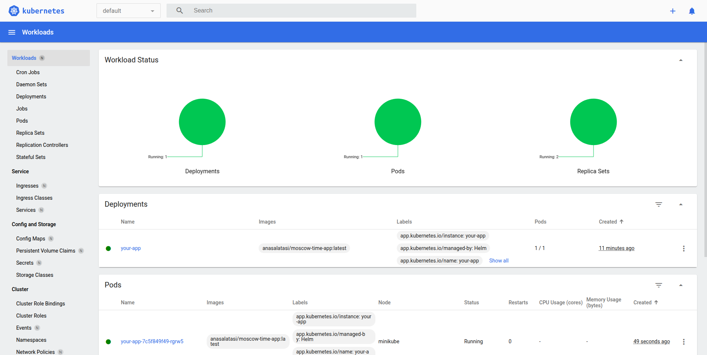
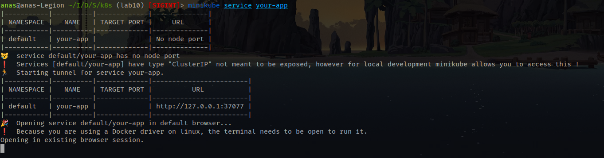
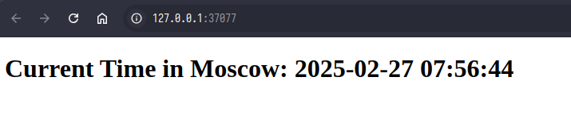
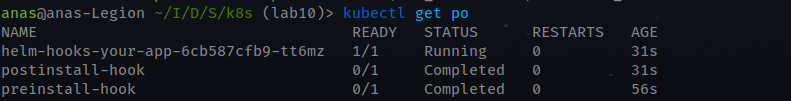

# Task 1
```bash
kubectl get pods,svc
```



```bash
minikube service your-app
```


# Task 2


```bash
kubectl describe po preinstall-hook
```
```
Name:             preinstall-hook
Namespace:        default
Priority:         0
Service Account:  default
Node:             minikube/192.168.49.2
Start Time:       Thu, 27 Feb 2025 09:49:06 +0300
Labels:           <none>
Annotations:      helm.sh/hook: pre-install
Status:           Succeeded
IP:               10.244.0.18
IPs:
  IP:  10.244.0.18
Containers:
  pre-install-container:
    Container ID:  docker://1247f906c1f6d7010fa2692b479aaaab1dc4e83282758b3c81d73ee260eb9fde
    Image:         busybox
    Image ID:      docker-pullable://busybox@sha256:498a000f370d8c37927118ed80afe8adc38d1edcbfc071627d17b25c88efcab0
    Port:          <none>
    Host Port:     <none>
    Command:
      sh
      -c
      echo The pre-install hook is running && sleep 20
    State:          Terminated
      Reason:       Completed
      Exit Code:    0
      Started:      Thu, 27 Feb 2025 09:49:08 +0300
      Finished:     Thu, 27 Feb 2025 09:49:28 +0300
    Ready:          False
    Restart Count:  0
    Environment:    <none>
    Mounts:
      /var/run/secrets/kubernetes.io/serviceaccount from kube-api-access-b8kw5 (ro)
Conditions:
  Type                        Status
  PodReadyToStartContainers   False 
  Initialized                 True 
  Ready                       False 
  ContainersReady             False 
  PodScheduled                True 
Volumes:
  kube-api-access-b8kw5:
    Type:                    Projected (a volume that contains injected data from multiple sources)
    TokenExpirationSeconds:  3607
    ConfigMapName:           kube-root-ca.crt
    ConfigMapOptional:       <nil>
    DownwardAPI:             true
QoS Class:                   BestEffort
Node-Selectors:              <none>
Tolerations:                 node.kubernetes.io/not-ready:NoExecute op=Exists for 300s
                             node.kubernetes.io/unreachable:NoExecute op=Exists for 300s
Events:
  Type    Reason     Age    From               Message
  ----    ------     ----   ----               -------
  Normal  Scheduled  2m40s  default-scheduler  Successfully assigned default/preinstall-hook to minikube
  Normal  Pulling    2m40s  kubelet            Pulling image "busybox"
  Normal  Pulled     2m38s  kubelet            Successfully pulled image "busybox" in 2.174s (2.174s including waiting). Image size: 4269694 bytes.
  Normal  Created    2m38s  kubelet            Created container: pre-install-container
  Normal  Started    2m38s  kubelet            Started container pre-install-container
```

```bash
kubectl describe po postinstall-hook
```
```
Name:             postinstall-hook
Namespace:        default
Priority:         0
Service Account:  default
Node:             minikube/192.168.49.2
Start Time:       Thu, 27 Feb 2025 09:49:31 +0300
Labels:           <none>
Annotations:      helm.sh/hook: post-install
Status:           Succeeded
IP:               10.244.0.20
IPs:
  IP:  10.244.0.20
Containers:
  post-install-container:
    Container ID:  docker://4c91f27e29657cb6b472ada628dc7920b0dcaad560e13b36c8cb8c41ed1f4712
    Image:         busybox
    Image ID:      docker-pullable://busybox@sha256:498a000f370d8c37927118ed80afe8adc38d1edcbfc071627d17b25c88efcab0
    Port:          <none>
    Host Port:     <none>
    Command:
      sh
      -c
      echo The post-install hook is running && sleep 20
    State:          Terminated
      Reason:       Completed
      Exit Code:    0
      Started:      Thu, 27 Feb 2025 09:49:35 +0300
      Finished:     Thu, 27 Feb 2025 09:49:55 +0300
    Ready:          False
    Restart Count:  0
    Environment:    <none>
    Mounts:
      /var/run/secrets/kubernetes.io/serviceaccount from kube-api-access-n24ph (ro)
Conditions:
  Type                        Status
  PodReadyToStartContainers   False 
  Initialized                 True 
  Ready                       False 
  ContainersReady             False 
  PodScheduled                True 
Volumes:
  kube-api-access-n24ph:
    Type:                    Projected (a volume that contains injected data from multiple sources)
    TokenExpirationSeconds:  3607
    ConfigMapName:           kube-root-ca.crt
    ConfigMapOptional:       <nil>
    DownwardAPI:             true
QoS Class:                   BestEffort
Node-Selectors:              <none>
Tolerations:                 node.kubernetes.io/not-ready:NoExecute op=Exists for 300s
                             node.kubernetes.io/unreachable:NoExecute op=Exists for 300s
Events:
  Type    Reason     Age    From               Message
  ----    ------     ----   ----               -------
  Normal  Scheduled  2m27s  default-scheduler  Successfully assigned default/postinstall-hook to minikube
  Normal  Pulling    2m27s  kubelet            Pulling image "busybox"
  Normal  Pulled     2m23s  kubelet            Successfully pulled image "busybox" in 1.907s (3.82s including waiting). Image size: 4269694 bytes.
  Normal  Created    2m23s  kubelet            Created container: post-install-container
  Normal  Started    2m23s  kubelet            Started container post-install-container
```


> **Note:** after adding the hook delete policy we will not see `preinstall-hook` and `postinstall-hook` when we run :
>```bash
>kubectl get po
>```
