# Helm Deployment

## Task 1

### Workloads page in the Minikube dashboard

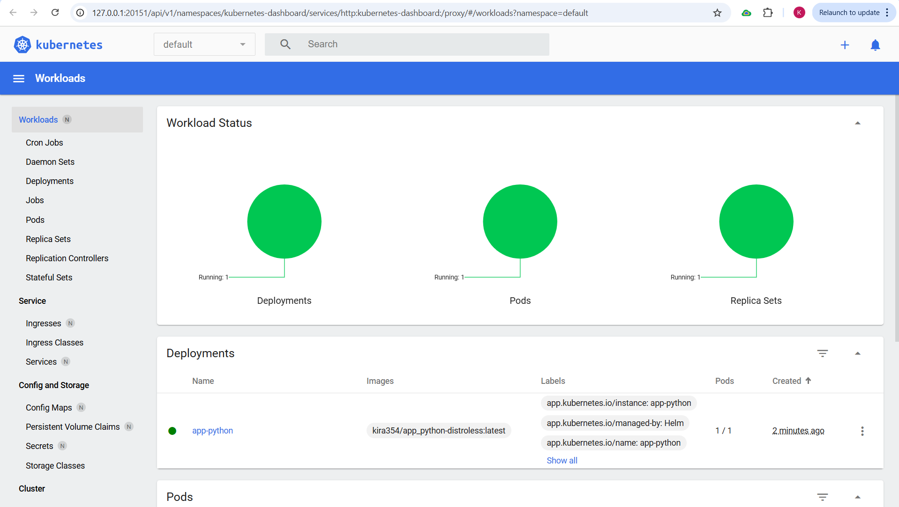
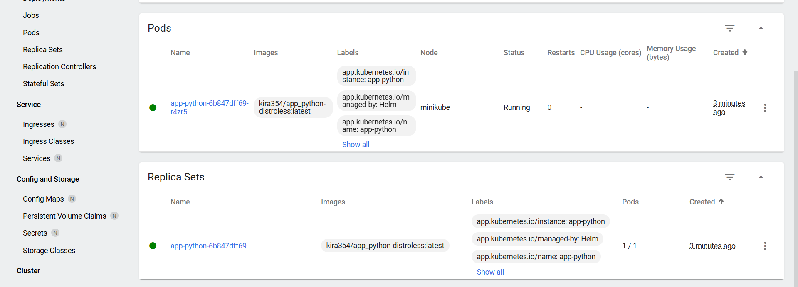

### Access To Application

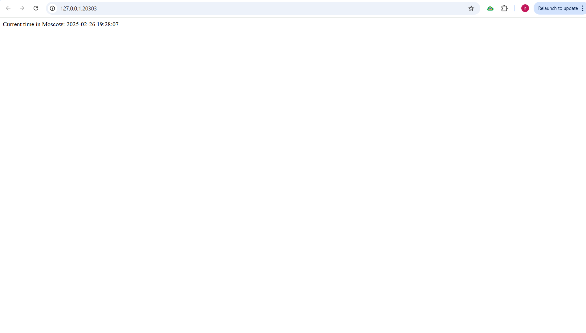
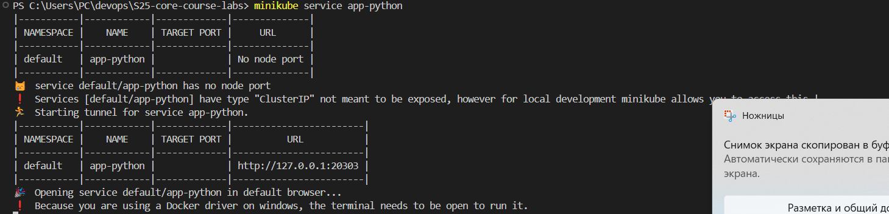

### Pods

Output of `kubectl get pods`:

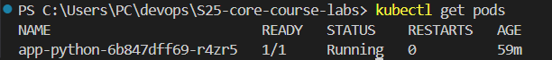

### Services

Output of `kubectl get svc`:

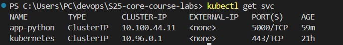

## Task 2

### Troubleshoot Hooks

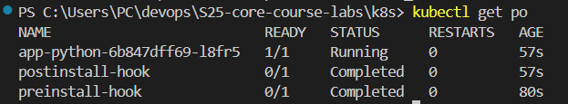

```bash
>>> kubectl describe po preinstall-hook
Name:             preinstall-hook
Namespace:        default
Priority:         0
Service Account:  default
Node:             minikube/192.168.49.2
Start Time:       Wed, 26 Feb 2025 23:05:22 +0300
Labels:           <none>
Annotations:      helm.sh/hook: pre-install
Status:           Succeeded
IP:               10.244.0.93
IPs:
  IP:  10.244.0.93
Containers:
  pre-install-container:
    Container ID:  docker://efb3308d71e13cda53a231505e156580aa94afbca31efb609ab1503844435166
    Image:         busybox
    Image ID:      docker-pullable://busybox@sha256:498a000f370d8c37927118ed80afe8adc38d1edcbfc071627d17b25c88efcab0
    Port:          <none>
    Host Port:     <none>
    Command:
      sh
      -c
      echo The pre-install hook is running && sleep 20
    State:          Terminated
      Reason:       Completed
      Exit Code:    0
      Started:      Wed, 26 Feb 2025 23:05:22 +0300
      Finished:     Wed, 26 Feb 2025 23:05:42 +0300
    Ready:          False
    Restart Count:  0
    Environment:    <none>
    Mounts:
      /var/run/secrets/kubernetes.io/serviceaccount from kube-api-access-5tljn (ro)
Conditions:
  Type                        Status
  PodReadyToStartContainers   False
  Initialized                 True
  Ready                       False
  ContainersReady             False
  PodScheduled                True
Volumes:
  kube-api-access-5tljn:
    Type:                    Projected (a volume that contains injected data from multiple sources)
    TokenExpirationSeconds:  3607
    ConfigMapName:           kube-root-ca.crt
    ConfigMapOptional:       <nil>
    DownwardAPI:             true
QoS Class:                   BestEffort
Node-Selectors:              <none>
Tolerations:                 node.kubernetes.io/not-ready:NoExecute op=Exists for 300s
                             node.kubernetes.io/unreachable:NoExecute op=Exists for 300s
Events:
  Type    Reason     Age   From               Message
  ----    ------     ----  ----               -------
  Normal  Scheduled  116s  default-scheduler  Successfully assigned default/preinstall-hook to minikube
  Normal  Pulled     116s  kubelet            Container image "busybox" already present on machine
  Normal  Created    116s  kubelet            Created container: pre-install-container
  Normal  Started    116s  kubelet            Started container pre-install-container
```

```bash
>>> kubectl describe po preinstall-hook
Name:             preinstall-hook
Namespace:        default
Priority:         0
Service Account:  default
Node:             minikube/192.168.49.2
Start Time:       Wed, 26 Feb 2025 23:05:22 +0300
Labels:           <none>
Annotations:      helm.sh/hook: pre-install
Status:           Succeeded
IP:               10.244.0.93
IPs:
  IP:  10.244.0.93
Containers:
  pre-install-container:
    Container ID:  docker://efb3308d71e13cda53a231505e156580aa94afbca31efb609ab1503844435166
    Image:         busybox
    Image ID:      docker-pullable://busybox@sha256:498a000f370d8c37927118ed80afe8adc38d1edcbfc071627d17b25c88efcab0
    Port:          <none>
    Host Port:     <none>
    Command:
      sh
      -c
      echo The pre-install hook is running && sleep 20
    State:          Terminated
      Reason:       Completed
      Exit Code:    0
      Started:      Wed, 26 Feb 2025 23:05:22 +0300
      Finished:     Wed, 26 Feb 2025 23:05:42 +0300
    Ready:          False
    Restart Count:  0
    Environment:    <none>
    Mounts:
      /var/run/secrets/kubernetes.io/serviceaccount from kube-api-access-5tljn (ro)
Conditions:
  Type                        Status
  PodReadyToStartContainers   False
  Initialized                 True
  Ready                       False
  ContainersReady             False
  PodScheduled                True
Volumes:
  kube-api-access-5tljn:
    Type:                    Projected (a volume that contains injected data from multiple sources)
    TokenExpirationSeconds:  3607
    ConfigMapName:           kube-root-ca.crt
    ConfigMapOptional:       <nil>
    DownwardAPI:             true
QoS Class:                   BestEffort
Node-Selectors:              <none>
Tolerations:                 node.kubernetes.io/not-ready:NoExecute op=Exists for 300s
                             node.kubernetes.io/unreachable:NoExecute op=Exists for 300s
Events:
  Type    Reason     Age   From               Message
  ----    ------     ----  ----               -------
  Normal  Scheduled  116s  default-scheduler  Successfully assigned default/preinstall-hook to minikube
  Normal  Pulled     116s  kubelet            Container image "busybox" already present on machine
  Normal  Created    116s  kubelet            Created container: pre-install-container
  Normal  Started    116s  kubelet            Started container pre-install-container
PS C:\Users\PC\devops\S25-core-course-labs\k8s> kubectl describe po postinstall-hook
Name:             postinstall-hook
Namespace:        default
Priority:         0
Service Account:  default
Node:             minikube/192.168.49.2
Start Time:       Wed, 26 Feb 2025 23:05:45 +0300
Labels:           <none>
Annotations:      helm.sh/hook: post-install
Status:           Succeeded
IP:               10.244.0.95
IPs:
  IP:  10.244.0.95
Containers:
  post-install-container:
    Container ID:  docker://8c6f6a4bb37695e00f9de0ff40101811c1de33f5e391f7d0f0f59aac69549d2e
    Image:         busybox
    Image ID:      docker-pullable://busybox@sha256:498a000f370d8c37927118ed80afe8adc38d1edcbfc071627d17b25c88efcab0
    Port:          <none>
    Host Port:     <none>
    Command:
      sh
      -c
      echo The post-install hook is running && sleep 20
    State:          Terminated
      Reason:       Completed
      Exit Code:    0
      Started:      Wed, 26 Feb 2025 23:05:48 +0300
      Finished:     Wed, 26 Feb 2025 23:06:08 +0300
    Ready:          False
    Restart Count:  0
    Environment:    <none>
    Mounts:
      /var/run/secrets/kubernetes.io/serviceaccount from kube-api-access-q4m7h (ro)
Conditions:
  Type                        Status
  PodReadyToStartContainers   False
  Initialized                 True
  Ready                       False
  ContainersReady             False
  PodScheduled                True
Volumes:
  kube-api-access-q4m7h:
    Type:                    Projected (a volume that contains injected data from multiple sources)
    TokenExpirationSeconds:  3607
    ConfigMapName:           kube-root-ca.crt
    ConfigMapOptional:       <nil>

    DownwardAPI:             true
QoS Class:                   BestEffort
Node-Selectors:              <none>
Tolerations:                 node.kubernetes.io/not-ready:NoExecute op=Exists for 300s
                             node.kubernetes.io/unreachable:NoExecute op=Exists for 300s
Events:
  Type    Reason     Age   From               Message
  ----    ------     ----  ----               -------
  Normal  Scheduled  2m6s  default-scheduler  Successfully assigned default/postinstall-hook to minikube
  Normal  Pulling    2m6s  kubelet            Pulling image "busybox"
  Normal  Pulled     2m3s  kubelet            Successfully pulled image "busybox" in 1.391s (3.057s including waiting). Image size: 4269694 bytes.
  Normal  Created    2m3s  kubelet            Created container: post-install-container
  Normal  Started    2m3s  kubelet            Started container post-install-container
```

**Outputs from kubectl get pods,svc command**
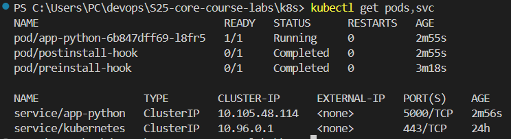

### Hook Delete Policy

I added `"helm.sh/hook-delete-policy": "hook-succeeded"` in hooks annotations for implementing a hook delete policy to remove the hook once it has executed successfully.

## Bonus Task

### Helm Chart for Javascript App

### Workloads page in the Minikube dashboard (including js app)

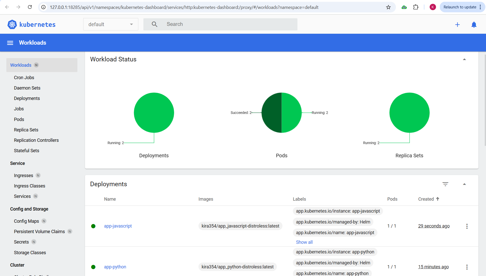

### Access To Javascript Application

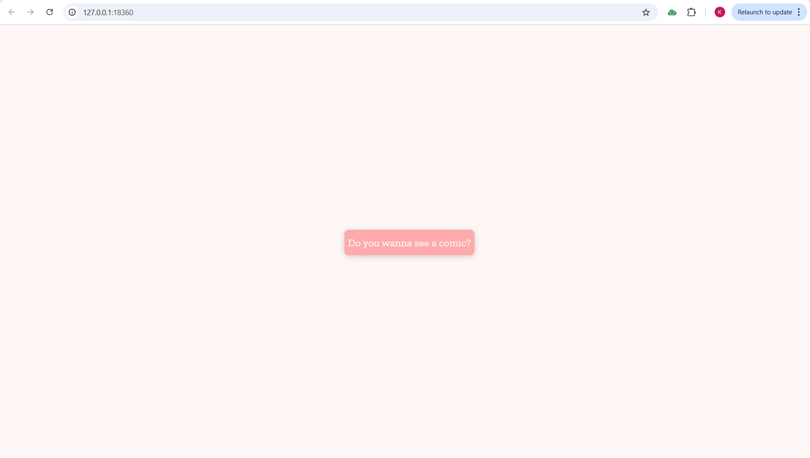
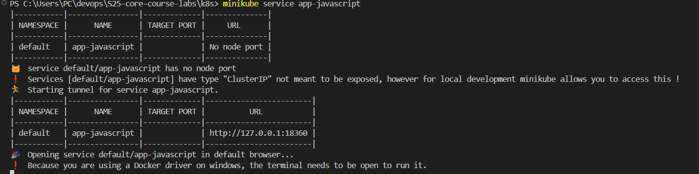

### Pods and Services for Javascript App

Output of `kubectl get pods,scv`:

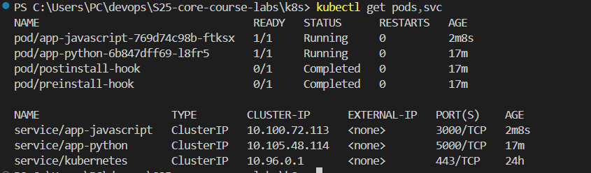

### Troubleshoot Hooks for Javascript App

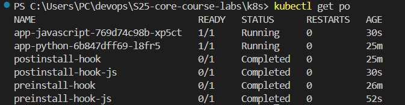

```bash
>>> kubectl describe po preinstall-hook-js
Name:             preinstall-hook-js
Namespace:        default
Priority:         0
Service Account:  default
Node:             minikube/192.168.49.2
Start Time:       Wed, 26 Feb 2025 23:30:39 +0300
Labels:           <none>
Annotations:      helm.sh/hook: pre-install
Status:           Succeeded
IP:               10.244.0.103
IPs:
  IP:  10.244.0.103
Containers:
  pre-install-container:
    Container ID:  docker://c9d9a38ca1abfcca25266ac90f16144a243b449cffdeb5267a9b6cdd9d142cf7
    Image:         busybox
    Image ID:      docker-pullable://busybox@sha256:498a000f370d8c37927118ed80afe8adc38d1edcbfc071627d17b25c88efcab0
    Port:          <none>
    Host Port:     <none>
    Command:
      sh
      -c
      echo The pre-install hook is running && sleep 20
    State:          Terminated
      Reason:       Completed
      Exit Code:    0
      Started:      Wed, 26 Feb 2025 23:30:39 +0300
      Finished:     Wed, 26 Feb 2025 23:30:59 +0300
    Ready:          False
    Restart Count:  0
    Environment:    <none>
    Mounts:
      /var/run/secrets/kubernetes.io/serviceaccount from kube-api-access-8htv4 (ro)
Conditions:
  Type                        Status
  PodReadyToStartContainers   False
  Initialized                 True
  Ready                       False
  ContainersReady             False
  PodScheduled                True
Volumes:
  kube-api-access-8htv4:
    Type:                    Projected (a volume that contains injected data from multiple sources)
    TokenExpirationSeconds:  3607
    ConfigMapName:           kube-root-ca.crt
    ConfigMapOptional:       <nil>
    DownwardAPI:             true
QoS Class:                   BestEffort
Node-Selectors:              <none>
Tolerations:                 node.kubernetes.io/not-ready:NoExecute op=Exists for 300s
                             node.kubernetes.io/unreachable:NoExecute op=Exists for 300s
Events:
  Type    Reason     Age   From               Message
  ----    ------     ----  ----               -------
  Normal  Scheduled  76s   default-scheduler  Successfully assigned default/preinstall-hook-js to minikube
  Normal  Pulled     76s   kubelet            Container image "busybox" already present on machine
  Normal  Created    76s   kubelet            Created container: pre-install-container
  Normal  Started    76s   kubelet            Started container pre-install-container
```

```bash
>>> kubectl describe po postinstall-hook-js
Name:             postinstall-hook-js
Namespace:        default
Priority:         0
Service Account:  default
Node:             minikube/192.168.49.2
Start Time:       Wed, 26 Feb 2025 23:31:01 +0300
Labels:           <none>
Annotations:      helm.sh/hook: post-install
Status:           Succeeded
IP:               10.244.0.105
IPs:
  IP:  10.244.0.105
Containers:
  post-install-container:
    Container ID:  docker://1647f212b0f939b84439b5d5a0df47188bf99f1c92082e99fa9487ac87dbc895
    Image:         busybox
    Image ID:      docker-pullable://busybox@sha256:498a000f370d8c37927118ed80afe8adc38d1edcbfc071627d17b25c88efcab0
    Port:          <none>
    Host Port:     <none>
    Command:
      sh
      -c
      echo The post-install hook is running && sleep 20
    State:          Terminated
      Reason:       Completed
      Exit Code:    0
      Started:      Wed, 26 Feb 2025 23:31:05 +0300
      Finished:     Wed, 26 Feb 2025 23:31:25 +0300
    Ready:          False
    Restart Count:  0
    Environment:    <none>
    Mounts:
      /var/run/secrets/kubernetes.io/serviceaccount from kube-api-access-9xmtg (ro)
Conditions:
  Type                        Status
  PodReadyToStartContainers   False
  Initialized                 True
  Ready                       False
  ContainersReady             False
  PodScheduled                True
Volumes:
  kube-api-access-9xmtg:
    Type:                    Projected (a volume that contains injected data from multiple sources)
    TokenExpirationSeconds:  3607
    ConfigMapName:           kube-root-ca.crt
    ConfigMapOptional:       <nil>
    DownwardAPI:             true
QoS Class:                   BestEffort
Node-Selectors:              <none>
Tolerations:                 node.kubernetes.io/not-ready:NoExecute op=Exists for 300s
                             node.kubernetes.io/unreachable:NoExecute op=Exists for 300s
Events:
  Type    Reason     Age   From               Message
  ----    ------     ----  ----               -------
  Normal  Scheduled  91s   default-scheduler  Successfully assigned default/postinstall-hook-js to minikube
  Normal  Pulling    91s   kubelet            Pulling image "busybox"
  Normal  Pulled     88s   kubelet            Successfully pulled image "busybox" in 1.474s (3.556s including waiting). Image size: 4269694 bytes.
  Normal  Created    88s   kubelet            Created container: post-install-container
  Normal  Started    88s   kubelet            Started container post-install-container
```

**Outputs from kubectl get pods,svc command for Javascript App**
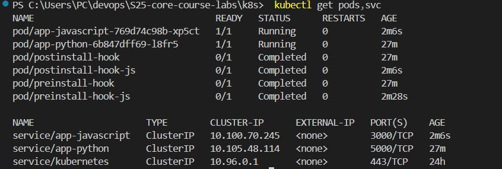

### Hook Delete Policy

I added `"helm.sh/hook-delete-policy": "hook-succeeded"` in hooks annotations for implementing a hook delete policy to remove the hook once it has executed successfully.

### Helm Library Chart

I created a library chart in `library-chart` folder and added dependencies to both apps Chart.yaml:

```yaml
dependencies:
  - name: library-chart
    version: "1.0.0"
    repository: "file://../library-chart"
```

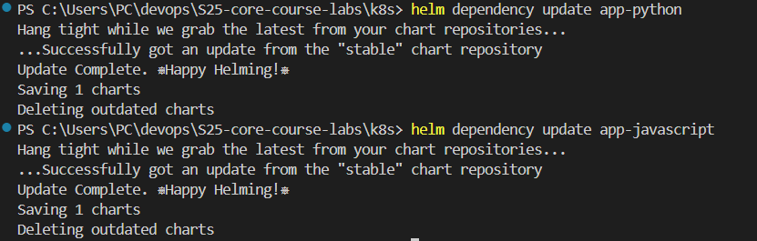
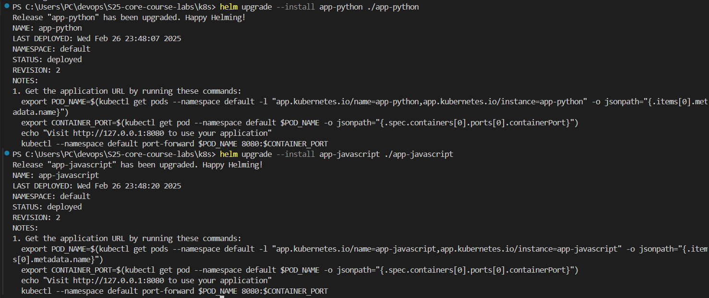
