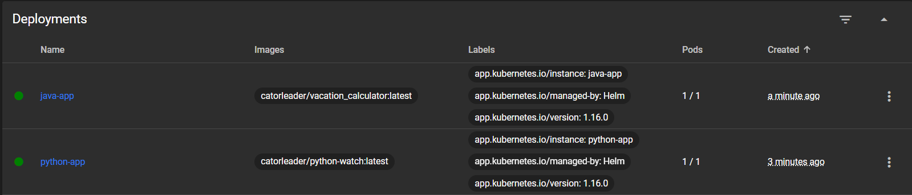
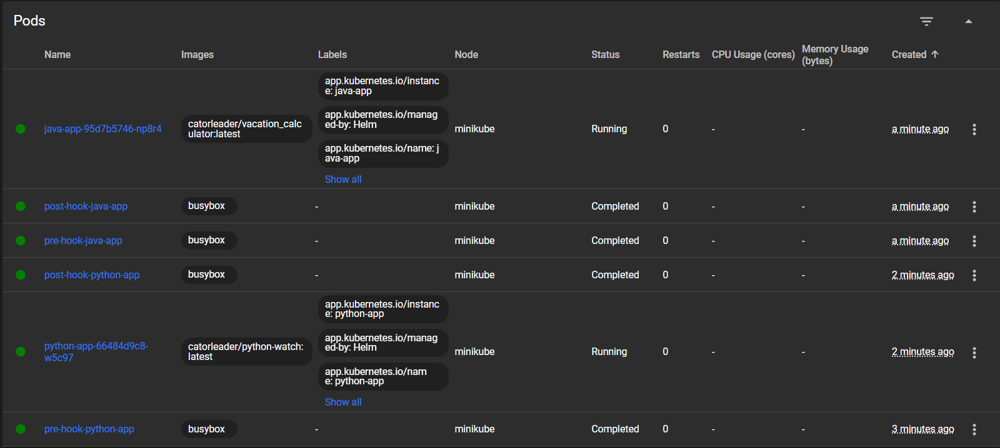
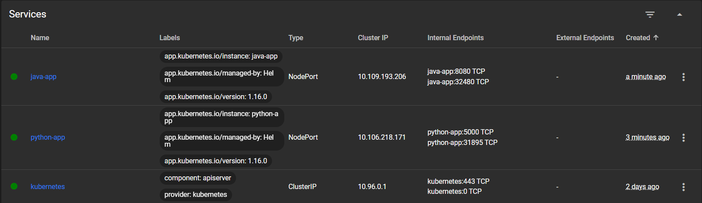
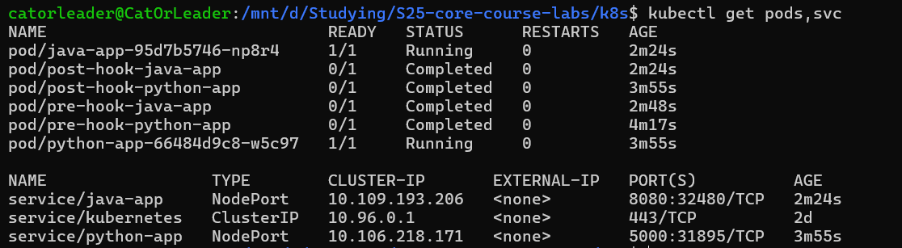
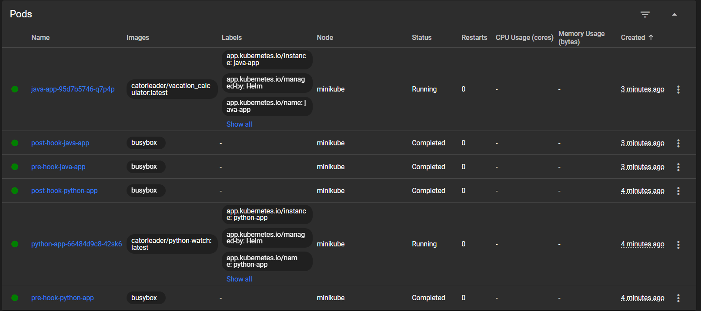
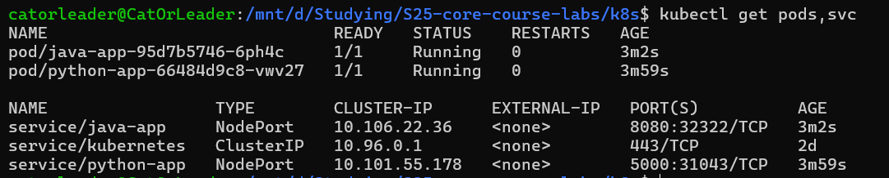
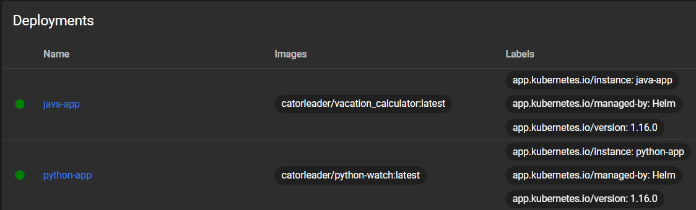

# Helm

---

* Suddenly, I completed the whole lab near instantly, so in the following screenshots there are already implemented
  library with labels and hooks.

## Task #1

* Apps is deployed using Helm

---

### Python App & Java App

* successful helm deployment

```bash
catorleader@CatOrLeader:/mnt/d/Studying/S25-core-course-labs/k8s$ helm install python-app python-app/
NAME: python-app
LAST DEPLOYED: Fri Feb 21 21:08:20 2025
NAMESPACE: default
STATUS: deployed
REVISION: 1
NOTES:
1. Get the application URL by running these commands:
  export NODE_PORT=$(kubectl get --namespace default -o jsonpath="{.spec.ports[0].nodePort}" services python-app)
  export NODE_IP=$(kubectl get nodes --namespace default -o jsonpath="{.items[0].status.addresses[0].address}")
  echo http://$NODE_IP:$NODE_PORT
catorleader@CatOrLeader:/mnt/d/Studying/S25-core-course-labs/k8s$ helm install java-app java-app/
NAME: java-app
LAST DEPLOYED: Fri Feb 21 21:09:50 2025
NAMESPACE: default
STATUS: deployed
REVISION: 1
NOTES:
1. Get the application URL by running these commands:
  export NODE_PORT=$(kubectl get --namespace default -o jsonpath="{.spec.ports[0].nodePort}" services java-app)
  export NODE_IP=$(kubectl get nodes --namespace default -o jsonpath="{.items[0].status.addresses[0].address}")
  echo http://$NODE_IP:$NODE_PORT
catorleader@CatOrLeader:/mnt/d/Studying/S25-core-course-labs/k8s$ minikube service --all
|-----------|----------|-------------|---------------------------|
| NAMESPACE |   NAME   | TARGET PORT |            URL            |
|-----------|----------|-------------|---------------------------|
| default   | java-app | http/8080   | http://192.168.49.2:32480 |
|-----------|----------|-------------|---------------------------|
|-----------|------------|-------------|--------------|
| NAMESPACE |    NAME    | TARGET PORT |     URL      |
|-----------|------------|-------------|--------------|
| default   | kubernetes |             | No node port |
|-----------|------------|-------------|--------------|
😿  service default/kubernetes has no node port
|-----------|------------|-------------|---------------------------|
| NAMESPACE |    NAME    | TARGET PORT |            URL            |
|-----------|------------|-------------|---------------------------|
| default   | python-app | http/5000   | http://192.168.49.2:31895 |
|-----------|------------|-------------|---------------------------|
❗  Services [default/kubernetes] have type "ClusterIP" not meant to be exposed, however for local development minikube allows you to access this !
🏃  Starting tunnel for service java-app.
🏃  Starting tunnel for service kubernetes.
🏃  Starting tunnel for service python-app.
|-----------|------------|-------------|------------------------|
| NAMESPACE |    NAME    | TARGET PORT |          URL           |
|-----------|------------|-------------|------------------------|
| default   | java-app   |             | http://127.0.0.1:39395 |
| default   | kubernetes |             | http://127.0.0.1:32873 |
| default   | python-app |             | http://127.0.0.1:44225 |
|-----------|------------|-------------|------------------------|
🎉  Opening service default/java-app in default browser...
👉  http://127.0.0.1:39395
🎉  Opening service default/kubernetes in default browser...
👉  http://127.0.0.1:32873
🎉  Opening service default/python-app in default browser...
👉  http://127.0.0.1:44225
❗  Because you are using a Docker driver on linux, the terminal needs to be open to run it.
```

* minikube dashboards







* `kubectl get pods,svc`



---

### Task #2

* Hooks are placed in common Helm library, written by myself
* ❗ **P.S:**: To show you the workability of my solution I firstly set the hooks deletion policy to `hook-failed`;
  Then, after the screenshots, I update the library with hooks to set deletion policy to
  the `before-hook-creation,hook-succeeded`

---

* `helm lint ...`

```bash
catorleader@CatOrLeader:/mnt/d/Studying/S25-core-course-labs/k8s$ helm lint python-app/
==> Linting python-app/
[INFO] Chart.yaml: icon is recommended

1 chart(s) linted, 0 chart(s) failed
catorleader@CatOrLeader:/mnt/d/Studying/S25-core-course-labs/k8s$ helm lint java-app/
==> Linting java-app/
[INFO] Chart.yaml: icon is recommended

1 chart(s) linted, 0 chart(s) failed
```

* `helm install --dry-tun helm-hooks ...`

```bash
catorleader@CatOrLeader:/mnt/d/Studying/S25-core-course-labs/k8s$ helm install --dry-run helm-hooks python-app/
NAME: helm-hooks
LAST DEPLOYED: Fri Feb 21 21:16:18 2025
NAMESPACE: default
STATUS: pending-install
REVISION: 1
HOOKS:
---
# Source: python-app/templates/post-install-hook.yaml
apiVersion: v1
kind: Pod
metadata:
   name: post-hook-python-app
   annotations:
       "helm.sh/hook": "post-install"
       "helm.sh/hook-delete-policy": hook-failed
spec:
  containers:
  - name: post-install-container
    image: busybox
    imagePullPolicy: Always
    command: ['sh', '-c', 'echo The post-install hook is running && sleep 15' ]
  restartPolicy: Never
  terminationGracePeriodSeconds: 0
---
# Source: python-app/templates/pre-install-hook.yaml
apiVersion: v1
kind: Pod
metadata:
   name: pre-hook-python-app
   annotations:
       "helm.sh/hook": "pre-install"
       "helm.sh/hook-delete-policy": hook-failed
spec:
  containers:
  - name: pre-install-container
    image: busybox
    imagePullPolicy: IfNotPresent
    command: ['sh', '-c', 'echo The pre-install hook is running && sleep 20' ]
  restartPolicy: Never
  terminationGracePeriodSeconds: 0
---
# Source: python-app/templates/tests/test-connection.yaml
apiVersion: v1
kind: Pod
metadata:
  name: "helm-hooks-python-app-test-connection"
  labels:
    helm.sh/chart: python-app-0.1.0
    app.kubernetes.io/name: python-app
    app.kubernetes.io/instance: helm-hooks
    app.kubernetes.io/version: "1.16.0"
    app.kubernetes.io/managed-by: Helm
  annotations:
    "helm.sh/hook": test
spec:
  containers:
    - name: wget
      image: busybox
      command: ['wget']
      args: ['helm-hooks-python-app:5000']
  restartPolicy: Never
MANIFEST:
---
# Source: python-app/templates/serviceaccount.yaml
apiVersion: v1
kind: ServiceAccount
metadata:
  name: helm-hooks-python-app
  labels:
    helm.sh/chart: python-app-0.1.0
    app.kubernetes.io/name: python-app
    app.kubernetes.io/instance: helm-hooks
    app.kubernetes.io/version: "1.16.0"
    app.kubernetes.io/managed-by: Helm
automountServiceAccountToken: true
---
# Source: python-app/templates/service.yaml
apiVersion: v1
kind: Service
metadata:
  name: helm-hooks-python-app
  labels:
    app.kubernetes.io/version: "1.16.0"
    app.kubernetes.io/managed-by: Helm
    app.kubernetes.io/instance: helm-hooks
spec:
  type: NodePort
  ports:
    - port: 5000
      targetPort: 5000
      protocol: TCP
      name: http
  selector:
    app.kubernetes.io/version: "1.16.0"
    app.kubernetes.io/managed-by: Helm
    app.kubernetes.io/instance: helm-hooks
---
# Source: python-app/templates/deployment.yaml
apiVersion: apps/v1
kind: Deployment
metadata:
  name: helm-hooks-python-app
  labels:
    app.kubernetes.io/version: "1.16.0"
    app.kubernetes.io/managed-by: Helm
    app.kubernetes.io/instance: helm-hooks
spec:
  replicas: 1
  selector:
    matchLabels:
      app.kubernetes.io/version: "1.16.0"
      app.kubernetes.io/managed-by: Helm
      app.kubernetes.io/instance: helm-hooks
  template:
    metadata:
      labels:
        helm.sh/chart: python-app-0.1.0
        app.kubernetes.io/name: python-app
        app.kubernetes.io/instance: helm-hooks
        app.kubernetes.io/version: "1.16.0"
        app.kubernetes.io/managed-by: Helm
        watch: null
    spec:
      serviceAccountName: helm-hooks-python-app
      containers:
        - name: python-app
          image: "catorleader/python-watch:latest"
          imagePullPolicy: IfNotPresent
          ports:
            - name: http
              containerPort: 5000
              protocol: TCP

NOTES:
1. Get the application URL by running these commands:
  export NODE_PORT=$(kubectl get --namespace default -o jsonpath="{.spec.ports[0].nodePort}" services helm-hooks-python-app)
  export NODE_IP=$(kubectl get nodes --namespace default -o jsonpath="{.items[0].status.addresses[0].address}")
  echo http://$NODE_IP:$NODE_PORT
catorleader@CatOrLeader:/mnt/d/Studying/S25-core-course-labs/k8s$ helm install --dry-run helm-hooks java-app/
NAME: helm-hooks
LAST DEPLOYED: Fri Feb 21 21:17:11 2025
NAMESPACE: default
STATUS: pending-install
REVISION: 1
HOOKS:
---
# Source: java-app/templates/post-install-hook.yaml
apiVersion: v1
kind: Pod
metadata:
   name: post-hook-java-app
   annotations:
       "helm.sh/hook": "post-install"
       "helm.sh/hook-delete-policy": hook-failed
spec:
  containers:
  - name: post-install-container
    image: busybox
    imagePullPolicy: Always
    command: ['sh', '-c', 'echo The post-install hook is running && sleep 15' ]
  restartPolicy: Never
  terminationGracePeriodSeconds: 0
---
# Source: java-app/templates/pre-install-hook.yaml
apiVersion: v1
kind: Pod
metadata:
   name: pre-hook-java-app
   annotations:
       "helm.sh/hook": "pre-install"
       "helm.sh/hook-delete-policy": hook-failed
spec:
  containers:
  - name: pre-install-container
    image: busybox
    imagePullPolicy: IfNotPresent
    command: ['sh', '-c', 'echo The pre-install hook is running && sleep 20' ]
  restartPolicy: Never
  terminationGracePeriodSeconds: 0
---
# Source: java-app/templates/tests/test-connection.yaml
apiVersion: v1
kind: Pod
metadata:
  name: "helm-hooks-java-app-test-connection"
  labels:
    helm.sh/chart: java-app-0.1.0
    app.kubernetes.io/name: java-app
    app.kubernetes.io/instance: helm-hooks
    app.kubernetes.io/version: "1.16.0"
    app.kubernetes.io/managed-by: Helm
  annotations:
    "helm.sh/hook": test
spec:
  containers:
    - name: wget
      image: busybox
      command: ['wget']
      args: ['helm-hooks-java-app:8080']
  restartPolicy: Never
MANIFEST:
---
# Source: java-app/templates/serviceaccount.yaml
apiVersion: v1
kind: ServiceAccount
metadata:
  name: helm-hooks-java-app
  labels:
    helm.sh/chart: java-app-0.1.0
    app.kubernetes.io/name: java-app
    app.kubernetes.io/instance: helm-hooks
    app.kubernetes.io/version: "1.16.0"
    app.kubernetes.io/managed-by: Helm
automountServiceAccountToken: true
---
# Source: java-app/templates/service.yaml
apiVersion: v1
kind: Service
metadata:
  name: helm-hooks-java-app
  labels:
    app.kubernetes.io/version: "1.16.0"
    app.kubernetes.io/managed-by: Helm
    app.kubernetes.io/instance: helm-hooks
spec:
  type: NodePort
  ports:
    - port: 8080
      targetPort:
      protocol: TCP
      name: http
  selector:
    app.kubernetes.io/version: "1.16.0"
    app.kubernetes.io/managed-by: Helm
    app.kubernetes.io/instance: helm-hooks
---
# Source: java-app/templates/deployment.yaml
apiVersion: apps/v1
kind: Deployment
metadata:
  name: helm-hooks-java-app
  labels:
    app.kubernetes.io/version: "1.16.0"
    app.kubernetes.io/managed-by: Helm
    app.kubernetes.io/instance: helm-hooks
spec:
  replicas: 1
  selector:
    matchLabels:
      app.kubernetes.io/version: "1.16.0"
      app.kubernetes.io/managed-by: Helm
      app.kubernetes.io/instance: helm-hooks
  template:
    metadata:
      labels:
        helm.sh/chart: java-app-0.1.0
        app.kubernetes.io/name: java-app
        app.kubernetes.io/instance: helm-hooks
        app.kubernetes.io/version: "1.16.0"
        app.kubernetes.io/managed-by: Helm
        vacation-calculator: null
    spec:
      serviceAccountName: helm-hooks-java-app
      containers:
        - name: java-app
          image: "catorleader/vacation_calculator:latest"
          imagePullPolicy: IfNotPresent
          ports:
            - name: http
              containerPort: 8080
              protocol: TCP

NOTES:
1. Get the application URL by running these commands:
  export NODE_PORT=$(kubectl get --namespace default -o jsonpath="{.spec.ports[0].nodePort}" services helm-hooks-java-app)
  export NODE_IP=$(kubectl get nodes --namespace default -o jsonpath="{.items[0].status.addresses[0].address}")
  echo http://$NODE_IP:$NODE_PORT
```

* `kubectl get po`

```bash
catorleader@CatOrLeader:/mnt/d/Studying/S25-core-course-labs/k8s$ kubectl get po
NAME                         READY   STATUS      RESTARTS   AGE
java-app-95d7b5746-q7p4p     1/1     Running     0          31s
post-hook-java-app           0/1     Completed   0          31s
post-hook-python-app         0/1     Completed   0          98s
pre-hook-java-app            0/1     Completed   0          54s
pre-hook-python-app          0/1     Completed   0          2m1s
python-app-66484d9c8-42sk6   1/1     Running     0          98s
```

* `kubectl describe po ...`

```bash
catorleader@CatOrLeader:/mnt/d/Studying/S25-core-course-labs/k8s$ kubectl describe po pre-hook-python-app
Name:             pre-hook-python-app
Namespace:        default
Priority:         0
Service Account:  default
Node:             minikube/192.168.49.2
Start Time:       Fri, 21 Feb 2025 21:18:10 +0300
Labels:           <none>
Annotations:      helm.sh/hook: pre-install
                  helm.sh/hook-delete-policy: hook-failed
Status:           Succeeded
IP:               10.244.0.36
IPs:
  IP:  10.244.0.36
Containers:
  pre-install-container:
    Container ID:  docker://b33994049a6151218f509136451e7197494f4038d73d48f6985532aa0934b4d6
    Image:         busybox
    Image ID:      docker-pullable://busybox@sha256:a5d0ce49aa801d475da48f8cb163c354ab95cab073cd3c138bd458fc8257fbf1
    Port:          <none>
    Host Port:     <none>
    Command:
      sh
      -c
      echo The pre-install hook is running && sleep 20
    State:          Terminated
      Reason:       Completed
      Exit Code:    0
      Started:      Fri, 21 Feb 2025 21:18:11 +0300
      Finished:     Fri, 21 Feb 2025 21:18:31 +0300
    Ready:          False
    Restart Count:  0
    Environment:    <none>
    Mounts:
      /var/run/secrets/kubernetes.io/serviceaccount from kube-api-access-p6f58 (ro)
Conditions:
  Type                        Status
  PodReadyToStartContainers   False
  Initialized                 True
  Ready                       False
  ContainersReady             False
  PodScheduled                True
Volumes:
  kube-api-access-p6f58:
    Type:                    Projected (a volume that contains injected data from multiple sources)
    TokenExpirationSeconds:  3607
    ConfigMapName:           kube-root-ca.crt
    ConfigMapOptional:       <nil>
    DownwardAPI:             true
QoS Class:                   BestEffort
Node-Selectors:              <none>
Tolerations:                 node.kubernetes.io/not-ready:NoExecute op=Exists for 300s
                             node.kubernetes.io/unreachable:NoExecute op=Exists for 300s
Events:
  Type    Reason     Age    From               Message
  ----    ------     ----   ----               -------
  Normal  Scheduled  2m59s  default-scheduler  Successfully assigned default/pre-hook-python-app to minikube
  Normal  Pulled     2m58s  kubelet            Container image "busybox" already present on machine
  Normal  Created    2m58s  kubelet            Created container: pre-install-container
  Normal  Started    2m58s  kubelet            Started container pre-install-container
catorleader@CatOrLeader:/mnt/d/Studying/S25-core-course-labs/k8s$ kubectl describe po pre-hook-java-app
Name:             pre-hook-java-app
Namespace:        default
Priority:         0
Service Account:  default
Node:             minikube/192.168.49.2
Start Time:       Fri, 21 Feb 2025 21:19:17 +0300
Labels:           <none>
Annotations:      helm.sh/hook: pre-install
                  helm.sh/hook-delete-policy: hook-failed
Status:           Succeeded
IP:               10.244.0.39
IPs:
  IP:  10.244.0.39
Containers:
  pre-install-container:
    Container ID:  docker://a1948fa028d36530f93219829c62adde24557b3e7b5d9bef33edf1c12ff9c226
    Image:         busybox
    Image ID:      docker-pullable://busybox@sha256:a5d0ce49aa801d475da48f8cb163c354ab95cab073cd3c138bd458fc8257fbf1
    Port:          <none>
    Host Port:     <none>
    Command:
      sh
      -c
      echo The pre-install hook is running && sleep 20
    State:          Terminated
      Reason:       Completed
      Exit Code:    0
      Started:      Fri, 21 Feb 2025 21:19:18 +0300
      Finished:     Fri, 21 Feb 2025 21:19:38 +0300
    Ready:          False
    Restart Count:  0
    Environment:    <none>
    Mounts:
      /var/run/secrets/kubernetes.io/serviceaccount from kube-api-access-qqxz6 (ro)
Conditions:
  Type                        Status
  PodReadyToStartContainers   False
  Initialized                 True
  Ready                       False
  ContainersReady             False
  PodScheduled                True
Volumes:
  kube-api-access-qqxz6:
    Type:                    Projected (a volume that contains injected data from multiple sources)
    TokenExpirationSeconds:  3607
    ConfigMapName:           kube-root-ca.crt
    ConfigMapOptional:       <nil>
    DownwardAPI:             true
QoS Class:                   BestEffort
Node-Selectors:              <none>
Tolerations:                 node.kubernetes.io/not-ready:NoExecute op=Exists for 300s
                             node.kubernetes.io/unreachable:NoExecute op=Exists for 300s
Events:
  Type    Reason     Age   From               Message
  ----    ------     ----  ----               -------
  Normal  Scheduled  118s  default-scheduler  Successfully assigned default/pre-hook-java-app to minikube
  Normal  Pulled     118s  kubelet            Container image "busybox" already present on machine
  Normal  Created    118s  kubelet            Created container: pre-install-container
  Normal  Started    118s  kubelet            Started container pre-install-container
catorleader@CatOrLeader:/mnt/d/Studying/S25-core-course-labs/k8s$ kubectl describe po post-hook-python-app
Name:             post-hook-python-app
Namespace:        default
Priority:         0
Service Account:  default
Node:             minikube/192.168.49.2
Start Time:       Fri, 21 Feb 2025 21:18:33 +0300
Labels:           <none>
Annotations:      helm.sh/hook: post-install
                  helm.sh/hook-delete-policy: hook-failed
Status:           Succeeded
IP:               10.244.0.38
IPs:
  IP:  10.244.0.38
Containers:
  post-install-container:
    Container ID:  docker://455dcbb76d019cfa76f3a3b3ab39717911aac9c2093919e53cfed780577aa1e7
    Image:         busybox
    Image ID:      docker-pullable://busybox@sha256:a5d0ce49aa801d475da48f8cb163c354ab95cab073cd3c138bd458fc8257fbf1
    Port:          <none>
    Host Port:     <none>
    Command:
      sh
      -c
      echo The post-install hook is running && sleep 15
    State:          Terminated
      Reason:       Completed
      Exit Code:    0
      Started:      Fri, 21 Feb 2025 21:18:36 +0300
      Finished:     Fri, 21 Feb 2025 21:18:51 +0300
    Ready:          False
    Restart Count:  0
    Environment:    <none>
    Mounts:
      /var/run/secrets/kubernetes.io/serviceaccount from kube-api-access-5n878 (ro)
Conditions:
  Type                        Status
  PodReadyToStartContainers   False
  Initialized                 True
  Ready                       False
  ContainersReady             False
  PodScheduled                True
Volumes:
  kube-api-access-5n878:
    Type:                    Projected (a volume that contains injected data from multiple sources)
    TokenExpirationSeconds:  3607
    ConfigMapName:           kube-root-ca.crt
    ConfigMapOptional:       <nil>
    DownwardAPI:             true
QoS Class:                   BestEffort
Node-Selectors:              <none>
Tolerations:                 node.kubernetes.io/not-ready:NoExecute op=Exists for 300s
                             node.kubernetes.io/unreachable:NoExecute op=Exists for 300s
Events:
  Type    Reason     Age    From               Message
  ----    ------     ----   ----               -------
  Normal  Scheduled  2m55s  default-scheduler  Successfully assigned default/post-hook-python-app to minikube
  Normal  Pulling    2m55s  kubelet            Pulling image "busybox"
  Normal  Pulled     2m53s  kubelet            Successfully pulled image "busybox" in 1.68s (1.68s including waiting). Image size: 4269694 bytes.
  Normal  Created    2m53s  kubelet            Created container: post-install-container
  Normal  Started    2m53s  kubelet            Started container post-install-container
catorleader@CatOrLeader:/mnt/d/Studying/S25-core-course-labs/k8s$ kubectl describe po post-hook-java-app
Name:             post-hook-java-app
Namespace:        default
Priority:         0
Service Account:  default
Node:             minikube/192.168.49.2
Start Time:       Fri, 21 Feb 2025 21:19:40 +0300
Labels:           <none>
Annotations:      helm.sh/hook: post-install
                  helm.sh/hook-delete-policy: hook-failed
Status:           Succeeded
IP:               10.244.0.41
IPs:
  IP:  10.244.0.41
Containers:
  post-install-container:
    Container ID:  docker://a29fa23da7b7b67f84a8598c61fc799c02ee4baa1356569c9130b4edaae02ef3
    Image:         busybox
    Image ID:      docker-pullable://busybox@sha256:a5d0ce49aa801d475da48f8cb163c354ab95cab073cd3c138bd458fc8257fbf1
    Port:          <none>
    Host Port:     <none>
    Command:
      sh
      -c
      echo The post-install hook is running && sleep 15
    State:          Terminated
      Reason:       Completed
      Exit Code:    0
      Started:      Fri, 21 Feb 2025 21:19:43 +0300
      Finished:     Fri, 21 Feb 2025 21:19:59 +0300
    Ready:          False
    Restart Count:  0
    Environment:    <none>
    Mounts:
      /var/run/secrets/kubernetes.io/serviceaccount from kube-api-access-p6z9s (ro)
Conditions:
  Type                        Status
  PodReadyToStartContainers   False
  Initialized                 True
  Ready                       False
  ContainersReady             False
  PodScheduled                True
Volumes:
  kube-api-access-p6z9s:
    Type:                    Projected (a volume that contains injected data from multiple sources)
    TokenExpirationSeconds:  3607
    ConfigMapName:           kube-root-ca.crt
    ConfigMapOptional:       <nil>
    DownwardAPI:             true
QoS Class:                   BestEffort
Node-Selectors:              <none>
Tolerations:                 node.kubernetes.io/not-ready:NoExecute op=Exists for 300s
                             node.kubernetes.io/unreachable:NoExecute op=Exists for 300s
Events:
  Type    Reason     Age   From               Message
  ----    ------     ----  ----               -------
  Normal  Scheduled  111s  default-scheduler  Successfully assigned default/post-hook-java-app to minikube
  Normal  Pulling    111s  kubelet            Pulling image "busybox"
  Normal  Pulled     109s  kubelet            Successfully pulled image "busybox" in 1.874s (1.874s including waiting). Image size: 4269694 bytes.
  Normal  Created    109s  kubelet            Created container: post-install-container
  Normal  Started    108s  kubelet            Started container post-install-container
```

* `kubectl get pods,svc`

```bash
catorleader@CatOrLeader:/mnt/d/Studying/S25-core-course-labs/k8s$ kubectl get pods,svc
NAME                             READY   STATUS      RESTARTS   AGE
pod/java-app-95d7b5746-q7p4p     1/1     Running     0          2m55s
pod/post-hook-java-app           0/1     Completed   0          2m55s
pod/post-hook-python-app         0/1     Completed   0          4m2s
pod/pre-hook-java-app            0/1     Completed   0          3m18s
pod/pre-hook-python-app          0/1     Completed   0          4m25s
pod/python-app-66484d9c8-42sk6   1/1     Running     0          4m2s

NAME                 TYPE        CLUSTER-IP       EXTERNAL-IP   PORT(S)          AGE
service/java-app     NodePort    10.108.25.50     <none>        8080:30714/TCP   2m55s
service/kubernetes   ClusterIP   10.96.0.1        <none>        443/TCP          2d
service/python-app   NodePort    10.106.172.243   <none>        5000:32030/TCP   4m2s
```

* minikube dashboards with hooks



* Then, I change the deletion policy of hooks, and there is a result of `kubectl get pods,svc`



---

### Task #3

* There are defined labels on each deployment, used from the library, providing the common `_labels.tpls`


