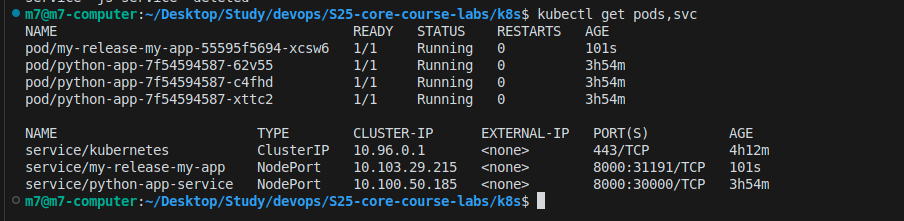
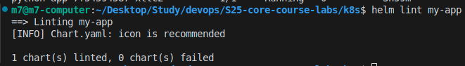
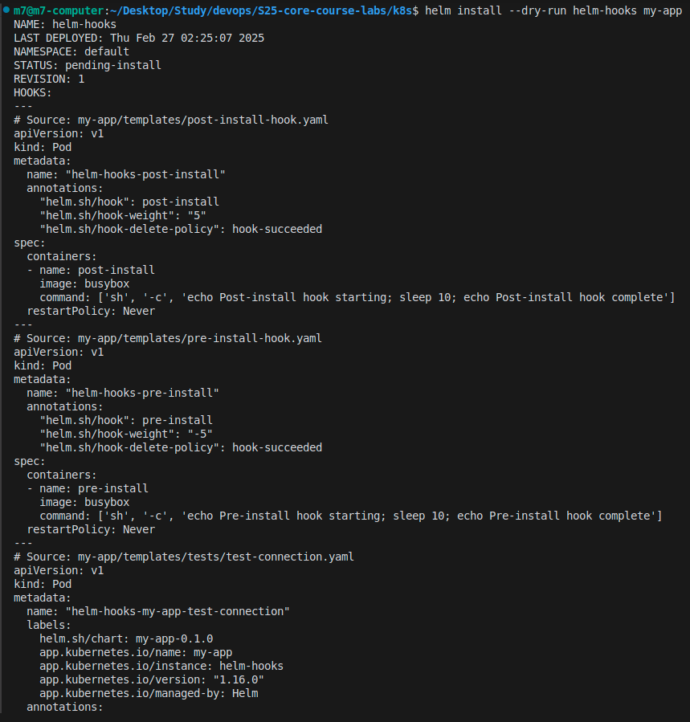
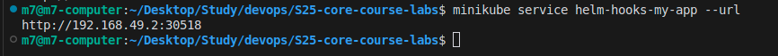

# Helm Chart Implementation Documentation

## Overview
This documentation covers the implementation of a Helm chart for our Flask application, including pre-install and post-install hooks.

## Implementation Steps

### 1. Chart Creation and Configuration
- Created a new Helm chart using `helm create my-app`
- Modified `values.yaml` to use our Flask application image:
  - Repository: marketer7/flask-time
  - Port: 8000
  - Service Type: NodePort

### 2. Chart Components
- **Deployment**: Configured to run Flask application
- **Service**: NodePort service exposing port 8000
- **Hooks**: 
  - Pre-install hook for initialization tasks
  - Post-install hook for post-deployment tasks
  - Both hooks configured with delete policy: `hook-succeeded`

### 3. Verification Steps

#### Pod and Service Status
```bash
kubectl get pods,svc
```


#### Hook Implementation
The hooks are implemented to ensure proper deployment sequence:
- Pre-install hook runs before deployment
- Post-install hook runs after deployment
- Both hooks use busybox image for lightweight execution



#### Chart Validation
Performed chart validation using Helm lint:
```bash
helm lint my-app
```


#### Dry Run Test
Executed dry run to verify chart configuration:
```bash
helm install --dry-run helm-hooks my-app
```


#### Application Accessibility
Verified application accessibility using Minikube service URL:
```bash
minikube service helm-hooks-my-app --url
```


## Conclusion
The Helm chart has been successfully implemented with:
- Working deployment of Flask application
- Properly configured service exposure
- Functional pre and post-install hooks
- Validated chart configuration
- Verified application accessibility

All components are functioning as expected, and the application is accessible through the NodePort service.


