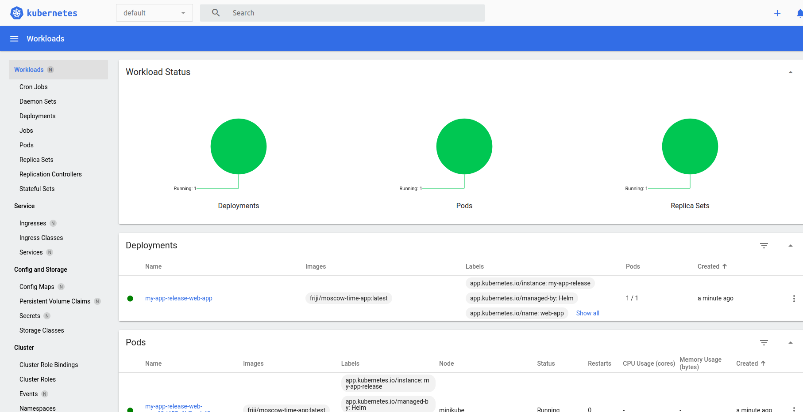

```
a@a-VirtualBox:~/PycharmProjects/S25-core-course-labs/k8s/web-app$ kubectl describe po preinstall
Name:             preinstall
Namespace:        default
Priority:         0
Service Account:  default
Node:             minikube/192.168.49.2
Start Time:       Sun, 09 Mar 2025 06:27:01 +0300
Labels:           <none>
Annotations:      helm.sh/hook: pre-install
Status:           Succeeded
IP:               10.244.0.13
IPs:
  IP:  10.244.0.13
Containers:
  preinstall:
    Container ID:  docker://a359f704c3e9f7ca5593ae542dbd352a6f0d1a8e7091d634a3063cb91588e713
    Image:         busybox
    Image ID:      docker-pullable://busybox@sha256:498a000f370d8c37927118ed80afe8adc38d1edcbfc071627d17b25c88efcab0
    Port:          <none>
    Host Port:     <none>
    Command:
      sleep
      20
    State:          Terminated
      Reason:       Completed
      Exit Code:    0
      Started:      Sun, 09 Mar 2025 06:27:07 +0300
      Finished:     Sun, 09 Mar 2025 06:27:27 +0300
    Ready:          False
    Restart Count:  0
    Environment:    <none>
    Mounts:
      /var/run/secrets/kubernetes.io/serviceaccount from kube-api-access-v9gpg (ro)
Conditions:
  Type                        Status
  PodReadyToStartContainers   False 
  Initialized                 True 
  Ready                       False 
  ContainersReady             False 
  PodScheduled                True 
Volumes:
  kube-api-access-v9gpg:
    Type:                    Projected (a volume that contains injected data from multiple sources)
    TokenExpirationSeconds:  3607
    ConfigMapName:           kube-root-ca.crt
    ConfigMapOptional:       <nil>
    DownwardAPI:             true
QoS Class:                   BestEffort
Node-Selectors:              <none>
Tolerations:                 node.kubernetes.io/not-ready:NoExecute op=Exists for 300s
                             node.kubernetes.io/unreachable:NoExecute op=Exists for 300s
Events:
  Type    Reason     Age   From               Message
  ----    ------     ----  ----               -------
  Normal  Scheduled  89s   default-scheduler  Successfully assigned default/preinstall to minikube
  Normal  Pulling    88s   kubelet            Pulling image "busybox"
  Normal  Pulled     83s   kubelet            Successfully pulled image "busybox" in 5.356s (5.356s including waiting). Image size: 4269694 bytes.
  Normal  Created    83s   kubelet            Created container: preinstall
  Normal  Started    83s   kubelet            Started container preinstall
```


```
a@a-VirtualBox:~/PycharmProjects/S25-core-course-labs/k8s/web-app$ kubectl describe po postinstall
Name:             postinstall
Namespace:        default
Priority:         0
Service Account:  default
Node:             minikube/192.168.49.2
Start Time:       Sun, 09 Mar 2025 06:27:29 +0300
Labels:           <none>
Annotations:      helm.sh/hook: post-install
Status:           Succeeded
IP:               10.244.0.15
IPs:
  IP:  10.244.0.15
Containers:
  postinstall:
    Container ID:  docker://9c84708494219c63508e5d48a70ce009fb2f2ce2523259e1ccbce9d40ecc9646
    Image:         busybox
    Image ID:      docker-pullable://busybox@sha256:498a000f370d8c37927118ed80afe8adc38d1edcbfc071627d17b25c88efcab0
    Port:          <none>
    Host Port:     <none>
    Command:
      sleep
      20
    State:          Terminated
      Reason:       Completed
      Exit Code:    0
      Started:      Sun, 09 Mar 2025 06:27:31 +0300
      Finished:     Sun, 09 Mar 2025 06:27:52 +0300
    Ready:          False
    Restart Count:  0
    Environment:    <none>
    Mounts:
      /var/run/secrets/kubernetes.io/serviceaccount from kube-api-access-9z5b6 (ro)
Conditions:
  Type                        Status
  PodReadyToStartContainers   False 
  Initialized                 True 
  Ready                       False 
  ContainersReady             False 
  PodScheduled                True 
Volumes:
  kube-api-access-9z5b6:
    Type:                    Projected (a volume that contains injected data from multiple sources)
    TokenExpirationSeconds:  3607
    ConfigMapName:           kube-root-ca.crt
    ConfigMapOptional:       <nil>
    DownwardAPI:             true
QoS Class:                   BestEffort
Node-Selectors:              <none>
Tolerations:                 node.kubernetes.io/not-ready:NoExecute op=Exists for 300s
                             node.kubernetes.io/unreachable:NoExecute op=Exists for 300s
Events:
  Type    Reason     Age   From               Message
  ----    ------     ----  ----               -------
  Normal  Scheduled  104s  default-scheduler  Successfully assigned default/postinstall to minikube
  Normal  Pulling    104s  kubelet            Pulling image "busybox"
  Normal  Pulled     102s  kubelet            Successfully pulled image "busybox" in 2.001s (2.001s including waiting). Image size: 4269694 bytes.
  Normal  Created    102s  kubelet            Created container: postinstall
  Normal  Started    101s  kubelet            Started container postinstall

```