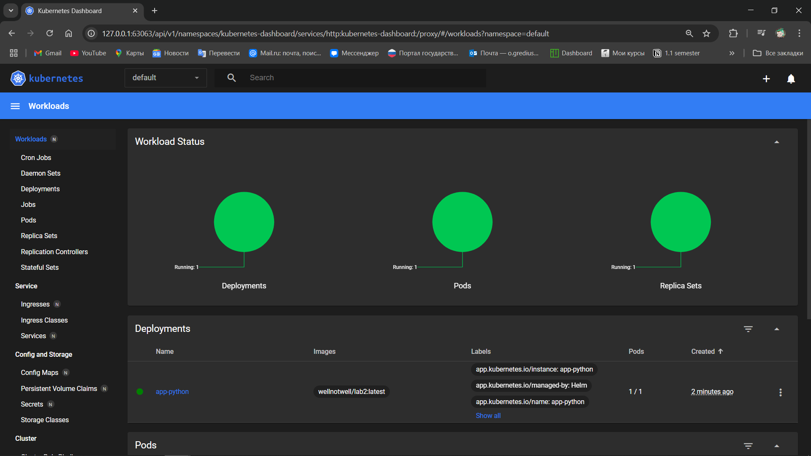

# Helm

## Task 1

### Install

```bash
> helm install --name-template=app-python ./app-python
```
```bash
NAME: app-python
LAST DEPLOYED: Sun Mar  2 21:17:49 2025
NAMESPACE: default
STATUS: deployed
REVISION: 1
NOTES:
1. Get the application URL by running these commands:
  export POD_NAME=$(kubectl get pods --namespace default -l "app.kubernetes.io/name=app-python,app.kubernetes.io/instance=app-python" -o jsonpath="{.items[0].metadata.name}")
  export CONTAINER_PORT=$(kubectl get pod --namespace default $POD_NAME -o jsonpath="{.spec.containers[0].ports[0].containerPort}")
  echo "Visit http://127.0.0.1:8080 to use your application"
  kubectl --namespace default port-forward $POD_NAME 8080:$CONTAINER_PORT
```

### Verify via Dashboard




## Access

```bash
> minikube service app-python
```
```bash
|-----------|------------|-------------|--------------|
| NAMESPACE |    NAME    | TARGET PORT |     URL      |
|-----------|------------|-------------|--------------|
| default   | app-python |             | No node port |
|-----------|------------|-------------|--------------|
* service default/app-python has no node port
! Services [default/app-python] have type "ClusterIP" not meant to be exposed, however for local development minikube allows you to access this !
* Starting tunnel for service app-python.
|-----------|------------|-------------|------------------------|
| NAMESPACE |    NAME    | TARGET PORT |          URL           |
|-----------|------------|-------------|------------------------|
| default   | app-python |             | http://127.0.0.1:63140 |
|-----------|------------|-------------|------------------------|
* Opening service default/app-python in default browser...
! Because you are using a Docker driver on windows, the terminal needs to be open to run it.
```

### Info

```bash
> kubectl get pods,svc
```
```bash
NAME                              READY   STATUS    RESTARTS   AGE
pod/app-python-54dd64c4d5-8qccb   1/1     Running   0          4m47s

NAME                 TYPE        CLUSTER-IP     EXTERNAL-IP   PORT(S)    AGE
service/app-python   ClusterIP   10.106.1.195   <none>        5000/TCP   4m47s
service/kubernetes   ClusterIP   10.96.0.1      <none>        443/TCP    4h4m
```

## Task 2

### Troubleshoot Hooks

```bash
> helm lint app-python
```
```bash
==> Linting app-python
[INFO] Chart.yaml: icon is recommended

1 chart(s) linted, 0 chart(s) failed
```
```bash
> helm install --dry-run helm-hooks app-python
```
```bash
NAME: helm-hooks
LAST DEPLOYED: Sun Mar  2 21:24:10 2025
NAMESPACE: default
STATUS: pending-install
REVISION: 1
HOOKS:
---
# Source: app-python/templates/postinstall-hook.yaml
apiVersion: v1
kind: Pod
metadata:
   name: postinstall-hook
   annotations:
       "helm.sh/hook": "post-install"
       "helm.sh/hook-delete-policy": "hook-succeeded"
spec:
  containers:
  - name: post-install-container
    image: busybox
    imagePullPolicy: Always
    command: ['sh', '-c', 'echo The post-install hook is running && sleep 15' ]
  restartPolicy: Never
  terminationGracePeriodSeconds: 0
---
# Source: app-python/templates/preinstall-hook.yaml
apiVersion: v1
kind: Pod
metadata:
   name: preinstall-hook
   annotations:
       "helm.sh/hook": "pre-install"
       "helm.sh/hook-delete-policy": "hook-succeeded"
spec:
  containers:
  - name: pre-install-container
    image: busybox
    imagePullPolicy: IfNotPresent
    command: ['sh', '-c', 'echo The pre-install hook is running && sleep 20' ]
  restartPolicy: Never
  terminationGracePeriodSeconds: 0
---
# Source: app-python/templates/tests/test-connection.yaml
apiVersion: v1
kind: Pod
metadata:
  name: "helm-hooks-app-python-test-connection"
  labels:
    helm.sh/chart: app-python-0.1.0
    app.kubernetes.io/name: app-python
    app.kubernetes.io/instance: helm-hooks
    app.kubernetes.io/version: "1.16.0"
    app.kubernetes.io/managed-by: Helm
  annotations:
    "helm.sh/hook": test
spec:
  containers:
    - name: wget
      image: busybox
      command: ['wget']
      args: ['helm-hooks-app-python:5000']
  restartPolicy: Never
MANIFEST:
---
# Source: app-python/templates/serviceaccount.yaml
apiVersion: v1
kind: ServiceAccount
metadata:
  name: helm-hooks-app-python
  labels:
    helm.sh/chart: app-python-0.1.0
    app.kubernetes.io/name: app-python
    app.kubernetes.io/instance: helm-hooks
    app.kubernetes.io/version: "1.16.0"
    app.kubernetes.io/managed-by: Helm
automountServiceAccountToken: true
---
# Source: app-python/templates/service.yaml
apiVersion: v1
kind: Service
metadata:
  name: helm-hooks-app-python
  labels:
    helm.sh/chart: app-python-0.1.0
    app.kubernetes.io/name: app-python
    app.kubernetes.io/instance: helm-hooks
    app.kubernetes.io/version: "1.16.0"
    app.kubernetes.io/managed-by: Helm
spec:
  type: ClusterIP
  ports:
    - port: 5000
      targetPort: http
      protocol: TCP
      name: http
  selector:
    app.kubernetes.io/name: app-python
    app.kubernetes.io/instance: helm-hooks
---
# Source: app-python/templates/deployment.yaml
apiVersion: apps/v1
kind: Deployment
metadata:
  name: helm-hooks-app-python
  labels:
    helm.sh/chart: app-python-0.1.0
    app.kubernetes.io/name: app-python
    app.kubernetes.io/instance: helm-hooks
    app.kubernetes.io/version: "1.16.0"
    app.kubernetes.io/managed-by: Helm
spec:
  replicas: 1
  selector:
    matchLabels:
      app.kubernetes.io/name: app-python
      app.kubernetes.io/instance: helm-hooks
  template:
    metadata:
      labels:
        helm.sh/chart: app-python-0.1.0
        app.kubernetes.io/name: app-python
        app.kubernetes.io/instance: helm-hooks
        app.kubernetes.io/version: "1.16.0"
        app.kubernetes.io/managed-by: Helm
    spec:
      serviceAccountName: helm-hooks-app-python
      containers:
        - name: app-python
          image: "wellnotwell/lab2:latest"
          imagePullPolicy: IfNotPresent
          ports:
            - name: http
              containerPort: 5000
              protocol: TCP
          livenessProbe:
            httpGet:
              path: /
              port: http
          readinessProbe:
            httpGet:
              path: /
              port: http

NOTES:
1. Get the application URL by running these commands:
  export POD_NAME=$(kubectl get pods --namespace default -l "app.kubernetes.io/name=app-python,app.kubernetes.io/instance=helm-hooks" -o jsonpath="{.items[0].metadata.name}")
  export CONTAINER_PORT=$(kubectl get pod --namespace default $POD_NAME -o jsonpath="{.spec.containers[0].ports[0].containerPort}")
  echo "Visit http://127.0.0.1:8080 to use your application"
  kubectl --namespace default port-forward $POD_NAME 8080:$CONTAINER_PORT
```

```bash
> kubectl get po
```
```bash
NAME                          READY   STATUS    RESTARTS   AGE
app-python-54dd64c4d5-8qccb   1/1     Running   0          7m8s
```

### Output

```bash
> kubectl get po
```
```bash
NAME                                     READY   STATUS      RESTARTS   AGE
helm-hooks-app-python-5b7575787d-s8564   1/1     Running     0          34s
postinstall-hook                         0/1     Completed   0          34s
preinstall-hook                          0/1     Completed   0          56s
```

```bash
> kubectl describe po preinstall-hook
```
```bash
Name:             preinstall-hook
Namespace:        default
Priority:         0
Service Account:  default
Node:             minikube/192.168.49.2
Start Time:       Sun, 02 Mar 2025 21:27:32 +0300
Labels:           <none>
Annotations:      helm.sh/hook: pre-install
Status:           Succeeded
IP:               10.244.0.21
IPs:
  IP:  10.244.0.21
Containers:
  pre-install-container:
    Container ID:  docker://6fda3295bba6067255fec3560416f1662edfc1dcb4134284996f429306150643
    Image:         busybox
    Image ID:      docker-pullable://busybox@sha256:498a000f370d8c37927118ed80afe8adc38d1edcbfc071627d17b25c88efcab0
    Port:          <none>
    Host Port:     <none>
    Command:
      sh
      -c
      echo The pre-install hook is running && sleep 20
    State:          Terminated
      Reason:       Completed
      Exit Code:    0
      Started:      Sun, 02 Mar 2025 21:27:33 +0300
      Finished:     Sun, 02 Mar 2025 21:27:53 +0300
    Ready:          False
    Restart Count:  0
    Environment:    <none>
    Mounts:
      /var/run/secrets/kubernetes.io/serviceaccount from kube-api-access-6g6vs (ro)
Conditions:
  Type                        Status
  PodReadyToStartContainers   False
  Initialized                 True
  Ready                       False
  ContainersReady             False
  PodScheduled                True
Volumes:
  kube-api-access-6g6vs:
    Type:                    Projected (a volume that contains injected data from multiple sources)
    TokenExpirationSeconds:  3607
    ConfigMapName:           kube-root-ca.crt
    ConfigMapOptional:       <nil>
    DownwardAPI:             true
QoS Class:                   BestEffort
Node-Selectors:              <none>
Tolerations:                 node.kubernetes.io/not-ready:NoExecute op=Exists for 300s
                             node.kubernetes.io/unreachable:NoExecute op=Exists for 300s
Events:
  Type    Reason     Age    From               Message
  ----    ------     ----   ----               -------
  Normal  Scheduled  4m14s  default-scheduler  Successfully assigned default/preinstall-hook to minikube
  Normal  Pulled     4m13s  kubelet            Container image "busybox" already present on machine
  Normal  Created    4m13s  kubelet            Created container: pre-install-container
  Normal  Started    4m13s  kubelet            Started container pre-install-container
```

```bash
> kubectl describe po postinstall-hook
```
```bash
Name:             postinstall-hook
Namespace:        default
Priority:         0
Service Account:  default
Node:             minikube/192.168.49.2
Start Time:       Sun, 02 Mar 2025 21:27:54 +0300
Labels:           <none>
Annotations:      helm.sh/hook: post-install
Status:           Succeeded
IP:               10.244.0.23
IPs:
  IP:  10.244.0.23
Containers:
  post-install-container:
    Container ID:  docker://2a78186f171066e19b81c682c7a39d79ff806d056e377b0b6bab8651cc5683ca
    Image:         busybox
    Image ID:      docker-pullable://busybox@sha256:498a000f370d8c37927118ed80afe8adc38d1edcbfc071627d17b25c88efcab0
    Port:          <none>
    Host Port:     <none>
    Command:
      sh
      -c
      echo The post-install hook is running && sleep 15
    State:          Terminated
      Reason:       Completed
      Exit Code:    0
      Started:      Sun, 02 Mar 2025 21:28:07 +0300
      Finished:     Sun, 02 Mar 2025 21:28:22 +0300
    Ready:          False
    Restart Count:  0
    Environment:    <none>
    Mounts:
      /var/run/secrets/kubernetes.io/serviceaccount from kube-api-access-qqwm5 (ro)
Conditions:
  Type                        Status
  PodReadyToStartContainers   False
  Initialized                 True
  Ready                       False
  ContainersReady             False
  PodScheduled                True
Volumes:
  kube-api-access-qqwm5:
    Type:                    Projected (a volume that contains injected data from multiple sources)
    TokenExpirationSeconds:  3607
    ConfigMapName:           kube-root-ca.crt
    ConfigMapOptional:       <nil>
    DownwardAPI:             true
QoS Class:                   BestEffort
Node-Selectors:              <none>
Tolerations:                 node.kubernetes.io/not-ready:NoExecute op=Exists for 300s
                             node.kubernetes.io/unreachable:NoExecute op=Exists for 300s
Events:
  Type    Reason     Age    From               Message
  ----    ------     ----   ----               -------
  Normal  Scheduled  4m35s  default-scheduler  Successfully assigned default/postinstall-hook to minikube
  Normal  Pulling    4m35s  kubelet            Pulling image "busybox"
  Normal  Pulled     4m22s  kubelet            Successfully pulled image "busybox" in 12.273s (12.273s including waiting). Image size: 4269694 bytes.
  Normal  Created    4m22s  kubelet            Created container: post-install-container
  Normal  Started    4m22s  kubelet            Started container post-install-container
```

### Hook Delete Policy

```bash
> kubectl get po
```
```bash
NAME                                     READY   STATUS    RESTARTS   AGE
helm-hooks-app-python-5b7575787d-q8fb9   1/1     Running   0          50s
```

```bash
> kubectl describe po preinstall-hook
```
```bash
Error from server (NotFound): pods "preinstall-hook" not found
```

```bash
> kubectl describe po postinstall-hook
```
```bash
Error from server (NotFound): pods "postinstall-hook" not found
```
