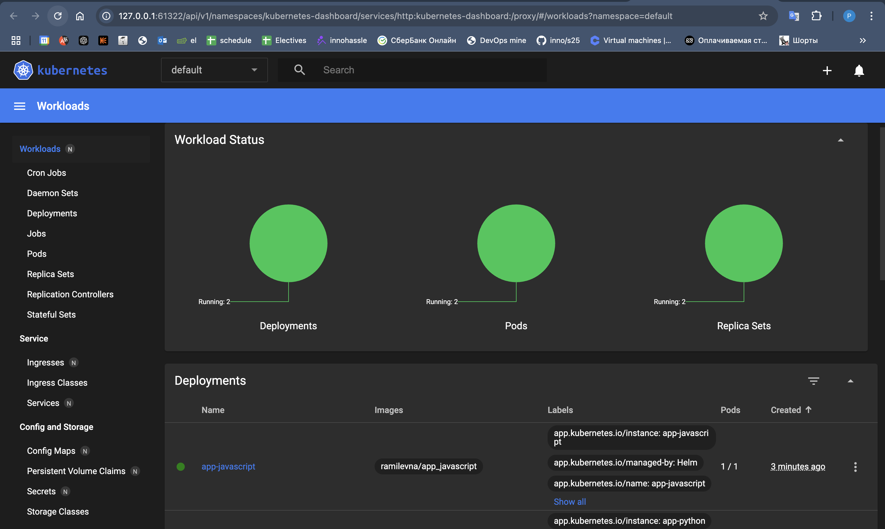
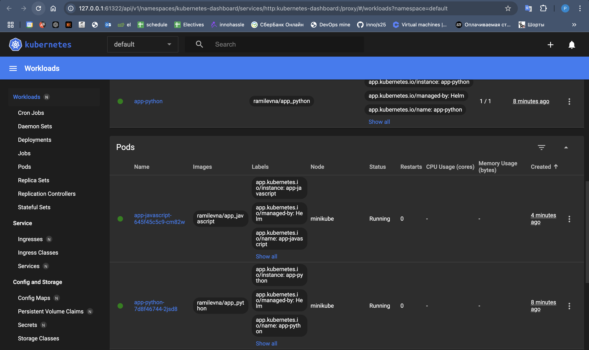
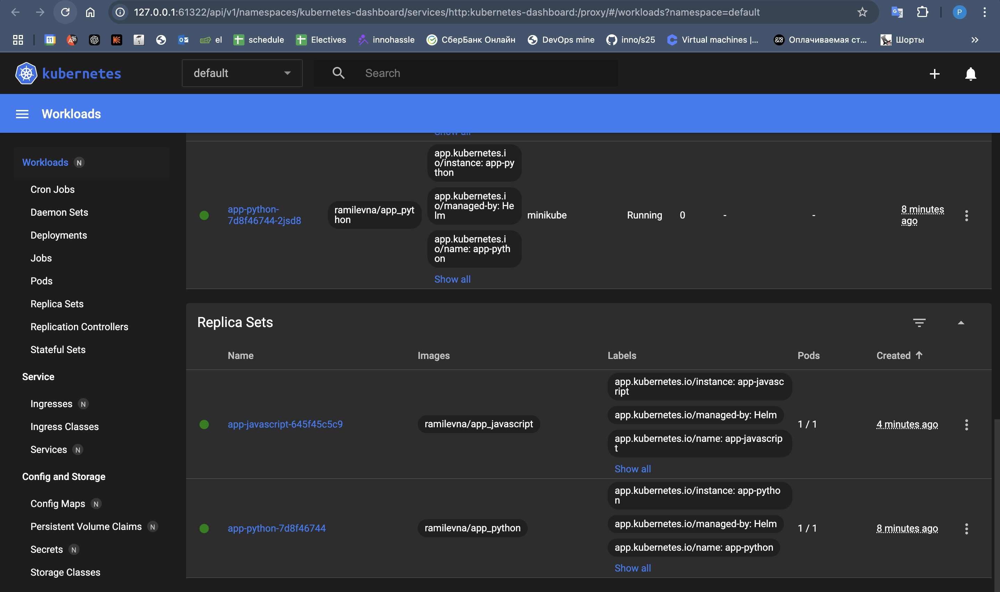
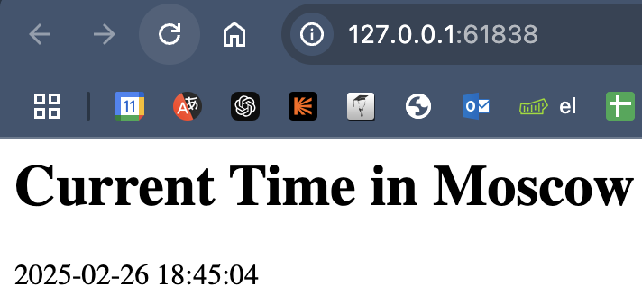
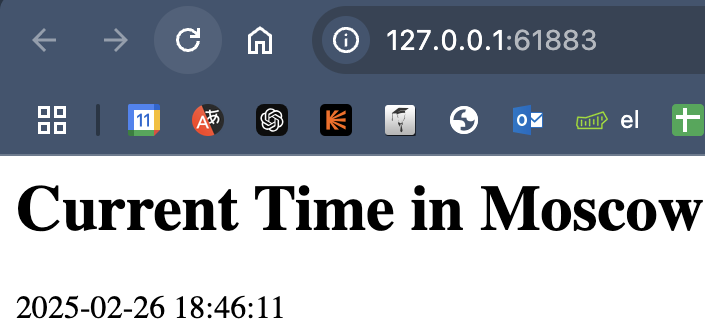

# Helm Deployment Report

## 1. Helm Setup and Chart Creation

### Installation and Verification
```sh
> helm repo add stable https://charts.helm.sh/stable
helm repo update
"stable" has been added to your repositories
Hang tight while we grab the latest from your chart repositories...
...Successfully got an update from the "stable" chart repository
Update Complete. ⎈Happy Helming!⎈
```

### Helm Chart Creation
```sh
> helm create python-app
Creating python-app
> helm create javascript-app
Creating javascript-app
```

### Modifications to `values.yaml`
- Updated repository name.
- Changed image tag.

### Modifications to `deployment.yaml`
- Updated `containerPort`.

### Installing the Helm Chart
Python App:
```bash
> helm install app-python ./app-python
NAME: app-python
LAST DEPLOYED: Wed Feb 26 18:32:40 2025
NAMESPACE: default
STATUS: deployed
REVISION: 1
NOTES:
1. Get the application URL by running these commands:
  export POD_NAME=$(kubectl get pods --namespace default -l "app.kubernetes.io/name=app-python,app.kubernetes.io/instance=app-python" -o jsonpath="{.items[0].metadata.name}")
  export CONTAINER_PORT=$(kubectl get pod --namespace default $POD_NAME -o jsonpath="{.spec.containers[0].ports[0].containerPort}")
  echo "Visit http://127.0.0.1:8080 to use your application"
  kubectl --namespace default port-forward $POD_NAME 8080:$CONTAINER_PORT
```

Javascript App:
```bash
> helm install app-javascript ./app-javascript
NAME: app-javascript
LAST DEPLOYED: Wed Feb 26 18:37:00 2025
NAMESPACE: default
STATUS: deployed
REVISION: 1
NOTES:
1. Get the application URL by running these commands:
  export POD_NAME=$(kubectl get pods --namespace default -l "app.kubernetes.io/name=app-javascript,app.kubernetes.io/instance=app-javascript" -o jsonpath="{.items[0].metadata.name}")
  export CONTAINER_PORT=$(kubectl get pod --namespace default $POD_NAME -o jsonpath="{.spec.containers[0].ports[0].containerPort}")
  echo "Visit http://127.0.0.1:8080 to use your application"
  kubectl --namespace default port-forward $POD_NAME 8080:$CONTAINER_PORT
```
### Verifying Installation
```sh
> kubectl get pods,svc
NAME                                  READY   STATUS    RESTARTS   AGE
pod/app-javascript-645f45c5c9-cm82w   1/1     Running   0          2m30s
pod/app-python-7d8f46744-2jsd8        1/1     Running   0          6m50s

NAME                     TYPE        CLUSTER-IP       EXTERNAL-IP   PORT(S)   AGE
service/app-javascript   ClusterIP   10.109.132.66    <none>        80/TCP    2m30s
service/app-python       ClusterIP   10.111.242.187   <none>        80/TCP    6m50s
service/kubernetes       ClusterIP   10.96.0.1        <none>        443/TCP   56m
```
```bash
minikube dashboard
```




### Accessing the Application
Python app:
```sh
> minikube service app-python
|-----------|------------|-------------|--------------|
| NAMESPACE |    NAME    | TARGET PORT |     URL      |
|-----------|------------|-------------|--------------|
| default   | app-python |             | No node port |
|-----------|------------|-------------|--------------|
😿  service default/app-python has no node port
❗  Services [default/app-python] have type "ClusterIP" not meant to be exposed, however for local development minikube allows you to access this !
🏃  Starting tunnel for service app-python.
|-----------|------------|-------------|------------------------|
| NAMESPACE |    NAME    | TARGET PORT |          URL           |
|-----------|------------|-------------|------------------------|
| default   | app-python |             | http://127.0.0.1:61838 |
|-----------|------------|-------------|------------------------|
🎉  Opening service default/app-python in default browser...
❗  Because you are using a Docker driver on darwin, the terminal needs to be open to run it.
```


Javascript app:
```bash
> minikube service app-javascript
|-----------|----------------|-------------|--------------|
| NAMESPACE |      NAME      | TARGET PORT |     URL      |
|-----------|----------------|-------------|--------------|
| default   | app-javascript |             | No node port |
|-----------|----------------|-------------|--------------|
😿  service default/app-javascript has no node port
❗  Services [default/app-javascript] have type "ClusterIP" not meant to be exposed, however for local development minikube allows you to access this !
🏃  Starting tunnel for service app-javascript.
|-----------|----------------|-------------|------------------------|
| NAMESPACE |      NAME      | TARGET PORT |          URL           |
|-----------|----------------|-------------|------------------------|
| default   | app-javascript |             | http://127.0.0.1:61883 |
|-----------|----------------|-------------|------------------------|
🎉  Opening service default/app-javascript in default browser...
❗  Because you are using a Docker driver on darwin, the terminal needs to be open to run it.
```

## 2. Helm Chart Hooks

Pre-Install Hook (`pre-install-hook.yaml`) and Post-Install Hook (`post-install-hook.yaml`) added.

### Hook Execution and Troubleshooting

Linting:
```bash
> helm lint app-python
==> Linting app-python
[INFO] Chart.yaml: icon is recommended

1 chart(s) linted, 0 chart(s) failed
```
Added pre-install-hook.yaml and post-install-hook.yaml files.

```sh
helm install --dry-run helm-hooks app-python
```
```bash
> kubectl get po

NAME                              READY   STATUS    RESTARTS   AGE
app-javascript-645f45c5c9-cm82w   1/1     Running   0          3h13m
app-python-7d8f46744-wp9f9        1/1     Running   0          83s
app-python-post-install           0/1     Completed 0          21s
app-python-pre-install            0/1     Completed 0          34s
```

## 3. Helm Library Chart

### Creating Library Chart
```sh
> helm create library-chart
Creating library-chart
```

### Template Modifications (`_labels.tpl`)
```yaml
{{- define "common.labels" -}}
app: {{ .Chart.Name }}
release: {{ .Release.Name }}
{{- end }}
```

### Using the Library Chart in Deployment
```yaml
metadata:
  labels:
    {{- include "common.labels" . | nindent 4 }}
```