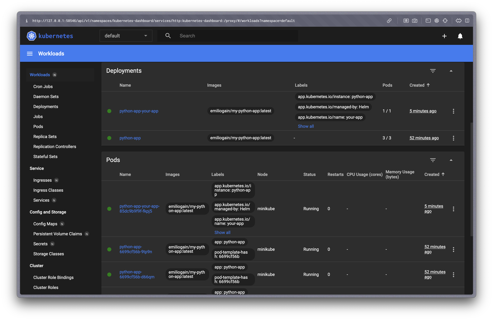
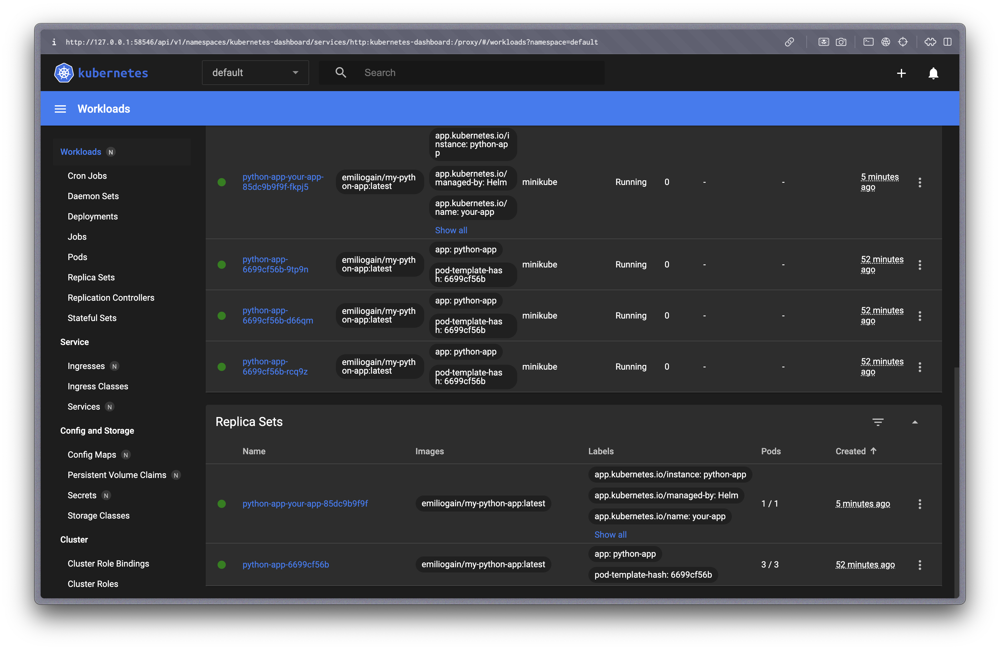

# Helm

```bash
❯ helm install python-app ./your-app
NAME: python-app
LAST DEPLOYED: Sun Mar  2 04:13:41 2025
NAMESPACE: default
STATUS: deployed
REVISION: 1
NOTES:
1. Get the application URL by running these commands:
  export NODE_PORT=$(kubectl get --namespace default -o jsonpath="{.spec.ports[0].nodePort}" services python-app-your-app)
  export NODE_IP=$(kubectl get nodes --namespace default -o jsonpath="{.items[0].status.addresses[0].address}")
  echo http://$NODE_IP:$NODE_PORT
```

```bash
❯ minikube service python-app-your-app
|-----------|---------------------|-------------|--------------|
| NAMESPACE |        NAME         | TARGET PORT |     URL      |
|-----------|---------------------|-------------|--------------|
| default   | python-app-your-app |             | No node port |
|-----------|---------------------|-------------|--------------|
😿  service default/python-app-your-app has no node port
❗  Services [default/python-app-your-app] have type "ClusterIP" not meant to be exposed, however for local development minikube allows you to access this !
🏃  Starting tunnel for service python-app-your-app.
|-----------|---------------------|-------------|------------------------|
| NAMESPACE |        NAME         | TARGET PORT |          URL           |
|-----------|---------------------|-------------|------------------------|
| default   | python-app-your-app |             | http://127.0.0.1:58370 |
|-----------|---------------------|-------------|------------------------|
🎉  Opening service default/python-app-your-app in default browser...
❗  Because you are using a Docker driver on darwin, the terminal needs to be open to run it.
```

```bash
❯ kubectl get pods,svc
NAME                                       READY   STATUS    RESTARTS   AGE
pod/python-app-6699cf56b-9tp9n             1/1     Running   0          49m
pod/python-app-6699cf56b-d66qm             1/1     Running   0          49m
pod/python-app-6699cf56b-rcq9z             1/1     Running   0          49m
pod/python-app-your-app-85dc9b9f9f-fkpj5   1/1     Running   0          92s

NAME                          TYPE        CLUSTER-IP     EXTERNAL-IP   PORT(S)        AGE
service/kubernetes            ClusterIP   10.96.0.1      <none>        443/TCP        73m
service/python-app            NodePort    10.107.42.4    <none>        80:31037/TCP   49m
service/python-app-your-app   ClusterIP   10.105.38.23   <none>        5000/TCP       92s
```

`minikube dashboard`:




## Helm Chart Hooks

```bash
❯ helm lint your-app
==> Linting your-app
[INFO] Chart.yaml: icon is recommended

1 chart(s) linted, 0 chart(s) failed
❯ helm install helm-hooks ./your-app --dry-run
NAME: helm-hooks
LAST DEPLOYED: Sun Mar  2 04:38:23 2025
NAMESPACE: default
STATUS: pending-install
REVISION: 1
HOOKS:
---
# Source: your-app/templates/post-install-hook.yaml
apiVersion: v1
kind: Pod
metadata:
  name: post-install-hook
  annotations:
    "helm.sh/hook": post-install
    "helm.sh/hook-delete-policy": before-hook-creation,hook-succeeded
spec:
  containers:
    - name: post-install-container
      image: busybox
      imagePullPolicy: Always
      command: ["sh", "-c", "echo The post-install hook is running && sleep 20"]
  restartPolicy: Never
  terminationGracePeriodSeconds: 0
---
# Source: your-app/templates/pre-install-hook.yaml
apiVersion: v1
kind: Pod
metadata:
  name: pre-install-hook
  annotations:
    "helm.sh/hook": pre-install
    "helm.sh/hook-delete-policy": before-hook-creation,hook-succeeded
spec:
  containers:
    - name: pre-install-container
      image: busybox
      imagePullPolicy: IfNotPresent
      command: ["sh", "-c", "echo The pre-install hook is running && sleep 20"]
  restartPolicy: Never
  terminationGracePeriodSeconds: 0
---
# Source: your-app/templates/tests/test-connection.yaml
apiVersion: v1
kind: Pod
metadata:
  name: "helm-hooks-your-app-test-connection"
  labels:
    helm.sh/chart: your-app-0.1.0
    app.kubernetes.io/name: your-app
    app.kubernetes.io/instance: helm-hooks
    app.kubernetes.io/version: "1.16.0"
    app.kubernetes.io/managed-by: Helm
  annotations:
    "helm.sh/hook": test
spec:
  containers:
    - name: wget
      image: busybox
      command: ['wget']
      args: ['helm-hooks-your-app:5000']
  restartPolicy: Never
MANIFEST:
---
# Source: your-app/templates/serviceaccount.yaml
apiVersion: v1
kind: ServiceAccount
metadata:
  name: helm-hooks-your-app
  labels:
    helm.sh/chart: your-app-0.1.0
    app.kubernetes.io/name: your-app
    app.kubernetes.io/instance: helm-hooks
    app.kubernetes.io/version: "1.16.0"
    app.kubernetes.io/managed-by: Helm
automountServiceAccountToken: true
---
# Source: your-app/templates/service.yaml
apiVersion: v1
kind: Service
metadata:
  name: helm-hooks-your-app
  labels:
    helm.sh/chart: your-app-0.1.0
    app.kubernetes.io/name: your-app
    app.kubernetes.io/instance: helm-hooks
    app.kubernetes.io/version: "1.16.0"
    app.kubernetes.io/managed-by: Helm
spec:
  type: ClusterIP
  ports:
    - port: 5000
      targetPort: http
      protocol: TCP
      name: http
  selector:
    app.kubernetes.io/name: your-app
    app.kubernetes.io/instance: helm-hooks
---
# Source: your-app/templates/deployment.yaml
apiVersion: apps/v1
kind: Deployment
metadata:
  name: helm-hooks-your-app
  labels:
    helm.sh/chart: your-app-0.1.0
    app.kubernetes.io/name: your-app
    app.kubernetes.io/instance: helm-hooks
    app.kubernetes.io/version: "1.16.0"
    app.kubernetes.io/managed-by: Helm
spec:
  replicas: 1
  selector:
    matchLabels:
      app.kubernetes.io/name: your-app
      app.kubernetes.io/instance: helm-hooks
  template:
    metadata:
      labels:
        helm.sh/chart: your-app-0.1.0
        app.kubernetes.io/name: your-app
        app.kubernetes.io/instance: helm-hooks
        app.kubernetes.io/version: "1.16.0"
        app.kubernetes.io/managed-by: Helm
    spec:
      serviceAccountName: helm-hooks-your-app
      containers:
        - name: your-app
          image: "emiliogain/my-python-app:latest"
          imagePullPolicy: IfNotPresent
          ports:
            - name: http
              containerPort: 5000
              protocol: TCP
          livenessProbe:
            httpGet:
              path: /
              port: http
          readinessProbe:
            httpGet:
              path: /
              port: http

NOTES:
1. Get the application URL by running these commands:
  export POD_NAME=$(kubectl get pods --namespace default -l "app.kubernetes.io/name=your-app,app.kubernetes.io/instance=helm-hooks" -o jsonpath="{.items[0].metadata.name}")
  export CONTAINER_PORT=$(kubectl get pod --namespace default $POD_NAME -o jsonpath="{.spec.containers[0].ports[0].containerPort}")
  echo "Visit http://127.0.0.1:8080 to use your application"
  kubectl --namespace default port-forward $POD_NAME 8080:$CONTAINER_PORT
```

```bash
❯ kubectl get po
NAME                                   READY   STATUS      RESTARTS   AGE
helm-hooks-your-app-797bf756b8-xgrpf   1/1     Running     0          117s
post-install-hook                      0/1     Completed   0          117s
pre-install-hook                       0/1     Completed   0          2m19s
python-app-6699cf56b-5dzk5             1/1     Running     0          2m49s
python-app-6699cf56b-8zqt2             1/1     Running     0          2m49s
python-app-6699cf56b-b7fjb             1/1     Running     0          2m49s
```

```bash
❯ kubectl describe po pre-install-hook
Name:             pre-install-hook
Namespace:        default
Priority:         0
Service Account:  default
Node:             minikube/192.168.49.2
Start Time:       Sun, 02 Mar 2025 05:12:22 +0300
Labels:           <none>
Annotations:      helm.sh/hook: pre-install
                  helm.sh/hook-delete-policy: before-hook-creation
                  helm.sh/hook-weight: 0
Status:           Succeeded
IP:               10.244.0.28
IPs:
  IP:  10.244.0.28
Containers:
  pre-install-container:
    Container ID:  docker://ff9bd714aa5526523ec8a41addc6a87ffb2e74aa1168566c5b4451dcb4393fcd
    Image:         busybox
    Image ID:      docker-pullable://busybox@sha256:498a000f370d8c37927118ed80afe8adc38d1edcbfc071627d17b25c88efcab0
    Port:          <none>
    Host Port:     <none>
    Command:
      sh
      -c
      echo The pre-install hook is running && sleep 20
    State:          Terminated
      Reason:       Completed
      Exit Code:    0
      Started:      Sun, 02 Mar 2025 05:12:23 +0300
      Finished:     Sun, 02 Mar 2025 05:12:43 +0300
    Ready:          False
    Restart Count:  0
    Environment:    <none>
    Mounts:
      /var/run/secrets/kubernetes.io/serviceaccount from kube-api-access-pvdch (ro)
Conditions:
  Type                        Status
  PodReadyToStartContainers   False 
  Initialized                 True 
  Ready                       False 
  ContainersReady             False 
  PodScheduled                True 
Volumes:
  kube-api-access-pvdch:
    Type:                    Projected (a volume that contains injected data from multiple sources)
    TokenExpirationSeconds:  3607
    ConfigMapName:           kube-root-ca.crt
    ConfigMapOptional:       <nil>
    DownwardAPI:             true
QoS Class:                   BestEffort
Node-Selectors:              <none>
Tolerations:                 node.kubernetes.io/not-ready:NoExecute op=Exists for 300s
                             node.kubernetes.io/unreachable:NoExecute op=Exists for 300s
Events:
  Type    Reason     Age   From               Message
  ----    ------     ----  ----               -------
  Normal  Scheduled  100s  default-scheduler  Successfully assigned default/pre-install-hook to minikube
  Normal  Pulled     99s   kubelet            Container image "busybox" already present on machine
  Normal  Created    99s   kubelet            Created container: pre-install-container
  Normal  Started    99s   kubelet            Started container pre-install-container
```
```bash
❯ kubectl describe po post-install-hook
Name:             post-install-hook
Namespace:        default
Priority:         0
Service Account:  default
Node:             minikube/192.168.49.2
Start Time:       Sun, 02 Mar 2025 05:12:44 +0300
Labels:           <none>
Annotations:      helm.sh/hook: post-install
                  helm.sh/hook-delete-policy: before-hook-creation
                  helm.sh/hook-weight: 5
Status:           Running
IP:               10.244.0.30
IPs:
  IP:  10.244.0.30
Containers:
  post-install-container:
    Container ID:  docker://8a44a7e98a6651c354394e9faa5a2922bfe8b0196a4a1293916c0329dd7f6147
    Image:         busybox
    Image ID:      docker-pullable://busybox@sha256:498a000f370d8c37927118ed80afe8adc38d1edcbfc071627d17b25c88efcab0
    Port:          <none>
    Host Port:     <none>
    Command:
      sh
      -c
      echo The post-install hook is running && sleep 15
    State:          Terminated
      Reason:       Completed
      Exit Code:    0
      Started:      Sun, 02 Mar 2025 05:12:47 +0300
      Finished:     Sun, 02 Mar 2025 05:13:02 +0300
    Ready:          False
    Restart Count:  0
    Environment:    <none>
    Mounts:
      /var/run/secrets/kubernetes.io/serviceaccount from kube-api-access-lv494 (ro)
Conditions:
  Type                        Status
  PodReadyToStartContainers   True 
  Initialized                 True 
  Ready                       False 
  ContainersReady             False 
  PodScheduled                True 
Volumes:
  kube-api-access-lv494:
    Type:                    Projected (a volume that contains injected data from multiple sources)
    TokenExpirationSeconds:  3607
    ConfigMapName:           kube-root-ca.crt
    ConfigMapOptional:       <nil>
    DownwardAPI:             true
QoS Class:                   BestEffort
Node-Selectors:              <none>
Tolerations:                 node.kubernetes.io/not-ready:NoExecute op=Exists for 300s
                             node.kubernetes.io/unreachable:NoExecute op=Exists for 300s
Events:
  Type    Reason     Age   From               Message
  ----    ------     ----  ----               -------
  Normal  Scheduled  19s   default-scheduler  Successfully assigned default/post-install-hook to minikube
  Normal  Pulling    18s   kubelet            Pulling image "busybox"
  Normal  Pulled     16s   kubelet            Successfully pulled image "busybox" in 2.46s (2.46s including waiting). Image size: 4042190 bytes.
  Normal  Created    16s   kubelet            Created container: post-install-container
  Normal  Started    16s   kubelet            Started container post-install-container
❯ kubectl describe po post-install-hook
Name:             post-install-hook
Namespace:        default
Priority:         0
Service Account:  default
Node:             minikube/192.168.49.2
Start Time:       Sun, 02 Mar 2025 05:12:44 +0300
Labels:           <none>
Annotations:      helm.sh/hook: post-install
                  helm.sh/hook-delete-policy: before-hook-creation
                  helm.sh/hook-weight: 5
Status:           Succeeded
IP:               10.244.0.30
IPs:
  IP:  10.244.0.30
Containers:
  post-install-container:
    Container ID:  docker://8a44a7e98a6651c354394e9faa5a2922bfe8b0196a4a1293916c0329dd7f6147
    Image:         busybox
    Image ID:      docker-pullable://busybox@sha256:498a000f370d8c37927118ed80afe8adc38d1edcbfc071627d17b25c88efcab0
    Port:          <none>
    Host Port:     <none>
    Command:
      sh
      -c
      echo The post-install hook is running && sleep 15
    State:          Terminated
      Reason:       Completed
      Exit Code:    0
      Started:      Sun, 02 Mar 2025 05:12:47 +0300
      Finished:     Sun, 02 Mar 2025 05:13:02 +0300
    Ready:          False
    Restart Count:  0
    Environment:    <none>
    Mounts:
      /var/run/secrets/kubernetes.io/serviceaccount from kube-api-access-lv494 (ro)
Conditions:
  Type                        Status
  PodReadyToStartContainers   False 
  Initialized                 True 
  Ready                       False 
  ContainersReady             False 
  PodScheduled                True 
Volumes:
  kube-api-access-lv494:
    Type:                    Projected (a volume that contains injected data from multiple sources)
    TokenExpirationSeconds:  3607
    ConfigMapName:           kube-root-ca.crt
    ConfigMapOptional:       <nil>
    DownwardAPI:             true
QoS Class:                   BestEffort
Node-Selectors:              <none>
Tolerations:                 node.kubernetes.io/not-ready:NoExecute op=Exists for 300s
                             node.kubernetes.io/unreachable:NoExecute op=Exists for 300s
Events:
  Type    Reason     Age   From               Message
  ----    ------     ----  ----               -------
  Normal  Scheduled  25s   default-scheduler  Successfully assigned default/post-install-hook to minikube
  Normal  Pulling    24s   kubelet            Pulling image "busybox"
  Normal  Pulled     22s   kubelet            Successfully pulled image "busybox" in 2.46s (2.46s including waiting). Image size: 4042190 bytes.
  Normal  Created    22s   kubelet            Created container: post-install-container
  Normal  Started    22s   kubelet            Started container post-install-container
```

```bash
❯ kubectl get pods,svc
NAME                                       READY   STATUS      RESTARTS   AGE
pod/helm-hooks-your-app-797bf756b8-xgrpf   1/1     Running     0          3m28s
pod/post-install-hook                      0/1     Completed   0          3m28s
pod/pre-install-hook                       0/1     Completed   0          3m50s
pod/python-app-6699cf56b-5dzk5             1/1     Running     0          4m20s
pod/python-app-6699cf56b-8zqt2             1/1     Running     0          4m20s
pod/python-app-6699cf56b-b7fjb             1/1     Running     0          4m20s

NAME                          TYPE        CLUSTER-IP       EXTERNAL-IP   PORT(S)        AGE
service/helm-hooks-your-app   ClusterIP   10.104.137.158   <none>        5000/TCP       3m28s
service/kubernetes            ClusterIP   10.96.0.1        <none>        443/TCP        123m
service/python-app            NodePort    10.107.42.4      <none>        80:31037/TCP   98m
```