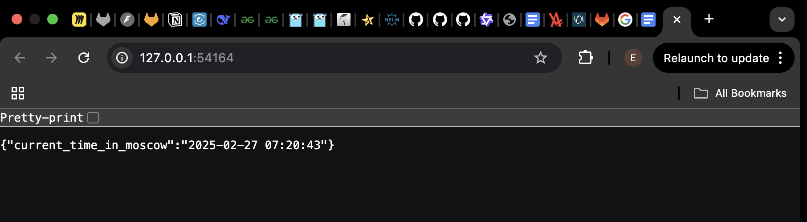

[# Helm

## Helm Setup and Chart Creation

```txt
(venv) ➜  k8s git:(Lab-10) ✗ helm install python-web-app ./python-web-app  
NAME: python-web-app
LAST DEPLOYED: Thu Feb 27 07:18:48 2025
NAMESPACE: default
STATUS: deployed
REVISION: 1
NOTES:
1. Get the application URL by running these commands:
  export POD_NAME=$(kubectl get pods --namespace default -l "app.kubernetes.io/name=python-web-app,app.kubernetes.io/instance=python-web-app" -o jsonpath="{.items[0].metadata.name}")
  export CONTAINER_PORT=$(kubectl get pod --namespace default $POD_NAME -o jsonpath="{.spec.containers[0].ports[0].containerPort}")
  echo "Visit http://127.0.0.1:8080 to use your application"
  kubectl --namespace default port-forward $POD_NAME 8080:$CONTAINER_PORT
```

```txt
(venv) ➜  k8s git:(Lab-10) ✗ kubectl get po,svc             
NAME                                        READY   STATUS    RESTARTS   AGE
pod/python-web-app-5bd6fd758f-2sj8m         1/1     Running   0          5m2s
pod/python-web-app-5bd6fd758f-mk2cv         1/1     Running   0          5m2s
pod/python-web-app-5bd6fd758f-xfkc9         1/1     Running   0          5m2s

NAME                         TYPE        CLUSTER-IP      EXTERNAL-IP   PORT(S)    AGE
service/kubernetes           ClusterIP   10.96.0.1       <none>        443/TCP    7m20s
service/python-web-app       ClusterIP   10.108.144.37   <none>        8000/TCP   5m2s
```

```txt
(venv) ➜  k8s git:(Lab-10) ✗ minikube service python-web-app
|-----------|----------------|-------------|--------------|
| NAMESPACE |      NAME      | TARGET PORT |     URL      |
|-----------|----------------|-------------|--------------|
| default   | python-web-app |             | No node port |
|-----------|----------------|-------------|--------------|
😿  service default/python-web-app has no node port
❗  Services [default/python-web-app] have type "ClusterIP" not meant to be exposed, however for local development minikube allows you to access this !
🏃  Starting tunnel for service python-web-app.
|-----------|----------------|-------------|------------------------|
| NAMESPACE |      NAME      | TARGET PORT |          URL           |
|-----------|----------------|-------------|------------------------|
| default   | python-web-app |             | http://127.0.0.1:54164 |
|-----------|----------------|-------------|------------------------|
🎉  Opening service default/python-web-app in default browser...
❗  Because you are using a Docker driver on darwin, the terminal needs to be open to run it.
```



## Helm Chart Hooks

### Troubleshoot Hooks

```txt
(venv) ➜  k8s git:(Lab-10) ✗ helm lint python-web-app
==> Linting python-web-app
[INFO] Chart.yaml: icon is recommended

1 chart(s) linted, 0 chart(s) failed
```

```txt
(venv) ➜  k8s git:(Lab-10) ✗ helm install --dry-run helm-hooks python-web-app
NAME: helm-hooks
LAST DEPLOYED: Thu Feb 27 10:57:28 2025
NAMESPACE: default
STATUS: pending-install
REVISION: 1
HOOKS:
---
# Source: python-web-app/templates/post-install-hook.yml
apiVersion: v1
kind: Pod
metadata:
   name: postinstall-hook
   annotations:
       "helm.sh/hook": "post-install"
       "helm.sh/hook-delete-policy": "hook-succeeded"
spec:
  containers:
  - name: post-install-container
    image: busybox
    imagePullPolicy: Always
    command: ['sh', '-c', 'echo The post-install hook is running && sleep 15' ]
  restartPolicy: Never
  terminationGracePeriodSeconds: 0
---
# Source: python-web-app/templates/pre-install-hook.yml
apiVersion: v1
kind: Pod
metadata:
   name: preinstall-hook
   annotations:
       "helm.sh/hook": "pre-install"
       "helm.sh/hook-delete-policy": "hook-succeeded"
spec:
  containers:
  - name: pre-install-container
    image: busybox
    imagePullPolicy: IfNotPresent
    command: ['sh', '-c', 'echo The pre-install hook is running && sleep 20' ]
  restartPolicy: Never
  terminationGracePeriodSeconds: 0
---
# Source: python-web-app/templates/tests/test-connection.yaml
apiVersion: v1
kind: Pod
metadata:
  name: "helm-hooks-python-web-app-test-connection"
  labels:
    helm.sh/chart: python-web-app-0.1.0
    app.kubernetes.io/name: python-web-app
    app.kubernetes.io/instance: helm-hooks
    app.kubernetes.io/version: "1.16.0"
    app.kubernetes.io/managed-by: Helm
  annotations:
    "helm.sh/hook": test
spec:
  containers:
    - name: wget
      image: busybox
      command: ['wget']
      args: ['helm-hooks-python-web-app:8000']
  restartPolicy: Never
MANIFEST:
---
# Source: python-web-app/templates/serviceaccount.yaml
apiVersion: v1
kind: ServiceAccount
metadata:
  name: helm-hooks-python-web-app
  labels:
    helm.sh/chart: python-web-app-0.1.0
    app.kubernetes.io/name: python-web-app
    app.kubernetes.io/instance: helm-hooks
    app.kubernetes.io/version: "1.16.0"
    app.kubernetes.io/managed-by: Helm
automountServiceAccountToken: true
---
# Source: python-web-app/templates/service.yaml
apiVersion: v1
kind: Service
metadata:
  name: helm-hooks-python-web-app
  labels:
    helm.sh/chart: python-web-app-0.1.0
    app.kubernetes.io/name: python-web-app
    app.kubernetes.io/instance: helm-hooks
    app.kubernetes.io/version: "1.16.0"
    app.kubernetes.io/managed-by: Helm
spec:
  type: ClusterIP
  ports:
    - port: 8000
      targetPort: http
      protocol: TCP
      name: http
  selector:
    app.kubernetes.io/name: python-web-app
    app.kubernetes.io/instance: helm-hooks
---
# Source: python-web-app/templates/deployment.yaml
apiVersion: apps/v1
kind: Deployment
metadata:
  name: helm-hooks-python-web-app
  labels:
    helm.sh/chart: python-web-app-0.1.0
    app.kubernetes.io/name: python-web-app
    app.kubernetes.io/instance: helm-hooks
    app.kubernetes.io/version: "1.16.0"
    app.kubernetes.io/managed-by: Helm
spec:
  replicas: 3
  selector:
    matchLabels:
      app.kubernetes.io/name: python-web-app
      app.kubernetes.io/instance: helm-hooks
  template:
    metadata:
      labels:
        helm.sh/chart: python-web-app-0.1.0
        app.kubernetes.io/name: python-web-app
        app.kubernetes.io/instance: helm-hooks
        app.kubernetes.io/version: "1.16.0"
        app.kubernetes.io/managed-by: Helm
    spec:
      serviceAccountName: helm-hooks-python-web-app
      containers:
        - name: python-web-app
          image: "netpo4ki/python-web:latest"
          imagePullPolicy: IfNotPresent
          ports:
            - name: http
              containerPort: 8000
              protocol: TCP
          livenessProbe:
            httpGet:
              path: /
              port: http
          readinessProbe:
            httpGet:
              path: /
              port: http

NOTES:
1. Get the application URL by running these commands:
  export POD_NAME=$(kubectl get pods --namespace default -l "app.kubernetes.io/name=python-web-app,app.kubernetes.io/instance=helm-hooks" -o jsonpath="{.items[0].metadata.name}")
  export CONTAINER_PORT=$(kubectl get pod --namespace default $POD_NAME -o jsonpath="{.spec.containers[0].ports[0].containerPort}")
  echo "Visit http://127.0.0.1:8080 to use your application"
  kubectl --namespace default port-forward $POD_NAME 8080:$CONTAINER_PORT
```

```txt
(venv) ➜  k8s git:(Lab-10) ✗ kubectl get po
No resources found in default namespace.
```

### Hook Delete Policy (Without)

```txt
(venv) ➜  k8s git:(Lab-10) ✗ helm install --name-template=python-web-app python-web-app
NAME: python-web-app
LAST DEPLOYED: Thu Feb 27 17:38:05 2025
NAMESPACE: default
STATUS: deployed
REVISION: 1
NOTES:
1. Get the application URL by running these commands:
  export POD_NAME=$(kubectl get pods --namespace default -l "app.kubernetes.io/name=python-web-app,app.kubernetes.io/instance=python-web-app" -o jsonpath="{.items[0].metadata.name}")
  export CONTAINER_PORT=$(kubectl get pod --namespace default $POD_NAME -o jsonpath="{.spec.containers[0].ports[0].containerPort}")
  echo "Visit http://127.0.0.1:8080 to use your application"
  kubectl --namespace default port-forward $POD_NAME 8080:$CONTAINER_PORT
```

```txt
(venv) ➜  k8s git:(Lab-10) ✗ kubectl get po
NAME                              READY   STATUS      RESTARTS   AGE
postinstall-hook                  0/1     Completed   0          54s
preinstall-hook                   0/1     Completed   0          80s
python-web-app-5bd6fd758f-992bw   1/1     Running     0          54s
python-web-app-5bd6fd758f-pbxs8   1/1     Running     0          54s
python-web-app-5bd6fd758f-vp795   1/1     Running     0          54s
```

```txt
(venv) ➜  k8s git:(Lab-10) ✗ kubectl describe pod preinstall-hook
Name:             preinstall-hook
Namespace:        default
Priority:         0
Service Account:  default
Node:             minikube/192.168.49.2
Start Time:       Thu, 27 Feb 2025 17:38:06 +0300
Labels:           <none>
Annotations:      helm.sh/hook: pre-install
Status:           Succeeded
IP:               10.244.0.3
IPs:
  IP:  10.244.0.3
Containers:
  pre-install-container:
    Container ID:  docker://71d2a9af45ab047c9b225623595ba6c32bcdb7fe7f82300014291b6762c0cab0
    Image:         busybox
    Image ID:      docker-pullable://busybox@sha256:498a000f370d8c37927118ed80afe8adc38d1edcbfc071627d17b25c88efcab0
    Port:          <none>
    Host Port:     <none>
    Command:
      sh
      -c
      echo The pre-install hook is running && sleep 20
    State:          Terminated
      Reason:       Completed
      Exit Code:    0
      Started:      Thu, 27 Feb 2025 17:38:10 +0300
      Finished:     Thu, 27 Feb 2025 17:38:30 +0300
    Ready:          False
    Restart Count:  0
    Environment:    <none>
    Mounts:
      /var/run/secrets/kubernetes.io/serviceaccount from kube-api-access-jzfsf (ro)
Conditions:
  Type                        Status
  PodReadyToStartContainers   False 
  Initialized                 True 
  Ready                       False 
  ContainersReady             False 
  PodScheduled                True 
Volumes:
  kube-api-access-jzfsf:
    Type:                    Projected (a volume that contains injected data from multiple sources)
    TokenExpirationSeconds:  3607
    ConfigMapName:           kube-root-ca.crt
    ConfigMapOptional:       <nil>
    DownwardAPI:             true
QoS Class:                   BestEffort
Node-Selectors:              <none>
Tolerations:                 node.kubernetes.io/not-ready:NoExecute op=Exists for 300s
                             node.kubernetes.io/unreachable:NoExecute op=Exists for 300s
Events:
  Type    Reason     Age    From               Message
  ----    ------     ----   ----               -------
  Normal  Scheduled  2m47s  default-scheduler  Successfully assigned default/preinstall-hook to minikube
  Normal  Pulling    2m47s  kubelet            Pulling image "busybox"
  Normal  Pulled     2m43s  kubelet            Successfully pulled image "busybox" in 3.614s (3.614s including waiting). Image size: 4042190 bytes.
  Normal  Created    2m43s  kubelet            Created container: pre-install-container
  Normal  Started    2m43s  kubelet            Started container pre-install-container
```

```txt
(venv) ➜  k8s git:(Lab-10) ✗ kubectl describe pod postinstall-hook
Name:             postinstall-hook
Namespace:        default
Priority:         0
Service Account:  default
Node:             minikube/192.168.49.2
Start Time:       Thu, 27 Feb 2025 17:38:32 +0300
Labels:           <none>
Annotations:      helm.sh/hook: post-install
Status:           Succeeded
IP:               10.244.0.7
IPs:
  IP:  10.244.0.7
Containers:
  post-install-container:
    Container ID:  docker://4d3cd36626d612dee45643504c74b43ffbb76f72cf174cbe58636385943d5b5d
    Image:         busybox
    Image ID:      docker-pullable://busybox@sha256:498a000f370d8c37927118ed80afe8adc38d1edcbfc071627d17b25c88efcab0
    Port:          <none>
    Host Port:     <none>
    Command:
      sh
      -c
      echo The post-install hook is running && sleep 15
    State:          Terminated
      Reason:       Completed
      Exit Code:    0
      Started:      Thu, 27 Feb 2025 17:38:41 +0300
      Finished:     Thu, 27 Feb 2025 17:38:56 +0300
    Ready:          False
    Restart Count:  0
    Environment:    <none>
    Mounts:
      /var/run/secrets/kubernetes.io/serviceaccount from kube-api-access-b7tnl (ro)
Conditions:
  Type                        Status
  PodReadyToStartContainers   False 
  Initialized                 True 
  Ready                       False 
  ContainersReady             False 
  PodScheduled                True 
Volumes:
  kube-api-access-b7tnl:
    Type:                    Projected (a volume that contains injected data from multiple sources)
    TokenExpirationSeconds:  3607
    ConfigMapName:           kube-root-ca.crt
    ConfigMapOptional:       <nil>
    DownwardAPI:             true
QoS Class:                   BestEffort
Node-Selectors:              <none>
Tolerations:                 node.kubernetes.io/not-ready:NoExecute op=Exists for 300s
                             node.kubernetes.io/unreachable:NoExecute op=Exists for 300s
Events:
  Type    Reason     Age    From               Message
  ----    ------     ----   ----               -------
  Normal  Scheduled  3m19s  default-scheduler  Successfully assigned default/postinstall-hook to minikube
  Normal  Pulling    3m19s  kubelet            Pulling image "busybox"
  Normal  Pulled     3m10s  kubelet            Successfully pulled image "busybox" in 1.406s (9.1s including waiting). Image size: 4042190 bytes.
  Normal  Created    3m10s  kubelet            Created container: post-install-container
  Normal  Started    3m10s  kubelet            Started container post-install-container
```

### Hook Delete Policy (With)

```txt
(venv) ➜  k8s git:(Lab-10) ✗ helm install --name-template=python-web-app python-web-app
NAME: python-web-app
LAST DEPLOYED: Thu Feb 27 17:51:10 2025
NAMESPACE: default
STATUS: deployed
REVISION: 1
NOTES:
1. Get the application URL by running these commands:
  export POD_NAME=$(kubectl get pods --namespace default -l "app.kubernetes.io/name=python-web-app,app.kubernetes.io/instance=python-web-app" -o jsonpath="{.items[0].metadata.name}")
  export CONTAINER_PORT=$(kubectl get pod --namespace default $POD_NAME -o jsonpath="{.spec.containers[0].ports[0].containerPort}")
  echo "Visit http://127.0.0.1:8080 to use your application"
  kubectl --namespace default port-forward $POD_NAME 8080:$CONTAINER_PORT
```

```txt
(venv) ➜  k8s git:(Lab-10) ✗ kubectl get po                                            
NAME                              READY   STATUS    RESTARTS   AGE
python-web-app-5bd6fd758f-8w75s   1/1     Running   0          49s
python-web-app-5bd6fd758f-9gt7h   1/1     Running   0          49s
python-web-app-5bd6fd758f-xtn77   1/1     Running   0          49s
```