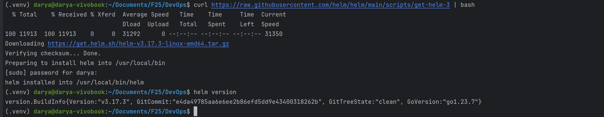
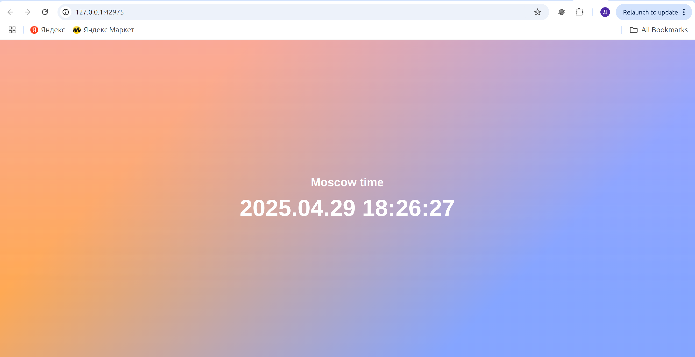

# Helm

### Install helm



### Create Helm Chart

1. Create Helm chart for my python app
```bash
helm create app-python-helm
Creating app-python-helm
```

2. Repository, port and tag in values.yaml
```bash
image:
  repository: darrpyy/devops
  tag: "latest"
  
service:
  port: 5000
```

3. Install helm chart
```bash
helm install app-python-helm ./app-python-helm

NAME: app-python-helm
LAST DEPLOYED: Tue Apr 29 16:02:29 2025
NAMESPACE: default
STATUS: deployed
REVISION: 1
NOTES:
1. Get the application URL by running these commands:
  export POD_NAME=$(kubectl get pods --namespace default -l "app.kubernetes.io/name=app-python-helm,app.kubernetes.io/instance=app-python-helm" -o jsonpath="{.items[0].metadata.name}")
  export CONTAINER_PORT=$(kubectl get pod --namespace default $POD_NAME -o jsonpath="{.spec.containers[0].ports[0].containerPort}")
  echo "Visit http://127.0.0.1:8080 to use your application"
  kubectl --namespace default port-forward $POD_NAME 8080:$CONTAINER_PORT
```

5. Checking application using `minikube service`
```bash
 minikube service app-python-helm
|-----------|-----------------|-------------|--------------|
| NAMESPACE |      NAME       | TARGET PORT |     URL      |
|-----------|-----------------|-------------|--------------|
| default   | app-python-helm |             | No node port |
|-----------|-----------------|-------------|--------------|
😿  service default/app-python-helm has no node port
❗  Services [default/app-python-helm] have type "ClusterIP" not meant to be exposed, however for local development minikube allows you to access this !
🏃  Starting tunnel for service app-python-helm.
|-----------|-----------------|-------------|------------------------|
| NAMESPACE |      NAME       | TARGET PORT |          URL           |
|-----------|-----------------|-------------|------------------------|
| default   | app-python-helm |             | http://127.0.0.1:42975 |
|-----------|-----------------|-------------|------------------------|
🎉  Opening service default/app-python-helm in default browser...
❗  Because you are using a Docker driver on linux, the terminal needs to be open to run it.
Opening in existing browser session.
```
Application


6. Checking the pods and services
```bash
 kubectl get pods,svc
NAME                                   READY   STATUS    RESTARTS   AGE
pod/app-python-helm-54c54857cc-6ncfh   1/1     Running   0          5m43s

NAME                      TYPE        CLUSTER-IP      EXTERNAL-IP   PORT(S)    AGE
service/app-python-helm   ClusterIP   10.109.122.62   <none>        5000/TCP   5m43s
service/kubernetes        ClusterIP   10.96.0.1       <none>        443/TCP    6h15m

```

### Helm chart hooks

I created hooks

```bash
helm install app-python-helm ./app-python-helm
```

```bash
kubectl get po
NAME                                READY   STATUS      RESTARTS   AGE
app-python-helm-54c54857cc-pfsd9    1/1     Running     0          20s
app-python-helm-post-install-hook   0/1     Completed   0          20s
app-python-helm-pre-install-hook    0/1     Completed   0          28s
```

```bash
kubectl describe po app-python-helm-pre-install-hook
Name:             app-python-helm-pre-install-hook
Namespace:        default
Priority:         0
Service Account:  default
Node:             minikube/192.168.49.2
Start Time:       Tue, 29 Apr 2025 18:39:26 +0300
Labels:           <none>
Annotations:      helm.sh/hook: pre-install
Status:           Succeeded
IP:               10.244.0.22
IPs:
  IP:  10.244.0.22
Containers:
  pre-install-container:
    Container ID:  docker://3445e6c806a9c05b1f340fae3c2f984f3d925b3d73eb65dc091bed53f0d863ac
    Image:         busybox
    Image ID:      docker-pullable://busybox@sha256:37f7b378a29ceb4c551b1b5582e27747b855bbfaa73fa11914fe0df028dc581f
    Port:          <none>
    Host Port:     <none>
    Command:
      sh
      -c
      echo Pre-install hook... && sleep 5
    State:          Terminated
      Reason:       Completed
      Exit Code:    0
      Started:      Tue, 29 Apr 2025 18:39:27 +0300
      Finished:     Tue, 29 Apr 2025 18:39:32 +0300
    Ready:          False
    Restart Count:  0
    Environment:    <none>
    Mounts:
      /var/run/secrets/kubernetes.io/serviceaccount from kube-api-access-65q5j (ro)
Conditions:
  Type                        Status
  PodReadyToStartContainers   False 
  Initialized                 True 
  Ready                       False 
  ContainersReady             False 
  PodScheduled                True 
Volumes:
  kube-api-access-65q5j:
    Type:                    Projected (a volume that contains injected data from multiple sources)
    TokenExpirationSeconds:  3607
    ConfigMapName:           kube-root-ca.crt
    ConfigMapOptional:       <nil>
    DownwardAPI:             true
QoS Class:                   BestEffort
Node-Selectors:              <none>
Tolerations:                 node.kubernetes.io/not-ready:NoExecute op=Exists for 300s
                             node.kubernetes.io/unreachable:NoExecute op=Exists for 300s
Events:
  Type    Reason     Age    From               Message
  ----    ------     ----   ----               -------
  Normal  Scheduled  2m50s  default-scheduler  Successfully assigned default/app-python-helm-pre-install-hook to minikube
  Normal  Pulled     2m50s  kubelet            Container image "busybox" already present on machine
  Normal  Created    2m49s  kubelet            Created container: pre-install-container
  Normal  Started    2m49s  kubelet            Started container pre-install-container
```

```bash
kubectl describe po app-python-helm-post-install-hook
Name:             app-python-helm-post-install-hook
Namespace:        default
Priority:         0
Service Account:  default
Node:             minikube/192.168.49.2
Start Time:       Tue, 29 Apr 2025 18:39:34 +0300
Labels:           <none>
Annotations:      helm.sh/hook: post-install
Status:           Succeeded
IP:               10.244.0.24
IPs:
  IP:  10.244.0.24
Containers:
  post-install-container:
    Container ID:  docker://e17832a018889ae9ce4e51571daed0280eb103fdf9bc5a4196cf30f8ee90795e
    Image:         busybox
    Image ID:      docker-pullable://busybox@sha256:37f7b378a29ceb4c551b1b5582e27747b855bbfaa73fa11914fe0df028dc581f
    Port:          <none>
    Host Port:     <none>
    Command:
      sh
      -c
      echo Post-install hook... && sleep 5
    State:          Terminated
      Reason:       Completed
      Exit Code:    0
      Started:      Tue, 29 Apr 2025 18:39:34 +0300
      Finished:     Tue, 29 Apr 2025 18:39:39 +0300
    Ready:          False
    Restart Count:  0
    Environment:    <none>
    Mounts:
      /var/run/secrets/kubernetes.io/serviceaccount from kube-api-access-bpsbd (ro)
Conditions:
  Type                        Status
  PodReadyToStartContainers   False 
  Initialized                 True 
  Ready                       False 
  ContainersReady             False 
  PodScheduled                True 
Volumes:
  kube-api-access-bpsbd:
    Type:                    Projected (a volume that contains injected data from multiple sources)
    TokenExpirationSeconds:  3607
    ConfigMapName:           kube-root-ca.crt
    ConfigMapOptional:       <nil>
    DownwardAPI:             true
QoS Class:                   BestEffort
Node-Selectors:              <none>
Tolerations:                 node.kubernetes.io/not-ready:NoExecute op=Exists for 300s
                             node.kubernetes.io/unreachable:NoExecute op=Exists for 300s
Events:
  Type    Reason     Age    From               Message
  ----    ------     ----   ----               -------
  Normal  Scheduled  2m58s  default-scheduler  Successfully assigned default/app-python-helm-post-install-hook to minikube
  Normal  Pulled     2m58s  kubelet            Container image "busybox" already present on machine
  Normal  Created    2m58s  kubelet            Created container: post-install-container
  Normal  Started    2m58s  kubelet            Started container post-install-container
```

Then I added delete policy and installed app again

```bash
kubectl get po
NAME                               READY   STATUS    RESTARTS   AGE
app-python-helm-54c54857cc-txtn2   1/1     Running   0          18s
```

Hooks were deleted
