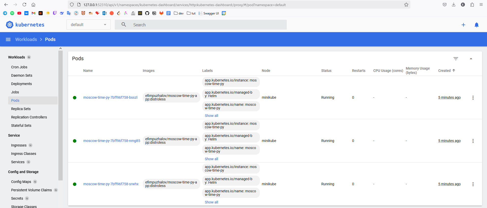

# Helm

## Helm Setup and Chart Creation

```bash
PS E:\Documents\Innop\C3\S2\devops\S25-core-course-labs\k8s> helm install moscow-time-py ./moscow-time-py
NAME: moscow-time-py
LAST DEPLOYED: Mon Feb 24 21:47:00 2025
NAMESPACE: default
REVISION: 1
NOTES:
1. Get the application URL by running these commands:
  export POD_NAME=$(kubectl get pods --namespace default -l "app.kubernetes.io/name=moscow-time-py,app.kubernetes.io/instance=moscow-time-py" -o jsonpath="{.items[0].metadata.name}")
  export CONTAINER_PORT=$(kubectl get pod --namespace default $POD_NAME -o jsonpath="{.spec.containers[0].ports[0].containerPort}")
  echo "Visit http://127.0.0.1:8080 to use your application"
  kubectl --namespace default port-forward $POD_NAME 8080:$CONTAINER_PORT
PS E:\Documents\Innop\C3\S2\devops\S25-core-course-labs\k8s> helm list
NAME            NAMESPACE       REVISION        UPDATED                                 STATUS          CHART                   APP VERSION
moscow-time-py  default         1               2025-02-24 21:47:00.281282 +0300 MSK    deployed        moscow-time-py-0.1.0    1.16.0     
PS E:\Documents\Innop\C3\S2\devops\S25-core-course-labs\k8s> kubectl get pods,svc
NAME                                  READY   STATUS    RESTARTS   AGE
pod/moscow-time-py-7bff96f758-bsszl   1/1     Running   0          2m50s
pod/moscow-time-py-7bff96f758-nmg85   1/1     Running   0          2m50s
pod/moscow-time-py-7bff96f758-srwhx   1/1     Running   0          2m50s

NAME                     TYPE        CLUSTER-IP     EXTERNAL-IP   PORT(S)    AGE
service/kubernetes       ClusterIP   10.96.0.1      <none>        443/TCP    11m
service/moscow-time-py   ClusterIP   10.111.7.178   <none>        5000/TCP   2m50s
PS E:\Documents\Innop\C3\S2\devops\S25-core-course-labs\k8s> minikube service moscow-time-py
|-----------|----------------|-------------|--------------|
| NAMESPACE |      NAME      | TARGET PORT |     URL      |
|-----------|----------------|-------------|--------------|
| default   | moscow-time-py |             | No node port |
|-----------|----------------|-------------|--------------|
😿  service default/moscow-time-py has no node port
❗  Services [default/moscow-time-py] have type "ClusterIP" not meant to be exposed, however for local development minikube allows you to access this !
🏃  Starting tunnel for service moscow-time-py.
|-----------|----------------|-------------|------------------------|
| NAMESPACE |      NAME      | TARGET PORT |          URL           |
|-----------|----------------|-------------|------------------------|
| default   | moscow-time-py |             | http://127.0.0.1:56312 |
|-----------|----------------|-------------|------------------------|
🎉  Opening service default/moscow-time-py in default browser...
❗  Because you are using a Docker driver on windows, the terminal needs to be open to run it.
```

Resulting healthy services



## Helm Chart Hooks

### Troubleshooting

```bash
PS E:\Documents\Innop\C3\S2\devops\S25-core-course-labs\k8s> helm lint moscow-time-py
==> Linting moscow-time-py
[INFO] Chart.yaml: icon is recommended

1 chart(s) linted, 0 chart(s) failed
PS E:\Documents\Innop\C3\S2\devops\S25-core-course-labs\k8s> helm install --dry-run helm-hooks moscow-time-py
NAME: helm-hooks
LAST DEPLOYED: Mon Feb 24 22:07:53 2025
NAMESPACE: default
STATUS: pending-install
REVISION: 1
HOOKS:
---
# Source: moscow-time-py/templates/post-install-hook.yml
apiVersion: v1
kind: Pod
metadata:
   name: postinstall-hook
   annotations:
       "helm.sh/hook": "post-install"
       "helm.sh/hook-delete-policy": "hook-succeeded"
spec:
  containers:
  - name: post-install-container
    image: busybox
    imagePullPolicy: Always
    command: ['sh', '-c', 'echo The post-install hook is running && sleep 15' ]
  restartPolicy: Never
  terminationGracePeriodSeconds: 0
---
# Source: moscow-time-py/templates/pre-install-hook.yml
apiVersion: v1
kind: Pod
metadata:
   name: preinstall-hook
   annotations:
       "helm.sh/hook": "pre-install"
       "helm.sh/hook-delete-policy": "hook-succeeded"
spec:
  containers:
  - name: pre-install-container
    image: busybox
    imagePullPolicy: IfNotPresent
    command: ['sh', '-c', 'echo The pre-install hook is running && sleep 20' ]
  restartPolicy: Never
  terminationGracePeriodSeconds: 0
---
# Source: moscow-time-py/templates/tests/test-connection.yaml
apiVersion: v1
kind: Pod
metadata:
  name: "helm-hooks-moscow-time-py-test-connection"
  labels:
    helm.sh/chart: moscow-time-py-0.1.0
    app.kubernetes.io/name: moscow-time-py
    app.kubernetes.io/instance: helm-hooks
    app.kubernetes.io/version: "1.16.0"
    app.kubernetes.io/managed-by: Helm
  annotations:
    "helm.sh/hook": test
spec:
  containers:
    - name: wget
      image: busybox
      command: ['wget']
      args: ['helm-hooks-moscow-time-py:5000']
  restartPolicy: Never
MANIFEST:
---
# Source: moscow-time-py/templates/serviceaccount.yaml
apiVersion: v1
kind: ServiceAccount
metadata:
  name: helm-hooks-moscow-time-py
  labels:
    helm.sh/chart: moscow-time-py-0.1.0
    app.kubernetes.io/name: moscow-time-py
    app.kubernetes.io/instance: helm-hooks
    app.kubernetes.io/version: "1.16.0"
    app.kubernetes.io/managed-by: Helm
automountServiceAccountToken: true
---
# Source: moscow-time-py/templates/service.yaml
apiVersion: v1
kind: Service
metadata:
  name: helm-hooks-moscow-time-py
  labels:
    helm.sh/chart: moscow-time-py-0.1.0
    app.kubernetes.io/name: moscow-time-py
    app.kubernetes.io/instance: helm-hooks
    app.kubernetes.io/version: "1.16.0"
    app.kubernetes.io/managed-by: Helm
spec:
  type: ClusterIP
  ports:
    - port: 5000
      targetPort: http
      protocol: TCP
      name: http
  selector:
    app.kubernetes.io/name: moscow-time-py
    app.kubernetes.io/instance: helm-hooks
---
# Source: moscow-time-py/templates/deployment.yaml
apiVersion: apps/v1
kind: Deployment
metadata:
  name: helm-hooks-moscow-time-py
  labels:
    helm.sh/chart: moscow-time-py-0.1.0
    app.kubernetes.io/name: moscow-time-py
    app.kubernetes.io/instance: helm-hooks
    app.kubernetes.io/version: "1.16.0"
    app.kubernetes.io/managed-by: Helm
spec:
  replicas: 3
  selector:
    matchLabels:
      app.kubernetes.io/name: moscow-time-py
      app.kubernetes.io/instance: helm-hooks
  template:
    metadata:
      labels:
        helm.sh/chart: moscow-time-py-0.1.0
        app.kubernetes.io/name: moscow-time-py
        app.kubernetes.io/instance: helm-hooks
        app.kubernetes.io/version: "1.16.0"
        app.kubernetes.io/managed-by: Helm
    spec:
      serviceAccountName: helm-hooks-moscow-time-py
      containers:
          image: "efimpuzhalov/moscow-time-py-app:distroless"
          imagePullPolicy: IfNotPresent
          ports:
            - name: http
              protocol: TCP
            httpGet:
              port: http
          readinessProbe:
            httpGet:
              path: /
              port: http

NOTES:
1. Get the application URL by running these commands:
  export POD_NAME=$(kubectl get pods --namespace default -l "app.kubernetes.io/name=moscow-time-py,app.kubernetes.io/instance=helm-hooks" -o jsonpath="{.items[0].metadata.name}")
  export CONTAINER_PORT=$(kubectl get pod --namespace default $POD_NAME -o jsonpath="{.spec.containers[0].ports[0].containerPort}")
  echo "Visit http://127.0.0.1:8080 to use your application"
  kubectl --namespace default port-forward $POD_NAME 8080:$CONTAINER_PORT
```

### Hooks without deletion policy

```bash
PS E:\Documents\Innop\C3\S2\devops\S25-core-course-labs\k8s> helm install moscow-time-py ./moscow-time-py
NAME: moscow-time-py
LAST DEPLOYED: Mon Feb 24 22:20:31 2025
NAMESPACE: default
STATUS: deployed
REVISION: 1
NOTES:
1. Get the application URL by running these commands:
  export POD_NAME=$(kubectl get pods --namespace default -l "app.kubernetes.io/name=moscow-time-py,app.kubernetes.io/instance=moscow-time-py" -o jsonpath="{.items[0].metadata.name}")
  export CONTAINER_PORT=$(kubectl get pod --namespace default $POD_NAME -o jsonpath="{.spec.containers[0].ports[0].containerPort}")
  echo "Visit http://127.0.0.1:8080 to use your application"
  kubectl --namespace default port-forward $POD_NAME 8080:$CONTAINER_PORT
```

`kubectl get po`

```bash
PS E:\Documents\Innop\C3\S2\devops\S25-core-course-labs\k8s> kubectl get po
NAME                              READY   STATUS      RESTARTS   AGE
moscow-time-py-7bff96f758-6lfgf   1/1     Running     0          34s
moscow-time-py-7bff96f758-ctbdg   1/1     Running     0          34s
moscow-time-py-7bff96f758-mbspd   1/1     Running     0          34s
postinstall-hook                  0/1     Completed   0          33s
preinstall-hook                   0/1     Completed   0          57s
```

`kubectl describe pod preinstall-hook`

```bash
PS E:\Documents\Innop\C3\S2\devops\S25-core-course-labs\k8s> kubectl describe pod preinstall-hook        
Name:             preinstall-hook
Namespace:        default
Priority:         0
Service Account:  default
Node:             minikube/192.168.49.2
Start Time:       Mon, 24 Feb 2025 22:20:31 +0300
Labels:           <none>
Annotations:      helm.sh/hook: pre-install
Status:           Succeeded
IP:               10.244.0.13
IPs:
  IP:  10.244.0.13
Containers:
  pre-install-container:
    Container ID:  docker://8e0384a821f3fcbc94a5483d68340d30e0ccd72e3a33e4413cd8ed61444306f1
    Image:         busybox
    Image ID:      docker-pullable://busybox@sha256:498a000f370d8c37927118ed80afe8adc38d1edcbfc071627d17b25c88efcab0
    Port:          <none>
    Host Port:     <none>
    Command:
      sh
      -c
      echo The pre-install hook is running && sleep 20
    State:          Terminated
      Reason:       Completed
      Exit Code:    0
      Started:      Mon, 24 Feb 2025 22:20:32 +0300
      Finished:     Mon, 24 Feb 2025 22:20:52 +0300
    Ready:          False
    Restart Count:  0
    Environment:    <none>
    Mounts:
      /var/run/secrets/kubernetes.io/serviceaccount from kube-api-access-4bmbk (ro)
Conditions:
  Type                        Status
  PodReadyToStartContainers   False
  Ready                       False
  ContainersReady             False
  PodScheduled                True
Volumes:
  kube-api-access-4bmbk:
    Type:                    Projected (a volume that contains injected data from multiple sources)
    TokenExpirationSeconds:  3607
    ConfigMapName:           kube-root-ca.crt
    ConfigMapOptional:       <nil>
    DownwardAPI:             true
QoS Class:                   BestEffort
Node-Selectors:              <none>
Tolerations:                 node.kubernetes.io/not-ready:NoExecute op=Exists for 300s
                             node.kubernetes.io/unreachable:NoExecute op=Exists for 300s
Events:
  Type    Reason     Age   From               Message
  ----    ------     ----  ----               -------
  Normal  Scheduled  66s   default-scheduler  Successfully assigned default/preinstall-hook to minikube
  Normal  Pulled     65s   kubelet            Container image "busybox" already present on machine
  Normal  Created    65s   kubelet            Created container: pre-install-container
  Normal  Started    65s   kubelet            Started container pre-install-container
```

`kubectl describe pod postinstall-hook`

```bash
PS E:\Documents\Innop\C3\S2\devops\S25-core-course-labs\k8s> kubectl describe pod postinstall-hook
Name:             postinstall-hook
Namespace:        default
Priority:         0
Service Account:  default
Node:             minikube/192.168.49.2
Start Time:       Mon, 24 Feb 2025 22:20:55 +0300
Labels:           <none>
Annotations:      helm.sh/hook: post-install
Status:           Succeeded
IP:               10.244.0.16
IPs:
  IP:  10.244.0.16
Containers:
  post-install-container:
    Container ID:  docker://685485cf5d0c7db7b1c6a7f7cf82aedd056229578fce594a5a9633b0a798e705
    Image:         busybox
    Image ID:      docker-pullable://busybox@sha256:498a000f370d8c37927118ed80afe8adc38d1edcbfc071627d17b25c88efcab0
    Port:          <none>
    Host Port:     <none>
    Command:
      sh
      -c
      echo The post-install hook is running && sleep 15
    State:          Terminated
      Reason:       Completed
      Exit Code:    0
      Started:      Mon, 24 Feb 2025 22:21:01 +0300
      Finished:     Mon, 24 Feb 2025 22:21:16 +0300
    Ready:          False
    Restart Count:  0
    Environment:    <none>
    Mounts:
      /var/run/secrets/kubernetes.io/serviceaccount from kube-api-access-z4r6p (ro)
Conditions:
  Type                        Status
  PodReadyToStartContainers   False
  Initialized                 True
  Ready                       False
  ContainersReady             False
  PodScheduled                True
Volumes:
  kube-api-access-z4r6p:
    Type:                    Projected (a volume that contains injected data from multiple sources)
    TokenExpirationSeconds:  3607
    ConfigMapName:           kube-root-ca.crt
    ConfigMapOptional:       <nil>
    DownwardAPI:             true
QoS Class:                   BestEffort
Node-Selectors:              <none>
Tolerations:                 node.kubernetes.io/not-ready:NoExecute op=Exists for 300s
                             node.kubernetes.io/unreachable:NoExecute op=Exists for 300s
Events:
  Type    Reason     Age   From               Message
  ----    ------     ----  ----               -------
  Normal  Scheduled  70s   default-scheduler  Successfully assigned default/postinstall-hook to minikube
  Normal  Pulling    69s   kubelet            Pulling image "busybox"
  Normal  Pulled     64s   kubelet            Successfully pulled image "busybox" in 4.904s (4.904s including waiting). Image size: 4269694 bytes.
  Normal  Created    64s   kubelet            Created container: post-install-container
  Normal  Started    64s   kubelet            Started container post-install-container
```

### Hooks with deletion policy

Hooks just removed automatically after completing their operation

```bash
PS E:\Documents\Innop\C3\S2\devops\S25-core-course-labs\k8s> helm install moscow-time-py ./moscow-time-py
NAME: moscow-time-py
LAST DEPLOYED: Mon Feb 24 22:26:55 2025
NAMESPACE: default
STATUS: deployed
REVISION: 1
NOTES:
1. Get the application URL by running these commands:
  export POD_NAME=$(kubectl get pods --namespace default -l "app.kubernetes.io/name=moscow-time-py,app.kubernetes.io/instance=moscow-time-py" -o jsonpath="{.items[0].metadata.name}")
  export CONTAINER_PORT=$(kubectl get pod --namespace default $POD_NAME -o jsonpath="{.spec.containers[0].ports[0].containerPort}")
  echo "Visit http://127.0.0.1:8080 to use your application"
  kubectl --namespace default port-forward $POD_NAME 8080:$CONTAINER_PORT
PS E:\Documents\Innop\C3\S2\devops\S25-core-course-labs\k8s> kubectl get po
NAME                              READY   STATUS    RESTARTS   AGE
moscow-time-py-7bff96f758-2826f   1/1     Running   0          30s
moscow-time-py-7bff96f758-6j7cn   1/1     Running   0          30s
moscow-time-py-7bff96f758-nqdj9   1/1     Running   0          30s
```

## Bonus Task: Helm Library Chart

### Applying changes for lib usage and successful apps installation

```bash
PS E:\Documents\Innop\C3\S2\devops\S25-core-course-labs\k8s\moscow-time-cs> helm dependency update
Saving 1 charts
Deleting outdated charts
PS E:\Documents\Innop\C3\S2\devops\S25-core-course-labs\k8s\moscow-time-cs> cd ..
PS E:\Documents\Innop\C3\S2\devops\S25-core-course-labs\k8s> cd .\moscow-time-py\
PS E:\Documents\Innop\C3\S2\devops\S25-core-course-labs\k8s\moscow-time-py> helm dependency update
Saving 1 charts
Deleting outdated charts
PS E:\Documents\Innop\C3\S2\devops\S25-core-course-labs\k8s\moscow-time-py> cd ..
PS E:\Documents\Innop\C3\S2\devops\S25-core-course-labs\k8s> helm install moscow-time-cs ./moscow-time-cs
NAME: moscow-time-cs
NAMESPACE: default
STATUS: deployed
REVISION: 1
NOTES:
1. Get the application URL by running these commands:
  export POD_NAME=$(kubectl get pods --namespace default -l "app.kubernetes.io/name=moscow-time-cs,app.kubernetes.io/instance=moscow-time-cs" -o jsonpath="{.items[0].metadata.name}")
  export CONTAINER_PORT=$(kubectl get pod --namespace default $POD_NAME -o jsonpath="{.spec.containers[0].ports[0].containerPort}")
  echo "Visit http://127.0.0.1:8080 to use your application"
  kubectl --namespace default port-forward $POD_NAME 8080:$CONTAINER_PORT
PS E:\Documents\Innop\C3\S2\devops\S25-core-course-labs\k8s> helm install moscow-time-py ./moscow-time-py
NAME: moscow-time-py
LAST DEPLOYED: Mon Feb 24 23:01:25 2025
NAMESPACE: default
STATUS: deployed
REVISION: 1
NOTES:
1. Get the application URL by running these commands:
  export POD_NAME=$(kubectl get pods --namespace default -l "app.kubernetes.io/name=moscow-time-py,app.kubernetes.io/instance=moscow-time-py" -o jsonpath="{.items[0].metadata.name}")
  export CONTAINER_PORT=$(kubectl get pod --namespace default $POD_NAME -o jsonpath="{.spec.containers[0].ports[0].containerPort}")
  echo "Visit http://127.0.0.1:8080 to use your application"
  kubectl --namespace default port-forward $POD_NAME 8080:$CONTAINER_PORT
PS E:\Documents\Innop\C3\S2\devops\S25-core-course-labs\k8s> kubectl get pods,svc
NAME                                  READY   STATUS    RESTARTS   AGE
pod/moscow-time-cs-9d8bcddd-2pqkt     1/1     Running   0          104s
pod/moscow-time-cs-9d8bcddd-g6mms     1/1     Running   0          104s
pod/moscow-time-cs-9d8bcddd-wzzcl     1/1     Running   0          104s
pod/moscow-time-py-7bff96f758-6cdnq   1/1     Running   0          40s
pod/moscow-time-py-7bff96f758-7hf42   1/1     Running   0          40s
pod/moscow-time-py-7bff96f758-cckxr   1/1     Running   0          40s

NAME                     TYPE        CLUSTER-IP       EXTERNAL-IP   PORT(S)    AGE
service/kubernetes       ClusterIP   10.96.0.1        <none>        443/TCP    84m
service/moscow-time-cs   ClusterIP   10.102.116.70    <none>        80/TCP     104s
service/moscow-time-py   ClusterIP   10.106.169.209   <none>        5000/TCP   40s
```
