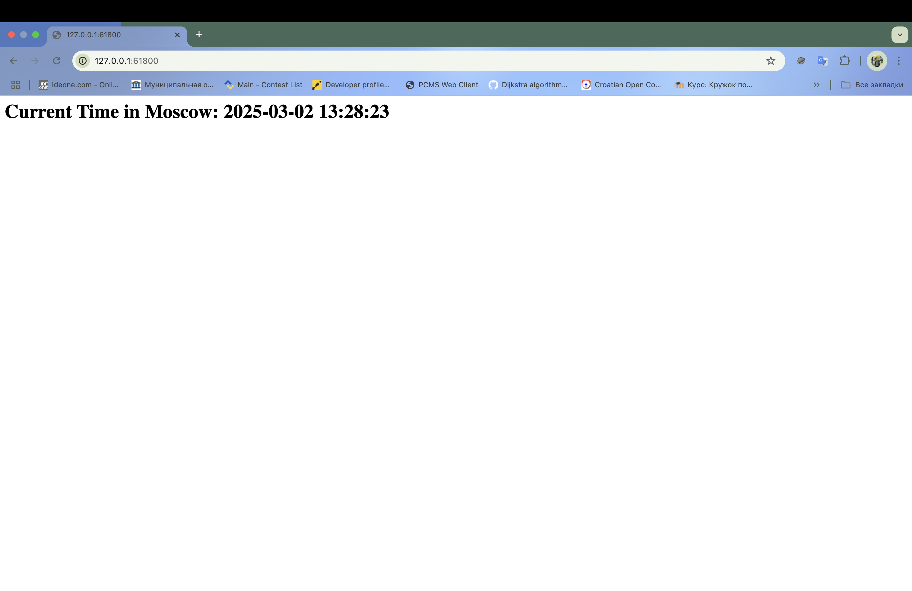

### Task 1

```commandline
demanzverev@MacBook-Pro-Deman k8s % minikube service my-app
|-----------|--------|-------------|--------------|
| NAMESPACE |  NAME  | TARGET PORT |     URL      |
|-----------|--------|-------------|--------------|
| default   | my-app |             | No node port |
|-----------|--------|-------------|--------------|
😿  service default/my-app has no node port
❗  Services [default/my-app] have type "ClusterIP" not meant to be exposed, however for local development minikube allows you to access this !
🏃  Starting tunnel for service my-app.
|-----------|--------|-------------|------------------------|
| NAMESPACE |  NAME  | TARGET PORT |          URL           |
|-----------|--------|-------------|------------------------|
| default   | my-app |             | http://127.0.0.1:61800 |
|-----------|--------|-------------|------------------------|
🎉  Opening service default/my-app in default browser...
❗  Because you are using a Docker driver on darwin, the terminal needs to be open to run it.
```



```commandline
NAME                             READY   STATUS    RESTARTS   AGE
pod/app-python-f58b856df-kqhjr   1/1     Running   0          66m
pod/app-python-f58b856df-m2rxn   1/1     Running   0          66m
pod/app-python-f58b856df-z5528   1/1     Running   0          66m
pod/my-app-65d8c4d4df-lr5jd      1/1     Running   0          4m39s

NAME                         TYPE        CLUSTER-IP       EXTERNAL-IP   PORT(S)        AGE
service/app-python-service   NodePort    10.107.249.210   <none>        80:31561/TCP   65m
service/kubernetes           ClusterIP   10.96.0.1        <none>        443/TCP        80m
service/my-app               ClusterIP   10.98.155.9      <none>        80/TCP         4m39s
```

### Task 2

```commandline
demanzverev@MacBook-Pro-Deman k8s % kubectl get po       
NAME                         READY   STATUS             RESTARTS      AGE
app-python-f58b856df-kqhjr   1/1     Running            0             83m
app-python-f58b856df-m2rxn   1/1     Running            0             83m
app-python-f58b856df-z5528   1/1     Running            0             83m
my-app-65d8c4d4df-nxjxw      1/1     Running            0             35s
postinstall-hook             0/1     Completed          0             35s
pre-install-pod              0/1     CrashLoopBackOff   5 (93s ago)   6m29s
preinstall-hook              0/1     Completed          0             57s
```

```commandline
demanzverev@MacBook-Pro-Deman k8s % kubectl describe po preinstall-hook       
Name:             preinstall-hook
Namespace:        default
Priority:         0
Service Account:  default
Node:             minikube/192.168.49.2
Start Time:       Sun, 02 Mar 2025 13:46:48 +0300
Labels:           <none>
Annotations:      helm.sh/hook: pre-install
Status:           Succeeded
IP:               10.244.0.10
IPs:
  IP:  10.244.0.10
Containers:
  pre-install-container:
    Container ID:  docker://fd014f2b5c9f67edc06fdd49764a1e538de57d89d6fa05144c978ab81148c118
    Image:         busybox
    Image ID:      docker-pullable://busybox@sha256:498a000f370d8c37927118ed80afe8adc38d1edcbfc071627d17b25c88efcab0
    Port:          <none>
    Host Port:     <none>
    Command:
      sh
      -c
      echo The pre-install hook is running && sleep 20
    State:          Terminated
      Reason:       Completed
      Exit Code:    0
      Started:      Sun, 02 Mar 2025 13:46:48 +0300
      Finished:     Sun, 02 Mar 2025 13:47:08 +0300
    Ready:          False
    Restart Count:  0
    Environment:    <none>
    Mounts:
      /var/run/secrets/kubernetes.io/serviceaccount from kube-api-access-kwxvh (ro)
Conditions:
  Type                        Status
  PodReadyToStartContainers   False 
  Initialized                 True 
  Ready                       False 
  ContainersReady             False 
  PodScheduled                True 
Volumes:
  kube-api-access-kwxvh:
    Type:                    Projected (a volume that contains injected data from multiple sources)
    TokenExpirationSeconds:  3607
    ConfigMapName:           kube-root-ca.crt
    ConfigMapOptional:       <nil>
    DownwardAPI:             true
QoS Class:                   BestEffort
Node-Selectors:              <none>
Tolerations:                 node.kubernetes.io/not-ready:NoExecute op=Exists for 300s
                             node.kubernetes.io/unreachable:NoExecute op=Exists for 300s
Events:
  Type    Reason     Age   From               Message
  ----    ------     ----  ----               -------
  Normal  Scheduled  108s  default-scheduler  Successfully assigned default/preinstall-hook to minikube
  Normal  Pulled     108s  kubelet            Container image "busybox" already present on machine
  Normal  Created    108s  kubelet            Created container: pre-install-container
  Normal  Started    108s  kubelet            Started container pre-install-container
```

```commandline
demanzverev@MacBook-Pro-Deman k8s % kubectl describe po postinstall-hook
Name:             postinstall-hook
Namespace:        default
Priority:         0
Service Account:  default
Node:             minikube/192.168.49.2
Start Time:       Sun, 02 Mar 2025 13:47:10 +0300
Labels:           <none>
Annotations:      helm.sh/hook: post-install
Status:           Succeeded
IP:               10.244.0.11
IPs:
  IP:  10.244.0.11
Containers:
  post-install-container:
    Container ID:  docker://cf4c68c0d5353a39e7053fcbcf2f54484e1e9ef782bdc5c544869aa9b5a3445c
    Image:         busybox
    Image ID:      docker-pullable://busybox@sha256:498a000f370d8c37927118ed80afe8adc38d1edcbfc071627d17b25c88efcab0
    Port:          <none>
    Host Port:     <none>
    Command:
      sh
      -c
      echo The post-install hook is running && sleep 15
    State:          Terminated
      Reason:       Completed
      Exit Code:    0
      Started:      Sun, 02 Mar 2025 13:47:12 +0300
      Finished:     Sun, 02 Mar 2025 13:47:27 +0300
    Ready:          False
    Restart Count:  0
    Environment:    <none>
    Mounts:
      /var/run/secrets/kubernetes.io/serviceaccount from kube-api-access-nkbxt (ro)
Conditions:
  Type                        Status
  PodReadyToStartContainers   False 
  Initialized                 True 
  Ready                       False 
  ContainersReady             False 
  PodScheduled                True 
Volumes:
  kube-api-access-nkbxt:
    Type:                    Projected (a volume that contains injected data from multiple sources)
    TokenExpirationSeconds:  3607
    ConfigMapName:           kube-root-ca.crt
    ConfigMapOptional:       <nil>
    DownwardAPI:             true
QoS Class:                   BestEffort
Node-Selectors:              <none>
Tolerations:                 node.kubernetes.io/not-ready:NoExecute op=Exists for 300s
                             node.kubernetes.io/unreachable:NoExecute op=Exists for 300s
Events:
  Type    Reason     Age   From               Message
  ----    ------     ----  ----               -------
  Normal  Scheduled  2m1s  default-scheduler  Successfully assigned default/postinstall-hook to minikube
  Normal  Pulling    2m    kubelet            Pulling image "busybox"
  Normal  Pulled     119s  kubelet            Successfully pulled image "busybox" in 1.7s (1.7s including waiting). Image size: 4042190 bytes.
  Normal  Created    119s  kubelet            Created container: post-install-container
  Normal  Started    119s  kubelet            Started container post-install-container
```

```commandline
kubectl get pods,svc
NAME                             READY   STATUS             RESTARTS      AGE
pod/app-python-f58b856df-kqhjr   1/1     Running            0             85m
pod/app-python-f58b856df-m2rxn   1/1     Running            0             85m
pod/app-python-f58b856df-z5528   1/1     Running            0             85m
pod/my-app-65d8c4d4df-nxjxw      1/1     Running            0             2m44s
pod/postinstall-hook             0/1     Completed          0             2m44s
pod/pre-install-pod              0/1     CrashLoopBackOff   6 (38s ago)   8m38s
pod/preinstall-hook              0/1     Completed          0             3m6s

NAME                         TYPE        CLUSTER-IP       EXTERNAL-IP   PORT(S)        AGE
service/app-python-service   NodePort    10.107.249.210   <none>        80:31561/TCP   84m
service/kubernetes           ClusterIP   10.96.0.1        <none>        443/TCP        99m
service/my-app               ClusterIP   10.98.115.179    <none>        80/TCP         2m44s
```

Result after adding hook delete policy: 

```commandline
demanzverev@MacBook-Pro-Deman k8s % helm uninstall my-app              
helm install my-app ./my-app
release "my-app" uninstalled
W0302 13:56:02.123324   17976 warnings.go:70] unknown field "spec.template.spec.containers[0].resources.httpGet"
NAME: my-app
LAST DEPLOYED: Sun Mar  2 13:55:39 2025
NAMESPACE: default
STATUS: deployed
REVISION: 1
NOTES:
1. Get the application URL by running these commands:
  export POD_NAME=$(kubectl get pods --namespace default -l "app.kubernetes.io/name=my-app,app.kubernetes.io/instance=my-app" -o jsonpath="{.items[0].metadata.name}")
  export CONTAINER_PORT=$(kubectl get pod --namespace default $POD_NAME -o jsonpath="{.spec.containers[0].ports[0].containerPort}")
  echo "Visit http://127.0.0.1:8080 to use your application"
  kubectl --namespace default port-forward $POD_NAME 8080:$CONTAINER_PORT
demanzverev@MacBook-Pro-Deman k8s % kubectl get pods                   
NAME                         READY   STATUS             RESTARTS       AGE
app-python-f58b856df-kqhjr   1/1     Running            0              91m
app-python-f58b856df-m2rxn   1/1     Running            0              91m
app-python-f58b856df-z5528   1/1     Running            0              91m
my-app-65d8c4d4df-6zz5v      1/1     Running            0              23s
pre-install-pod              0/1     CrashLoopBackOff   7 (100s ago)   15m
demanzverev@MacBook-Pro-Deman k8s % 

```