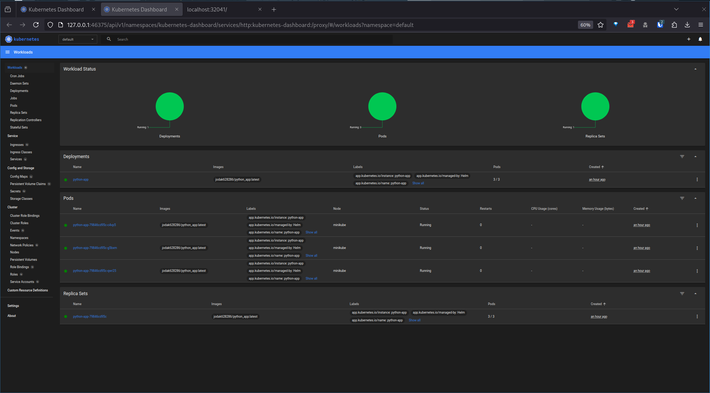

# Helm Deployment

## Chart creation

### workloads on dashboard



### `kubectl get pods,svc output`

```bash
NAME                              READY   STATUS    RESTARTS   AGE
pod/python-app-79846cd95c-c4vp5   1/1     Running   0          96m
pod/python-app-79846cd95c-g5bxm   1/1     Running   0          96m
pod/python-app-79846cd95c-qwr25   1/1     Running   0          96m

NAME                 TYPE        CLUSTER-IP       EXTERNAL-IP   PORT(S)          AGE
service/kubernetes   ClusterIP   10.96.0.1        <none>        443/TCP          3h13m
service/python-app   NodePort    10.102.220.142   <none>        8080:32041/TCP   96m
```
## Chart hooks

### Hook Implementation

Implemented two hooks: pre-install and post-install.
Both of them print messages and sleep for 10 seconds.

Both hooks use the `hook-succeeded` delete policy to clean up automatically after successful execution (not present in the following outputs since added them at step 5).

### Outputs

`kubectl get po`

```bash
NAME                                     READY   STATUS      RESTARTS   AGE
helm-hooks-post-install-hook             0/1     Completed   0          56s
helm-hooks-pre-install-hook              0/1     Completed   0          99s
helm-hooks-python-app-774897fd5d-bxtj8   1/1     Running     0          56s
helm-hooks-python-app-774897fd5d-ssmdq   1/1     Running     0          56s
helm-hooks-python-app-774897fd5d-v5kvm   1/1     Running     0          56s
```

`kubectl describe po helm-hooks-pre-install-hook`

```bash
Name:             helm-hooks-pre-install-hook
Namespace:        default
Priority:         0
Service Account:  default
Node:             minikube/192.168.49.2
Start Time:       Sun, 09 Mar 2025 16:56:04 +0000
Labels:           <none>
Annotations:      helm.sh/hook: pre-install
                  helm.sh/hook-weight: -5
Status:           Succeeded
IP:               10.244.0.34
IPs:
  IP:  10.244.0.34
Containers:
  pre-install-job:
    Container ID:  docker://fd42e40cbc4bbc75ece9711b1c4018fce25e5cc935e8a82f25d579add9810ece
    Image:         busybox
    Image ID:      docker-pullable://busybox@sha256:498a000f370d8c37927118ed80afe8adc38d1edcbfc071627d17b25c88efcab0
    Port:          <none>
    Host Port:     <none>
    Command:
      sh
      -c
      echo "Pre-install hook starting" && sleep 10 && echo "Pre-install hook complete"
    State:          Terminated
      Reason:       Completed
      Exit Code:    0
      Started:      Sun, 09 Mar 2025 16:56:28 +0000
      Finished:     Sun, 09 Mar 2025 16:56:39 +0000
    Ready:          False
    Restart Count:  0
    Environment:    <none>
    Mounts:
      /var/run/secrets/kubernetes.io/serviceaccount from kube-api-access-258vp (ro)
Conditions:
  Type                        Status
  PodReadyToStartContainers   False 
  Initialized                 True 
  Ready                       False 
  ContainersReady             False 
  PodScheduled                True 
Volumes:
  kube-api-access-258vp:
    Type:                    Projected (a volume that contains injected data from multiple sources)
    TokenExpirationSeconds:  3607
    ConfigMapName:           kube-root-ca.crt
    ConfigMapOptional:       <nil>
    DownwardAPI:             true
QoS Class:                   BestEffort
Node-Selectors:              <none>
Tolerations:                 node.kubernetes.io/not-ready:NoExecute op=Exists for 300s
                             node.kubernetes.io/unreachable:NoExecute op=Exists for 300s
Events:
  Type    Reason     Age    From               Message
  ----    ------     ----   ----               -------
  Normal  Scheduled  2m19s  default-scheduler  Successfully assigned default/helm-hooks-pre-install-hook to minikube
  Normal  Pulling    2m     kubelet            Pulling image "busybox"
  Normal  Pulled     115s   kubelet            Successfully pulled image "busybox" in 5.22s (5.22s including waiting). Image size: 4269694 bytes.
  Normal  Created    115s   kubelet            Created container: pre-install-job
  Normal  Started    113s   kubelet            Started container pre-install-job
```

`kubectl describe po helm-hooks-post-install-hook`

```bash
Name:             helm-hooks-post-install-hook
Namespace:        default
Priority:         0
Service Account:  default
Node:             minikube/192.168.49.2
Start Time:       Sun, 09 Mar 2025 16:56:46 +0000
Labels:           <none>
Annotations:      helm.sh/hook: post-install
                  helm.sh/hook-weight: 5
Status:           Succeeded
IP:               10.244.0.38
IPs:
  IP:  10.244.0.38
Containers:
  post-install-job:
    Container ID:  docker://a68e81cca42f7f70df26e8e6f6d92d84dd3d62531f29bf7763a6cd6fdeab5bae
    Image:         busybox
    Image ID:      docker-pullable://busybox@sha256:498a000f370d8c37927118ed80afe8adc38d1edcbfc071627d17b25c88efcab0
    Port:          <none>
    Host Port:     <none>
    Command:
      sh
      -c
      echo "Post-install hook starting" && sleep 10 && echo "Post-install hook complete"
    State:          Terminated
      Reason:       Completed
      Exit Code:    0
      Started:      Sun, 09 Mar 2025 16:57:01 +0000
      Finished:     Sun, 09 Mar 2025 16:57:12 +0000
    Ready:          False
    Restart Count:  0
    Environment:    <none>
    Mounts:
      /var/run/secrets/kubernetes.io/serviceaccount from kube-api-access-5qcll (ro)
Conditions:
  Type                        Status
  PodReadyToStartContainers   False 
  Initialized                 True 
  Ready                       False 
  ContainersReady             False 
  PodScheduled                True 
Volumes:
  kube-api-access-5qcll:
    Type:                    Projected (a volume that contains injected data from multiple sources)
    TokenExpirationSeconds:  3607
    ConfigMapName:           kube-root-ca.crt
    ConfigMapOptional:       <nil>
    DownwardAPI:             true
QoS Class:                   BestEffort
Node-Selectors:              <none>
Tolerations:                 node.kubernetes.io/not-ready:NoExecute op=Exists for 300s
                             node.kubernetes.io/unreachable:NoExecute op=Exists for 300s
Events:
  Type    Reason     Age   From               Message
  ----    ------     ----  ----               -------
  Normal  Scheduled  2m1s  default-scheduler  Successfully assigned default/helm-hooks-post-install-hook to minikube
  Normal  Pulling    110s  kubelet            Pulling image "busybox"
  Normal  Pulled     108s  kubelet            Successfully pulled image "busybox" in 2.2s (2.2s including waiting). Image size: 4269694 bytes.
  Normal  Created    106s  kubelet            Created container: post-install-job
  Normal  Started    106s  kubelet            Started container post-install-job
```

