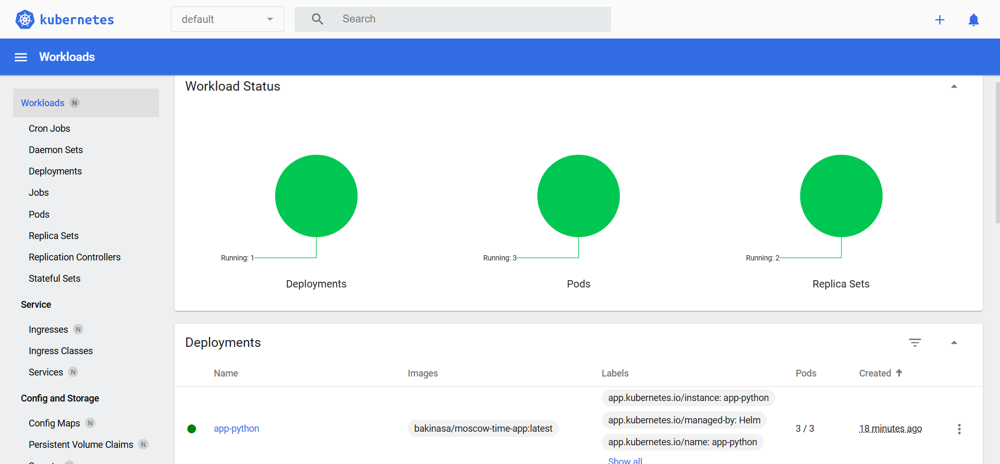

# **Helm Lab Report**

## **Task 1: Helm Setup and Chart Creation**

### **Helm Upgrade Execution**

```sh
C:\Users\bakin\PycharmProjects\S25-devops-engineering-labs\k8s> helm upgrade app-python ./app-python
```

**Output:**

```plaintext
Release "app-python" has been upgraded. Happy Helming!
NAME: app-python
LAST DEPLOYED: Mon Mar 2 23:12:20 2025
NAMESPACE: default
STATUS: deployed
REVISION: 2
```

### **Checking Running Pods**

```sh
kubectl get pods
```

**Output:**

```plaintext
NAME                          READY   STATUS    RESTARTS   AGE
app-python-6c6b6cdff8-bntm4   1/1     Running   0          12m
app-python-6c6b6cdff8-bxf74   1/1     Running   0          40s
app-python-6c6b6cdff8-pp78g   1/1     Running   0          40s
```

### **Checking Services**

```sh
kubectl get svc
```

**Output:**

```plaintext
NAME         TYPE        CLUSTER-IP      EXTERNAL-IP   PORT(S)        AGE
app-python   NodePort    10.104.220.38           80:30741/TCP   18m
kubernetes   ClusterIP   10.96.0.1               443/TCP        22m
```

### **Minikube Dashboard Launch**

```sh
minikube dashboard
```

**Output:**

```plaintext
* Enabling dashboard ...
  - Using image docker.io/kubernetesui/metrics-scraper:v1.0.8
  - Using image docker.io/kubernetesui/dashboard:v2.7.0
```

**Screenshot:**


---

## **Task 2: Helm Chart Hooks**

### **Helm Lint Check**

```sh
helm lint app-python
```

**Output:**

```plaintext
==> Linting app-python
[INFO] Chart.yaml: icon is recommended

1 chart(s) linted, 0 chart(s) failed
```

### **Checking Jobs Execution**

```sh
kubectl get jobs
```

**Output:**

```plaintext
NAME                      STATUS     COMPLETIONS   DURATION   AGE
app-python-post-install   Complete   1/1           26s        8m23s
app-python-pre-install    Complete   1/1           25s        8m48s
```

### **Dry-Run Helm Hooks Execution**

```sh
helm install --dry-run helm-hooks ./app-python
```

**Output (Snippet):**

```plaintext
PS C:\Users\bakin\PycharmProjects\S25-devops-engineering-labs\k8s> helm install --dry-run helm-hooks ./app-python
NAME: helm-hooks
LAST DEPLOYED: Mon Mar  3 02:32:20 2025
NAMESPACE: default
STATUS: pending-install
REVISION: 1
HOOKS:
---
# Source: app-python/templates/tests/test-connection.yaml
apiVersion: v1
kind: Pod
metadata:
  name: "helm-hooks-app-python-test-connection"
  labels:
    helm.sh/chart: app-python-0.1.0
    app.kubernetes.io/name: app-python
    app.kubernetes.io/instance: helm-hooks
    app.kubernetes.io/version: "1.16.0"
    app.kubernetes.io/managed-by: Helm
  annotations:
    "helm.sh/hook": test
spec:
  containers:
    - name: wget
      image: busybox
      command: ['wget']
      args: ['helm-hooks-app-python:80']
  restartPolicy: Never
---
# Source: app-python/templates/post-install-hook.yaml
apiVersion: batch/v1
kind: Job
metadata:
  name: "helm-hooks-post-install"
  labels:
    app: "helm-hooks"
  annotations:
    "helm.sh/hook": post-install
    "helm.sh/hook-delete-policy": hook-succeeded
spec:
  template:
    spec:
      containers:
      - name: post-install
        image: busybox
        command: ['sh', '-c', 'echo Post-install hook executed; sleep 20']
      restartPolicy: Never
---
# Source: app-python/templates/pre-install-hook.yaml
apiVersion: batch/v1
kind: Job
metadata:
  name: "helm-hooks-pre-install"
  labels:
    app: "helm-hooks"
  annotations:
    "helm.sh/hook": pre-install
    "helm.sh/hook-delete-policy": hook-succeeded
spec:
  template:
    spec:
      containers:
      - name: pre-install
        image: busybox
        command: ['sh', '-c', 'echo Pre-install hook executed; sleep 20']
      restartPolicy: Never
MANIFEST:
---
# Source: app-python/templates/serviceaccount.yaml
apiVersion: v1
kind: ServiceAccount
metadata:
  name: helm-hooks-app-python
  labels:
    helm.sh/chart: app-python-0.1.0
    app.kubernetes.io/name: app-python
    app.kubernetes.io/instance: helm-hooks
    app.kubernetes.io/version: "1.16.0"
    app.kubernetes.io/managed-by: Helm
automountServiceAccountToken: true
---
# Source: app-python/templates/service.yaml
apiVersion: v1
kind: Service
metadata:
  name: helm-hooks-app-python
  labels:
    helm.sh/chart: app-python-0.1.0
    app.kubernetes.io/name: app-python
    app.kubernetes.io/instance: helm-hooks
    app.kubernetes.io/version: "1.16.0"
    app.kubernetes.io/managed-by: Helm
spec:
  type: NodePort
  ports:
    - port: 80
      targetPort: http
      protocol: TCP
      name: http
  selector:
    app.kubernetes.io/name: app-python
    app.kubernetes.io/instance: helm-hooks
---
# Source: app-python/templates/deployment.yaml
apiVersion: apps/v1
kind: Deployment
metadata:
  name: helm-hooks-app-python
  labels:
    helm.sh/chart: app-python-0.1.0
    app.kubernetes.io/name: app-python
    app.kubernetes.io/instance: helm-hooks
    app.kubernetes.io/version: "1.16.0"
    app.kubernetes.io/managed-by: Helm
spec:
  replicas: 3
  selector:
    matchLabels:
      app.kubernetes.io/name: app-python
      app.kubernetes.io/instance: helm-hooks
  template:
    metadata:
      labels:
        helm.sh/chart: app-python-0.1.0
        app.kubernetes.io/name: app-python
        app.kubernetes.io/instance: helm-hooks
        app.kubernetes.io/version: "1.16.0"
        app.kubernetes.io/managed-by: Helm
    spec:
      serviceAccountName: helm-hooks-app-python
      containers:
        - name: app-python
          image: "bakinasa/moscow-time-app:latest"
          imagePullPolicy: IfNotPresent
          ports:
            - name: http
              containerPort: 80
              protocol: TCP

NOTES:
1. Get the application URL by running these commands:
  export NODE_PORT=$(kubectl get --namespace default -o jsonpath="{.spec.ports[0].nodePort}" services helm-hooks-app-python)
  export NODE_IP=$(kubectl get nodes --namespace default -o jsonpath="{.items[0].status.addresses[0].address}")
  echo http://$NODE_IP:$NODE_PORT

```

### **Troubleshooting Hooks**

```sh
kubectl get po
```

**Output:**

```plaintext
NAME                            READY   STATUS      RESTARTS   AGE
app-python-6c6b6cdff8-4hpg7     1/1     Running     0          10m
app-python-6c6b6cdff8-fznhm     1/1     Running     0          10m
app-python-6c6b6cdff8-n5npn     1/1     Running     0          10m
app-python-post-install-q79sc   0/1     Completed   0          10m
app-python-pre-install-bp8gb    0/1     Completed   0          11m
```

### **Describing Pre-Install Hook Job**

```sh
kubectl describe job app-python-pre-install
```

**Output (Snippet):**

```plaintext
C:\Users\bakin\PycharmProjects\S25-devops-engineering-labs\k8s>kubectl describe job app-python-pre-install
Name:             app-python-pre-install
Namespace:        default
Selector:         batch.kubernetes.io/controller-uid=717e6926-eda7-4393-a90b-b5237125482e
Labels:           app=app-python
Annotations:      helm.sh/hook: pre-install
Parallelism:      1
Completions:      1
Completion Mode:  NonIndexed
Start Time:       Mon, 03 Mar 2025 02:45:59 +0300
Completed At:     Mon, 03 Mar 2025 02:46:24 +0300
Duration:         25s
Pods Statuses:    0 Active (0 Ready) / 1 Succeeded / 0 Failed
Pod Template:
  Labels:  batch.kubernetes.io/controller-uid=717e6926-eda7-4393-a90b-b5237125482e
           batch.kubernetes.io/job-name=app-python-pre-install
           controller-uid=717e6926-eda7-4393-a90b-b5237125482e
           job-name=app-python-pre-install
  Containers:
   pre-install:
    Image:      busybox
    Port:       <none>
    Host Port:  <none>
    Command:
      sh
      -c
      echo Pre-install hook executed; sleep 20
    Environment:  <none>
    Mounts:       <none>
  Volumes:        <none>
Events:
  Type    Reason            Age   From            Message
  ----    ------            ----  ----            -------
  Normal  SuccessfulCreate  12m   job-controller  Created pod: app-python-pre-install-bp8gb
  Normal  Completed         12m   job-controller  Job completed
```

### **Describing Post-Install Hook Job**

```sh
kubectl describe job app-python-post-install
```

**Output (Snippet):**

```plaintext
C:\Users\bakin\PycharmProjects\S25-devops-engineering-labs\k8s>kubectl describe job app-python-post-install
Name:             app-python-post-install
Namespace:        default
Selector:         batch.kubernetes.io/controller-uid=bee718fa-28ec-4d79-acbc-c5feb3db8e5a
Labels:           app=app-python
Annotations:      helm.sh/hook: post-install
Parallelism:      1
Completions:      1
Completion Mode:  NonIndexed
Start Time:       Mon, 03 Mar 2025 02:46:24 +0300
Completed At:     Mon, 03 Mar 2025 02:46:50 +0300
Duration:         26s
Pods Statuses:    0 Active (0 Ready) / 1 Succeeded / 0 Failed
Pod Template:
  Labels:  batch.kubernetes.io/controller-uid=bee718fa-28ec-4d79-acbc-c5feb3db8e5a
           batch.kubernetes.io/job-name=app-python-post-install
           controller-uid=bee718fa-28ec-4d79-acbc-c5feb3db8e5a
           job-name=app-python-post-install
  Containers:
   post-install:
    Image:      busybox
    Port:       <none>
    Host Port:  <none>
    Command:
      sh
      -c
      echo Post-install hook executed; sleep 20
    Environment:  <none>
    Mounts:       <none>
  Volumes:        <none>
Events:
  Type    Reason            Age   From            Message
  ----    ------            ----  ----            -------
  Normal  SuccessfulCreate  12m   job-controller  Created pod: app-python-post-install-q79sc
  Normal  Completed         12m   job-controller  Job completed

```

### **Hook Delete Policy**
Hooks were configured to be removed after successful execution:
```yaml
annotations:
  "helm.sh/hook-delete-policy": hook-succeeded
```
