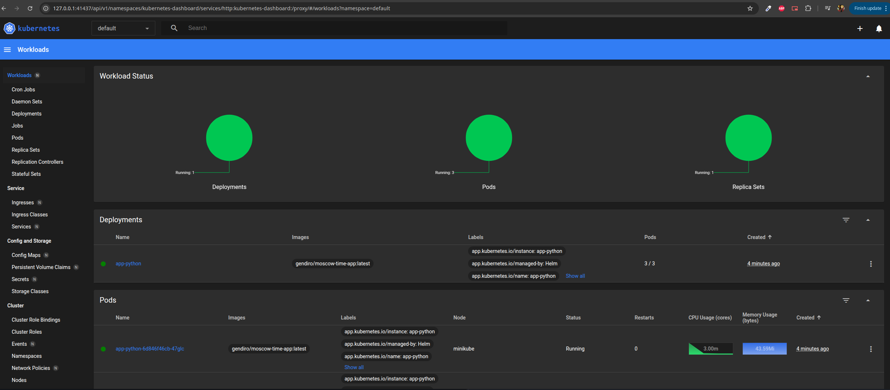
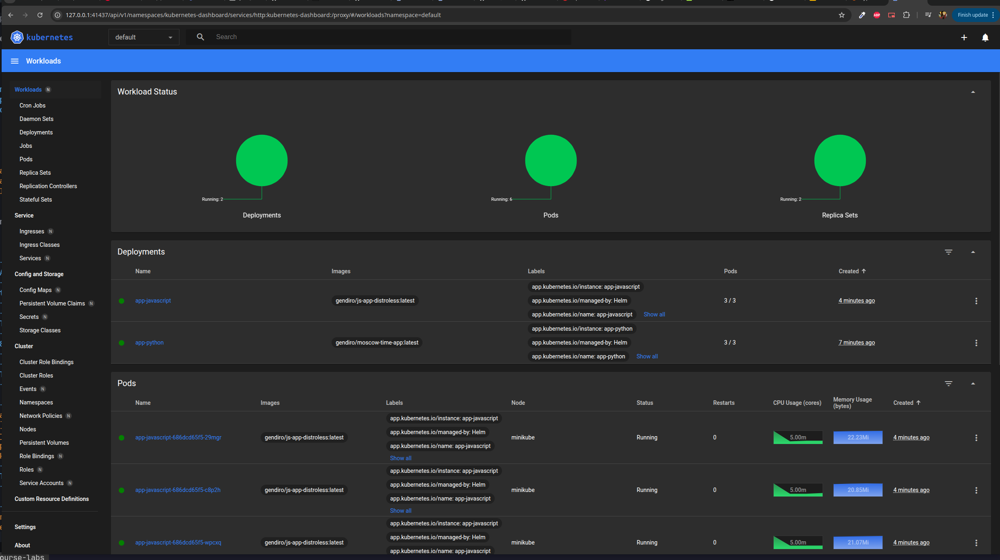

# HELM

## Task 1

Creating the application for the first time like this:

```bash
❯ helm create app-python
Creating app-python
```

Then we update the values in the `values.yaml` (e.g. upping the number of replicas to 3, changing service type to `LoadBalancer`, specifying image/port, etc)
and run the `helm install`:

```bash
❯ helm install app-python ./app-python
NAME: app-python
LAST DEPLOYED: Thu Feb 27 03:48:40 2025
NAMESPACE: default
STATUS: deployed
REVISION: 1
NOTES:
1. Get the application URL by running these commands:
  http://moscow-time-app.local/
```

We can check that we did everything correctly either in the kubernetes dashboard:



That means that we can run it with `minikube service app-python`:

```bash
❯ minikube service app-python
|-----------|------------|-------------|---------------------------|
| NAMESPACE |    NAME    | TARGET PORT |            URL            |
|-----------|------------|-------------|---------------------------|
| default   | app-python | http/8000   | http://192.168.49.2:32137 |
|-----------|------------|-------------|---------------------------|
🎉  Opening service default/app-python in default browser...
```
(The application was opened in browser afterwards).

And we can further check it with:

```bash
❯ kubectl get pods,svc
NAME                              READY   STATUS    RESTARTS   AGE
pod/app-python-6d846f46cb-47glc   1/1     Running   0          8m11s
pod/app-python-6d846f46cb-55r65   1/1     Running   0          8m11s
pod/app-python-6d846f46cb-lgg96   1/1     Running   0          8m11s

NAME                 TYPE           CLUSTER-IP      EXTERNAL-IP   PORT(S)          AGE
service/app-python   LoadBalancer   10.103.63.196   <pending>     8000:32137/TCP   8m11s
service/kubernetes   ClusterIP      10.96.0.1       <none>        443/TCP          9h
```

## Task 2

### Linting

First we lint to make sure that everything is fine:

```bash
❯ helm lint app-python
==> Linting app-python
[INFO] Chart.yaml: icon is recommended

1 chart(s) linted, 0 chart(s) failed
```

### Adding hooks

Then I added files `pre-install-hook.yaml` and `post-install-hook.yaml` to the templates folder of the helm directory.
To make sure that they've been properly added we can do this:

```bash
❯ helm install --dry-run helm-hooks app-python
NAME: helm-hooks
LAST DEPLOYED: Thu Feb 27 04:31:13 2025
NAMESPACE: default
STATUS: pending-install
REVISION: 1
HOOKS:
---
# Source: app-python/templates/post-install-hook.yaml
apiVersion: v1
kind: Pod
metadata:
   name: postinstall-hook
   annotations:
       "helm.sh/hook": "post-install"
spec:
  containers:
  - name: post-install-container
    image: busybox
    imagePullPolicy: Always
    command: ['sh', '-c', 'echo The post-install hook is running && sleep 15' ]
  restartPolicy: Never
  terminationGracePeriodSeconds: 0
---
# Source: app-python/templates/pre-install-hook.yaml
apiVersion: v1
kind: Pod
metadata:
   name: preinstall-hook
   annotations:
       "helm.sh/hook": "pre-install"
spec:
  containers:
  - name: pre-install-container
    image: busybox
    imagePullPolicy: IfNotPresent
    command: ['sh', '-c', 'echo The pre-install hook is running && sleep 20' ]
  restartPolicy: Never
  terminationGracePeriodSeconds: 0
---
# Source: app-python/templates/tests/test-connection.yaml
apiVersion: v1
kind: Pod
metadata:
  name: "helm-hooks-app-python-test-connection"
  labels:
    helm.sh/chart: app-python-0.1.0
    app.kubernetes.io/name: app-python
    app.kubernetes.io/instance: helm-hooks
    app.kubernetes.io/version: "1.16.0"
    app.kubernetes.io/managed-by: Helm
  annotations:
    "helm.sh/hook": test
spec:
  containers:
    - name: wget
      image: busybox
      command: ['wget']
      args: ['helm-hooks-app-python:8000']
  restartPolicy: Never
MANIFEST:
---
# Source: app-python/templates/serviceaccount.yaml
apiVersion: v1
kind: ServiceAccount
metadata:
  name: helm-hooks-app-python
  labels:
    helm.sh/chart: app-python-0.1.0
    app.kubernetes.io/name: app-python
    app.kubernetes.io/instance: helm-hooks
    app.kubernetes.io/version: "1.16.0"
    app.kubernetes.io/managed-by: Helm
automountServiceAccountToken: true
---
# Source: app-python/templates/service.yaml
apiVersion: v1
kind: Service
metadata:
  name: helm-hooks-app-python
  labels:
    helm.sh/chart: app-python-0.1.0
    app.kubernetes.io/name: app-python
    app.kubernetes.io/instance: helm-hooks
    app.kubernetes.io/version: "1.16.0"
    app.kubernetes.io/managed-by: Helm
spec:
  type: LoadBalancer
  ports:
    - port: 8000
      targetPort: http
      protocol: TCP
      name: http
  selector:
    app.kubernetes.io/name: app-python
    app.kubernetes.io/instance: helm-hooks
---
# Source: app-python/templates/deployment.yaml
apiVersion: apps/v1
kind: Deployment
metadata:
  name: helm-hooks-app-python
  labels:
    helm.sh/chart: app-python-0.1.0
    app.kubernetes.io/name: app-python
    app.kubernetes.io/instance: helm-hooks
    app.kubernetes.io/version: "1.16.0"
    app.kubernetes.io/managed-by: Helm
spec:
  replicas: 3
  selector:
    matchLabels:
      app.kubernetes.io/name: app-python
      app.kubernetes.io/instance: helm-hooks
  template:
    metadata:
      labels:
        helm.sh/chart: app-python-0.1.0
        app.kubernetes.io/name: app-python
        app.kubernetes.io/instance: helm-hooks
        app.kubernetes.io/version: "1.16.0"
        app.kubernetes.io/managed-by: Helm
    spec:
      serviceAccountName: helm-hooks-app-python
      containers:
        - name: app-python
          image: "gendiro/moscow-time-app:latest"
          imagePullPolicy: IfNotPresent
          ports:
            - name: http
              containerPort: 8000
              protocol: TCP
          livenessProbe:
            httpGet:
              path: /
              port: http
          readinessProbe:
            httpGet:
              path: /
              port: http
---
# Source: app-python/templates/ingress.yaml
apiVersion: networking.k8s.io/v1
kind: Ingress
metadata:
  name: helm-hooks-app-python
  labels:
    helm.sh/chart: app-python-0.1.0
    app.kubernetes.io/name: app-python
    app.kubernetes.io/instance: helm-hooks
    app.kubernetes.io/version: "1.16.0"
    app.kubernetes.io/managed-by: Helm
  annotations:
    nginx.ingress.kubernetes.io/rewrite-target: /
spec:
  ingressClassName: nginx
  rules:
    - host: "moscow-time-app.local"
      http:
        paths:
          - path: /
            pathType: Prefix
            backend:
              service:
                name: helm-hooks-app-python
                port:
                  number: 8000

NOTES:
1. Get the application URL by running these commands:
  http://moscow-time-app.local/
```

Then we can actaully (re-)run it to add the hooks.
After that we can see that we have hooks in the `kubectl get po` list:

```bash
❯ kubectl get po
NAME                          READY   STATUS      RESTARTS   AGE
app-python-6d846f46cb-6khl5   1/1     Running     0          18s
app-python-6d846f46cb-92q88   1/1     Running     0          18s
app-python-6d846f46cb-f2qbb   1/1     Running     0          18s
postinstall-hook              0/1     Completed   0          18s
preinstall-hook               0/1     Completed   0          41s
```

### Description of hooks

And here are the more detailed description of those hooks:

```bash
❯ kubectl describe po preinstall-hook
Name:             preinstall-hook
Namespace:        default
Priority:         0
Service Account:  default
Node:             minikube/192.168.49.2
Start Time:       Thu, 27 Feb 2025 04:40:44 +0300
Labels:           <none>
Annotations:      helm.sh/hook: pre-install
Status:           Succeeded
IP:               10.244.0.38
IPs:
  IP:  10.244.0.38
Containers:
  pre-install-container:
    Container ID:  docker://1237cd7f96271af9c7164e417116d3d12935da2ed4e084f2ba9834ec06084970
    Image:         busybox
    Image ID:      docker-pullable://busybox@sha256:498a000f370d8c37927118ed80afe8adc38d1edcbfc071627d17b25c88efcab0
    Port:          <none>
    Host Port:     <none>
    Command:
      sh
      -c
      echo The pre-install hook is running && sleep 20
    State:          Terminated
      Reason:       Completed
      Exit Code:    0
      Started:      Thu, 27 Feb 2025 04:40:45 +0300
      Finished:     Thu, 27 Feb 2025 04:41:05 +0300
    Ready:          False
    Restart Count:  0
    Environment:    <none>
    Mounts:
      /var/run/secrets/kubernetes.io/serviceaccount from kube-api-access-cwmkb (ro)
Conditions:
  Type                        Status
  PodReadyToStartContainers   False
  Initialized                 True
  Ready                       False
  ContainersReady             False
  PodScheduled                True
Volumes:
  kube-api-access-cwmkb:
    Type:                    Projected (a volume that contains injected data from multiple sources)
    TokenExpirationSeconds:  3607
    ConfigMapName:           kube-root-ca.crt
    ConfigMapOptional:       <nil>
    DownwardAPI:             true
QoS Class:                   BestEffort
Node-Selectors:              <none>
Tolerations:                 node.kubernetes.io/not-ready:NoExecute op=Exists for 300s
                             node.kubernetes.io/unreachable:NoExecute op=Exists for 300s
Events:
  Type    Reason     Age   From               Message
  ----    ------     ----  ----               -------
  Normal  Scheduled  94s   default-scheduler  Successfully assigned default/preinstall-hook to minikube
  Normal  Pulled     93s   kubelet            Container image "busybox" already present on machine
  Normal  Created    93s   kubelet            Created container: pre-install-container
  Normal  Started    93s   kubelet            Started container pre-install-container
```

And postinstall:

```bash
❯ kubectl describe po postinstall-hook
Name:             postinstall-hook
Namespace:        default
Priority:         0
Service Account:  default
Node:             minikube/192.168.49.2
Start Time:       Thu, 27 Feb 2025 04:41:07 +0300
Labels:           <none>
Annotations:      helm.sh/hook: post-install
Status:           Succeeded
IP:               10.244.0.42
IPs:
  IP:  10.244.0.42
Containers:
  post-install-container:
    Container ID:  docker://52c8eb6a48dfafa666cb6d690233d785cb6ef6337de2c521b7e8fdd1e2531d0c
    Image:         busybox
    Image ID:      docker-pullable://busybox@sha256:498a000f370d8c37927118ed80afe8adc38d1edcbfc071627d17b25c88efcab0
    Port:          <none>
    Host Port:     <none>
    Command:
      sh
      -c
      echo The post-install hook is running && sleep 15
    State:          Terminated
      Reason:       Completed
      Exit Code:    0
      Started:      Thu, 27 Feb 2025 04:41:09 +0300
      Finished:     Thu, 27 Feb 2025 04:41:24 +0300
    Ready:          False
    Restart Count:  0
    Environment:    <none>
    Mounts:
      /var/run/secrets/kubernetes.io/serviceaccount from kube-api-access-292s4 (ro)
Conditions:
  Type                        Status
  PodReadyToStartContainers   False
  Initialized                 True
  Ready                       False
  ContainersReady             False
  PodScheduled                True
Volumes:
  kube-api-access-292s4:
    Type:                    Projected (a volume that contains injected data from multiple sources)
    TokenExpirationSeconds:  3607
    ConfigMapName:           kube-root-ca.crt
    ConfigMapOptional:       <nil>
    DownwardAPI:             true
QoS Class:                   BestEffort
Node-Selectors:              <none>
Tolerations:                 node.kubernetes.io/not-ready:NoExecute op=Exists for 300s
                             node.kubernetes.io/unreachable:NoExecute op=Exists for 300s
Events:
  Type    Reason     Age   From               Message
  ----    ------     ----  ----               -------
  Normal  Scheduled  101s  default-scheduler  Successfully assigned default/postinstall-hook to minikube
  Normal  Pulling    100s  kubelet            Pulling image "busybox"
  Normal  Pulled     99s   kubelet            Successfully pulled image "busybox" in 1.436s (1.436s including waiting). Image size: 4269678 bytes.
  Normal  Created    99s   kubelet            Created container: post-install-container
  Normal  Started    99s   kubelet            Started container post-install-container
```

### Delete policy

Just adding the `"helm.sh/hook-delete-policy": "hook-succeeded"` to `annotations` of the hooks files mentioned above is all it takes to add the
delete policy to them.

After that we can see that there are no hooks after install:

```bash
❯ kubectl get pods,svc
NAME                              READY   STATUS    RESTARTS   AGE
pod/app-python-6d846f46cb-6c9s6   1/1     Running   0          31s
pod/app-python-6d846f46cb-dfd7d   1/1     Running   0          31s
pod/app-python-6d846f46cb-hhm77   1/1     Running   0          31s

NAME                 TYPE           CLUSTER-IP       EXTERNAL-IP   PORT(S)          AGE
service/app-python   LoadBalancer   10.104.204.220   <pending>     8000:31530/TCP   31s
service/kubernetes   ClusterIP      10.96.0.1        <none>        443/TCP          10h
```

## Bonus Task

### Javascript Application Chart

Adding the helm to the javascript app is almost identical to the python one:

```bash
❯ helm create app-javascript
Creating app-javascript
```

Adding the same parameters to the `values.yml` and same hooks as python app, then `install`, and so we get following:

```bash
❯ kubectl get pods,svc
NAME                                  READY   STATUS    RESTARTS   AGE
pod/app-javascript-686dcd65f5-29mgr   1/1     Running   0          30s
pod/app-javascript-686dcd65f5-c8p2h   1/1     Running   0          30s
pod/app-javascript-686dcd65f5-wpcxq   1/1     Running   0          30s
pod/app-python-6d846f46cb-4hdgl       1/1     Running   0          4m4s
pod/app-python-6d846f46cb-8gzgm       1/1     Running   0          4m4s
pod/app-python-6d846f46cb-vsfjt       1/1     Running   0          4m4s

NAME                     TYPE           CLUSTER-IP       EXTERNAL-IP   PORT(S)          AGE
service/app-javascript   LoadBalancer   10.103.54.212    <pending>     3000:31755/TCP   30s
service/app-python       LoadBalancer   10.105.235.123   <pending>     8000:31258/TCP   4m4s
service/kubernetes       ClusterIP      10.96.0.1        <none>        443/TCP          10h
```

and we can test it further by running: 

```bash
❯ minikube service --all
|-----------|----------------|-------------|---------------------------|
| NAMESPACE |      NAME      | TARGET PORT |            URL            |
|-----------|----------------|-------------|---------------------------|
| default   | app-javascript | http/3000   | http://192.168.49.2:31755 |
|-----------|----------------|-------------|---------------------------|
|-----------|------------|-------------|---------------------------|
| NAMESPACE |    NAME    | TARGET PORT |            URL            |
|-----------|------------|-------------|---------------------------|
| default   | app-python | http/8000   | http://192.168.49.2:31258 |
|-----------|------------|-------------|---------------------------|
|-----------|------------|-------------|--------------|
| NAMESPACE |    NAME    | TARGET PORT |     URL      |
|-----------|------------|-------------|--------------|
| default   | kubernetes |             | No node port |
|-----------|------------|-------------|--------------|
😿  service default/kubernetes has no node port
❗  Services [default/kubernetes] have type "ClusterIP" not meant to be exposed, however for local development minikube allows you to access this !
🎉  Opening service default/app-javascript in default browser...
🎉  Opening service default/app-python in default browser...
🏃  Starting tunnel for service kubernetes.
|-----------|------------|-------------|------------------------|
| NAMESPACE |    NAME    | TARGET PORT |          URL           |
|-----------|------------|-------------|------------------------|
| default   | kubernetes |             | http://127.0.0.1:44103 |
|-----------|------------|-------------|------------------------|
🎉  Opening service default/kubernetes in default browser...
❗  Because you are using a Docker driver on linux, the terminal needs to be open to run it.
```

And dashboard also shows that everything is ok:



### Library

```bash
helm create lib
```

Then we change the type of chart to library and remove all extra files in `templates` folder.

Then, we add it as a dependency to both applications:

```yaml
dependencies:
  - name: lib
    version: 0.1.0
    repository: file://../lib
```

Then we need to update the dependencies:

```bash
❯ helm dependency update app-python
Saving 1 charts
Deleting outdated charts
❯ helm dependency update app-javascript
Saving 1 charts
Deleting outdated charts
```

And it successfully rebuilds the charts and doesn't have any dependency issues.
The lib doesn't do anything so it's hard to show that it's there, but we can
still be certain that it's a dependency:

```bash
❯ helm show chart ./app-python
apiVersion: v2
appVersion: 1.16.0
dependencies:
- name: lib
  repository: file://../lib
  version: 0.1.0
description: A Helm chart for Kubernetes
name: app-python
type: application
version: 0.1.0

❯ helm show chart ./app-javascript
apiVersion: v2
appVersion: 1.16.0
dependencies:
- name: lib
  repository: file://../lib
  version: 0.1.0
description: A Helm chart for Kubernetes
name: app-javascript
type: application
version: 0.1.0
```
