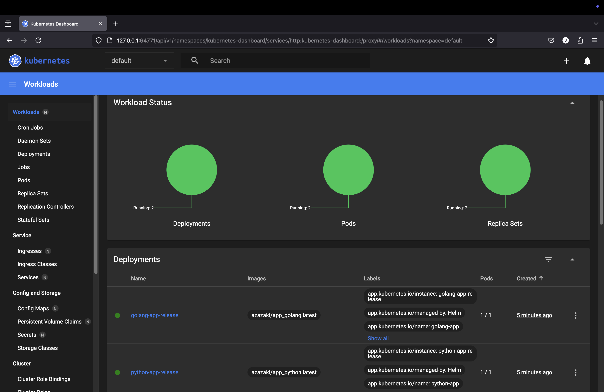
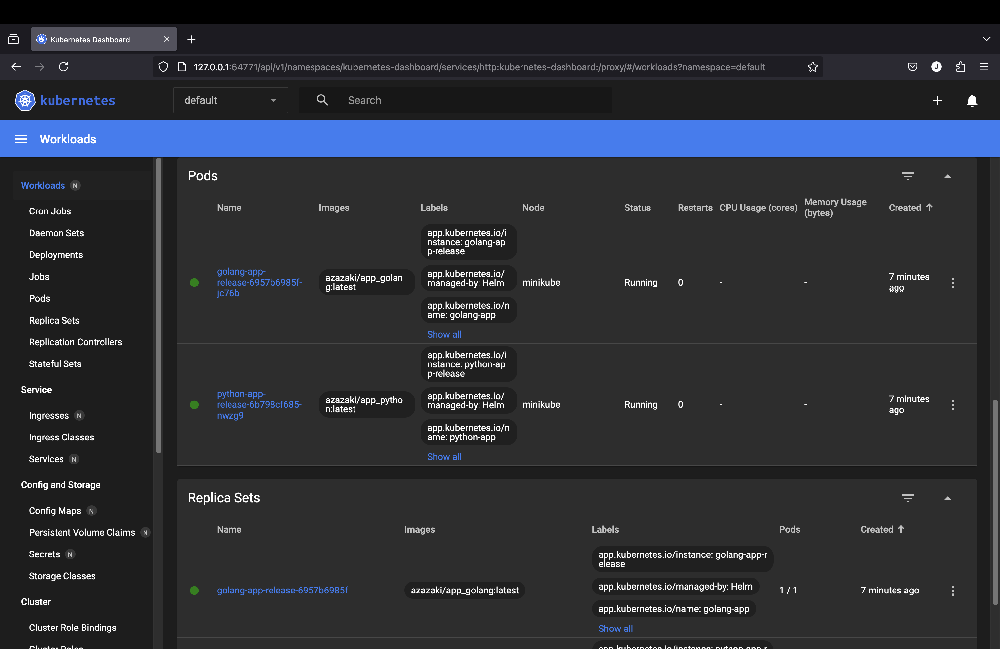
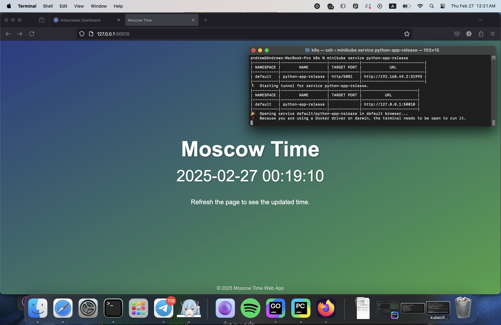
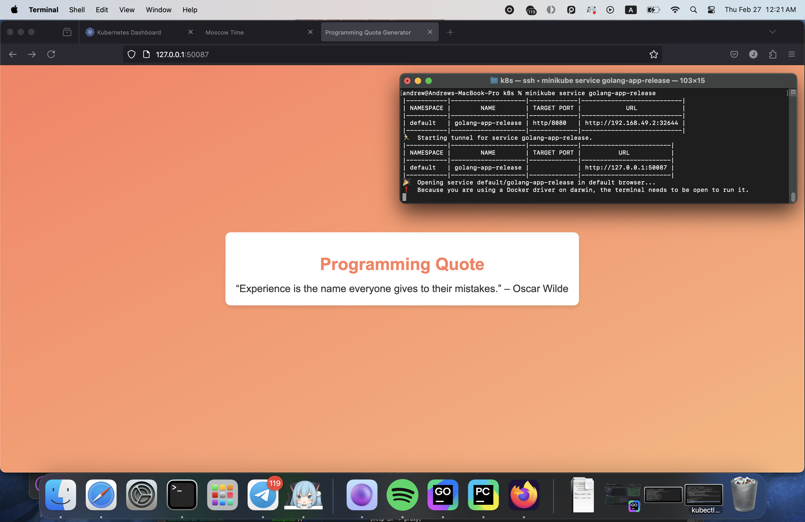

# HELM

## Task 1: Helm Setup and Chart Creation

1. Overview
In this task, we set up Helm locally, generated a Helm chart for our application, and deployed it to minikube. Below are the steps and final outputs.

2. **Installation and Initialization**  
   Firstly, install helm (I used brew).  
   ```bash
   brew install helm
   ```
   Secondly, initialize and add repo (VPN is must-have) 
   ```bash
   helm repo add bitnami https://charts.bitnami.com/bitnami
   ```
   **Output:**
   ```
    andrew@Andrews-MacBook-Pro k8s % helm repo add bitnami https://charts.bitnami.com/bitnami
    "bitnami" has been added to your repositories
   ```

3. **Create a Helm Chart**  
   - Moved into our `k8s` folder and ran:
     ```bash
     helm create python-app
     ```
     and
     ```bash
     helm create golang-app
     ```
     **Output:**
     ```yaml
     andrew@Andrews-MacBook-Pro k8s % helm create python-app
     Creating python-app
     andrew@Andrews-MacBook-Pro k8s % helm create golang-app
     Creating golang-app
     ```
   - This generated a scaffolded chart under `python-app` and `golang-app`.

4. **Update `values.yaml`**  
   - Changed the image repository and tag to our Docker images:
     ```yaml
     image:
       repository: azazaki/app_python
       tag: latest
       pullPolicy: IfNotPresent
       containerPort: 5001
     ```
     and
     ```yaml
     image:
       repository: azazaki/app_golang
       tag: latest
       pullPolicy: IfNotPresent
       containerPort: 8080
     ```
   - Changed `service` section:
     ```yaml
     service:
      type: NodePort
      port: 5001
     ```
     and
     ```yaml
     service:
      type: NodePort
      port: 8080
     ```
   - Commented out `livenessProbe` and `readinessProbe`.

5. **Install the Chart**  
   - Installed the chart into minikube:
     ```bash
     helm install python-app-release ./python-app
     ```
     and
     ```bash
     helm install golang-app-release ./golang-app
     ```
     **Output:**
     ```
     andrew@Andrews-MacBook-Pro k8s % helm install python-app-release ./python-app 
     NAME: python-app-release
     LAST DEPLOYED: Thu Feb 27 00:06:51 2025
     NAMESPACE: default
     STATUS: deployed
     REVISION: 1
     NOTES:
     1. Get the application URL by running these commands:
       export NODE_PORT=$(kubectl get --namespace default -o jsonpath="{.spec.ports[0].nodePort}" services python-app-release)
       export NODE_IP=$(kubectl get nodes --namespace default -o jsonpath="{.items[0].status.addresses[0].address}")
       echo http://$NODE_IP:$NODE_PORT
     andrew@Andrews-MacBook-Pro k8s % helm install golang-app-release ./golang-app 
     NAME: golang-app-release
     LAST DEPLOYED: Thu Feb 27 00:07:00 2025
     NAMESPACE: default
     STATUS: deployed
     REVISION: 1
     NOTES:
     1. Get the application URL by running these commands:
       export NODE_PORT=$(kubectl get --namespace default -o jsonpath="{.spec.ports[0].nodePort}" services golang-app-release)
       export NODE_IP=$(kubectl get nodes --namespace default -o jsonpath="{.items[0].status.addresses[0].address}")
       echo http://$NODE_IP:$NODE_PORT
     ```
   - Confirmed that releases are deployed:
     ```bash
     helm list
     ```
     **Output:**
     ```yaml
     andrew@Andrews-MacBook-Pro k8s % helm list
     NAME              	NAMESPACE	REVISION	UPDATED                             	STATUS  CHART           	APP VERSION
     golang-app-release	default  	1       	2025-02-27 00:07:00.790395 +0300 MSK	deployedgolang-app-0.1.0	1.16.0     
     python-app-release	default  	1       	2025-02-27 00:06:51.235997 +0300 MSK	deployedpython-app-0.1.0	1.16.0 
     ```

6. **Verify Services**  
   - Checked `minikube dashboard`  
     
     
     All pods, services, deployments, replica sets are healthy.
   
   - Checked the Pods and Services to ensure everything is running:
     ```bash
     kubectl get pods,svc
     ```
     **Output:**
     ```yaml
     andrew@Andrews-MacBook-Pro k8s % kubectl get pods,svc
     NAME                                      READY   STATUS    RESTARTS   AGE
     pod/golang-app-release-6957b6985f-jc76b   1/1     Running   0          10m
     pod/python-app-release-6b798cf685-nwzg9   1/1     Running   0          10m
    
     NAME                         TYPE        CLUSTER-IP      EXTERNAL-IP   PORT(S)          AGE
     service/golang-app-release   NodePort    10.103.61.187   <none>        8080:32644/TCP   10m
     service/kubernetes           ClusterIP   10.96.0.1       <none>        443/TCP          3h34m
     service/python-app-release   NodePort    10.99.208.228   <none>        5001:31993/TCP   10m
     ```
   - Confirmed we can access the application via:
     ```bash
     minikube service python-app-release
     ```
     
     and
     ```bash
     minikube service golang-app-release
     ```
     
     

---

### 3. Final Output

`kubectl get pods,svc`

```bash
andrew@Andrews-MacBook-Pro study % kubectl get pods,svc
NAME                                      READY   STATUS    RESTARTS   AGE
pod/golang-app-release-6957b6985f-jc76b   1/1     Running   0          22h
pod/python-app-release-6b798cf685-nwzg9   1/1     Running   0          22h

NAME                         TYPE        CLUSTER-IP      EXTERNAL-IP   PORT(S)          AGE
service/golang-app-release   NodePort    10.103.61.187   <none>        8080:32644/TCP   22h
service/kubernetes           ClusterIP   10.96.0.1       <none>        443/TCP          25h
service/python-app-release   NodePort    10.99.208.228   <none>        5001:31993/TCP   22h
```

## Task 2: Helm Chart Hooks

In this task, we add **pre-install** and **post-install** hooks to our Helm chart to demonstrate how hooks can be used for custom actions before and after the main resources are created.

### 1. Implementation Steps

1. **Add Hook Templates**  
   In chart’s `templates/` folder (for both `python-app` and `golang-app`), create two new YAML files:

   - **`pre-install-hook.yaml`**:
     ```yaml
     apiVersion: v1
     kind: Pod
     metadata:
       name: "{{ .Release.Name }}-preinstall-hook"
       annotations:
         "helm.sh/hook": pre-install
         "helm.sh/hook-delete-policy": hook-succeeded
     spec:
       containers:
       - name: pre-install-container
         image: busybox
         imagePullPolicy: IfNotPresent
         command: ['sh', '-c', 'echo The pre-install hook is running && sleep 20' ]
       restartPolicy: Never
       terminationGracePeriodSeconds: 0
     ```

   - **`post-install-hook.yaml`**:
     ```yaml
     apiVersion: v1
     kind: Pod
     metadata:
       name: "{{ .Release.Name }}-postinstall-hook"
       annotations:
         "helm.sh/hook": post-install
         "helm.sh/hook-delete-policy": hook-succeeded
     spec:
       containers:
       - name: post-install-container
         image: busybox
         imagePullPolicy: Always
         command: ['sh', '-c', 'echo The post-install hook is running && sleep 15' ]
       restartPolicy: Never
       terminationGracePeriodSeconds: 0
     ```

   Here, both Pods simply **sleep for 20 seconds** to simulate a setup process.

2. **Lint the Chart**  
   ```bash
   helm lint python-app
   ```
   and
   ```bash
   helm lint golang-app
   ```
   **Output:**
   ```
   andrew@Andrews-MacBook-Pro k8s % helm lint python-app 
   ==> Linting python-app
   [INFO] Chart.yaml: icon is recommended
    
   1 chart(s) linted, 0 chart(s) failed
   andrew@Andrews-MacBook-Pro k8s % helm lint golang-app
   ==> Linting golang-app
   [INFO] Chart.yaml: icon is recommended
    
   1 chart(s) linted, 0 chart(s) failed
   ```
3. **Dry Run**
   ```bash
   helm install --dry-run helm-hooks python-app
   ```
   and
   ```bash
   helm install --dry-run helm-hooks golang-app
   ```
   **Output:**
   ```
    andrew@Andrews-MacBook-Pro k8s % helm install --dry-run helm-hooks python-app 
    NAME: helm-hooks
    LAST DEPLOYED: Thu Feb 27 22:55:26 2025
    NAMESPACE: default
    STATUS: pending-install
    REVISION: 1
    HOOKS:
    ---
    # Source: python-app/templates/post-install-hook.yaml
    apiVersion: v1
    kind: Pod
    metadata:
      name: "helm-hooks-postinstall-hook"
      annotations:
        "helm.sh/hook": post-install
        "helm.sh/hook-delete-policy": hook-succeeded
    spec:
      containers:
      - name: post-install-container
        image: busybox
        imagePullPolicy: Always
        command: ['sh', '-c', 'echo The post-install hook is running && sleep 15' ]
      restartPolicy: Never
      terminationGracePeriodSeconds: 0
    ---
    # Source: python-app/templates/pre-install-hook.yaml
    apiVersion: v1
    kind: Pod
    metadata:
      name: "helm-hooks-preinstall-hook"
      annotations:
        "helm.sh/hook": pre-install
        "helm.sh/hook-delete-policy": hook-succeeded
    spec:
      containers:
      - name: pre-install-container
        image: busybox
        imagePullPolicy: IfNotPresent
        command: ['sh', '-c', 'echo The pre-install hook is running && sleep 20' ]
      restartPolicy: Never
      terminationGracePeriodSeconds: 0
    ---
    # Source: python-app/templates/tests/test-connection.yaml
    apiVersion: v1
    kind: Pod
    metadata:
      name: "helm-hooks-python-app-test-connection"
      labels:
        helm.sh/chart: python-app-0.1.0
        app.kubernetes.io/name: python-app
        app.kubernetes.io/instance: helm-hooks
        app.kubernetes.io/version: "1.16.0"
        app.kubernetes.io/managed-by: Helm
      annotations:
        "helm.sh/hook": test
    spec:
      containers:
        - name: wget
          image: busybox
          command: ['wget']
          args: ['helm-hooks-python-app:5001']
      restartPolicy: Never
    MANIFEST:
    ---
    # Source: python-app/templates/serviceaccount.yaml
    apiVersion: v1
    kind: ServiceAccount
    metadata:
      name: helm-hooks-python-app
      labels:
        helm.sh/chart: python-app-0.1.0
        app.kubernetes.io/name: python-app
        app.kubernetes.io/instance: helm-hooks
        app.kubernetes.io/version: "1.16.0"
        app.kubernetes.io/managed-by: Helm
    automountServiceAccountToken: true
    ---
    # Source: python-app/templates/service.yaml
    apiVersion: v1
    kind: Service
    metadata:
      name: helm-hooks-python-app
      labels:
        helm.sh/chart: python-app-0.1.0
        app.kubernetes.io/name: python-app
        app.kubernetes.io/instance: helm-hooks
        app.kubernetes.io/version: "1.16.0"
        app.kubernetes.io/managed-by: Helm
    spec:
      type: NodePort
      ports:
        - port: 5001
          targetPort: http
          protocol: TCP
          name: http
      selector:
        app.kubernetes.io/name: python-app
        app.kubernetes.io/instance: helm-hooks
    ---
    # Source: python-app/templates/deployment.yaml
    apiVersion: apps/v1
    kind: Deployment
    metadata:
      name: helm-hooks-python-app
      labels:
        helm.sh/chart: python-app-0.1.0
        app.kubernetes.io/name: python-app
        app.kubernetes.io/instance: helm-hooks
        app.kubernetes.io/version: "1.16.0"
        app.kubernetes.io/managed-by: Helm
    spec:
      replicas: 1
      selector:
        matchLabels:
          app.kubernetes.io/name: python-app
          app.kubernetes.io/instance: helm-hooks
      template:
        metadata:
          labels:
            helm.sh/chart: python-app-0.1.0
            app.kubernetes.io/name: python-app
            app.kubernetes.io/instance: helm-hooks
            app.kubernetes.io/version: "1.16.0"
            app.kubernetes.io/managed-by: Helm
        spec:
          serviceAccountName: helm-hooks-python-app
          containers:
            - name: python-app
              image: "azazaki/app_python:latest"
              imagePullPolicy: IfNotPresent
              ports:
                - name: http
                  containerPort: 5001
                  protocol: TCP
    
    NOTES:
    1. Get the application URL by running these commands:
      export NODE_PORT=$(kubectl get --namespace default -o jsonpath="{.spec.ports[0].nodePort}" services helm-hooks-python-app)
      export NODE_IP=$(kubectl get nodes --namespace default -o jsonpath="{.items[0].status.addresses[0].address}")
      echo http://$NODE_IP:$NODE_PORT
   ```
4. **Install with Hooks**  
   Run `helm install --dry-run helm-hooks python-app` and `helm install --dry-run helm-hooks golang-app`  
   After that, we can check our hooks :)  
   - `kubectl get po`
     ```
     andrew@Andrews-MacBook-Pro ~ % kubectl get po
     NAME                         READY   STATUS    RESTARTS   AGE
     helm-hooks-preinstall-hook   1/1     Running   0          3s
     ```
   - `kubectl describe po helm-hooks-preinstall-hook`
     ```
     andrew@Andrews-MacBook-Pro ~ % kubectl describe po helm-hooks-preinstall-hook
     Name:             helm-hooks-preinstall-hook
     Namespace:        default
     Priority:         0
     Service Account:  default
     Node:             minikube/192.168.49.2
     Start Time:       Thu, 27 Feb 2025 23:04:31 +0300
     Labels:           <none>
     Annotations:      helm.sh/hook: pre-install
                       helm.sh/hook-delete-policy: hook-succeeded
     Status:           Running
     IP:               10.244.0.53
     IPs:
       IP:  10.244.0.53
     Containers:
       pre-install-container:
         Container ID:  docker://cc2bdaabbe7a1636987d190b52d4ea0df00617a69b8bacb4a4c180b1140219a0
         Image:         busybox
         Image ID:      docker-pullable://busybox@sha256:498a000f370d8c37927118ed80afe8adc38d1edcbfc071627d17b25c88efcab0
         Port:          <none>
         Host Port:     <none>
         Command:
           sh
           -c
           echo The pre-install hook is running && sleep 20
         State:          Running
           Started:      Thu, 27 Feb 2025 23:04:32 +0300
         Ready:          True
         Restart Count:  0
         Environment:    <none>
         Mounts:
           /var/run/secrets/kubernetes.io/serviceaccount from kube-api-access-hlx7d (ro)
     Conditions:
       Type                        Status
       PodReadyToStartContainers   True 
       Initialized                 True 
       Ready                       True 
       ContainersReady             True 
       PodScheduled                True 
     Volumes:
       kube-api-access-hlx7d:
         Type:                    Projected (a volume that contains injected data from multiple sources)
         TokenExpirationSeconds:  3607
         ConfigMapName:           kube-root-ca.crt
         ConfigMapOptional:       <nil>
         DownwardAPI:             true
     QoS Class:                   BestEffort
     Node-Selectors:              <none>
     Tolerations:                 node.kubernetes.io/not-ready:NoExecute op=Exists for 300s
                                  node.kubernetes.io/unreachable:NoExecute op=Exists for 300s
     Events:
       Type    Reason     Age   From               Message
       ----    ------     ----  ----               -------
       Normal  Scheduled  11s   default-scheduler  Successfully assigned default/helm-hooks-preinstall-hook to minikube
       Normal  Pulled     10s   kubelet            Container image "busybox" already present on machine
       Normal  Created    10s   kubelet            Created container: pre-install-container
       Normal  Started    10s   kubelet            Started container pre-install-container
     ```
   - `kubectl get po`
     ```
     andrew@Andrews-MacBook-Pro ~ % kubectl get po
     NAME                                     READY   STATUS    RESTARTS   AGE
     helm-hooks-postinstall-hook              1/1     Running   0          8s
     helm-hooks-python-app-6b4f665d58-97rqj   1/1     Running   0          8s
     ```
     As you can see, pre-install hook already disappeared, because hook-delete policy is already implemented.   
     In `annotations` section of `pre-install-hook.yaml` and `post-install-hook.yaml` – `"helm.sh/hook-delete-policy": hook-succeeded`
   - `kubectl describe po helm-hooks-postinstall-hook`
     ```
     andrew@Andrews-MacBook-Pro ~ % kubectl describe po helm-hooks-postinstall-hook
     Name:             helm-hooks-postinstall-hook
     Namespace:        default
     Priority:         0
     Service Account:  default
     Node:             minikube/192.168.49.2
     Start Time:       Thu, 27 Feb 2025 23:04:54 +0300
     Labels:           <none>
     Annotations:      helm.sh/hook: post-install
                       helm.sh/hook-delete-policy: hook-succeeded
     Status:           Running
     IP:               10.244.0.54
     IPs:
       IP:  10.244.0.54
     Containers:
       post-install-container:
         Container ID:  docker://3231a83ebe1ed45f6d5a7eaf64bb2f464c93935d5495205e07aedc4456b711e2
         Image:         busybox
         Image ID:      docker-pullable://busybox@sha256:498a000f370d8c37927118ed80afe8adc38d1edcbfc071627d17b25c88efcab0
         Port:          <none>
         Host Port:     <none>
         Command:
           sh
           -c
           echo The post-install hook is running && sleep 15
         State:          Running
           Started:      Thu, 27 Feb 2025 23:04:57 +0300
         Ready:          True
         Restart Count:  0
         Environment:    <none>
         Mounts:
           /var/run/secrets/kubernetes.io/serviceaccount from kube-api-access-4j72z (ro)
     Conditions:
       Type                        Status
       PodReadyToStartContainers   True 
       Initialized                 True 
       Ready                       True 
       ContainersReady             True 
       PodScheduled                True 
     Volumes:
       kube-api-access-4j72z:
         Type:                    Projected (a volume that contains injected data from multiple sources)
         TokenExpirationSeconds:  3607
         ConfigMapName:           kube-root-ca.crt
         ConfigMapOptional:       <nil>
         DownwardAPI:             true
     QoS Class:                   BestEffort
     Node-Selectors:              <none>
     Tolerations:                 node.kubernetes.io/not-ready:NoExecute op=Exists for 300s
                                 node.kubernetes.io/unreachable:NoExecute op=Exists for 300s
     Events:
       Type    Reason     Age   From               Message
       ----    ------     ----  ----               -------
       Normal  Scheduled  17s   default-scheduler  Successfully assigned default/helm-hooks-postinstall-hook to minikube
       Normal  Pulling    17s   kubelet            Pulling image "busybox"
       Normal  Pulled     14s   kubelet            Successfully pulled image "busybox" in 2.459s (2.459s including waiting). Image size: 4042190 bytes.
       Normal  Created    14s   kubelet            Created container: post-install-container
       Normal  Started    14s   kubelet            Started container post-install-container
     ```
   - `kubectl describe po helm-hooks-postinstall-hook` and `kubectl describe po helm-hooks-preinstall-hook`
     ```
     andrew@Andrews-MacBook-Pro ~ % kubectl describe po helm-hooks-postinstall-hook
     Error from server (NotFound): pods "helm-hooks-postinstall-hook" not found
     andrew@Andrews-MacBook-Pro ~ % kubectl describe po helm-hooks-preinstall-hook 
     Error from server (NotFound): pods "helm-hooks-preinstall-hook" not found
     ```
   - `kubectl get pods,svc`
     ```
     andrew@Andrews-MacBook-Pro ~ % kubectl get pods,svc
     NAME                                         READY   STATUS    RESTARTS   AGE
     pod/helm-hooks-python-app-6b4f665d58-97rqj   1/1     Running   0          9m28s
    
     NAME                            TYPE        CLUSTER-IP       EXTERNAL-IP   PORT(S)          AGE
     service/helm-hooks-python-app   NodePort    10.102.110.219   <none>        5001:31000/TCP   9m28s
     service/kubernetes              ClusterIP   10.96.0.1        <none>        443/TCP          26h
     ```
   Almost the same logs for `golang-app`.

## Bonus Task: Helm Library Chart


### 1. Helm Chart for Extra App:  
Already did it :)

### 2. Create a Library Chart:

1. **Generate a library chart:**
   ```bash
   helm create my-library
   ```
   **Output:**
   ```
   andrew@Andrews-MacBook-Pro k8s % helm create my-library               
   Creating my-library
   ```
   - Delete the contents of `templates` folder
   - Create `_labels.tpl`
     ```
     {{- define "my-library.labels" -}}
     app.kubernetes.io/name: {{ .Chart.Name | quote }}
     app.kubernetes.io/version: {{ .Chart.Version | quote }}
     app.kubernetes.io/instance: {{ .Release.Name | quote }}
     app.kubernetes.io/part-of: "my-shared-library"
     {{- end -}}
     ```
   - Declare Dependency in Chart.yaml of each app:
     ```yaml
     dependencies:
       - name: my-library
         version: 0.1.0
         repository: "file://../my-library"
     ```
   - Include the `Library Labels` in deployment.yaml:
     ```yaml
     metadata:
       labels:
         {{- include "my-library.labels" . | nindent 4 }}
         {{- include "python-app.labels" . | nindent 4 }}
     spec:
       selector:
         matchLabels:
           {{- include "my-library.labels" . | nindent 6 }}
           {{- include "python-app.selectorLabels" . | nindent 6 }}
     template:
       metadata:
         labels:
           {{- include "my-library.labels" . | nindent 8 }}
           {{- include "python-app.labels" . | nindent 8 }}
     ```
2. **Update dependencies for both applications:**
   ```bash
   helm dependency update
   ```
   ```
   andrew@Andrews-MacBook-Pro golang-app % helm dependency update                              
   Hang tight while we grab the latest from your chart repositories...
   ...Successfully got an update from the "bitnami" chart repository
   Update Complete. ⎈Happy Helming!⎈
   Saving 1 charts 
   Deleting outdated charts
   andrew@Andrews-MacBook-Pro python-app % helm dependency update                              
   Hang tight while we grab the latest from your chart repositories...
   ...Successfully got an update from the "bitnami" chart repository
   Update Complete. ⎈Happy Helming!⎈
   Saving 1 charts 
   Deleting outdated charts
   ```
3. **Upgrade all!**
   ```bash
   helm upgrade --install python-app-release golang-app
   ```
   and
   ```bash
   helm upgrade --install python-app-release python-app
   ```
   Outputs:
   ```
   andrew@Andrews-MacBook-Pro k8s % helm upgrade --install python-app-release python-app
   Release "python-app-release" has been upgraded. Happy Helming!
   NAME: python-app-release
   LAST DEPLOYED: Thu Feb 27 23:40:12 2025
   NAMESPACE: default
   STATUS: deployed
   REVISION: 2
   NOTES:
   1. Get the application URL by running these commands:
      export NODE_PORT=$(kubectl get --namespace default -o jsonpath="{.spec.ports[0].nodePort}" services python-app-release)
      export NODE_IP=$(kubectl get nodes --namespace default -o jsonpath="{.items[0].status.addresses[0].address}")
      echo http://$NODE_IP:$NODE_PORT
   andrew@Andrews-MacBook-Pro k8s % helm upgrade --install python-app-release golang-app
   Release "python-app-release" has been upgraded. Happy Helming!
   NAME: python-app-release
   LAST DEPLOYED: Thu Feb 27 23:47:16 2025
   NAMESPACE: default
   STATUS: deployed
   REVISION: 5
   NOTES:
   1. Get the application URL by running these commands:
      export NODE_PORT=$(kubectl get --namespace default -o jsonpath="{.spec.ports[0].nodePort}" services python-app-release-golang-app)
      export NODE_IP=$(kubectl get nodes --namespace default -o jsonpath="{.items[0].status.addresses[0].address}")
      echo http://$NODE_IP:$NODE_PORT
   ```
4. **Conclusion**  
   By creating a `library chart` with a shared `labels` template and referencing it in your applications, we:
   - Ensure consistent labeling (or any other repeated logic) across multiple charts.
   - Keep chart code DRY (Don’t Repeat Yourself).
   - Make future updates (like new labels) easy to propagate by editing the library chart once.
