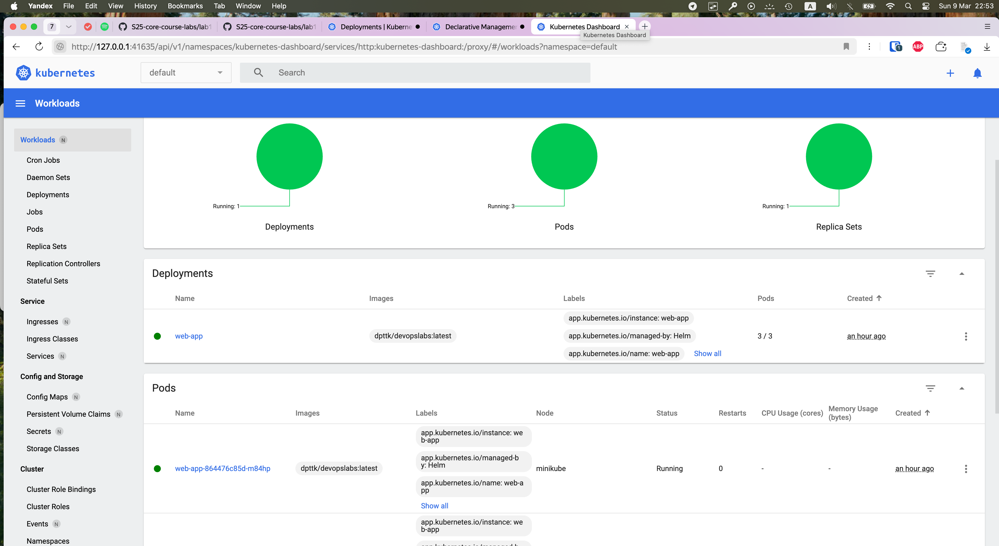

``` bash
dpttk@codenv:~/uni/devops/S25-core-course-labs/app_python$ minikube service web-app
|-----------|---------|-------------|--------------|
| NAMESPACE |  NAME   | TARGET PORT |     URL      |
|-----------|---------|-------------|--------------|
| default   | web-app |             | No node port |
|-----------|---------|-------------|--------------|
😿  service default/web-app has no node port
❗  Services [default/web-app] have type "ClusterIP" not meant to be exposed, however for local development minikube allows you to access this !
🏃  Starting tunnel for service web-app.
|-----------|---------|-------------|------------------------|
| NAMESPACE |  NAME   | TARGET PORT |          URL           |
|-----------|---------|-------------|------------------------|
| default   | web-app |             | http://127.0.0.1:38767 |
|-----------|---------|-------------|------------------------|
🎉  Opening service default/web-app in default browser...
👉  http://127.0.0.1:38767
❗  Because you are using a Docker driver on linux, the terminal needs to be open to run it.
```

```bash
dpttk@codenv:~/uni/devops/S25-core-course-labs/k8s$ kubectl get pods,svc
NAME                           READY   STATUS    RESTARTS   AGE
pod/web-app-864476c85d-m84hp   1/1     Running   0          74m
pod/web-app-864476c85d-rl26l   1/1     Running   0          74m
pod/web-app-864476c85d-xbrrj   1/1     Running   0          74m

NAME                 TYPE        CLUSTER-IP       EXTERNAL-IP   PORT(S)   AGE
service/kubernetes   ClusterIP   10.96.0.1        <none>        443/TCP   121m
service/web-app      ClusterIP   10.100.145.185   <none>        80/TCP    74m
````


