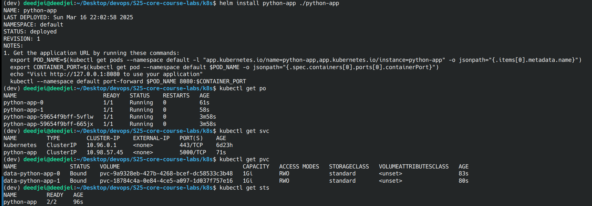

## Task 1
### Step 3
- Created a Helm chart for the application (fastapi-mt)
- Updated values.yaml:
    - Set image.repository to iucd/fastapi-mt
    - Modified service.port in values.yaml
    - Commented out livenessProbe and readinessProbe.
### Step 4
- Deployed the Helm chart:
    - ```bash
      helm install fastapi-mt ./fastapi-mt
      ```
- Verified deployment:
    1. 
    2. 
### Step 5
- Confirmed service accessibility:
    1. 
### Step 6
- Output of `kubectl get pods,svc`
    1. 

## Task 2
### Step 2
- Added `pre-install-hook` and `post-install-hook` hooks in templates/ directory
### Step 3
- Executed the following commands:
    - ```bash
      helm lint fastapi-mt
      helm install --dry-run fastapi-mt ./fastapi-mt
      kubectl get po
      ```
### Step 4
- Verified hook execution:
    1. 
    2. Preinstall hook: 
    ```bash
    Name:             pre-install-hook-4hgzh
    Namespace:        default
    Priority:         0
    Service Account:  default
    Node:             minikube/192.168.49.2
    Start Time:       Thu, 27 Feb 2025 06:09:59 +0300
    Labels:           batch.kubernetes.io/controller-uid=af367a4d-423e-405c-b9bd-7b6b2e904350
                    batch.kubernetes.io/job-name=pre-install-hook
                    controller-uid=af367a4d-423e-405c-b9bd-7b6b2e904350
                    job-name=pre-install-hook
    Annotations:      <none>
    Status:           Succeeded
    IP:               10.244.0.5
    IPs:
    IP:           10.244.0.5
    Controlled By:  Job/pre-install-hook
    Containers:
    pre-install-hook:
        Container ID:  docker://6e1e3606e2f41583f1a9772d111995cbb716abd48f18b5c6cd8491e99facc9f5
        Image:         busybox
        Image ID:      docker-pullable://busybox@sha256:498a000f370d8c37927118ed80afe8adc38d1edcbfc071627d17b25c88efcab0
        Port:          <none>
        Host Port:     <none>
        Command:
        sh
        -c
        echo Pre-Install Hook && sleep 20
        State:          Terminated
        Reason:       Completed
        Exit Code:    0
        Started:      Thu, 27 Feb 2025 06:10:11 +0300
        Finished:     Thu, 27 Feb 2025 06:10:31 +0300
        Ready:          False
        Restart Count:  0
        Environment:    <none>
        Mounts:
        /var/run/secrets/kubernetes.io/serviceaccount from kube-api-access-v9qwq (ro)
    Conditions:
    Type                        Status
    PodReadyToStartContainers   False 
    Initialized                 True 
    Ready                       False 
    ContainersReady             False 
    PodScheduled                True 
    Volumes:
    kube-api-access-v9qwq:
        Type:                    Projected (a volume that contains injected data from multiple sources)
        TokenExpirationSeconds:  3607
        ConfigMapName:           kube-root-ca.crt
        ConfigMapOptional:       <nil>
        DownwardAPI:             true
    QoS Class:                   BestEffort
    Node-Selectors:              <none>
    Tolerations:                 node.kubernetes.io/not-ready:NoExecute op=Exists for 300s
                                node.kubernetes.io/unreachable:NoExecute op=Exists for 300s
    Events:
    Type    Reason     Age    From               Message
    ----    ------     ----   ----               -------
    Normal  Scheduled  3m58s  default-scheduler  Successfully assigned default/pre-install-hook-4hgzh to minikube
    Normal  Pulling    3m54s  kubelet            Pulling image "busybox"
    Normal  Pulled     3m48s  kubelet            Successfully pulled image "busybox" in 6.453s (6.453s including waiting). Image size: 4269694 bytes.
    Normal  Created    3m47s  kubelet            Created container: pre-install-hook
    Normal  Started    3m46s  kubelet            Started container pre-install-hook
    ```
    3. Postinstall hook: 
    ```bash
    Name:             post-install-hook-2vgt6
    Namespace:        default
    Priority:         0
    Service Account:  default
    Node:             minikube/192.168.49.2
    Start Time:       Thu, 27 Feb 2025 06:10:38 +0300
    Labels:           batch.kubernetes.io/controller-uid=8b517141-eec5-4ac1-9ac3-6861a9484a17
                    batch.kubernetes.io/job-name=post-install-hook
                    controller-uid=8b517141-eec5-4ac1-9ac3-6861a9484a17
                    job-name=post-install-hook
    Annotations:      <none>
    Status:           Succeeded
    IP:               10.244.0.6
    IPs:
    IP:           10.244.0.6
    Controlled By:  Job/post-install-hook
    Containers:
    post-install-hook:
        Container ID:  docker://012ab0b19576ed4f5061a5634f7b4a92754df29c3af9fcf8420d57ab89e64b43
        Image:         busybox
        Image ID:      docker-pullable://busybox@sha256:498a000f370d8c37927118ed80afe8adc38d1edcbfc071627d17b25c88efcab0
        Port:          <none>
        Host Port:     <none>
        Command:
        sh
        -c
        echo Post-Install Hook && sleep 20
        State:          Terminated
        Reason:       Completed
        Exit Code:    0
        Started:      Thu, 27 Feb 2025 06:10:45 +0300
        Finished:     Thu, 27 Feb 2025 06:11:06 +0300
        Ready:          False
        Restart Count:  0
        Environment:    <none>
        Mounts:
        /var/run/secrets/kubernetes.io/serviceaccount from kube-api-access-sjwdp (ro)
    Conditions:
    Type                        Status
    PodReadyToStartContainers   False 
    Initialized                 True 
    Ready                       False 
    ContainersReady             False 
    PodScheduled                True 
    Volumes:
    kube-api-access-sjwdp:
        Type:                    Projected (a volume that contains injected data from multiple sources)
        TokenExpirationSeconds:  3607
        ConfigMapName:           kube-root-ca.crt
        ConfigMapOptional:       <nil>
        DownwardAPI:             true
    QoS Class:                   BestEffort
    Node-Selectors:              <none>
    Tolerations:                 node.kubernetes.io/not-ready:NoExecute op=Exists for 300s
                                node.kubernetes.io/unreachable:NoExecute op=Exists for 300s
    Events:
    Type    Reason     Age    From               Message
    ----    ------     ----   ----               -------
    Normal  Scheduled  3m44s  default-scheduler  Successfully assigned default/post-install-hook-2vgt6 to minikube
    Normal  Pulling    3m40s  kubelet            Pulling image "busybox"
    Normal  Pulled     3m38s  kubelet            Successfully pulled image "busybox" in 2.603s (2.603s including waiting). Image size: 4269694 bytes.
    Normal  Created    3m37s  kubelet            Created container: post-install-hook
    Normal  Started    3m36s  kubelet            Started container post-install-hook
    ```
- Checked status of the helm deployment after hooks:
    1. 

## Bonus Task
### Step 1
- Created a helm chart for gin-mt via `helm create gin-mt`
- Updated values.yaml with:
    ```yaml
    image:
      repository: iucd/gin-mt
    ...
    service:
      type: ClusterIP
      port: 8080
    ```
- Added same hooks, commented out livenessProbe and readinessProbe.
### Step 2
- Created `libchart` as a Helm library chart, in `Chart.yaml` type changed to `library`
- Removed default templates and added a `labels` template:
```yaml
{{- define "common.labels" -}}
app.kubernetes.io/name: {{ .Chart.Name }}
app.kubernetes.io/instance: {{ .Release.Name }}
app.kubernetes.io/version: {{ .Chart.AppVersion }}
{{- end }}
```
### Step 3
- Added the `libchart` dependency in `fastapi-mt/Chart.yaml` and `gin-mt/Chart.yaml`:
```yaml
dependencies:
  - name: libchart
    version: 0.1.0
    repository: "file://../libchart"
```
- Ran:
```bash
helm dependency update fastapi-mt
helm dependency update gin-mt
```
- Verified dependencies:
```bash
helm dependency list fastapi-mt
helm dependency list gin-mt
```
1. 
### Step 4
- Installed fastapi-mt and gin-mt:
```bash
helm install fastapi-mt ./fastapi-mt
helm install gin-mt ./gin-mt
```
- Checked if the library chart template was applied:
```bash
helm template fastapi-mt ./fastapi-mt
```
1. 