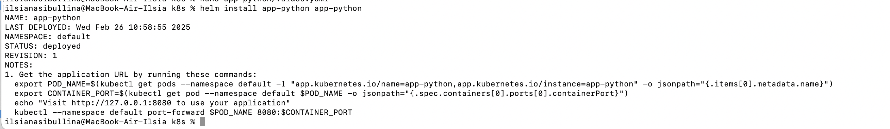

# Helm

## Task 1

Firt of all, I installed helm:


After that I created app-python chart and installed it:



Minikube dashboard:


Chart was created:

```bash
k8s % helm list

NAME       NAMESPACE REVISION UPDATED                              STATUS   CHART            
APP VERSION
app-python default   1        2025-02-26 10:58:55.100689 +0300 MSK deployed app-python-0.1.0 
1.16.0   


k8s % kubectl get pods,svc
NAME                                         READY   STATUS    RESTARTS      AGE
pod/app-nodejs-deployment-5cc557f5d6-4vsk7   1/1     Running   2 (47m ago)   18h
pod/app-nodejs-deployment-5cc557f5d6-9rw2q   1/1     Running   2 (47m ago)   18h
pod/app-nodejs-deployment-5cc557f5d6-qlxjs   1/1     Running   2 (47m ago)   18h
pod/app-python-58c4758cb-zkmjn               1/1     Running   0             12m
pod/app-python-deployment-79d8d46c8d-9zqkp   1/1     Running   2 (47m ago)   18h
pod/app-python-deployment-79d8d46c8d-tfrl2   1/1     Running   2 (47m ago)   18h
pod/app-python-deployment-79d8d46c8d-v6hs8   1/1     Running   2 (47m ago)   18h

NAME                         TYPE        CLUSTER-IP      EXTERNAL-IP   PORT(S)    AGE
service/app-nodejs-service   ClusterIP   10.110.72.250   <none>        80/TCP     18h
service/app-python           ClusterIP   10.110.73.32    <none>        5000/TCP   12m
service/app-python-service   ClusterIP   10.105.82.35    <none>        80/TCP     18h
service/kubernetes           ClusterIP   10.96.0.1       <none>        443/TCP    22h
```

And screenshot with `minikude service app-python`:


## Task 2

The output of `helm lint app-python`:


The output of `helm install --dry-run helm-hooks app-python`:

```bash
k8s % helm install --dry-run helm-hooks app-python 
NAME: helm-hooks
LAST DEPLOYED: Wed Feb 26 11:47:12 2025
NAMESPACE: default
STATUS: pending-install
REVISION: 1
HOOKS:
---
# Source: app-python/templates/post-install-hook.yaml
apiVersion: v1
kind: Pod
metadata:
  name: postinstall-hook
  annotations:
    "helm.sh/hook": "post-install"
spec:
  containers:
    - name: post-install-container
      image: busybox
      imagePullPolicy: Always
      command: ['sh', '-c', 'echo Post-install hook is running... && sleep 15']
  restartPolicy: Never
  terminationGracePeriodSeconds: 0
---
# Source: app-python/templates/pre-install-hook.yaml
apiVersion: v1
kind: Pod
metadata:
  name: preinstall-hook
  annotations:
    "helm.sh/hook": "pre-install"
spec:
  containers:
    - name: pre-install-container
      image: busybox
      imagePullPolicy: IfNotPresent
      command: ['sh', '-c', 'echo Pre-install hook is running... && sleep 20']
  restartPolicy: Never
  terminationGracePeriodSeconds: 0
---
# Source: app-python/templates/tests/test-connection.yaml
apiVersion: v1
kind: Pod
metadata:
  name: "helm-hooks-app-python-test-connection"
  labels:
    helm.sh/chart: app-python-0.1.0
    app.kubernetes.io/name: app-python
    app.kubernetes.io/instance: helm-hooks
    app.kubernetes.io/version: "1.16.0"
    app.kubernetes.io/managed-by: Helm
  annotations:
    "helm.sh/hook": test
spec:
  containers:
    - name: wget
      image: busybox
      command: ['wget']
      args: ['helm-hooks-app-python:5000']
  restartPolicy: Never
MANIFEST:
---
# Source: app-python/templates/serviceaccount.yaml
apiVersion: v1
kind: ServiceAccount
metadata:
  name: helm-hooks-app-python
  labels:
    helm.sh/chart: app-python-0.1.0
    app.kubernetes.io/name: app-python
    app.kubernetes.io/instance: helm-hooks
    app.kubernetes.io/version: "1.16.0"
    app.kubernetes.io/managed-by: Helm
automountServiceAccountToken: true
---
# Source: app-python/templates/service.yaml
apiVersion: v1
kind: Service
metadata:
  name: helm-hooks-app-python
  labels:
    helm.sh/chart: app-python-0.1.0
    app.kubernetes.io/name: app-python
    app.kubernetes.io/instance: helm-hooks
    app.kubernetes.io/version: "1.16.0"
    app.kubernetes.io/managed-by: Helm
spec:
  type: ClusterIP
  ports:
    - port: 5000
      targetPort: http
      protocol: TCP
      name: http
  selector:
    app.kubernetes.io/name: app-python
    app.kubernetes.io/instance: helm-hooks
---
# Source: app-python/templates/deployment.yaml
apiVersion: apps/v1
kind: Deployment
metadata:
  name: helm-hooks-app-python
  labels:
    helm.sh/chart: app-python-0.1.0
    app.kubernetes.io/name: app-python
    app.kubernetes.io/instance: helm-hooks
    app.kubernetes.io/version: "1.16.0"
    app.kubernetes.io/managed-by: Helm
spec:
  replicas: 1
  selector:
    matchLabels:
      app.kubernetes.io/name: app-python
      app.kubernetes.io/instance: helm-hooks
  template:
    metadata:
      labels:
        helm.sh/chart: app-python-0.1.0
        app.kubernetes.io/name: app-python
        app.kubernetes.io/instance: helm-hooks
        app.kubernetes.io/version: "1.16.0"
        app.kubernetes.io/managed-by: Helm
    spec:
      serviceAccountName: helm-hooks-app-python
      containers:
        - name: app-python
          image: "ilsiia/app-python:latest"
          imagePullPolicy: IfNotPresent
          ports:
            - name: http
              containerPort: 5000
              protocol: TCP
          livenessProbe:
            httpGet:
              path: /
              port: http
          readinessProbe:
            httpGet:
              path: /
              port: http

NOTES:
1. Get the application URL by running these commands:
  export POD_NAME=$(kubectl get pods --namespace default -l 
"app.kubernetes.io/name=app-python,app.kubernetes.io/instance=helm-hooks" -o jsonpath="{.items[0].metadata.name}")
  export CONTAINER_PORT=$(kubectl get pod --namespace default $POD_NAME -o 
jsonpath="{.spec.containers[0].ports[0].containerPort}")
  echo "Visit http://127.0.0.1:8080 to use your application"
  kubectl --namespace default port-forward $POD_NAME 8080:$CONTAINER_PORT
```

The output of `kubectl get po`:


The output of `kubectl describe po postinstall-hook` and `kubectl describe po preinstall-hook`:

```bash
k8s % kubectl describe po postinstall-hook
Name:             postinstall-hook
Namespace:        default
Priority:         0
Service Account:  default
Node:             minikube/192.168.49.2
Start Time:       Wed, 26 Feb 2025 12:10:35 +0300
Labels:           <none>
Annotations:      helm.sh/hook: post-install
Status:           Succeeded
IP:               10.244.0.86
IPs:
  IP:  10.244.0.86
Containers:
  post-install-container:
    Container ID:  docker://fba4ec4a46077faff8283d298134eb49dbfe30713b581c2c834686f03e5aaba6
    Image:         busybox
    Image ID:      docker-pullable://busybox@sha256:498a000f370d8c37927118ed80afe8adc38d1edcbfc071627d17b25c88efcab0
    Port:          <none>
    Host Port:     <none>
    Command:
      sh
      -c
      echo Post-install hook is running... && sleep 15
    State:          Terminated
      Reason:       Completed
      Exit Code:    0
      Started:      Wed, 26 Feb 2025 12:10:43 +0300
      Finished:     Wed, 26 Feb 2025 12:10:59 +0300
    Ready:          False
    Restart Count:  0
    Environment:    <none>
    Mounts:
      /var/run/secrets/kubernetes.io/serviceaccount from kube-api-access-w26rk (ro)
Conditions:
  Type                        Status
  PodReadyToStartContainers   False 
  Initialized                 True 
  Ready                       False 
  ContainersReady             False 
  PodScheduled                True 
Volumes:
  kube-api-access-w26rk:
    Type:                    Projected (a volume that contains injected data from multiple sources)
    TokenExpirationSeconds:  3607
    ConfigMapName:           kube-root-ca.crt
    ConfigMapOptional:       <nil>
    DownwardAPI:             true
QoS Class:                   BestEffort
Node-Selectors:              <none>
Tolerations:                 node.kubernetes.io/not-ready:NoExecute op=Exists for 300s
                             node.kubernetes.io/unreachable:NoExecute op=Exists for 300s
Events:
  Type    Reason     Age    From               Message
  ----    ------     ----   ----               -------
  Normal  Scheduled  2m19s  default-scheduler  Successfully assigned default/postinstall-hook to minikube
  Normal  Pulling    2m19s  kubelet            Pulling image "busybox"
  Normal  Pulled     2m11s  kubelet            Successfully pulled image "busybox" in 8.047s (8.047s including waiting). 
Image size: 4042190 bytes.
  Normal  Created    2m11s  kubelet            Created container: post-install-container
  Normal  Started    2m10s  kubelet            Started container post-install-container
ilsianasibullina@MacBook-Air-Ilsia k8s % kubectl describe po preinstall-hook 
Name:             preinstall-hook
Namespace:        default
Priority:         0
Service Account:  default
Node:             minikube/192.168.49.2
Start Time:       Wed, 26 Feb 2025 12:08:58 +0300
Labels:           <none>
Annotations:      helm.sh/hook: pre-install
Status:           Succeeded
IP:               10.244.0.85
IPs:
  IP:  10.244.0.85
Containers:
  pre-install-container:
    Container ID:  docker://0f3f91666083c091c2af74eb25ddc6d1974d9accc32069fd031b1a3760e83e96
    Image:         busybox
    Image ID:      docker-pullable://busybox@sha256:498a000f370d8c37927118ed80afe8adc38d1edcbfc071627d17b25c88efcab0
    Port:          <none>
    Host Port:     <none>
    Command:
      sh
      -c
      echo Pre-install hook is running... && sleep 20
    State:          Terminated
      Reason:       Completed
      Exit Code:    0
      Started:      Wed, 26 Feb 2025 12:08:59 +0300
      Finished:     Wed, 26 Feb 2025 12:09:19 +0300
    Ready:          False
    Restart Count:  0
    Environment:    <none>
    Mounts:
      /var/run/secrets/kubernetes.io/serviceaccount from kube-api-access-t8992 (ro)
Conditions:
  Type                        Status
  PodReadyToStartContainers   False 
  Initialized                 True 
  Ready                       False 
  ContainersReady             False 
  PodScheduled                True 
Volumes:
  kube-api-access-t8992:
    Type:                    Projected (a volume that contains injected data from multiple sources)
    TokenExpirationSeconds:  3607
    ConfigMapName:           kube-root-ca.crt
    ConfigMapOptional:       <nil>
    DownwardAPI:             true
QoS Class:                   BestEffort
Node-Selectors:              <none>
Tolerations:                 node.kubernetes.io/not-ready:NoExecute op=Exists for 300s
                             node.kubernetes.io/unreachable:NoExecute op=Exists for 300s
Events:
  Type    Reason     Age    From               Message
  ----    ------     ----   ----               -------
  Normal  Scheduled  4m37s  default-scheduler  Successfully assigned default/preinstall-hook to minikube
  Normal  Pulled     4m36s  kubelet            Container image "busybox" already present on machine
  Normal  Created    4m36s  kubelet            Created container: pre-install-container
  Normal  Started    4m36s  kubelet            Started container pre-install-container

```

After intriducing Delete Policy:


```bash
k8s % helm status helm-hooks

NAME: helm-hooks
LAST DEPLOYED: Wed Feb 26 12:17:30 2025
NAMESPACE: default
STATUS: deployed
REVISION: 2
NOTES:
1. Get the application URL by running these commands:
  export POD_NAME=$(kubectl get pods --namespace default -l 
"app.kubernetes.io/name=app-python,app.kubernetes.io/instance=helm-hooks" -o jsonpath="{.items[0].metadata.name}")
  export CONTAINER_PORT=$(kubectl get pod --namespace default $POD_NAME -o 
jsonpath="{.spec.containers[0].ports[0].containerPort}")
  echo "Visit http://127.0.0.1:8080 to use your application"
  kubectl --namespace default port-forward $POD_NAME 8080:$CONTAINER_PORT

```

## Bonus task

The screenshot with `minikude service app-nodejs` after creating app-nodejs chart:


The output of `kubectl get pods,svc` after installing chart for second app:

```bash
ilsianasibullina@MacBook-Air-Ilsia k8s % kubectl get pods,svc
NAME                                         READY   STATUS    RESTARTS       AGE
pod/app-nodejs-869869d8fd-shdts              1/1     Running   0              52s
pod/app-nodejs-deployment-5cc557f5d6-4vsk7   1/1     Running   2 (142m ago)   20h
pod/app-nodejs-deployment-5cc557f5d6-9rw2q   1/1     Running   2 (142m ago)   20h
pod/app-nodejs-deployment-5cc557f5d6-qlxjs   1/1     Running   2 (142m ago)   20h
pod/app-python-deployment-79d8d46c8d-9thvn   1/1     Running   0              43m
pod/app-python-deployment-79d8d46c8d-d69dx   1/1     Running   0              43m
pod/app-python-deployment-79d8d46c8d-lqdkh   1/1     Running   0              43m
pod/helm-hooks-app-python-645fd5ddd5-mvrx5   1/1     Running   0              24m

NAME                            TYPE        CLUSTER-IP       EXTERNAL-IP   PORT(S)    AGE
service/app-nodejs              ClusterIP   10.108.29.112    <none>        3001/TCP   52s
service/app-nodejs-service      ClusterIP   10.110.72.250    <none>        80/TCP     20h
service/app-python              ClusterIP   10.110.73.32     <none>        5000/TCP   107m
service/app-python-service      ClusterIP   10.107.188.222   <none>        80/TCP     43m
service/helm-hooks-app-python   ClusterIP   10.111.90.107    <none>        5000/TCP   23m
service/kubernetes              ClusterIP   10.96.0.1        <none>        443/TCP    24h

```

The output of linting:


The output of `kubectl get po` after introducing preinstall-hook and postinstall-hook for second app:

```bash
k8s % kubectl get po
NAME                                     READY   STATUS      RESTARTS       AGE
app-nodejs-869869d8fd-shdts              1/1     Running     0              10m
app-nodejs-deployment-5cc557f5d6-4vsk7   1/1     Running     2 (151m ago)   20h
app-nodejs-deployment-5cc557f5d6-9rw2q   1/1     Running     2 (151m ago)   20h
app-nodejs-deployment-5cc557f5d6-qlxjs   1/1     Running     2 (151m ago)   20h
app-python-deployment-79d8d46c8d-9thvn   1/1     Running     0              52m
app-python-deployment-79d8d46c8d-d69dx   1/1     Running     0              52m
app-python-deployment-79d8d46c8d-lqdkh   1/1     Running     0              52m
helm-hooks-app-python-645fd5ddd5-mvrx5   1/1     Running     0              33m
postinstall-hook                         0/1     Completed   0              19s
preinstall-hook                          0/1     Completed   0              24s

```

The output agter introducing delete policy:

```bash
k8s % helm upgrade --install helm-hooks app-nodejs

Release "helm-hooks" has been upgraded. Happy Helming!
NAME: helm-hooks
LAST DEPLOYED: Wed Feb 26 12:59:24 2025
NAMESPACE: default
STATUS: deployed
REVISION: 5
NOTES:
1. Get the application URL by running these commands:
  export POD_NAME=$(kubectl get pods --namespace default -l 
"app.kubernetes.io/name=app-nodejs,app.kubernetes.io/instance=helm-hooks" -o jsonpath="{.items[0].metadata.name}")
  export CONTAINER_PORT=$(kubectl get pod --namespace default $POD_NAME -o 
jsonpath="{.spec.containers[0].ports[0].containerPort}")
  echo "Visit http://127.0.0.1:8080 to use your application"
  kubectl --namespace default port-forward $POD_NAME 8080:$CONTAINER_PORT


k8s % kubectl get po                                    
NAME                                     READY   STATUS    RESTARTS       AGE
app-nodejs-869869d8fd-shdts              1/1     Running   0              14m
app-nodejs-deployment-5cc557f5d6-4vsk7   1/1     Running   2 (155m ago)   20h
app-nodejs-deployment-5cc557f5d6-9rw2q   1/1     Running   2 (155m ago)   20h
app-nodejs-deployment-5cc557f5d6-qlxjs   1/1     Running   2 (155m ago)   20h
app-python-deployment-79d8d46c8d-9thvn   1/1     Running   0              56m
app-python-deployment-79d8d46c8d-d69dx   1/1     Running   0              56m
app-python-deployment-79d8d46c8d-lqdkh   1/1     Running   0              56m
helm-hooks-app-nodejs-66d5b45754-z54dj   1/1     Running   0              14s
```

### Library Chart

Output of upgrading charts after adding library chart as dependency:

```bash
k8s % helm dependency update app-python
Hang tight while we grab the latest from your chart repositories...
...Successfully got an update from the "stable" chart repository
Update Complete. ⎈Happy Helming!⎈
Saving 1 charts
Deleting outdated charts
ilsianasibullina@MacBook-Air-Ilsia k8s % helm dependency update app-nodejs 
Hang tight while we grab the latest from your chart repositories...
...Successfully got an update from the "stable" chart repository
Update Complete. ⎈Happy Helming!⎈
Saving 1 charts
Deleting outdated charts
```

The output of installing:

```bash
k8s % helm upgrade --install app-python-library app-python
Release "app-python-library" has been upgraded. Happy Helming!
NAME: app-python-library
LAST DEPLOYED: Wed Feb 26 13:21:27 2025
NAMESPACE: default
STATUS: deployed
REVISION: 2
NOTES:
1. Get the application URL by running these commands:
  export POD_NAME=$(kubectl get pods --namespace default -l 
"app.kubernetes.io/name=app-python,app.kubernetes.io/instance=app-python-library" -o jsonpath="{.items[0].metadata.name}")
  export CONTAINER_PORT=$(kubectl get pod --namespace default $POD_NAME -o 
jsonpath="{.spec.containers[0].ports[0].containerPort}")
  echo "Visit http://127.0.0.1:8080 to use your application"
  kubectl --namespace default port-forward $POD_NAME 8080:$CONTAINER_PORT
k8s % helm upgrade --install app-nodejs-library app-nodejs
Release "app-nodejs-library" has been upgraded. Happy Helming!
NAME: app-nodejs-library
LAST DEPLOYED: Wed Feb 26 13:21:40 2025
NAMESPACE: default
STATUS: deployed
REVISION: 2
NOTES:
1. Get the application URL by running these commands:
  export POD_NAME=$(kubectl get pods --namespace default -l 
"app.kubernetes.io/name=app-nodejs,app.kubernetes.io/instance=app-nodejs-library" -o jsonpath="{.items[0].metadata.name}")
  export CONTAINER_PORT=$(kubectl get pod --namespace default $POD_NAME -o 
jsonpath="{.spec.containers[0].ports[0].containerPort}")
  echo "Visit http://127.0.0.1:8080 to use your application"
  kubectl --namespace default port-forward $POD_NAME 8080:$CONTAINER_PORT

```
