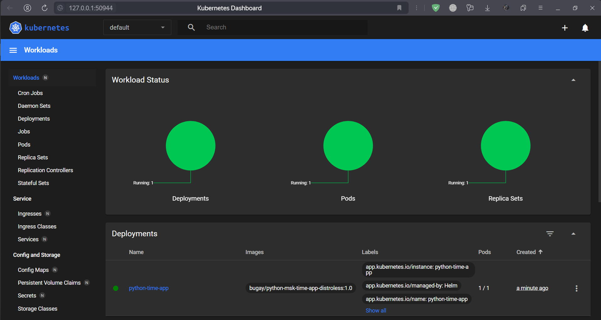

# Helm

---

## Task 1

Let me explain all the process to set up helm to run Python applicaiton:

- I adhered the instruction for creating a default template and changing it a bit to set up for my application:

```bash
E:\Innopolis\BS-3 (S25, S-2)\DevOps Engineering\Labs\S25-core-course-labs\k8s>helm create python-time-app

Creating python-time-app
```

- I installed python-time-app:

```bash
E:\Innopolis\BS-3 (S25, S-2)\DevOps Engineering\Labs\S25-core-course-labs\k8s>helm install python-time-app ./python-time-app

NAME: python-time-app
LAST DEPLOYED: Tue Feb 25 19:48:21 2025
NAMESPACE: default
STATUS: deployed
REVISION: 1
NOTES:
1. Get the application URL by running these commands:
  export POD_NAME=$(kubectl get pods --namespace default -l "app.kubernetes.io/name=python-time-app,app.kubernetes.io/instance=python-time-app" -o jsonpath="{.items[0].metadata.name}")
  export CONTAINER_PORT=$(kubectl get pod --namespace default $POD_NAME -o jsonpath="{.spec.containers[0].ports[0].containerPort}")
  echo "Visit http://127.0.0.1:8080 to use your application"
  kubectl --namespace default port-forward $POD_NAME 8080:$CONTAINER_PORT
```

- Then I ensured that all services are healthy using the minikube dashboard:

```bash
E:\Innopolis\BS-3 (S25, S-2)\DevOps Engineering\Labs\S25-core-course-labs\k8s>minikube dashboard

* Verifying dashboard health ...
* Launching proxy ...
* Verifying proxy health ...
* Opening http://127.0.0.1:51220/api/v1/namespaces/kubernetes-dashboard/services/http:kubernetes-dashboard:/proxy/ in your default browser...
```




- This is an output of `kubectl get pods,svc` command:

```bash
E:\Innopolis\BS-3 (S25, S-2)\DevOps Engineering\Labs\S25-core-course-labs\k8s>kubectl get pods,svc

NAME                                  READY   STATUS    RESTARTS   AGE
pod/python-time-app-b75bd44fb-wbq4b   1/1     Running   0          14m

NAME                      TYPE        CLUSTER-IP      EXTERNAL-IP   PORT(S)   AGE
service/kubernetes        ClusterIP   10.96.0.1       <none>        443/TCP   25h
service/python-time-app   ClusterIP   10.100.68.202   <none>        80/TCP    14m
```

- And then I accessed the application by the command `minikube service python-time-app`:

```bash
E:\Innopolis\BS-3 (S25, S-2)\DevOps Engineering\Labs\S25-core-course-labs\k8s>minikube service python-time-app

|-----------|-----------------|-------------|--------------|
| NAMESPACE |      NAME       | TARGET PORT |     URL      |
|-----------|-----------------|-------------|--------------|
| default   | python-time-app |             | No node port |
|-----------|-----------------|-------------|--------------|
* service default/python-time-app has no node port
! Services [default/python-time-app] have type "ClusterIP" not meant to be exposed, however for local development minikube allows you to access this !
* Starting tunnel for service python-time-app.
|-----------|-----------------|-------------|------------------------|
| NAMESPACE |      NAME       | TARGET PORT |          URL           |
|-----------|-----------------|-------------|------------------------|
| default   | python-time-app |             | http://127.0.0.1:51374 |
|-----------|-----------------|-------------|------------------------|
* Opening service default/python-time-app in default browser...
! Because you are using a Docker driver on windows, the terminal needs to be open to run it.
```


---

## Task 2

- I started with uninstalling application and creating hooks files;

- After that, I checked the configuration with `linting` and `dry-run installation` of helm hooks;

- Then I installed application after hooks adding;

- This is an output for required commands:

```bash
E:\Innopolis\BS-3 (S25, S-2)\DevOps Engineering\Labs\S25-core-course-labs\k8s>kubectl get po

NAME                              READY   STATUS      RESTARTS   AGE
postinstall-hook                  0/1     Completed   0          66s
preinstall-hook                   0/1     Completed   0          78s
python-time-app-b75bd44fb-5z98w   1/1     Running     0          66s
```

```bash
E:\Innopolis\BS-3 (S25, S-2)\DevOps Engineering\Labs\S25-core-course-labs\k8s>kubectl describe pod preinstall-hook

Name:             preinstall-hook
Namespace:        default
Priority:         0
Service Account:  default
Node:             minikube/192.168.49.2
Start Time:       Tue, 25 Feb 2025 20:50:08 +0300
Labels:           <none>
Annotations:      helm.sh/hook: pre-install
Status:           Succeeded
IP:               10.244.0.58
IPs:
  IP:  10.244.0.58
Containers:
  pre-install-container:
    Container ID:  docker://53c59ec7ef99cb9a367eddcf49a27aa0ef11e30a148f4205b3a0d6d6558ab497
    Image:         busybox
    Image ID:      docker-pullable://busybox@sha256:498a000f370d8c37927118ed80afe8adc38d1edcbfc071627d17b25c88efcab0
    Port:          <none>
    Host Port:     <none>
    Command:
      sh
      -c
      echo The pre-install hook is running && sleep 10
    State:          Terminated
      Reason:       Completed
      Exit Code:    0
      Started:      Tue, 25 Feb 2025 20:50:09 +0300
      Finished:     Tue, 25 Feb 2025 20:50:19 +0300
    Ready:          False
    Restart Count:  0
    Environment:    <none>
    Mounts:
      /var/run/secrets/kubernetes.io/serviceaccount from kube-api-access-j8h6v (ro)
Conditions:
  Type                        Status
  PodReadyToStartContainers   False
  Initialized                 True
  Ready                       False
  ContainersReady             False
  PodScheduled                True
Volumes:
  kube-api-access-j8h6v:
    Type:                    Projected (a volume that contains injected data from multiple sources)
    TokenExpirationSeconds:  3607
    ConfigMapName:           kube-root-ca.crt
    ConfigMapOptional:       <nil>
    DownwardAPI:             true
QoS Class:                   BestEffort
Node-Selectors:              <none>
Tolerations:                 node.kubernetes.io/not-ready:NoExecute op=Exists for 300s
                             node.kubernetes.io/unreachable:NoExecute op=Exists for 300s
Events:
  Type    Reason     Age   From               Message
  ----    ------     ----  ----               -------
  Normal  Scheduled  50s   default-scheduler  Successfully assigned default/preinstall-hook to minikube
  Normal  Pulled     49s   kubelet            Container image "busybox" already present on machine
  Normal  Created    49s   kubelet            Created container: pre-install-container
  Normal  Started    49s   kubelet            Started container pre-install-container
```

```bash
E:\Innopolis\BS-3 (S25, S-2)\DevOps Engineering\Labs\S25-core-course-labs\k8s>kubectl describe pod postinstall-hook
Name:             postinstall-hook
Namespace:        default
Priority:         0
Service Account:  default
Node:             minikube/192.168.49.2
Start Time:       Tue, 25 Feb 2025 20:50:20 +0300
Labels:           <none>
Annotations:      helm.sh/hook: post-install
Status:           Succeeded
IP:               10.244.0.60
IPs:
  IP:  10.244.0.60
Containers:
  post-install-container:
    Container ID:  docker://3aa1529ef50193a0a4d06a78fb9939f84b6c402aba3f6c52102f0ad8ebf6743b
    Image:         busybox
    Image ID:      docker-pullable://busybox@sha256:498a000f370d8c37927118ed80afe8adc38d1edcbfc071627d17b25c88efcab0
    Port:          <none>
    Host Port:     <none>
    Command:
      sh
      -c
      echo The post-install hook is running && sleep 5
    State:          Terminated
      Reason:       Completed
      Exit Code:    0
      Started:      Tue, 25 Feb 2025 20:50:24 +0300
      Finished:     Tue, 25 Feb 2025 20:50:29 +0300
    Ready:          False
    Restart Count:  0
    Environment:    <none>
    Mounts:
      /var/run/secrets/kubernetes.io/serviceaccount from kube-api-access-hnhk2 (ro)
Conditions:
  Type                        Status
  PodReadyToStartContainers   False
  Initialized                 True
  Ready                       False
  ContainersReady             False
  PodScheduled                True
Volumes:
  kube-api-access-hnhk2:
    Type:                    Projected (a volume that contains injected data from multiple sources)
    TokenExpirationSeconds:  3607
    ConfigMapName:           kube-root-ca.crt
    ConfigMapOptional:       <nil>
    DownwardAPI:             true
QoS Class:                   BestEffort
Node-Selectors:              <none>
Tolerations:                 node.kubernetes.io/not-ready:NoExecute op=Exists for 300s
                             node.kubernetes.io/unreachable:NoExecute op=Exists for 300s
Events:
  Type    Reason     Age   From               Message
  ----    ------     ----  ----               -------
  Normal  Scheduled  46s   default-scheduler  Successfully assigned default/postinstall-hook to minikube
  Normal  Pulling    46s   kubelet            Pulling image "busybox"
  Normal  Pulled     43s   kubelet            Successfully pulled image "busybox" in 2.489s (2.489s including waiting). Image size: 4269694 bytes.
  Normal  Created    43s   kubelet            Created container: post-install-container
  Normal  Started    43s   kubelet            Started container post-install-container
```

- At the end, I added hooks deletion policy (annotation `"helm.sh/hook-delete-policy": hook-succeeded`).

---

## Bonus Task

For this task I completed the same steps for my second (Scala) application. Then, I created library chart with labels template and setted up dependencies in other charts.

Updating dependencies:

```bash
E:\Innopolis\BS-3 (S25, S-2)\DevOps Engineering\Labs\S25-core-course-labs\k8s>helm dependency update ./python-time-app

Hang tight while we grab the latest from your chart repositories...
...Successfully got an update from the "stable" chart repository
Update Complete. ⎈Happy Helming!⎈
Saving 1 charts
Deleting outdated charts

E:\Innopolis\BS-3 (S25, S-2)\DevOps Engineering\Labs\S25-core-course-labs\k8s>helm dependency update ./scala-time-app

Hang tight while we grab the latest from your chart repositories...
...Successfully got an update from the "stable" chart repository
Update Complete. ⎈Happy Helming!⎈
Saving 1 charts
Deleting outdated charts
```

Reinstalling both applications:

```bash
E:\Innopolis\BS-3 (S25, S-2)\DevOps Engineering\Labs\S25-core-course-labs\k8s>helm install python-time-app ./python-time-app --set appName=python-time-app --set appVersion=1.0

NAME: python-time-app
LAST DEPLOYED: Tue Feb 25 21:46:42 2025
NAMESPACE: default
STATUS: deployed
REVISION: 1
NOTES:
1. Get the application URL by running these commands:
  export POD_NAME=$(kubectl get pods --namespace default -l "app.kubernetes.io/name=python-time-app,app.kubernetes.io/instance=python-time-app" -o jsonpath="{.items[0].metadata.name}")
  export CONTAINER_PORT=$(kubectl get pod --namespace default $POD_NAME -o jsonpath="{.spec.containers[0].ports[0].containerPort}")
  echo "Visit http://127.0.0.1:8080 to use your application"
  kubectl --namespace default port-forward $POD_NAME 8080:$CONTAINER_PORT

E:\Innopolis\BS-3 (S25, S-2)\DevOps Engineering\Labs\S25-core-course-labs\k8s>helm install scala-time-app ./scala-time-app --set appName=scala-time-app --set appVersion=1.0

NAME: scala-time-app
LAST DEPLOYED: Tue Feb 25 21:47:25 2025
NAMESPACE: default
STATUS: deployed
REVISION: 1
NOTES:
1. Get the application URL by running these commands:
  export POD_NAME=$(kubectl get pods --namespace default -l "app.kubernetes.io/name=scala-time-app,app.kubernetes.io/instance=scala-time-app" -o jsonpath="{.items[0].metadata.name}")
  export CONTAINER_PORT=$(kubectl get pod --namespace default $POD_NAME -o jsonpath="{.spec.containers[0].ports[0].containerPort}")
  echo "Visit http://127.0.0.1:8080 to use your application"
  kubectl --namespace default port-forward $POD_NAME 8080:$CONTAINER_PORT
```

And it is working, so I can access both applications by `minikube service python-time-app` and `minikube service scala-time-app` commands:


---
