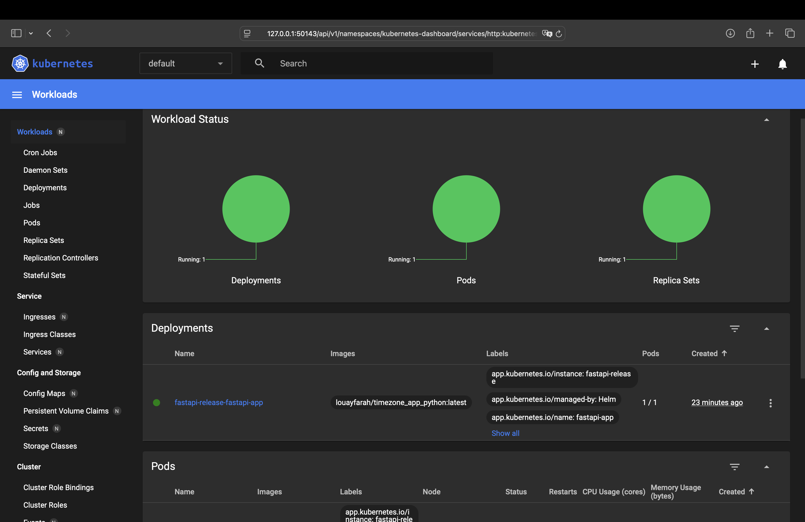

# HELM.md

## Task 1: Helm Setup and Chart Creation

### Starting minikube
```bash
(venv) louayfarah@Louays-MacBook-Pro S25-core-course-labs % minikube start
😄  minikube v1.35.0 on Darwin 15.1.1 (arm64)
✨  Using the docker driver based on existing profile
👍  Starting "minikube" primary control-plane node in "minikube" cluster
🚜  Pulling base image v0.0.46 ...
🔄  Restarting existing docker container for "minikube" ...
❗  Failing to connect to https://registry.k8s.io/ from both inside the minikube container and host machine
💡  To pull new external images, you may need to configure a proxy: https://minikube.sigs.k8s.io/docs/reference/networking/proxy/
🐳  Preparing Kubernetes v1.32.0 on Docker 27.4.1 ...
🔎  Verifying Kubernetes components...
    ▪ Using image registry.k8s.io/metrics-server/metrics-server:v0.7.2
    ▪ Using image gcr.io/k8s-minikube/storage-provisioner:v5
💡  After the addon is enabled, please run "minikube tunnel" and your ingress resources would be available at "127.0.0.1"
    ▪ Using image docker.io/kubernetesui/dashboard:v2.7.0
    ▪ Using image registry.k8s.io/ingress-nginx/kube-webhook-certgen:v1.4.4
    ▪ Using image docker.io/kubernetesui/metrics-scraper:v1.0.8
    ▪ Using image registry.k8s.io/ingress-nginx/kube-webhook-certgen:v1.4.4
    ▪ Using image registry.k8s.io/ingress-nginx/controller:v1.11.3
💡  Some dashboard features require the metrics-server addon. To enable all features please run:

        minikube addons enable metrics-server

🔎  Verifying ingress addon...
🌟  Enabled addons: dashboard, default-storageclass, storage-provisioner, metrics-server, ingress
🏄  Done! kubectl is now configured to use "minikube" cluster and "default" namespace by default
```

### Verifying Dashboard is working
```bash
(venv) louayfarah@Louays-MacBook-Pro S25-core-course-labs % minikube dashboard
🤔  Verifying dashboard health ...
🚀  Launching proxy ...
🤔  Verifying proxy health ...
🎉  Opening http://127.0.0.1:50143/api/v1/namespaces/kubernetes-dashboard/services/http:kubernetes-dashboard:/proxy/ in your default browser...
```

### Installing the release
```bash
(venv) louayfarah@Louays-MacBook-Pro k8s % helm install fastapi-release ./fastapi-app

NAME: fastapi-release
LAST DEPLOYED: Mon Mar  3 04:25:37 2025
NAMESPACE: default
STATUS: deployed
REVISION: 1
NOTES:
1. Get the application URL by running these commands:
  export POD_NAME=$(kubectl get pods --namespace default -l "app.kubernetes.io/name=fastapi-app,app.kubernetes.io/instance=fastapi-release" -o jsonpath="{.items[0].metadata.name}")
  export CONTAINER_PORT=$(kubectl get pod --namespace default $POD_NAME -o jsonpath="{.spec.containers[0].ports[0].containerPort}")
  echo "Visit http://127.0.0.1:8080 to use your application"
  kubectl --namespace default port-forward $POD_NAME 8080:$CONTAINER_PORT
```

### Changing configuration
**Values.yaml** updated with our Docker image `louayfarah/timezone_app_python:latest`.

**Deployment** listens on port 8000.

### Getting pods and services
```bash
(venv) louayfarah@Louays-MacBook-Pro k8s % kubectl get pods,svc

NAME                                               READY   STATUS    RESTARTS   AGE
pod/fastapi-release-fastapi-app-85f77cdf7d-scdg9   1/1     Running   0          8s

NAME                                  TYPE        CLUSTER-IP     EXTERNAL-IP   PORT(S)    AGE
service/fastapi-release-fastapi-app   ClusterIP   10.97.211.82   <none>        8000/TCP   8s
service/kubernetes                    ClusterIP   10.96.0.1      <none>        443/TCP    3d20h
```

and verifying access to the application:
```bash
(venv) louayfarah@Louays-MacBook-Pro k8s % minikube service fastapi-release-fastapi-app

|-----------|-----------------------------|-------------|--------------|
| NAMESPACE |            NAME             | TARGET PORT |     URL      |
|-----------|-----------------------------|-------------|--------------|
| default   | fastapi-release-fastapi-app |             | No node port |
|-----------|-----------------------------|-------------|--------------|
😿  service default/fastapi-release-fastapi-app has no node port
❗  Services [default/fastapi-release-fastapi-app] have type "ClusterIP" not meant to be exposed, however for local development minikube allows you to access this !
🏃  Starting tunnel for service fastapi-release-fastapi-app.
|-----------|-----------------------------|-------------|------------------------|
| NAMESPACE |            NAME             | TARGET PORT |          URL           |
|-----------|-----------------------------|-------------|------------------------|
| default   | fastapi-release-fastapi-app |             | http://127.0.0.1:50175 |
|-----------|-----------------------------|-------------|------------------------|
🎉  Opening service default/fastapi-release-fastapi-app in default browser...
❗  Because you are using a Docker driver on darwin, the terminal needs to be open to run it.
```

Screenshots of the Dashboard and working application



## Task 2: Helm Chart Hooks

### Hook Implementation
In `templates/hooks.yaml`

### Commands & Outputs
helm lint:

```bash
(venv) louayfarah@Louays-MacBook-Pro k8s % helm lint ./fastapi-app

==> Linting ./fastapi-app
[INFO] Chart.yaml: icon is recommended

1 chart(s) linted, 0 chart(s) failed
```

helm install:

```bash
(venv) louayfarah@Louays-MacBook-Pro k8s % helm install hook-release ./fastapi-app

NAME: hook-release
LAST DEPLOYED: Mon Mar  3 04:32:12 2025
NAMESPACE: default
STATUS: deployed
REVISION: 1
NOTES:
1. Get the application URL by running these commands:
  export POD_NAME=$(kubectl get pods --namespace default -l "app.kubernetes.io/name=fastapi-app,app.kubernetes.io/instance=hook-release" -o jsonpath="{.items[0].metadata.name}")
  export CONTAINER_PORT=$(kubectl get pod --namespace default $POD_NAME -o jsonpath="{.spec.containers[0].ports[0].containerPort}")
  echo "Visit http://127.0.0.1:8080 to use your application"
  kubectl --namespace default port-forward $POD_NAME 8080:$CONTAINER_PORT
```

helm list:

```bash
(venv) louayfarah@Louays-MacBook-Pro k8s % helm list
NAME            NAMESPACE       REVISION        UPDATED                                 STATUS          CHART                   APP VERSION
fastapi-release default         1               2025-03-03 04:25:37.449842 +0800 +08    deployed        fastapi-app-0.1.0       1.16.0     
hook-release    default         1               2025-03-03 04:32:12.55338 +0800 +08     deployed        fastapi-app-0.1.0       1.16.0
```

kubectl get po:

```bash
(venv) louayfarah@Louays-MacBook-Pro k8s % kubectl get po
NAME                                           READY   STATUS    RESTARTS   AGE
fastapi-release-fastapi-app-85f77cdf7d-scdg9   1/1     Running   0          19m
preinstall-hook                                0/1     Completed 0          12m
hook-release-fastapi-app-7d7fd77bb5-qj6jp      1/1     Running   0          12m
postinstall-hook                               0/1     Completed 0          11m
```


kubectl describe:
```bash

(venv) louayfarah@Louays-MacBook-Pro S25-core-course-labs % kubectl describe po preinstall-hook
Name:             preinstall-hook
Namespace:        default
Priority:         0
Service Account:  default
Node:             minikube/192.168.49.2
Start Time:       Mon, 03 Mar 2025 04:32:12 +0800
Labels:           <none>
Annotations:      helm.sh/hook: pre-install
                  helm.sh/hook-delete-policy: hook-succeeded
Status:           Running
IP:               10.244.0.43
IPs:
  IP:  10.244.0.43
Containers:
  preinstall-hook:
    Container ID:  docker://jad988eab16f47fcd90431e58329a136a63afc03f47087f45b4f5d2243a392nk
    Image:         busybox
    Image ID:      docker-pullable://busybox@sha256:jq81yah0910d8c37927118ed80afe8adc38d1edcbfc071627d17b25c88iwq911
    Port:          <none>
    Host Port:     <none>
    Command:
      sh
      -c
    Args:
      echo 'Running pre-install'; sleep 20
    State:          Running
      Started:      Mon, 03 Mar 2025 04:32:00 +0800
    Ready:          True
    Restart Count:  0
    Environment:    <none>
    Mounts:
      /var/run/secrets/kubernetes.io/serviceaccount from kube-api-access-2bknm (ro)
Conditions:
  Type                        Status
  PodReadyToStartContainers   True 
  Initialized                 True 
  Ready                       True 
  ContainersReady             True 
  PodScheduled                True 
Volumes:
  kube-api-access-2bknm:
    Type:                    Projected (a volume that contains injected data from multiple sources)
    TokenExpirationSeconds:  3607
    ConfigMapName:           kube-root-ca.crt
    ConfigMapOptional:       <nil>
    DownwardAPI:             true
QoS Class:                   BestEffort
Node-Selectors:              <none>
Tolerations:                 node.kubernetes.io/not-ready:NoExecute op=Exists for 300s
                             node.kubernetes.io/unreachable:NoExecute op=Exists for 300s
Events:
  Type    Reason     Age   From               Message
  ----    ------     ----  ----               -------
  Normal  Scheduled  13s   default-scheduler  Successfully assigned default/preinstall-hook to minikube
  Normal  Pulling    13s   kubelet            Pulling image "busybox"
  Normal  Pulled     5s    kubelet            Successfully pulled image "busybox" in 8.544s (8.544s including waiting). Image size: 4042190 bytes.
  Normal  Created    5s    kubelet            Created container: preinstall-hook
  Normal  Started    5s    kubelet            Started container preinstall-hook
```

```bash

(venv) louayfarah@Louays-MacBook-Pro S25-core-course-labs % kubectl describe po postinstall-hook
Name:             postinstall-hook
Namespace:        default
Priority:         0
Service Account:  default
Node:             minikube/192.168.49.2
Start Time:       Mon, 03 Mar 2025 04:32:12 +0800
Labels:           <none>
Annotations:      helm.sh/hook: post-install
                  helm.sh/hook-delete-policy: hook-succeeded
Status:           Running
IP:               10.244.0.42
IPs:
  IP:  10.244.0.42
Containers:
  postinstall-hook:
    Container ID:  docker://b35288eab16f47fcd90431e58329a136363afc03f47087f45b4f5d22439ee962
    Image:         busybox
    Image ID:      docker-pullable://busybox@sha256:498a000f370d8c37927118ed80afe8adc38d1edcbfc071627d17b25c88efcab0
    Port:          <none>
    Host Port:     <none>
    Command:
      sh
      -c
    Args:
      echo 'Running post-install'; sleep 20
    State:          Running
      Started:      Mon, 03 Mar 2025 04:32:21 +0800
    Ready:          True
    Restart Count:  0
    Environment:    <none>
    Mounts:
      /var/run/secrets/kubernetes.io/serviceaccount from kube-api-access-2bknm (ro)
Conditions:
  Type                        Status
  PodReadyToStartContainers   True 
  Initialized                 True 
  Ready                       True 
  ContainersReady             True 
  PodScheduled                True 
Volumes:
  kube-api-access-2bknm:
    Type:                    Projected (a volume that contains injected data from multiple sources)
    TokenExpirationSeconds:  3607
    ConfigMapName:           kube-root-ca.crt
    ConfigMapOptional:       <nil>
    DownwardAPI:             true
QoS Class:                   BestEffort
Node-Selectors:              <none>
Tolerations:                 node.kubernetes.io/not-ready:NoExecute op=Exists for 300s
                             node.kubernetes.io/unreachable:NoExecute op=Exists for 300s
Events:
  Type    Reason     Age   From               Message
  ----    ------     ----  ----               -------
  Normal  Scheduled  13s   default-scheduler  Successfully assigned default/postinstall-hook to minikube
  Normal  Pulling    13s   kubelet            Pulling image "busybox"
  Normal  Pulled     5s    kubelet            Successfully pulled image "busybox" in 8.544s (8.544s including waiting). Image size: 4042190 bytes.
  Normal  Created    5s    kubelet            Created container: postinstall-hook
  Normal  Started    5s    kubelet            Started container postinstall-hook
```


We see logs indicating the pods ran `sleep 20`, then completed. Because of `"helm.sh/hook-delete-policy": hook-succeeded`, these pods are removed after successful completion.
