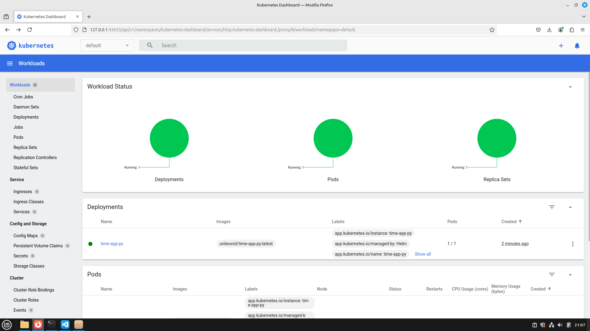

## Setup Helm chart with `helm create time-app-py`

```
Creating time-app-py
```

## Installed Helm chart with `helm install time-app-py ./time-app-py/`

```
NAME: time-app-py
LAST DEPLOYED: Sun Mar  2 21:05:00 2025
NAMESPACE: default
STATUS: deployed
REVISION: 1
NOTES:
1. Get the application URL by running these commands:
  export POD_NAME=$(kubectl get pods --namespace default -l "app.kubernetes.io/name=time-app-py,app.kubernetes.io/instance=time-app-py" -o jsonpath="{.items[0].metadata.name}")
  export CONTAINER_PORT=$(kubectl get pod --namespace default $POD_NAME -o jsonpath="{.spec.containers[0].ports[0].containerPort}")
  echo "Visit http://127.0.0.1:8080 to use your application"
  kubectl --namespace default port-forward $POD_NAME 8080:$CONTAINER_PORT
```

## Run commands to get application URL *(I replaced 8080 port to 8081 because it was already used)*

```
Visit http://127.0.0.1:8081 to use your application
Forwarding from 127.0.0.1:8081 -> 8080
Forwarding from [::1]:8081 -> 8080
Handling connection for 8081
```


## `minikube dashboard`

```
🔌  Enabling dashboard ...
    ▪ Using image docker.io/kubernetesui/dashboard:v2.7.0
    ▪ Using image docker.io/kubernetesui/metrics-scraper:v1.0.8
💡  Some dashboard features require the metrics-server addon. To enable all features please run:

	minikube addons enable metrics-server

🤔  Verifying dashboard health ...
🚀  Launching proxy ...
🤔  Verifying proxy health ...
🎉  Opening http://127.0.0.1:43633/api/v1/namespaces/kubernetes-dashboard/services/http:kubernetes-dashboard:/proxy/ in your default browser...
```



## `minikube service time-app-py`

```
|-----------|-------------|-------------|--------------|
| NAMESPACE |    NAME     | TARGET PORT |     URL      |
|-----------|-------------|-------------|--------------|
| default   | time-app-py |             | No node port |
|-----------|-------------|-------------|--------------|
😿  service default/time-app-py has no node port
❗  Services [default/time-app-py] have type "ClusterIP" not meant to be exposed, however for local development minikube allows you to access this !
🏃  Starting tunnel for service time-app-py.
|-----------|-------------|-------------|------------------------|
| NAMESPACE |    NAME     | TARGET PORT |          URL           |
|-----------|-------------|-------------|------------------------|
| default   | time-app-py |             | http://127.0.0.1:43021 |
|-----------|-------------|-------------|------------------------|
🎉  Opening service default/time-app-py in default browser...
❗  Because you are using a Docker driver on linux, the terminal needs to be open to run it.
```


## `kubectl get pods,svc`

```
NAME                               READY   STATUS    RESTARTS   AGE
pod/time-app-py-6c5d66c6b6-dk5nf   1/1     Running   0          8m43s

NAME                  TYPE        CLUSTER-IP       EXTERNAL-IP   PORT(S)   AGE
service/kubernetes    ClusterIP   10.96.0.1        <none>        443/TCP   3h21m
service/time-app-py   ClusterIP   10.101.231.232   <none>        80/TCP    8m43s
```

## `helm install --dry-run helm-hooks ./time-app-py/`

```
NAME: helm-hooks
LAST DEPLOYED: Sun Mar  2 21:19:11 2025
NAMESPACE: default
STATUS: pending-install
REVISION: 1
HOOKS:
---
# Source: time-app-py/templates/post-install-hook.yaml
apiVersion: v1
kind: Pod
metadata:
   name: postinstall-hook
   annotations:
       "helm.sh/hook": "post-install"
spec:
  containers:
  - name: post-install-container
    image: busybox
    imagePullPolicy: Always
    command: ['sh', '-c', 'echo The post-install hook is running && sleep 15' ]
  restartPolicy: Never
  terminationGracePeriodSeconds: 0
---
# Source: time-app-py/templates/pre-install-hook.yaml
apiVersion: v1
kind: Pod
metadata:
   name: preinstall-hook
   annotations:
       "helm.sh/hook": "pre-install"
spec:
  containers:
  - name: pre-install-container
    image: busybox
    imagePullPolicy: IfNotPresent
    command: ['sh', '-c', 'echo The pre-install hook is running && sleep 1' ]
  restartPolicy: Never
  terminationGracePeriodSeconds: 0
---
# Source: time-app-py/templates/tests/test-connection.yaml
apiVersion: v1
kind: Pod
metadata:
  name: "helm-hooks-time-app-py-test-connection"
  labels:
    helm.sh/chart: time-app-py-0.1.0
    app.kubernetes.io/name: time-app-py
    app.kubernetes.io/instance: helm-hooks
    app.kubernetes.io/version: "1.16.0"
    app.kubernetes.io/managed-by: Helm
  annotations:
    "helm.sh/hook": test
spec:
  containers:
    - name: wget
      image: busybox
      command: ['wget']
      args: ['helm-hooks-time-app-py:80']
  restartPolicy: Never
MANIFEST:
---
# Source: time-app-py/templates/serviceaccount.yaml
apiVersion: v1
kind: ServiceAccount
metadata:
  name: helm-hooks-time-app-py
  labels:
    helm.sh/chart: time-app-py-0.1.0
    app.kubernetes.io/name: time-app-py
    app.kubernetes.io/instance: helm-hooks
    app.kubernetes.io/version: "1.16.0"
    app.kubernetes.io/managed-by: Helm
automountServiceAccountToken: true
---
# Source: time-app-py/templates/service.yaml
apiVersion: v1
kind: Service
metadata:
  name: helm-hooks-time-app-py
  labels:
    helm.sh/chart: time-app-py-0.1.0
    app.kubernetes.io/name: time-app-py
    app.kubernetes.io/instance: helm-hooks
    app.kubernetes.io/version: "1.16.0"
    app.kubernetes.io/managed-by: Helm
spec:
  type: ClusterIP
  ports:
    - port: 80
      targetPort: http
      protocol: TCP
      name: http
  selector:
    app.kubernetes.io/name: time-app-py
    app.kubernetes.io/instance: helm-hooks
---
# Source: time-app-py/templates/deployment.yaml
apiVersion: apps/v1
kind: Deployment
metadata:
  name: helm-hooks-time-app-py
  labels:
    helm.sh/chart: time-app-py-0.1.0
    app.kubernetes.io/name: time-app-py
    app.kubernetes.io/instance: helm-hooks
    app.kubernetes.io/version: "1.16.0"
    app.kubernetes.io/managed-by: Helm
spec:
  replicas: 1
  selector:
    matchLabels:
      app.kubernetes.io/name: time-app-py
      app.kubernetes.io/instance: helm-hooks
  template:
    metadata:
      labels:
        helm.sh/chart: time-app-py-0.1.0
        app.kubernetes.io/name: time-app-py
        app.kubernetes.io/instance: helm-hooks
        app.kubernetes.io/version: "1.16.0"
        app.kubernetes.io/managed-by: Helm
    spec:
      serviceAccountName: helm-hooks-time-app-py
      containers:
        - name: time-app-py
          image: "unileonid/time-app-py:latest"
          imagePullPolicy: IfNotPresent
          ports:
            - name: http
              containerPort: 8080
              protocol: TCP
          livenessProbe:
            httpGet:
              path: /
              port: http
          readinessProbe:
            httpGet:
              path: /
              port: http
NOTES:
1. Get the application URL by running these commands:
  export POD_NAME=$(kubectl get pods --namespace default -l "app.kubernetes.io/name=time-app-py,app.kubernetes.io/instance=helm-hooks" -o jsonpath="{.items[0].metadata.name}")
  export CONTAINER_PORT=$(kubectl get pod --namespace default $POD_NAME -o jsonpath="{.spec.containers[0].ports[0].containerPort}")
  echo "Visit http://127.0.0.1:8080 to use your application"
  kubectl --namespace default port-forward $POD_NAME 8080:$CONTAINER_PORT
```

## `kubectl get po`

```
NAME                                      READY   STATUS      RESTARTS   AGE
helm-hooks-time-app-py-576d5885f4-j8n8q   1/1     Running     0          53s
postinstall-hook                          0/1     Completed   0          53s
preinstall-hook                           0/1     Completed   0          109s
time-app-py-6c5d66c6b6-dk5nf              1/1     Running     0          17m
```

## `kubectl describe po preinstall-hook`

```
Name:             preinstall-hook
Namespace:        default
Priority:         0
Service Account:  default
Node:             minikube/192.168.76.2
Start Time:       Sun, 02 Mar 2025 21:20:21 +0300
Labels:           <none>
Annotations:      helm.sh/hook: pre-install
Status:           Succeeded
IP:               10.244.0.24
IPs:
  IP:  10.244.0.24
Containers:
  pre-install-container:
    Container ID:  docker://5847103296a35905d305ae0d5df7b17e22fe421a3e7d75ab45bc7f0c9ac11ddd
    Image:         busybox
    Image ID:      docker-pullable://busybox@sha256:498a000f370d8c37927118ed80afe8adc38d1edcbfc071627d17b25c88efcab0
    Port:          <none>
    Host Port:     <none>
    Command:
      sh
      -c
      echo The pre-install hook is running && sleep 20
    State:          Terminated
      Reason:       Completed
      Exit Code:    0
      Started:      Sun, 02 Mar 2025 21:20:54 +0300
      Finished:     Sun, 02 Mar 2025 21:21:14 +0300
    Ready:          False
    Restart Count:  0
    Environment:    <none>
    Mounts:
      /var/run/secrets/kubernetes.io/serviceaccount from kube-api-access-njdwc (ro)
Conditions:
  Type                        Status
  PodReadyToStartContainers   False 
  Initialized                 True 
  Ready                       False 
  ContainersReady             False 
  PodScheduled                True 
Volumes:
  kube-api-access-njdwc:
    Type:                    Projected (a volume that contains injected data from multiple sources)
    TokenExpirationSeconds:  3607
    ConfigMapName:           kube-root-ca.crt
    ConfigMapOptional:       <nil>
    DownwardAPI:             true
QoS Class:                   BestEffort
Node-Selectors:              <none>
Tolerations:                 node.kubernetes.io/not-ready:NoExecute op=Exists for 300s
                             node.kubernetes.io/unreachable:NoExecute op=Exists for 300s
Events:
  Type     Reason     Age                   From               Message
  ----     ------     ----                  ----               -------
  Normal   Scheduled  2m24s                 default-scheduler  Successfully assigned default/preinstall-hook to minikube
  Warning  Failed     2m14s                 kubelet            Failed to pull image "busybox": Error response from daemon: Get "https://registry-1.docker.io/v2/": dial tcp [2600:1f18:2148:bc02:22:27bd:19a8:870c]:443: connect: network is unreachable
  Warning  Failed     2m14s                 kubelet            Error: ErrImagePull
  Normal   BackOff    2m14s                 kubelet            Back-off pulling image "busybox"
  Warning  Failed     2m14s                 kubelet            Error: ImagePullBackOff
  Normal   Pulling    119s (x2 over 2m23s)  kubelet            Pulling image "busybox"
  Normal   Pulled     111s                  kubelet            Successfully pulled image "busybox" in 7.909s (7.909s including waiting). Image size: 4269694 bytes.
  Normal   Created    111s                  kubelet            Created container: pre-install-container
  Normal   Started    110s                  kubelet            Started container pre-install-container
```

## `kubectl describe po postinstall-hook`

```
Name:             postinstall-hook
Namespace:        default
Priority:         0
Service Account:  default
Node:             minikube/192.168.76.2
Start Time:       Sun, 02 Mar 2025 21:21:17 +0300
Labels:           <none>
Annotations:      helm.sh/hook: post-install
Status:           Succeeded
IP:               10.244.0.26
IPs:
  IP:  10.244.0.26
Containers:
  post-install-container:
    Container ID:  docker://32c0d6afa2bacd9184e40895d397a2219d15c781c88ae99bac6fd91beb9c4dbb
    Image:         busybox
    Image ID:      docker-pullable://busybox@sha256:498a000f370d8c37927118ed80afe8adc38d1edcbfc071627d17b25c88efcab0
    Port:          <none>
    Host Port:     <none>
    Command:
      sh
      -c
      echo The post-install hook is running && sleep 15
    State:          Terminated
      Reason:       Completed
      Exit Code:    0
      Started:      Sun, 02 Mar 2025 21:21:49 +0300
      Finished:     Sun, 02 Mar 2025 21:22:04 +0300
    Ready:          False
    Restart Count:  0
    Environment:    <none>
    Mounts:
      /var/run/secrets/kubernetes.io/serviceaccount from kube-api-access-gnscs (ro)
Conditions:
  Type                        Status
  PodReadyToStartContainers   False 
  Initialized                 True 
  Ready                       False 
  ContainersReady             False 
  PodScheduled                True 
Volumes:
  kube-api-access-gnscs:
    Type:                    Projected (a volume that contains injected data from multiple sources)
    TokenExpirationSeconds:  3607
    ConfigMapName:           kube-root-ca.crt
    ConfigMapOptional:       <nil>
    DownwardAPI:             true
QoS Class:                   BestEffort
Node-Selectors:              <none>
Tolerations:                 node.kubernetes.io/not-ready:NoExecute op=Exists for 300s
                             node.kubernetes.io/unreachable:NoExecute op=Exists for 300s
Events:
  Type     Reason     Age                    From               Message
  ----     ------     ----                   ----               -------
  Normal   Scheduled  2m44s                  default-scheduler  Successfully assigned default/postinstall-hook to minikube
  Warning  Failed     2m26s                  kubelet            Failed to pull image "busybox": Error response from daemon: Get "https://registry-1.docker.io/v2/": net/http: request canceled while waiting for connection (Client.Timeout exceeded while awaiting headers)
  Warning  Failed     2m26s                  kubelet            Error: ErrImagePull
  Normal   BackOff    2m26s                  kubelet            Back-off pulling image "busybox"
  Warning  Failed     2m26s                  kubelet            Error: ImagePullBackOff
  Normal   Pulling    2m15s (x2 over 2m41s)  kubelet            Pulling image "busybox"
  Normal   Pulled     2m12s                  kubelet            Successfully pulled image "busybox" in 3.08s (3.08s including waiting). Image size: 4269694 bytes.
  Normal   Created    2m12s                  kubelet            Created container: post-install-container
  Normal   Started    2m12s                  kubelet            Started container post-install-container
```

## `kubectl get pods,svc`

```
NAME                                          READY   STATUS      RESTARTS   AGE
pod/helm-hooks-time-app-py-576d5885f4-j8n8q   1/1     Running     0          3m31s
pod/postinstall-hook                          0/1     Completed   0          3m31s
pod/preinstall-hook                           0/1     Completed   0          4m27s
pod/time-app-py-6c5d66c6b6-dk5nf              1/1     Running     0          19m

NAME                             TYPE        CLUSTER-IP       EXTERNAL-IP   PORT(S)   AGE
service/helm-hooks-time-app-py   ClusterIP   10.97.79.114     <none>        80/TCP    3m31s
service/kubernetes               ClusterIP   10.96.0.1        <none>        443/TCP   3h32m
service/time-app-py              ClusterIP   10.101.231.232   <none>        80/TCP    19m
```
