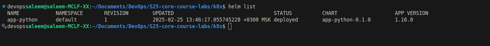

# HELM

## Table of contents

- [HELM](#helm)
  - [Table of contents](#table-of-contents)
  - [Creating a Helm chart for the Python app](#creating-a-helm-chart-for-the-python-app)

## Creating a Helm chart for the Python app
- After installing Helm, i created a template Helm chart for the Python app using `helm create app-python` command.

- Afterwards, I modified the `values.yaml` as require in the assignment

- Then i ran the `helm install` command to deploy the Python app.

    - 

    - 

- The service was created successfully and I was able to access the Python app using the external IP address.

    - 

    - 

- This can be checked by using `kubectl get po,svc` command also.

    - [kubectl statistic](images/kubectl%20statistics.png)

- Also can be checked using dashboard

    - 

    - 