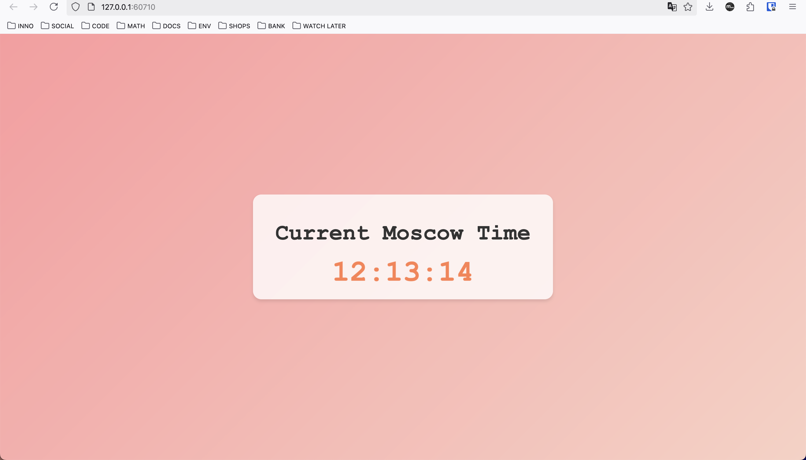

# Helm

## Installing chart for `moscow-time` application

```bash
➜  k8s git:(lab-10) ✗ helm install --name-template=moscow-time moscow-time
NAME: moscow-time
LAST DEPLOYED: Sat Feb 22 11:40:34 2025
NAMESPACE: default
STATUS: deployed
REVISION: 1
NOTES:
1. Get the application URL by running these commands:
  export POD_NAME=$(kubectl get pods --namespace default -l "app.kubernetes.io/name=moscow-time,app.kubernetes.io/instance=moscow-time" -o jsonpath="{.items[0].metadata.name}")
  export CONTAINER_PORT=$(kubectl get pod --namespace default $POD_NAME -o jsonpath="{.spec.containers[0].ports[0].containerPort}")
  echo "Visit http://127.0.0.1:8080 to use your application"
  kubectl --namespace default port-forward $POD_NAME 8080:$CONTAINER_PORT
➜  k8s git:(lab-10) ✗ minikube service moscow-time
|-----------|-------------|-------------|--------------|
| NAMESPACE |    NAME     | TARGET PORT |     URL      |
|-----------|-------------|-------------|--------------|
| default   | moscow-time |             | No node port |
|-----------|-------------|-------------|--------------|
😿  service default/moscow-time has no node port
❗  Services [default/moscow-time] have type "ClusterIP" not meant to be exposed, however for local development minikube allows you to access this !
🏃  Starting tunnel for service moscow-time.
|-----------|-------------|-------------|------------------------|
| NAMESPACE |    NAME     | TARGET PORT |          URL           |
|-----------|-------------|-------------|------------------------|
| default   | moscow-time |             | http://127.0.0.1:56698 |
|-----------|-------------|-------------|------------------------|
🎉  Opening service default/moscow-time in default browser...
❗  Because you are using a Docker driver on darwin, the terminal needs to be open to run it.
```




