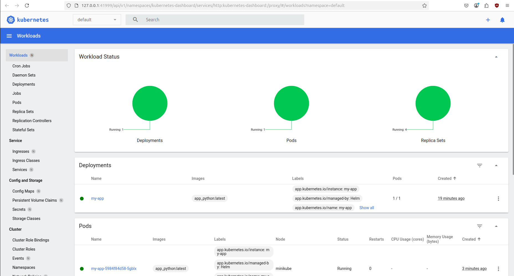

# Helm app 

### Output after upgrading (I installed it previously)

```bash
Release "my-app" has been upgraded. Happy Helming!
NAME: my-app
LAST DEPLOYED: Sat Mar 15 13:31:17 2025
NAMESPACE: default
STATUS: deployed
REVISION: 6
NOTES:
1. Get the application URL by running these commands:
  export POD_NAME=$(kubectl get pods --namespace default -l "app.kubernetes.io/name=my-app,app.kubernetes.io/instance=my-app" -o jsonpath="{.items[0].metadata.name}")
  export CONTAINER_PORT=$(kubectl get pod --namespace default $POD_NAME -o jsonpath="{.spec.containers[0].ports[0].containerPort}")
  echo "Visit http://127.0.0.1:8080 to use your application"
  kubectl --namespace default port-forward $POD_NAME 8080:$CONTAINER_PORT
  ```

### Output from ```bash kubectl get pods,svc```

```bash
NAME                          READY   STATUS    RESTARTS   AGE
pod/my-app-5984f84d58-5gblx   1/1     Running   0          13s

NAME                 TYPE        CLUSTER-IP    EXTERNAL-IP   PORT(S)   AGE
service/kubernetes   ClusterIP   10.96.0.1     <none>        443/TCP   18m
service/my-app       ClusterIP   10.111.9.86   <none>        80/TCP    16m
```

### Output from kubectl describe pod

```bash
Name:             my-app-5984f84d58-5gblx
Namespace:        default
Priority:         0
Service Account:  my-app
Node:             minikube/192.168.49.2
Start Time:       Sat, 15 Mar 2025 13:31:17 +0300
Labels:           app.kubernetes.io/instance=my-app
                  app.kubernetes.io/managed-by=Helm
                  app.kubernetes.io/name=my-app
                  app.kubernetes.io/version=1.16.0
                  helm.sh/chart=my-app-0.1.0
                  pod-template-hash=5984f84d58
Annotations:      <none>
Status:           Running
IP:               10.244.0.8
IPs:
  IP:           10.244.0.8
Controlled By:  ReplicaSet/my-app-5984f84d58
Containers:
  my-app:
    Container ID:   docker://6e0856b23d9dac939269a66f1dbf3eb0945fc671aa5175fcd36b07248e7a1590
    Image:          app_python:latest
    Image ID:       docker://sha256:91fff24401005dd01d623da9b00d18deabcf5e53b6773a2f9ec0b5fbe6552b05
    Port:           80/TCP
    Host Port:      0/TCP
    State:          Running
      Started:      Sat, 15 Mar 2025 13:31:17 +0300
    Ready:          True
    Restart Count:  0
    Liveness:       http-get http://:8080/ delay=0s timeout=1s period=10s #success=1 #failure=3
    Readiness:      http-get http://:8080/ delay=10s timeout=1s period=5s #success=1 #failure=3
    Environment:    <none>
    Mounts:
      /var/run/secrets/kubernetes.io/serviceaccount from kube-api-access-2mpbc (ro)
Conditions:
  Type                        Status
  PodReadyToStartContainers   True 
  Initialized                 True 
  Ready                       True 
  ContainersReady             True 
  PodScheduled                True 
Volumes:
  kube-api-access-2mpbc:
    Type:                    Projected (a volume that contains injected data from multiple sources)
    TokenExpirationSeconds:  3607
    ConfigMapName:           kube-root-ca.crt
    ConfigMapOptional:       <nil>
    DownwardAPI:             true
QoS Class:                   BestEffort
Node-Selectors:              <none>
Tolerations:                 node.kubernetes.io/not-ready:NoExecute op=Exists for 300s
                             node.kubernetes.io/unreachable:NoExecute op=Exists for 300s
Events:
  Type    Reason     Age   From               Message
  ----    ------     ----  ----               -------
  Normal  Scheduled  27s   default-scheduler  Successfully assigned default/my-app-5984f84d58-5gblx to minikube
  Normal  Pulled     27s   kubelet            Container image "app_python:latest" already present on machine
  Normal  Created    27s   kubelet            Created container: my-app
  Normal  Started    26s   kubelet            Started container my-app
```

### Here is screenshot from minikube dashboard:




### Output from minikube service my-app
```bash
|-----------|--------|-------------|--------------|
| NAMESPACE |  NAME  | TARGET PORT |     URL      |
|-----------|--------|-------------|--------------|
| default   | my-app |             | No node port |
|-----------|--------|-------------|--------------|
😿  service default/my-app has no node port
❗  Services [default/my-app] have type "ClusterIP" not meant to be exposed, however for local development minikube allows you to access this !
🏃  Starting tunnel for service my-app.
|-----------|--------|-------------|------------------------|
| NAMESPACE |  NAME  | TARGET PORT |          URL           |
|-----------|--------|-------------|------------------------|
| default   | my-app |             | http://127.0.0.1:46685 |
|-----------|--------|-------------|------------------------|
🎉  Opening service default/my-app in default browser...
❗  Because you are using a Docker driver on linux, the terminal needs to be open to run it.
Gtk-Message: 13:32:52.451: Not loading module "atk-bridge": The functionality is provided by GTK natively. Please try to not load it.
```

### Get pods,svc once more

```bash
NAME                          READY   STATUS    RESTARTS   AGE
pod/my-app-5984f84d58-5gblx   1/1     Running   0          7m46s

NAME                 TYPE        CLUSTER-IP    EXTERNAL-IP   PORT(S)   AGE
service/kubernetes   ClusterIP   10.96.0.1     <none>        443/TCP   25m
service/my-app       ClusterIP   10.111.9.86   <none>        80/TCP    24m
```

## Task 2

### Output of kubectl get po (after hooks installation)

```bash
NAME                                 READY   STATUS      RESTARTS   AGE
helm-hooks-my-app-775c6b7c5c-z8x92   1/1     Running     0          111s
my-app-5984f84d58-5gblx              1/1     Running     0          5h58m
post-install-hook                    0/1     Completed   0          111s
pre-install-hook                     0/1     Completed   0          2m27s
```

### Output of kubectl describe po pre-install-hook

```bash
Name:             pre-install-hook
Namespace:        default
Priority:         0
Service Account:  default
Node:             minikube/192.168.49.2
Start Time:       Sat, 15 Mar 2025 19:27:30 +0300
Labels:           <none>
Annotations:      helm.sh/hook: pre-install
                  helm.sh/hook-delete-policy: before-hook-creation
Status:           Succeeded
IP:               10.244.0.26
IPs:
  IP:  10.244.0.26
Containers:
  pre-install-container:
    Container ID:  docker://ae348595556164ceaa63c3c5906cf8bd55890d5617a084d553f30e4ba2d1e0b6
    Image:         busybox
    Image ID:      docker-pullable://busybox@sha256:498a000f370d8c37927118ed80afe8adc38d1edcbfc071627d17b25c88efcab0
    Port:          <none>
    Host Port:     <none>
    Command:
      /bin/sh
      -c
      echo Pre-install Hook Running; sleep 20
    State:          Terminated
      Reason:       Completed
      Exit Code:    0
      Started:      Sat, 15 Mar 2025 19:27:44 +0300
      Finished:     Sat, 15 Mar 2025 19:28:04 +0300
    Ready:          False
    Restart Count:  0
    Environment:    <none>
    Mounts:
      /var/run/secrets/kubernetes.io/serviceaccount from kube-api-access-6ctdf (ro)
Conditions:
  Type                        Status
  PodReadyToStartContainers   False 
  Initialized                 True 
  Ready                       False 
  ContainersReady             False 
  PodScheduled                True 
Volumes:
  kube-api-access-6ctdf:
    Type:                    Projected (a volume that contains injected data from multiple sources)
    TokenExpirationSeconds:  3607
    ConfigMapName:           kube-root-ca.crt
    ConfigMapOptional:       <nil>
    DownwardAPI:             true
QoS Class:                   BestEffort
Node-Selectors:              <none>
Tolerations:                 node.kubernetes.io/not-ready:NoExecute op=Exists for 300s
                             node.kubernetes.io/unreachable:NoExecute op=Exists for 300s
Events:
  Type    Reason     Age   From               Message
  ----    ------     ----  ----               -------
  Normal  Scheduled  98s   default-scheduler  Successfully assigned default/pre-install-hook to minikube
  Normal  Pulling    97s   kubelet            Pulling image "busybox"
  Normal  Pulled     84s   kubelet            Successfully pulled image "busybox" in 13.118s (13.118s including waiting). Image size: 4269694 bytes.
  Normal  Created    84s   kubelet            Created container: pre-install-container
  Normal  Started    84s   kubelet            Started container pre-install-container
```

### Output of kubectl describe po post-install-hook

```bash
Name:             post-install-hook
Namespace:        default
Priority:         0
Service Account:  default
Node:             minikube/192.168.49.2
Start Time:       Sat, 15 Mar 2025 19:28:06 +0300
Labels:           <none>
Annotations:      helm.sh/hook: post-install
                  helm.sh/hook-delete-policy: before-hook-creation
Status:           Succeeded
IP:               10.244.0.28
IPs:
  IP:  10.244.0.28
Containers:
  post-install-container:
    Container ID:  docker://94c44901bf6a1be1b20479beeae56b6389e015da6562b3021a9638c2d9985619
    Image:         busybox
    Image ID:      docker-pullable://busybox@sha256:498a000f370d8c37927118ed80afe8adc38d1edcbfc071627d17b25c88efcab0
    Port:          <none>
    Host Port:     <none>
    Command:
      /bin/sh
      -c
      echo Post-install Hook Running; sleep 20
    State:          Terminated
      Reason:       Completed
      Exit Code:    0
      Started:      Sat, 15 Mar 2025 19:28:09 +0300
      Finished:     Sat, 15 Mar 2025 19:28:29 +0300
    Ready:          False
    Restart Count:  0
    Environment:    <none>
    Mounts:
      /var/run/secrets/kubernetes.io/serviceaccount from kube-api-access-fw872 (ro)
Conditions:
  Type                        Status
  PodReadyToStartContainers   False 
  Initialized                 True 
  Ready                       False 
  ContainersReady             False 
  PodScheduled                True 
Volumes:
  kube-api-access-fw872:
    Type:                    Projected (a volume that contains injected data from multiple sources)
    TokenExpirationSeconds:  3607
    ConfigMapName:           kube-root-ca.crt
    ConfigMapOptional:       <nil>
    DownwardAPI:             true
QoS Class:                   BestEffort
Node-Selectors:              <none>
Tolerations:                 node.kubernetes.io/not-ready:NoExecute op=Exists for 300s
                             node.kubernetes.io/unreachable:NoExecute op=Exists for 300s
Events:
  Type    Reason     Age   From               Message
  ----    ------     ----  ----               -------
  Normal  Scheduled  78s   default-scheduler  Successfully assigned default/post-install-hook to minikube
  Normal  Pulling    78s   kubelet            Pulling image "busybox"
  Normal  Pulled     75s   kubelet            Successfully pulled image "busybox" in 2.263s (2.263s including waiting). Image size: 4269694 bytes.
  Normal  Created    75s   kubelet            Created container: post-install-container
  Normal  Started    75s   kubelet            Started container post-install-container
```