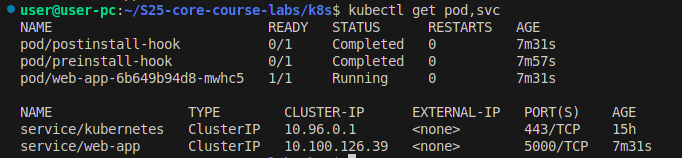

# Task 1

```bash
kubectl get pods,svc
```


```bash
minikube service web-app
```


# Task 2


```bash
kubectl describe po preinstall-hook
```
```
Name:             preinstall-hook
Namespace:        default
Priority:         0
Service Account:  default
Node:             minikube/192.168.49.2
Start Time:       Tue, 08 Apr 2025 15:49:51 +0300
Labels:           <none>
Annotations:      helm.sh/hook: pre-install
Status:           Succeeded
IP:               10.244.0.18
IPs:
  IP:  10.244.0.18
Containers:
  pre-install-container:
    Container ID:  docker://ddfce017c45478acbf83546b68d840b4759e6df35bd86645613b73244d563c9e
    Image:         busybox
    Image ID:      docker-pullable://busybox@sha256:37f7b378a29ceb4c551b1b5582e27747b855bbfaa73fa11914fe0df028dc581f
    Port:          <none>
    Host Port:     <none>
    Command:
      sh
      -c
      echo The pre-install hook is running && sleep 20
    State:          Terminated
      Reason:       Completed
      Exit Code:    0
      Started:      Tue, 08 Apr 2025 15:49:55 +0300
      Finished:     Tue, 08 Apr 2025 15:50:16 +0300
    Ready:          False
    Restart Count:  0
    Environment:    <none>
    Mounts:
      /var/run/secrets/kubernetes.io/serviceaccount from kube-api-access-hzf5b (ro)
Conditions:
  Type                        Status
  PodReadyToStartContainers   False 
  Initialized                 True 
  Ready                       False 
  ContainersReady             False 
  PodScheduled                True 
Volumes:
  kube-api-access-hzf5b:
    Type:                    Projected (a volume that contains injected data from multiple sources)
    TokenExpirationSeconds:  3607
    ConfigMapName:           kube-root-ca.crt
    ConfigMapOptional:       <nil>
    DownwardAPI:             true
QoS Class:                   BestEffort
Node-Selectors:              <none>
Tolerations:                 node.kubernetes.io/not-ready:NoExecute op=Exists for 300s
                             node.kubernetes.io/unreachable:NoExecute op=Exists for 300s
Events:
  Type    Reason     Age    From               Message
  ----    ------     ----   ----               -------
  Normal  Scheduled  8m37s  default-scheduler  Successfully assigned default/preinstall-hook to minikube
  Normal  Pulling    8m37s  kubelet            Pulling image "busybox"
  Normal  Pulled     8m33s  kubelet            Successfully pulled image "busybox" in 4.279s (4.279s including waiting). Image size: 4277910 bytes.
  Normal  Created    8m33s  kubelet            Created container: pre-install-container
  Normal  Started    8m32s  kubelet            Started container pre-install-container
```

```bash
kubectl describe po postinstall-hook
```
```
Name:             postinstall-hook
Namespace:        default
Priority:         0
Service Account:  default
Node:             minikube/192.168.49.2
Start Time:       Tue, 08 Apr 2025 15:50:17 +0300
Labels:           <none>
Annotations:      helm.sh/hook: post-install
Status:           Succeeded
IP:               10.244.0.20
IPs:
  IP:  10.244.0.20
Containers:
  post-install-container:
    Container ID:  docker://78db7976a109605a1c17733a2b1f8b54b52018f4f4b66efaf0f9a1e3b1ccc166
    Image:         busybox
    Image ID:      docker-pullable://busybox@sha256:37f7b378a29ceb4c551b1b5582e27747b855bbfaa73fa11914fe0df028dc581f
    Port:          <none>
    Host Port:     <none>
    Command:
      sh
      -c
      echo The post-install hook is running && sleep 20
    State:          Terminated
      Reason:       Completed
      Exit Code:    0
      Started:      Tue, 08 Apr 2025 15:50:19 +0300
      Finished:     Tue, 08 Apr 2025 15:50:39 +0300
    Ready:          False
    Restart Count:  0
    Environment:    <none>
    Mounts:
      /var/run/secrets/kubernetes.io/serviceaccount from kube-api-access-qdb6q (ro)
Conditions:
  Type                        Status
  PodReadyToStartContainers   False 
  Initialized                 True 
  Ready                       False 
  ContainersReady             False 
  PodScheduled                True 
Volumes:
  kube-api-access-qdb6q:
    Type:                    Projected (a volume that contains injected data from multiple sources)
    TokenExpirationSeconds:  3607
    ConfigMapName:           kube-root-ca.crt
    ConfigMapOptional:       <nil>
    DownwardAPI:             true
QoS Class:                   BestEffort
Node-Selectors:              <none>
Tolerations:                 node.kubernetes.io/not-ready:NoExecute op=Exists for 300s
                             node.kubernetes.io/unreachable:NoExecute op=Exists for 300s
Events:
  Type    Reason     Age    From               Message
  ----    ------     ----   ----               -------
  Normal  Scheduled  8m50s  default-scheduler  Successfully assigned default/postinstall-hook to minikube
  Normal  Pulling    8m50s  kubelet            Pulling image "busybox"
  Normal  Pulled     8m48s  kubelet            Successfully pulled image "busybox" in 1.531s (1.531s including waiting). Image size: 4277910 bytes.
  Normal  Created    8m48s  kubelet            Created container: post-install-container
  Normal  Started    8m48s  kubelet            Started container post-install-container
```
## Adding hook delete policy
Before adding the delete policy I'll delete the old hooks:


After adding the hook delete policy we will not see `preinstall-hook` and `postinstall-hook` when we run :
```bash
kubectl get pods,svc
```

