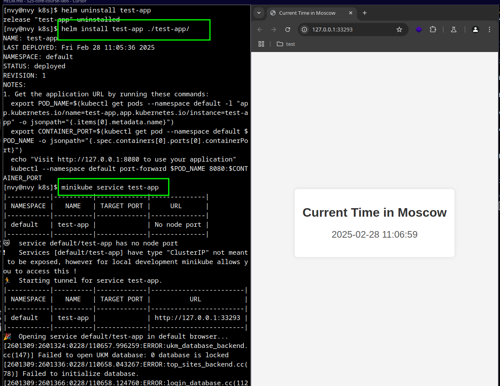

# Task 1

> Modify the containerPort setting in the deployment.yml file.
Instead of ContainerPort setting changes in `deployment.yml` I just fixed it in `values.yaml` file.

Output of commands:
```bash 
$ helm install test-app ./test-app

NAME: test-app
LAST DEPLOYED: Fri Feb 28 10:38:18 2025
NAMESPACE: default
STATUS: deployed
REVISION: 1
NOTES:
1. Get the application URL by running these commands:
  export POD_NAME=$(kubectl get pods --namespace default -l "app.kubernetes.io/name=test-app,app.kubernetes.io/instance=test-app" -o jsonpath="{.items[0].metadata.name}")
  export CONTAINER_PORT=$(kubectl get pod --namespace default $POD_NAME -o jsonpath="{.spec.containers[0].ports[0].containerPort}")
  echo "Visit http://127.0.0.1:8080 to use your application"
  kubectl --namespace default port-forward $POD_NAME 8080:$CONTAINER_PORT

$ kubectl get pods,svc

NAME                            READY   STATUS    RESTARTS   AGE
pod/test-app-5cdf7d8b56-rd7w6   1/1     Running   0          2m6s

NAME                 TYPE        CLUSTER-IP       EXTERNAL-IP   PORT(S)   AGE
service/kubernetes   ClusterIP   10.96.0.1        <none>        443/TCP   19h
service/test-app     ClusterIP   10.100.156.102   <none>        80/TCP    2m6s
```

Output of the `minikube service test-app`


# Task 2

Output of step 4:
```bash
[nvy@nvy k8s]$ kubectl get pods,svc
NAME                            READY   STATUS      RESTARTS   AGE
pod/post-install-hook           0/1     Completed   0          2m56s
pod/pre-install-hook            0/1     Completed   0          3m20s
pod/test-app-5cdf7d8b56-pf6l9   1/1     Running     0          2m56s

NAME                 TYPE        CLUSTER-IP     EXTERNAL-IP   PORT(S)   AGE
service/kubernetes   ClusterIP   10.96.0.1      <none>        443/TCP   21h
service/test-app     ClusterIP   10.99.107.68   <none>        80/TCP    2m56s
[nvy@nvy k8s]$ kubectl get po

NAME                        READY   STATUS      RESTARTS   AGE
post-install-hook           0/1     Completed   0          2m3s
pre-install-hook            0/1     Completed   0          2m27s
test-app-5cdf7d8b56-pf6l9   1/1     Running     0          2m3s
[nvy@nvy k8s]$ kubectl describe po pre-install-hook

Name:             pre-install-hook
Namespace:        default
Priority:         0
Service Account:  default
Node:             minikube/192.168.49.2
Start Time:       Fri, 28 Feb 2025 12:13:23 +0300
Labels:           <none>
Annotations:      helm.sh/hook: pre-install
Status:           Succeeded
IP:               10.244.0.39
IPs:
  IP:  10.244.0.39
Containers:
  pre-install-container:
    Container ID:  docker://fe037d0cb6e1a6d18550c898531e7982ba170aa0948b641be4796c63257aca97
    Image:         busybox
    Image ID:      docker-pullable://busybox@sha256:498a000f370d8c37927118ed80afe8adc38d1edcbfc071627d17b25c88efcab0
    Port:          <none>
    Host Port:     <none>
    Command:
      sh
      -c
      sleep 20
    State:          Terminated
      Reason:       Completed
      Exit Code:    0
      Started:      Fri, 28 Feb 2025 12:13:25 +0300
      Finished:     Fri, 28 Feb 2025 12:13:45 +0300
    Ready:          False
    Restart Count:  0
    Environment:    <none>
    Mounts:
      /var/run/secrets/kubernetes.io/serviceaccount from kube-api-access-2wt2m (ro)
Conditions:
  Type                        Status
  PodReadyToStartContainers   False
  Initialized                 True
  Ready                       False
  ContainersReady             False
  PodScheduled                True
Volumes:
  kube-api-access-2wt2m:
    Type:                    Projected (a volume that contains injected data from multiple sources)
    TokenExpirationSeconds:  3607
    ConfigMapName:           kube-root-ca.crt
    ConfigMapOptional:       <nil>
    DownwardAPI:             true
QoS Class:                   BestEffort
Node-Selectors:              <none>
Tolerations:                 node.kubernetes.io/not-ready:NoExecute op=Exists for 300s
                             node.kubernetes.io/unreachable:NoExecute op=Exists for 300s
Events:
  Type    Reason     Age    From               Message
  ----    ------     ----   ----               -------
  Normal  Scheduled  2m38s  default-scheduler  Successfully assigned default/pre-install-hook to minikube
  Normal  Pulling    2m37s  kubelet            Pulling image "busybox"
  Normal  Pulled     2m36s  kubelet            Successfully pulled image "busybox" in 1.377s (1.377s including waiting). Image size: 4269678 bytes.
  Normal  Created    2m36s  kubelet            Created container: pre-install-container
  Normal  Started    2m36s  kubelet            Started container pre-install-container
[nvy@nvy k8s]$ kubectl describe po post-install-hook
Name:             post-install-hook
Namespace:        default
Priority:         0
Service Account:  default
Node:             minikube/192.168.49.2
Start Time:       Fri, 28 Feb 2025 12:13:47 +0300
Labels:           <none>
Annotations:      helm.sh/hook: post-install
Status:           Succeeded
IP:               10.244.0.41
IPs:
  IP:  10.244.0.41
Containers:
  post-install-container:
    Container ID:  docker://347b50dcbcccfa3428590ae7130990abbe64de556387847346c7bafbe746e656
    Image:         busybox
    Image ID:      docker-pullable://busybox@sha256:498a000f370d8c37927118ed80afe8adc38d1edcbfc071627d17b25c88efcab0
    Port:          <none>
    Host Port:     <none>
    Command:
      sh
      -c
      sleep 20
    State:          Terminated
      Reason:       Completed
      Exit Code:    0
      Started:      Fri, 28 Feb 2025 12:13:49 +0300
      Finished:     Fri, 28 Feb 2025 12:14:09 +0300
    Ready:          False
    Restart Count:  0
    Environment:    <none>
    Mounts:
      /var/run/secrets/kubernetes.io/serviceaccount from kube-api-access-jl56h (ro)
Conditions:
  Type                        Status
  PodReadyToStartContainers   False
  Initialized                 True
  Ready                       False
  ContainersReady             False
  PodScheduled                True
Volumes:
  kube-api-access-jl56h:
    Type:                    Projected (a volume that contains injected data from multiple sources)
    TokenExpirationSeconds:  3607
    ConfigMapName:           kube-root-ca.crt
    ConfigMapOptional:       <nil>
    DownwardAPI:             true
QoS Class:                   BestEffort
Node-Selectors:              <none>
Tolerations:                 node.kubernetes.io/not-ready:NoExecute op=Exists for 300s
                             node.kubernetes.io/unreachable:NoExecute op=Exists for 300s
Events:
  Type    Reason     Age    From               Message
  ----    ------     ----   ----               -------
  Normal  Scheduled  2m18s  default-scheduler  Successfully assigned default/post-install-hook to minikube
  Normal  Pulling    2m18s  kubelet            Pulling image "busybox"
  Normal  Pulled     2m17s  kubelet            Successfully pulled image "busybox" in 1.326s (1.326s including waiting). Image size: 4269678 bytes.
  Normal  Created    2m17s  kubelet            Created container: post-install-container
  Normal  Started    2m17s  kubelet            Started container post-install-container

# clean up
[nvy@nvy k8s]$ helm uninstall test-app
release "test-app" uninstalled
[nvy@nvy k8s]$ minikube stop
```