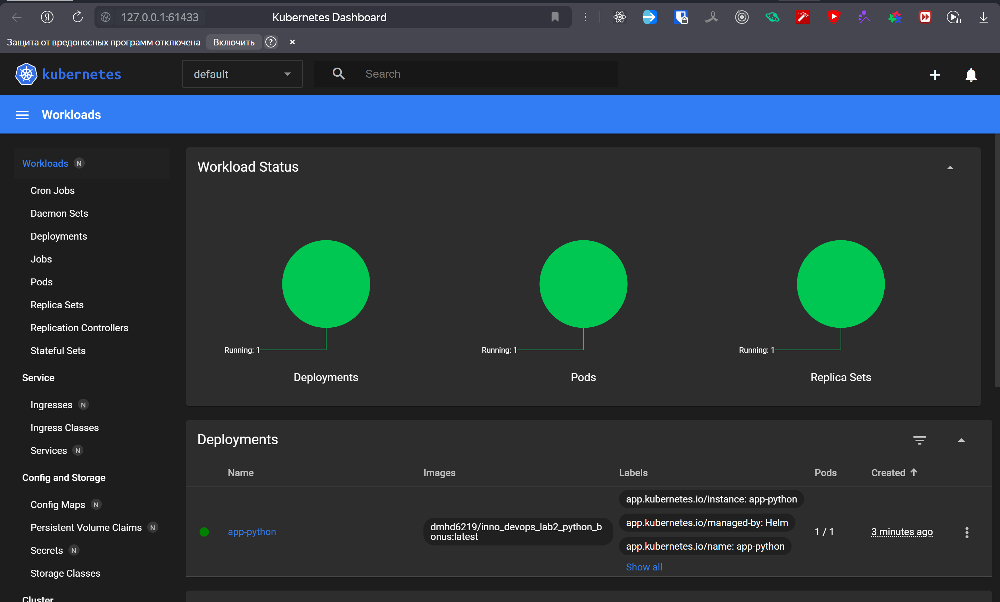

# Lab 10: Introduction to Helm

## Task 1: Helm Setup and Chart Creation

### Create Heml chart

`helm create app-python`

```
PS C:\Projects\University\S25\DevOps\S25-core-course-labs\k8s> helm create app-python
Creating app-python
```

`helm install app-python ./app-python`

```
PS C:\Projects\University\S25\DevOps\S25-core-course-labs\k8s> helm install app-python ./app-python
NAME: app-python
LAST DEPLOYED: Sat Mar  1 21:54:04 2025
NAMESPACE: default
STATUS: deployed
REVISION: 1
NOTES:
1. Get the application URL by running these commands:
  http://app-python.local/
```

`kubectl get pods,svc`

```
PS C:\Projects\University\S25\DevOps\S25-core-course-labs\k8s> kubectl get pods,svc                        
NAME                              READY   STATUS    RESTARTS   AGE
pod/app-python-696b768f9d-xtl4s   1/1     Running   0          30s

NAME                 TYPE        CLUSTER-IP       EXTERNAL-IP   PORT(S)   AGE
service/app-python   ClusterIP   10.100.178.151   <none>        80/TCP    31s
service/kubernetes   ClusterIP   10.96.0.1        <none>        443/TCP   21m
```

### Verify Helm chart

`minikube service --all`

```
PS C:\Projects\University\S25\DevOps\S25-core-course-labs\k8s> minikube service --all                          
|-----------|------------|-------------|--------------|
| NAMESPACE |    NAME    | TARGET PORT |     URL      |
|-----------|------------|-------------|--------------|
| default   | app-python |             | No node port |
|-----------|------------|-------------|--------------|
* service default/app-python has no node port
|-----------|------------|-------------|--------------|
| NAMESPACE |    NAME    | TARGET PORT |     URL      |
|-----------|------------|-------------|--------------|
| default   | kubernetes |             | No node port |
|-----------|------------|-------------|--------------|
* service default/kubernetes has no node port
! Services [default/app-python default/kubernetes] have type "ClusterIP" not meant to be exposed, however for local development minikube allows you to access this !    
* Starting tunnel for service app-python.
* Starting tunnel for service kubernetes.
|-----------|------------|-------------|------------------------|
| NAMESPACE |    NAME    | TARGET PORT |          URL           |
|-----------|------------|-------------|------------------------|
| default   | app-python |             | http://127.0.0.1:61249 |
| default   | kubernetes |             | http://127.0.0.1:61251 |
|-----------|------------|-------------|------------------------|
* Opening service default/app-python in default browser...
* Opening service default/kubernetes in default browser...
! Because you are using a Docker driver on windows, the terminal needs to be open to run it.
```




## Task 2: Helm Chart Hooks

### Execute built-in hooks

`helm lint`

```
PS C:\Projects\University\S25\DevOps\S25-core-course-labs\k8s> helm lint app-python
==> Linting app-python
[INFO] Chart.yaml: icon is recommended

1 chart(s) linted, 0 chart(s) failed
```

### Execute created hooks

`helm install --dry-run helm-hooks app-python`

```
PS C:\Projects\University\S25\DevOps\S25-core-course-labs\k8s> helm install --dry-run helm-hooks ./app-python
NAME: helm-hooks
LAST DEPLOYED: Sat Mar  1 23:18:52 2025
NAMESPACE: default
STATUS: pending-install
REVISION: 1
HOOKS:
---
# Source: app-python/templates/post-install-hook.yaml
apiVersion: v1
kind: Pod
metadata:
   name: postinstall-hook
   annotations:
       "helm.sh/hook": "post-install"
spec:
  containers:
  - name: post-install-container
    image: busybox
    imagePullPolicy: Always
    command: ['sh', '-c', 'echo The post-install hook is running && sleep 15' ]
  restartPolicy: Never
  terminationGracePeriodSeconds: 0
---
# Source: app-python/templates/pre-install-hook.yaml
apiVersion: v1
kind: Pod
metadata:
   name: preinstall-hook
   annotations:
       "helm.sh/hook": "pre-install"
spec:
  containers:
  - name: pre-install-container
    image: busybox
    imagePullPolicy: Always
    command: ['sh', '-c', 'echo The pre-install hook is running && sleep 15' ]
  restartPolicy: Never
  terminationGracePeriodSeconds: 0
---
# Source: app-python/templates/tests/test-connection.yaml
apiVersion: v1
kind: Pod
metadata:
  name: "helm-hooks-app-python-test-connection"
  labels:
    helm.sh/chart: app-python-0.1.0
    app.kubernetes.io/name: app-python
    app.kubernetes.io/instance: helm-hooks
    app.kubernetes.io/version: "1.16.0"
    app.kubernetes.io/managed-by: Helm
  annotations:
    "helm.sh/hook": test
spec:
  containers:
    - name: wget
      image: busybox
      command: ['wget']
      args: ['helm-hooks-app-python:80']
  restartPolicy: Never
MANIFEST:
---
# Source: app-python/templates/serviceaccount.yaml
apiVersion: v1
kind: ServiceAccount
metadata:
  name: helm-hooks-app-python
  labels:
    helm.sh/chart: app-python-0.1.0
    app.kubernetes.io/name: app-python
    app.kubernetes.io/instance: helm-hooks
    app.kubernetes.io/version: "1.16.0"
    app.kubernetes.io/managed-by: Helm
automountServiceAccountToken: true
---
# Source: app-python/templates/service.yaml
apiVersion: v1
kind: Service
metadata:
  name: helm-hooks-app-python
  labels:
    helm.sh/chart: app-python-0.1.0
    app.kubernetes.io/name: app-python
    app.kubernetes.io/instance: helm-hooks
    app.kubernetes.io/version: "1.16.0"
    app.kubernetes.io/managed-by: Helm
spec:
  type: ClusterIP
  ports:
    - port: 80
      targetPort: http
      protocol: TCP
      name: http
  selector:
    app.kubernetes.io/name: app-python
    app.kubernetes.io/instance: helm-hooks
---
# Source: app-python/templates/deployment.yaml
apiVersion: apps/v1
kind: Deployment
metadata:
  name: helm-hooks-app-python
  labels:
    helm.sh/chart: app-python-0.1.0
    app.kubernetes.io/name: app-python
    app.kubernetes.io/instance: helm-hooks
    app.kubernetes.io/version: "1.16.0"
    app.kubernetes.io/managed-by: Helm
spec:
  replicas: 1
  selector:
    matchLabels:
      app.kubernetes.io/name: app-python
      app.kubernetes.io/instance: helm-hooks
  template:
    metadata:
      labels:
        helm.sh/chart: app-python-0.1.0
        app.kubernetes.io/name: app-python
        app.kubernetes.io/instance: helm-hooks
        app.kubernetes.io/version: "1.16.0"
        app.kubernetes.io/managed-by: Helm
    spec:
      serviceAccountName: helm-hooks-app-python
      containers:
        - name: app-python
          image: "dmhd6219/inno_devops_lab2_python_bonus:latest"
          imagePullPolicy: IfNotPresent
          ports:
            - name: http
              containerPort: 8000
              protocol: TCP
          livenessProbe:
            httpGet:
              path: /
              port: http
          readinessProbe:
            httpGet:
              path: /
              port: http
          resources:
            limits:
              cpu: 100m
              memory: 100Mi
            requests:
              cpu: 100m
              memory: 100Mi
---
# Source: app-python/templates/ingress.yaml
apiVersion: networking.k8s.io/v1
kind: Ingress
metadata:
  name: helm-hooks-app-python
  labels:
    helm.sh/chart: app-python-0.1.0
    app.kubernetes.io/name: app-python
    app.kubernetes.io/instance: helm-hooks
    app.kubernetes.io/version: "1.16.0"
    app.kubernetes.io/managed-by: Helm
  annotations:
    nginx.ingress.kubernetes.io/rewrite-target: /
spec:
  ingressClassName: nginx
  rules:
    - host: "app-python.local"
      http:
        paths:
          - path: /
            pathType: Prefix
            backend:
              service:
                name: helm-hooks-app-python
                port:
                  number: 80

NOTES:
1. Get the application URL by running these commands:
  http://app-python.local/
```

`helm install helm-hooks ./app-python`

```
PS C:\Projects\University\S25\DevOps\S25-core-course-labs\k8s> helm install helm-hooks ./app-python          
NAME: helm-hooks
LAST DEPLOYED: Sat Mar  1 23:19:21 2025
NAMESPACE: default
STATUS: deployed
REVISION: 1
NOTES:
1. Get the application URL by running these commands:
  http://app-python.local/
```

`kubectl get po`

```
PS C:\Projects\University\S25\DevOps\S25-core-course-labs\k8s> kubectl get po                      
NAME                                     READY   STATUS      RESTARTS   AGE
app-python-696b768f9d-vbthp              1/1     Running     0          4m39s
helm-hooks-app-python-86d7b864fc-f5qbz   1/1     Running     0          34s
postinstall-hook                         0/1     Completed   0          34s
preinstall-hook                          0/1     Completed   0          60s
```

`kubectl describe po preinstall-hook`

```
PS C:\Projects\University\S25\DevOps\S25-core-course-labs\k8s> kubectl describe po preinstall-hook
Name:             preinstall-hook
Namespace:        default
Priority:         0
Service Account:  default
Node:             minikube/192.168.49.2
Start Time:       Sat, 01 Mar 2025 23:19:21 +0300
Labels:           <none>
Annotations:      helm.sh/hook: pre-install
Status:           Succeeded
IP:               10.244.0.6
IPs:
  IP:  10.244.0.6
Containers:
  pre-install-container:
    Container ID:  docker://15863ae1998bebdc44f2e8c046331c770e03504ab56c24cf8ffb89fab09f4a49
    Image:         busybox
    Image ID:      docker-pullable://busybox@sha256:498a000f370d8c37927118ed80afe8adc38d1edcbfc071627d17b25c88efcab0
    Port:          <none>
    Host Port:     <none>
    Command:
      sh
      -c
      echo The pre-install hook is running && sleep 15
    State:          Terminated
      Reason:       Completed
      Exit Code:    0
      Started:      Sat, 01 Mar 2025 23:19:30 +0300
      Finished:     Sat, 01 Mar 2025 23:19:45 +0300
    Ready:          False
    Restart Count:  0
    Environment:    <none>
    Mounts:
      /var/run/secrets/kubernetes.io/serviceaccount from kube-api-access-jsv56 (ro)
Conditions:
  Type                        Status
  PodReadyToStartContainers   False
  Initialized                 True
  Ready                       False
  ContainersReady             False
  PodScheduled                True
Volumes:
  kube-api-access-jsv56:
    Type:                    Projected (a volume that contains injected data from multiple sources)
    TokenExpirationSeconds:  3607
    ConfigMapName:           kube-root-ca.crt
    ConfigMapOptional:       <nil>
    DownwardAPI:             true
QoS Class:                   BestEffort
Node-Selectors:              <none>
Tolerations:                 node.kubernetes.io/not-ready:NoExecute op=Exists for 300s
                             node.kubernetes.io/unreachable:NoExecute op=Exists for 300s
Events:
  Type    Reason     Age    From               Message
  ----    ------     ----   ----               -------
  Normal  Scheduled  2m54s  default-scheduler  Successfully assigned default/preinstall-hook to minikube
  Normal  Pulling    2m53s  kubelet            Pulling image "busybox"
  Normal  Pulled     2m45s  kubelet            Successfully pulled image "busybox" in 7.764s (7.764s including waiting). Image size: 4269694 bytes.
  Normal  Created    2m45s  kubelet            Created container: pre-install-container
  Normal  Started    2m45s  kubelet            Started container pre-install-container
```

`kubectl describe po postinstall-hook`

```
PS C:\Projects\University\S25\DevOps\S25-core-course-labs\k8s> kubectl describe po postinstall-hook
Name:             postinstall-hook
Namespace:        default
Priority:         0
Service Account:  default
Node:             minikube/192.168.49.2
Start Time:       Sat, 01 Mar 2025 23:19:47 +0300
Labels:           <none>
Annotations:      helm.sh/hook: post-install
Status:           Succeeded
IP:               10.244.0.8
IPs:
  IP:  10.244.0.8
Containers:
  post-install-container:
    Container ID:  docker://25a12875c137cb620ccdbc3f723f6679b17e49fd5b0269387f11160b746587ac
    Image:         busybox
    Image ID:      docker-pullable://busybox@sha256:498a000f370d8c37927118ed80afe8adc38d1edcbfc071627d17b25c88efcab0
    Port:          <none>
    Host Port:     <none>
    Command:
      sh
      -c
      echo The post-install hook is running && sleep 15
    State:          Terminated
      Reason:       Completed
      Exit Code:    0
      Started:      Sat, 01 Mar 2025 23:19:52 +0300
      Finished:     Sat, 01 Mar 2025 23:20:07 +0300
    Ready:          False
    Restart Count:  0
    Environment:    <none>
    Mounts:
      /var/run/secrets/kubernetes.io/serviceaccount from kube-api-access-zrmsz (ro)
Conditions:
  Type                        Status
  PodReadyToStartContainers   False
  Initialized                 True
  Ready                       False
  ContainersReady             False
  PodScheduled                True
Volumes:
  kube-api-access-zrmsz:
    Type:                    Projected (a volume that contains injected data from multiple sources)
    TokenExpirationSeconds:  3607
    ConfigMapName:           kube-root-ca.crt
    ConfigMapOptional:       <nil>
    DownwardAPI:             true
QoS Class:                   BestEffort
Node-Selectors:              <none>
Tolerations:                 node.kubernetes.io/not-ready:NoExecute op=Exists for 300s
                             node.kubernetes.io/unreachable:NoExecute op=Exists for 300s
Events:
  Type    Reason     Age    From               Message
  ----    ------     ----   ----               -------
  Normal  Scheduled  3m35s  default-scheduler  Successfully assigned default/postinstall-hook to minikube
  Normal  Pulling    3m34s  kubelet            Pulling image "busybox"
  Normal  Pulled     3m30s  kubelet            Successfully pulled image "busybox" in 3.635s (3.635s including waiting). Image size: 4269694 bytes.
  Normal  Created    3m30s  kubelet            Created container: post-install-container
  Normal  Started    3m30s  kubelet            Started container post-install-container
```

### Execute created hooks with delete policy

I added "helm.sh/hook-delete-policy": "hook-succeeded" to annotations in hooks

`helm install app-python ./app-python`

```
PS C:\Projects\University\S25\DevOps\S25-core-course-labs\k8s> helm install app-python ./app-python          
NAME: app-python
LAST DEPLOYED: Sat Mar  1 23:31:11 2025
NAMESPACE: default
STATUS: deployed
REVISION: 1
NOTES:
1. Get the application URL by running these commands:
  http://app-python.local/
```

`kubectl get po`

```
PS C:\Projects\University\S25\DevOps\S25-core-course-labs\k8s> kubectl get po                      
NAME                          READY   STATUS    RESTARTS   AGE
app-python-696b768f9d-vws46   1/1     Running   0          97s
```

`kubectl describe po preinstall-hook`

```
PS C:\Projects\University\S25\DevOps\S25-core-course-labs\k8s> kubectl describe po preinstall-hook
Error from server (NotFound): pods "preinstall-hook" not found
```

`kubectl describe po postinstall-hook`

```
PS C:\Projects\University\S25\DevOps\S25-core-course-labs\k8s> kubectl describe po postinstall-hook
Error from server (NotFound): pods "postinstall-hook" not found
```

`kubectl get pods,svc`

```
PS C:\Projects\University\S25\DevOps\S25-core-course-labs\k8s> kubectl get pods,svc
NAME                              READY   STATUS    RESTARTS   AGE
pod/app-python-696b768f9d-vws46   1/1     Running   0          3m52s

NAME                 TYPE        CLUSTER-IP      EXTERNAL-IP   PORT(S)   AGE
service/app-python   ClusterIP   10.106.217.69   <none>        80/TCP    3m52s
service/kubernetes   ClusterIP   10.96.0.1       <none>        443/TCP   5m33s
```