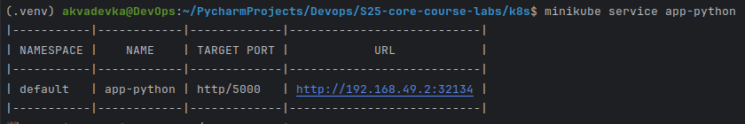

# Helm

## Task 1
**Create a Helm Chart**


**Update a values.yaml**

````
image:
  repository: ksenon9/lab2
  pullPolicy: IfNotPresent
  tag: latest
  containerPort: 5000
````

and 

````
service:
  type: NodePort
  port: 5000
````

**Install the Helm Chart**

````
helm install app-python ./app-python
````


**Minikube dashboard**
````
minikube dashboard
````


**Check what our application running**

````
minikube service app-python
````



**Output ``kubectl get pods,svc``**


# Task 2

**Crate hook files**

I created two files ``post-install-hook.yaml`` and ``pre-install-hook.yaml``


**Lint the Helm Chart**


**Dry run**

````
helm install --dry-run helm-hooks ./app-python
````

````
(.venv) akvadevka@DevOps:~/PycharmProjects/Devops/S25-core-course-labs/k8s$ helm install --dry-run helm-hooks ./app-python
NAME: helm-hooks
LAST DEPLOYED: Sun Mar  2 19:24:30 2025
NAMESPACE: default
STATUS: pending-install
REVISION: 1
HOOKS:
---
# Source: app-python/templates/post-install-hook.yaml
apiVersion: v1
kind: Pod
metadata:
  name: postinstall-hook
  annotations:
    "helm.sh/hook": post-install
    "helm.sh/hook-delete-policy": hook-succeeded
spec:
  containers:
    - name: postinstall
      image: busybox
      command: ['sh', '-c', 'sleep 20']
  restartPolicy: Never
---
# Source: app-python/templates/pre-install-hook.yaml
apiVersion: v1
kind: Pod
metadata:
  name: preinstall-hook
  annotations:
    "helm.sh/hook": pre-install
    "helm.sh/hook-delete-policy": hook-succeeded
spec:
  containers:
    - name: preinstall
      image: busybox
      command: ['sh', '-c', 'sleep 20']
  restartPolicy: Never
---
# Source: app-python/templates/tests/test-connection.yaml
apiVersion: v1
kind: Pod
metadata:
  name: "helm-hooks-app-python-test-connection"
  labels:
    helm.sh/chart: app-python-0.1.0
    app.kubernetes.io/name: app-python
    app.kubernetes.io/instance: helm-hooks
    app.kubernetes.io/version: "1.16.0"
    app.kubernetes.io/managed-by: Helm
  annotations:
    "helm.sh/hook": test
spec:
  containers:
    - name: wget
      image: busybox
      command: ['wget']
      args: ['helm-hooks-app-python:5000']
  restartPolicy: Never
MANIFEST:
---
# Source: app-python/templates/serviceaccount.yaml
apiVersion: v1
kind: ServiceAccount
metadata:
  name: helm-hooks-app-python
  labels:
    helm.sh/chart: app-python-0.1.0
    app.kubernetes.io/name: app-python
    app.kubernetes.io/instance: helm-hooks
    app.kubernetes.io/version: "1.16.0"
    app.kubernetes.io/managed-by: Helm
automountServiceAccountToken: true
---
# Source: app-python/templates/service.yaml
apiVersion: v1
kind: Service
metadata:
  name: helm-hooks-app-python
  labels:
    helm.sh/chart: app-python-0.1.0
    app.kubernetes.io/name: app-python
    app.kubernetes.io/instance: helm-hooks
    app.kubernetes.io/version: "1.16.0"
    app.kubernetes.io/managed-by: Helm
spec:
  type: NodePort
  ports:
    - port: 5000
      targetPort: http
      protocol: TCP
      name: http
  selector:
    app.kubernetes.io/name: app-python
    app.kubernetes.io/instance: helm-hooks
---
# Source: app-python/templates/deployment.yaml
apiVersion: apps/v1
kind: Deployment
metadata:
  name: helm-hooks-app-python
  labels:
    helm.sh/chart: app-python-0.1.0
    app.kubernetes.io/name: app-python
    app.kubernetes.io/instance: helm-hooks
    app.kubernetes.io/version: "1.16.0"
    app.kubernetes.io/managed-by: Helm
spec:
  replicas: 1
  selector:
    matchLabels:
      app.kubernetes.io/name: app-python
      app.kubernetes.io/instance: helm-hooks
  template:
    metadata:
      labels:
        helm.sh/chart: app-python-0.1.0
        app.kubernetes.io/name: app-python
        app.kubernetes.io/instance: helm-hooks
        app.kubernetes.io/version: "1.16.0"
        app.kubernetes.io/managed-by: Helm
    spec:
      serviceAccountName: helm-hooks-app-python
      containers:
        - name: app-python
          image: "ksenon9/lab2:latest"
          imagePullPolicy: IfNotPresent
          ports:
            - name: http
              containerPort: 5000
              protocol: TCP
          livenessProbe:
            httpGet:
              path: /
              port: http
          readinessProbe:
            httpGet:
              path: /
              port: http

NOTES:
1. Get the application URL by running these commands:
  export NODE_PORT=$(kubectl get --namespace default -o jsonpath="{.spec.ports[0].nodePort}" services helm-hooks-app-python)
  export NODE_IP=$(kubectl get nodes --namespace default -o jsonpath="{.items[0].status.addresses[0].address}")
  echo http://$NODE_IP:$NODE_PORT
````


**Output ``kubectl get po``**


**Output ``kubectl describe po preinstall-hook``**

````
(.venv) akvadevka@DevOps:~/PycharmProjects/Devops$ kubectl describe po preinstall-hook 
Name:             preinstall-hook
Namespace:        default
Priority:         0
Service Account:  default
Node:             minikube/192.168.49.2
Start Time:       Sun, 02 Mar 2025 20:09:40 +0300
Labels:           <none>
Annotations:      helm.sh/hook: pre-install
                  helm.sh/hook-delete-policy: before-hook-creation
Status:           Succeeded
IP:               10.244.0.53
IPs:
  IP:  10.244.0.53
Containers:
  preinstall:
    Container ID:  docker://8464ff69166c5dcc9ddc6e83efdcec07de8f5797d0b00853a8a220598b79b64a
    Image:         busybox
    Image ID:      docker-pullable://busybox@sha256:498a000f370d8c37927118ed80afe8adc38d1edcbfc071627d17b25c88efcab0
    Port:          <none>
    Host Port:     <none>
    Command:
      sh
      -c
      sleep 60
    State:          Terminated
      Reason:       Completed
      Exit Code:    0
      Started:      Sun, 02 Mar 2025 20:09:40 +0300
      Finished:     Sun, 02 Mar 2025 20:10:40 +0300
    Ready:          False
    Restart Count:  0
    Environment:    <none>
    Mounts:
      /var/run/secrets/kubernetes.io/serviceaccount from kube-api-access-zs9ft (ro)
Conditions:
  Type                        Status
  PodReadyToStartContainers   False 
  Initialized                 True 
  Ready                       False 
  ContainersReady             False 
  PodScheduled                True 
Volumes:
  kube-api-access-zs9ft:
    Type:                    Projected (a volume that contains injected data from multiple sources)
    TokenExpirationSeconds:  3607
    ConfigMapName:           kube-root-ca.crt
    ConfigMapOptional:       <nil>
    DownwardAPI:             true
QoS Class:                   BestEffort
Node-Selectors:              <none>
Tolerations:                 node.kubernetes.io/not-ready:NoExecute op=Exists for 300s
                             node.kubernetes.io/unreachable:NoExecute op=Exists for 300s
Events:
  Type    Reason     Age   From               Message
  ----    ------     ----  ----               -------
  Normal  Scheduled  4m    default-scheduler  Successfully assigned default/preinstall-hook to minikube
  Normal  Pulled     4m    kubelet            Container image "busybox" already present on machine
  Normal  Created    4m    kubelet            Created container: preinstall
  Normal  Started    4m    kubelet            Started container preinstall
````


**Output ``kubectl describe po postinstall-hook``**

````
(.venv) akvadevka@DevOps:~/PycharmProjects/Devops$ kubectl describe po postinstall-hook
Name:             postinstall-hook
Namespace:        default
Priority:         0
Service Account:  default
Node:             minikube/192.168.49.2
Start Time:       Sun, 02 Mar 2025 20:10:45 +0300
Labels:           <none>
Annotations:      helm.sh/hook: post-install
                  helm.sh/hook-delete-policy: before-hook-creation
Status:           Succeeded
IP:               10.244.0.55
IPs:
  IP:  10.244.0.55
Containers:
  postinstall:
    Container ID:  docker://923d36b38fca721644c58632c9a53b747527a81b90e648a0ef83cebbc40a3d49
    Image:         busybox
    Image ID:      docker-pullable://busybox@sha256:498a000f370d8c37927118ed80afe8adc38d1edcbfc071627d17b25c88efcab0
    Port:          <none>
    Host Port:     <none>
    Command:
      sh
      -c
      sleep 60
    State:          Terminated
      Reason:       Completed
      Exit Code:    0
      Started:      Sun, 02 Mar 2025 20:10:49 +0300
      Finished:     Sun, 02 Mar 2025 20:11:49 +0300
    Ready:          False
    Restart Count:  0
    Environment:    <none>
    Mounts:
      /var/run/secrets/kubernetes.io/serviceaccount from kube-api-access-s9jmh (ro)
Conditions:
  Type                        Status
  PodReadyToStartContainers   False 
  Initialized                 True 
  Ready                       False 
  ContainersReady             False 
  PodScheduled                True 
Volumes:
  kube-api-access-s9jmh:
    Type:                    Projected (a volume that contains injected data from multiple sources)
    TokenExpirationSeconds:  3607
    ConfigMapName:           kube-root-ca.crt
    ConfigMapOptional:       <nil>
    DownwardAPI:             true
QoS Class:                   BestEffort
Node-Selectors:              <none>
Tolerations:                 node.kubernetes.io/not-ready:NoExecute op=Exists for 300s
                             node.kubernetes.io/unreachable:NoExecute op=Exists for 300s
Events:
  Type    Reason     Age    From               Message
  ----    ------     ----   ----               -------
  Normal  Scheduled  3m48s  default-scheduler  Successfully assigned default/postinstall-hook to minikube
  Normal  Pulling    3m48s  kubelet            Pulling image "busybox"
  Normal  Pulled     3m44s  kubelet            Successfully pulled image "busybox" in 3.631s (3.631s including waiting). Image size: 4269694 bytes.
  Normal  Created    3m44s  kubelet            Created container: postinstall
  Normal  Started    3m44s  kubelet            Started container postinstall
````


**Output ``kubectl get pods,svc``**

````
(.venv) akvadevka@DevOps:~/PycharmProjects/Devops$ kubectl get pods,svc
NAME                                         READY   STATUS      RESTARTS   AGE
pod/app-python-6d74f8f4ff-vbbkb              1/1     Running     0          100m
pod/helm-hooks-app-python-794fc6f544-j8vzb   1/1     Running     0          4m36s
pod/postinstall-hook                         0/1     Completed   0          4m34s
pod/preinstall-hook                          0/1     Completed   0          5m39s

NAME                            TYPE        CLUSTER-IP      EXTERNAL-IP   PORT(S)          AGE
service/app-python              NodePort    10.103.17.9     <none>        5000:32134/TCP   100m
service/helm-hooks-app-python   NodePort    10.109.20.173   <none>        5000:30769/TCP   4m36s
service/kubernetes              ClusterIP   10.96.0.1       <none>        443/TCP          3d22h
````

**Implementing a hook delete policy**

I have set the parameter in the annotation for ``post-install-hook.yaml`` and ``pre-install-hook.yaml``:
```
"helm.sh/hook-delete-policy": hook-succeeded
```
