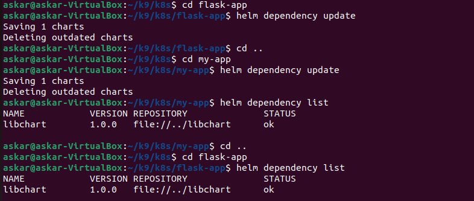

# Lab 10: Introduction to Helm

## Overview
In this lab, we cover Helm installation, chart creation, chart deployment, hook implementation, and working with Helm library charts.

---

## Setup and Chart Creation

### Creating Helm Chart

```bash
helm create flask-app
```
We modify `values.yaml`:
```yaml
image:
  repository: twentythree3/flask-app
  tag: "latest"
 
service:
  type: ClusterIP
  port: 5001
```

### Installing and Verifying the Helm Chart


```bash
helm install flask-app ./flask-app
```


### Checking that all services are healthy:

```bash
kubectl get pods,svc
```


### Starting the service:

```bash
minikube service flask-app
```


### Looking the dasboard:


---

## Helm Chart Hooks 

### Implementing Helm Chart Hooks

We create `hooks.yaml` inside `flask-app/templates/`:
```yaml
---
apiVersion: v1
kind: Pod
metadata:
  name: preinstall-hook
  annotations:
    "helm.sh/hook": pre-install
    "helm.sh/hook-delete-policy": hook-succeeded
spec:
  containers:
    - name: preinstall
      image: busybox
      command: ['sh', '-c', 'echo Pre-install hook running; sleep 20']
  restartPolicy: Never
---
apiVersion: v1
kind: Pod
metadata:
  name: postinstall-hook
  annotations:
    "helm.sh/hook": post-install
    "helm.sh/hook-delete-policy": hook-succeeded
spec:
  containers:
    - name: postinstall
      image: busybox
      command: ['sh', '-c', 'echo Post-install hook running; sleep 20']
  restartPolicy: Never
```

### Test and Validate Hooks

```bash
helm lint flask-app
helm install --dry-run helm-hooks ./flask-app
kubectl get po
kubectl describe po preinstall-hook
kubectl describe po postinstall-hook
```


```bash
askar@askar-VirtualBox:~/k9/k8s$ kubectl describe po preinstall-hook
Name:             preinstall-hook
Namespace:        default
Priority:         0
Service Account:  default
Node:             minikube/192.168.49.2
Start Time:       Thu, 27 Feb 2025 01:29:47 +0300
Labels:           <none>
Annotations:      helm.sh/hook: pre-install
Status:           Succeeded
IP:               10.244.0.37
IPs:
  IP:  10.244.0.37
Containers:
  preinstall:
    Container ID:  docker://df79d510eb5b88a6d1f08a74006f13b70d0bace7f43dc5bd4d81cbc650597f5e
    Image:         busybox
    Image ID:      docker-pullable://busybox@sha256:498a000f370d8c37927118ed80afe8adc38d1edcbfc071627d17b25c88efcab0
    Port:          <none>
    Host Port:     <none>
    Command:
      sh
      -c
      echo Pre-install hook running; sleep 20
    State:          Terminated
      Reason:       Completed
      Exit Code:    0
      Started:      Thu, 27 Feb 2025 01:29:52 +0300
      Finished:     Thu, 27 Feb 2025 01:30:13 +0300
    Ready:          False
    Restart Count:  0
    Environment:    <none>
    Mounts:
      /var/run/secrets/kubernetes.io/serviceaccount from kube-api-access-5sqhp (ro)
Conditions:
  Type                        Status
  PodReadyToStartContainers   False 
  Initialized                 True 
  Ready                       False 
  ContainersReady             False 
  PodScheduled                True 
Volumes:
  kube-api-access-5sqhp:
    Type:                    Projected (a volume that contains injected data from multiple sources)
    TokenExpirationSeconds:  3607
    ConfigMapName:           kube-root-ca.crt
    ConfigMapOptional:       <nil>
    DownwardAPI:             true
QoS Class:                   BestEffort
Node-Selectors:              <none>
Tolerations:                 node.kubernetes.io/not-ready:NoExecute op=Exists for 300s
                             node.kubernetes.io/unreachable:NoExecute op=Exists for 300s
Events:
  Type    Reason     Age    From               Message
  ----    ------     ----   ----               -------
  Normal  Scheduled  3m13s  default-scheduler  Successfully assigned default/preinstall-hook to minikube
  Normal  Pulling    3m11s  kubelet            Pulling image "busybox"
  Normal  Pulled     3m8s   kubelet            Successfully pulled image "busybox" in 2.432s (2.432s including waiting). Image size: 4269694 bytes.
  Normal  Created    3m8s   kubelet            Created container: preinstall
  Normal  Started    3m7s   kubelet            Started container preinstall
```

```bash
askar@askar-VirtualBox:~/k9/k8s$ kubectl describe po postinstall-hook
Name:             postinstall-hook
Namespace:        default
Priority:         0
Service Account:  default
Node:             minikube/192.168.49.2
Start Time:       Thu, 27 Feb 2025 01:30:17 +0300
Labels:           <none>
Annotations:      helm.sh/hook: post-install
Status:           Succeeded
IP:               10.244.0.39
IPs:
  IP:  10.244.0.39
Containers:
  postinstall:
    Container ID:  docker://eda72378d9a7332515d244e91c12587ac624885c4ca8877a0a1a52cc9294ba77
    Image:         busybox
    Image ID:      docker-pullable://busybox@sha256:498a000f370d8c37927118ed80afe8adc38d1edcbfc071627d17b25c88efcab0
    Port:          <none>
    Host Port:     <none>
    Command:
      sh
      -c
      echo Post-install hook running; sleep 20
    State:          Terminated
      Reason:       Completed
      Exit Code:    0
      Started:      Thu, 27 Feb 2025 01:30:23 +0300
      Finished:     Thu, 27 Feb 2025 01:30:43 +0300
    Ready:          False
    Restart Count:  0
    Environment:    <none>
    Mounts:
      /var/run/secrets/kubernetes.io/serviceaccount from kube-api-access-q2nj5 (ro)
Conditions:
  Type                        Status
  PodReadyToStartContainers   False 
  Initialized                 True 
  Ready                       False 
  ContainersReady             False 
  PodScheduled                True 
Volumes:
  kube-api-access-q2nj5:
    Type:                    Projected (a volume that contains injected data from multiple sources)
    TokenExpirationSeconds:  3607
    ConfigMapName:           kube-root-ca.crt
    ConfigMapOptional:       <nil>
    DownwardAPI:             true
QoS Class:                   BestEffort
Node-Selectors:              <none>
Tolerations:                 node.kubernetes.io/not-ready:NoExecute op=Exists for 300s
                             node.kubernetes.io/unreachable:NoExecute op=Exists for 300s
Events:
  Type    Reason     Age   From               Message
  ----    ------     ----  ----               -------
  Normal  Scheduled  4m7s  default-scheduler  Successfully assigned default/postinstall-hook to minikube
  Normal  Pulling    4m5s  kubelet            Pulling image "busybox"
  Normal  Pulled     4m2s  kubelet            Successfully pulled image "busybox" in 1.683s (3.078s including waiting). Image size: 4269694 bytes.
  Normal  Created    4m1s  kubelet            Created container: postinstall
  Normal  Started    4m1s  kubelet            Started container postinstall
```


### Delete policy

I added the annotation "helm.sh/hook-delete-policy": "hook-succeeded" to my hook definitions. This means that once a hook runs successfully, Helm automatically deletes it so it doesn't stick around.


---

# Bonus Task

## Extra App

For node js app we do all the same things as with python app

### Creating Helm Chart
```bash
helm create my-app
```
We modify `values.yaml`:
```yaml
image:
  repository: twentythree3/myapp
  tag: "latest"
 
service:
  type: ClusterIP
  port: 3001
```

### Installing and Verifying the Helm Chart


```bash
helm install my-app ./my-app
```


### Checking that all services are healthy:

```bash
kubectl get pods,svc
```


### Starting the service:

```bash
minikube service my-app
```


### Looking the dasboard:


### Implementing Helm Chart Hooks

We create `hooks.yaml` inside `my-app/templates/`:
```yaml
---
apiVersion: v1
kind: Pod
metadata:
  name: preinstall-hook
  annotations:
    "helm.sh/hook": pre-install
    "helm.sh/hook-delete-policy": hook-succeeded
spec:
  containers:
    - name: preinstall
      image: busybox
      command: ['sh', '-c', 'echo Pre-install hook running; sleep 20']
  restartPolicy: Never
---
apiVersion: v1
kind: Pod
metadata:
  name: postinstall-hook
  annotations:
    "helm.sh/hook": post-install
    "helm.sh/hook-delete-policy": hook-succeeded
spec:
  containers:
    - name: postinstall
      image: busybox
      command: ['sh', '-c', 'echo Post-install hook running; sleep 20']
  restartPolicy: Never
```

### Test and Validate Hooks

```bash
helm lint my-app
helm install --dry-run helm-hooks ./my-app
kubectl get po
kubectl describe po preinstall-hook
kubectl describe po postinstall-hook
```


```bash
askar@askar-VirtualBox:~/k9/k8s$ kubectl describe po preinstall-hook
Name:             preinstall-hook
Namespace:        default
Priority:         0
Service Account:  default
Node:             minikube/192.168.49.2
Start Time:       Thu, 27 Feb 2025 02:05:55 +0300
Labels:           <none>
Annotations:      helm.sh/hook: pre-install
Status:           Succeeded
IP:               10.244.0.44
IPs:
  IP:  10.244.0.44
Containers:
  preinstall:
    Container ID:  docker://acfd8a4e8a15b28adaad4536c5b6c53d44feaffa3a9f90c2175879317fbf8027
    Image:         busybox
    Image ID:      docker-pullable://busybox@sha256:498a000f370d8c37927118ed80afe8adc38d1edcbfc071627d17b25c88efcab0
    Port:          <none>
    Host Port:     <none>
    Command:
      sh
      -c
      echo Pre-install hook running; sleep 20
    State:          Terminated
      Reason:       Completed
      Exit Code:    0
      Started:      Thu, 27 Feb 2025 02:05:59 +0300
      Finished:     Thu, 27 Feb 2025 02:06:19 +0300
    Ready:          False
    Restart Count:  0
    Environment:    <none>
    Mounts:
      /var/run/secrets/kubernetes.io/serviceaccount from kube-api-access-hpp45 (ro)
Conditions:
  Type                        Status
  PodReadyToStartContainers   False 
  Initialized                 True 
  Ready                       False 
  ContainersReady             False 
  PodScheduled                True 
Volumes:
  kube-api-access-hpp45:
    Type:                    Projected (a volume that contains injected data from multiple sources)
    TokenExpirationSeconds:  3607
    ConfigMapName:           kube-root-ca.crt
    ConfigMapOptional:       <nil>
    DownwardAPI:             true
QoS Class:                   BestEffort
Node-Selectors:              <none>
Tolerations:                 node.kubernetes.io/not-ready:NoExecute op=Exists for 300s
                             node.kubernetes.io/unreachable:NoExecute op=Exists for 300s
Events:
  Type    Reason     Age   From               Message
  ----    ------     ----  ----               -------
  Normal  Scheduled  5m8s  default-scheduler  Successfully assigned default/preinstall-hook to minikube
  Normal  Pulling    5m7s  kubelet            Pulling image "busybox"
  Normal  Pulled     5m6s  kubelet            Successfully pulled image "busybox" in 1.916s (1.916s including waiting). Image size: 4269694 bytes.
  Normal  Created    5m5s  kubelet            Created container: preinstall
  Normal  Started    5m5s  kubelet            Started container preinstall
```

```bash
askar@askar-VirtualBox:~/k9/k8s$ kubectl describe po postinstall-hook
Name:             postinstall-hook
Namespace:        default
Priority:         0
Service Account:  default
Node:             minikube/192.168.49.2
Start Time:       Thu, 27 Feb 2025 02:06:22 +0300
Labels:           <none>
Annotations:      helm.sh/hook: post-install
Status:           Succeeded
IP:               10.244.0.46
IPs:
  IP:  10.244.0.46
Containers:
  postinstall:
    Container ID:  docker://2b12e1fb8a8052c4654a998680a435da2a437abea4ed771b009d1bb403975c17
    Image:         busybox
    Image ID:      docker-pullable://busybox@sha256:498a000f370d8c37927118ed80afe8adc38d1edcbfc071627d17b25c88efcab0
    Port:          <none>
    Host Port:     <none>
    Command:
      sh
      -c
      echo Post-install hook running; sleep 20
    State:          Terminated
      Reason:       Completed
      Exit Code:    0
      Started:      Thu, 27 Feb 2025 02:06:27 +0300
      Finished:     Thu, 27 Feb 2025 02:06:47 +0300
    Ready:          False
    Restart Count:  0
    Environment:    <none>
    Mounts:
      /var/run/secrets/kubernetes.io/serviceaccount from kube-api-access-gnchl (ro)
Conditions:
  Type                        Status
  PodReadyToStartContainers   False 
  Initialized                 True 
  Ready                       False 
  ContainersReady             False 
  PodScheduled                True 
Volumes:
  kube-api-access-gnchl:
    Type:                    Projected (a volume that contains injected data from multiple sources)
    TokenExpirationSeconds:  3607
    ConfigMapName:           kube-root-ca.crt
    ConfigMapOptional:       <nil>
    DownwardAPI:             true
QoS Class:                   BestEffort
Node-Selectors:              <none>
Tolerations:                 node.kubernetes.io/not-ready:NoExecute op=Exists for 300s
                             node.kubernetes.io/unreachable:NoExecute op=Exists for 300s
Events:
  Type    Reason     Age    From               Message
  ----    ------     ----   ----               -------
  Normal  Scheduled  4m47s  default-scheduler  Successfully assigned default/postinstall-hook to minikube
  Normal  Pulling    4m45s  kubelet            Pulling image "busybox"
  Normal  Pulled     4m43s  kubelet            Successfully pulled image "busybox" in 1.754s (1.754s including waiting). Image size: 4269694 bytes.
  Normal  Created    4m43s  kubelet            Created container: postinstall
  Normal  Started    4m43s  kubelet            Started container postinstall
```

### Delete policy
The same thing here, I added the annotation "helm.sh/hook-delete-policy": "hook-succeeded" to my hook definitions, which means that once a hook runs successfully, Helm automatically deletes it so it doesn't stick around.


# Creating a Library Chart

```bash
helm create libchart
```
We modify `libchart/templates/_labels.tpl`:

```yaml
{{- define "libchart.labels" -}}
app.kubernetes.io/name: {{ .Chart.Name }}
app.kubernetes.io/version: {{ .Chart.Version }}
{{- end -}}
```

### Then using the Library Chart in Applications

We add to `Chart.yaml` in each app's folder to include `libchart` as a dependency:

```yaml
dependencies:
  - name: libchart
    version: 1.0.0
    repository: "file://../libchart"
```

After we run:

```bash
helm dependency update
```





---

## Final steps

```bash
helm  upgrade --install my-app ./my-app
helm  upgrade --install flask-app ./flask-app
```


### Check pod statuse:

```bash
kubectl get pods,svc
```


