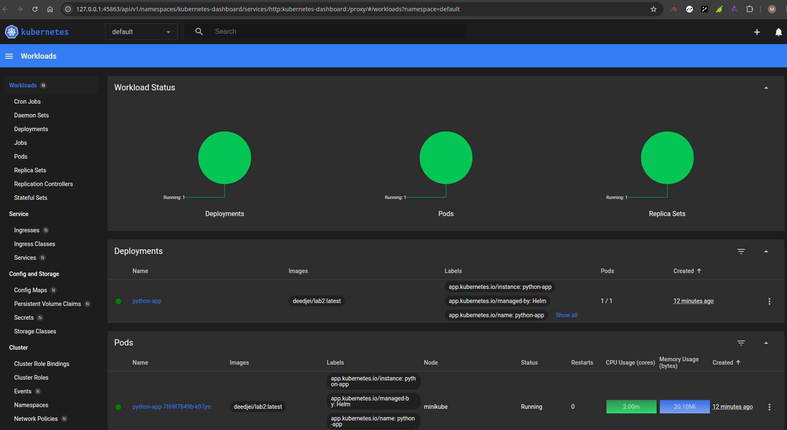
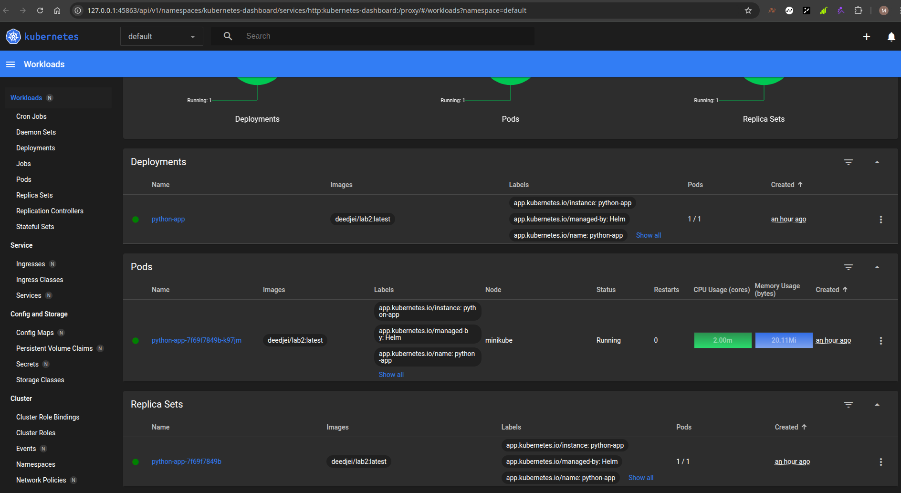

# Helm Setup and Chart Creation

## Overview

This document outlines the steps to set up Helm and create a custom Helm chart for deploying an application on Kubernetes.
## Task 1
## Helm Setup Chart Creation
### Installation

```bash
$ sudo snap install helm --classic
```

### Chart Creation

```bash
$ helm create python-app
Creating python-app
```
### Modify the Chart

1. **Update `values.yaml`:**

```yaml
image:
  repository: repository/path
  tag: "latest"

```
2. **Modify `deployment.yaml`:**
```yaml
ports:
  - name: http
    containerPort: 5000
    protocol: TCP
```

### Installation

The Helm chart was installed using the following command:

```bash
$ helm install python-app ./python-app
NAME: python-app
LAST DEPLOYED: Thu Feb 27 00:08:08 2025
NAMESPACE: default
STATUS: deployed
REVISION: 1
NOTES:
1. Get the application URL by running these commands:
  export POD_NAME=$(kubectl get pods --namespace default -l "app.kubernetes.io/name=python-app,app.kubernetes.io/instance=python-app" -o jsonpath="{.items[0].metadata.name}")
  export CONTAINER_PORT=$(kubectl get pod --namespace default $POD_NAME -o jsonpath="{.spec.containers[0].ports[0].containerPort}")
  echo "Visit http://127.0.0.1:8080 to use your application"
  kubectl --namespace default port-forward $POD_NAME 8080:$CONTAINER_PORT
```
## Outputs
### Pods and Services

1. **The output of the `kubectl get pods,svc` command:**
```bash
$ kubectl get pods
NAME                          READY   STATUS    RESTARTS   AGE
python-app-7f69f7849b-k97jm   1/1     Running   0          7s

$ kubectl get svc
NAME         TYPE        CLUSTER-IP       EXTERNAL-IP   PORT(S)    AGE
kubernetes   ClusterIP   10.96.0.1        <none>        443/TCP    3h48m
python-app   ClusterIP   10.105.225.243   <none>        5000/TCP   22s
```
2. **The output of the `minikube service python-app` command:**
```bash
|-----------|------------|-------------|--------------|
| NAMESPACE |    NAME    | TARGET PORT |     URL      |
|-----------|------------|-------------|--------------|
| default   | python-app |             | No node port |
|-----------|------------|-------------|--------------|
😿  service default/python-app has no node port
❗  Services [default/python-app] have type "ClusterIP" not meant to be exposed, however for local development minikube allows you to access this !
🏃  Starting tunnel for service python-app.
|-----------|------------|-------------|------------------------|
| NAMESPACE |    NAME    | TARGET PORT |          URL           |
|-----------|------------|-------------|------------------------|
| default   | python-app |             | http://127.0.0.1:44551 |
|-----------|------------|-------------|------------------------|
🎉  Opening service default/python-app in default browser...
/usr/bin/xdg-open: 611: kfmclient: not found
/usr/bin/xdg-open: 491: test: Illegal number: 
/usr/bin/xdg-open: 492: test: Illegal number: 
/usr/bin/xdg-open: 493: test: Illegal number: 
❗  Because you are using a Docker driver on linux, the terminal needs to be open to run it.
```
3. **The output of the `minikube dashboard` command:**
```bash
🤔  Verifying dashboard health ...
🚀  Launching proxy ...
🤔  Verifying proxy health ...
http://127.0.0.1:45863/api/v1/namespaces/kubernetes-dashboard/services/http:kubernetes-dashboard:/proxy/
```






## Task 2

### Outputs

1. **The output of the `kubectl get po` command:**
```bash
sudo kubectl get po
NAME                                     READY   STATUS      RESTARTS   AGE
helm-hooks-python-app-7b7654fc99-fhsnq   1/1     Running     0          37s
postinstall-hook                         0/1     Completed   0          37s
preinstall-hook                          0/1     Completed   0          66s
python-app-7f69f7849b-k97jm              1/1     Running     0          57m
```

2. **The output of the `kubectl get svc` command:**

```bash
NAME                    TYPE        CLUSTER-IP       EXTERNAL-IP   PORT(S)    AGE
helm-hooks-python-app   ClusterIP   10.111.125.135   <none>        5000/TCP   32m
kubernetes              ClusterIP   10.96.0.1        <none>        443/TCP    5h16m
python-app              ClusterIP   10.105.225.243   <none>        5000/TCP   89m
```

3.  **The output of the `kubectl describe po preinstall-hook` command:**
```bash
Name:             preinstall-hook
Namespace:        default
Priority:         0
Service Account:  default
Node:             minikube/192.168.49.2
Start Time:       Thu, 27 Feb 2025 01:04:42 +0300
Labels:           <none>
Annotations:      helm.sh/hook: pre-install
Status:           Succeeded
IP:               10.244.0.18
IPs:
  IP:  10.244.0.18
Containers:
  pre-install-container:
    Container ID:  docker://820a3bc352658a32cc9b333982068f545d26b09de084b1c19dfdde8ba3a76294
    Image:         busybox
    Image ID:      docker-pullable://busybox@sha256:498a000f370d8c37927118ed80afe8adc38d1edcbfc071627d17b25c88efcab0
    Port:          <none>
    Host Port:     <none>
    Command:
      sh
      -c
      echo The pre-install hook is running && sleep 20
    State:          Terminated
      Reason:       Completed
      Exit Code:    0
      Started:      Thu, 27 Feb 2025 01:04:48 +0300
      Finished:     Thu, 27 Feb 2025 01:05:09 +0300
    Ready:          False
    Restart Count:  0
    Environment:    <none>
    Mounts:
      /var/run/secrets/kubernetes.io/serviceaccount from kube-api-access-vhjkj (ro)
Conditions:
  Type                        Status
  PodReadyToStartContainers   False 
  Initialized                 True 
  Ready                       False 
  ContainersReady             False 
  PodScheduled                True 
Volumes:
  kube-api-access-vhjkj:
    Type:                    Projected (a volume that contains injected data from multiple sources)
    TokenExpirationSeconds:  3607
    ConfigMapName:           kube-root-ca.crt
    ConfigMapOptional:       <nil>
    DownwardAPI:             true
QoS Class:                   BestEffort
Node-Selectors:              <none>
Tolerations:                 node.kubernetes.io/not-ready:NoExecute op=Exists for 300s
                             node.kubernetes.io/unreachable:NoExecute op=Exists for 300s
Events:
  Type    Reason     Age    From               Message
  ----    ------     ----   ----               -------
  Normal  Scheduled  3m37s  default-scheduler  Successfully assigned default/preinstall-hook to minikube
  Normal  Pulling    3m36s  kubelet            Pulling image "busybox"
  Normal  Pulled     3m31s  kubelet            Successfully pulled image "busybox" in 5.241s (5.242s including waiting). Image size: 4269694 bytes.
  Normal  Created    3m31s  kubelet            Created container: pre-install-container
  Normal  Started    3m30s  kubelet            Started container pre-install-container
```
4.  **The output of the `ubectl describe po postinstall-hook` command:**
```bash
Name:             postinstall-hook
Namespace:        default
Priority:         0
Service Account:  default
Node:             minikube/192.168.49.2
Start Time:       Thu, 27 Feb 2025 01:05:11 +0300
Labels:           <none>
Annotations:      helm.sh/hook: post-install
Status:           Succeeded
IP:               10.244.0.20
IPs:
  IP:  10.244.0.20
Containers:
  post-install-container:
    Container ID:  docker://6f9b1cc53a81bea177f56fd05838fa1cd1fbd4b93d17cf72f40e8e4769e7771e
    Image:         busybox
    Image ID:      docker-pullable://busybox@sha256:498a000f370d8c37927118ed80afe8adc38d1edcbfc071627d17b25c88efcab0
    Port:          <none>
    Host Port:     <none>
    Command:
      sh
      -c
      echo The post-install hook is running && sleep 15
    State:          Terminated
      Reason:       Completed
      Exit Code:    0
      Started:      Thu, 27 Feb 2025 01:05:14 +0300
      Finished:     Thu, 27 Feb 2025 01:05:30 +0300
    Ready:          False
    Restart Count:  0
    Environment:    <none>
    Mounts:
      /var/run/secrets/kubernetes.io/serviceaccount from kube-api-access-jcmpj (ro)
Conditions:
  Type                        Status
  PodReadyToStartContainers   False 
  Initialized                 True 
  Ready                       False 
  ContainersReady             False 
  PodScheduled                True 
Volumes:
  kube-api-access-jcmpj:
    Type:                    Projected (a volume that contains injected data from multiple sources)
    TokenExpirationSeconds:  3607
    ConfigMapName:           kube-root-ca.crt
    ConfigMapOptional:       <nil>
    DownwardAPI:             true
QoS Class:                   BestEffort
Node-Selectors:              <none>
Tolerations:                 node.kubernetes.io/not-ready:NoExecute op=Exists for 300s
                             node.kubernetes.io/unreachable:NoExecute op=Exists for 300s
Events:
  Type    Reason     Age    From               Message
  ----    ------     ----   ----               -------
  Normal  Scheduled  3m41s  default-scheduler  Successfully assigned default/postinstall-hook to minikube
  Normal  Pulling    3m40s  kubelet            Pulling image "busybox"
  Normal  Pulled     3m38s  kubelet            Successfully pulled image "busybox" in 1.987s (1.987s including waiting). Image size: 4269694 bytes.
  Normal  Created    3m38s  kubelet            Created container: post-install-container
  Normal  Started    3m37s  kubelet            Started container post-install-container
```