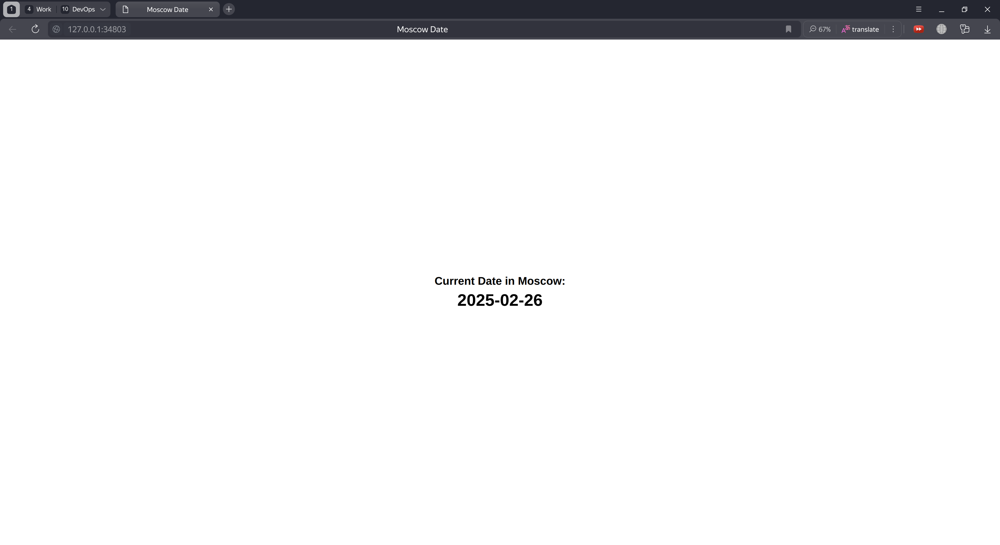

# Helm

## Installation

Install and check the version of Helm

```bash
curl https://raw.githubusercontent.com/helm/helm/main/scripts/get-helm-3 | bash

  % Total    % Received % Xferd  Average Speed   Time    Time     Time  Current
                                 Dload  Upload   Total   Spent    Left  Speed
100 11913  100 11913    0     0  17669      0 --:--:-- --:--:-- --:--:-- 17648
Downloading https://get.helm.sh/helm-v3.17.1-linux-amd64.tar.gz
Verifying checksum... Done.
Preparing to install helm into /usr/local/bin
[sudo] password for azamat: 
helm installed into /usr/local/bin/helm
```

```bash
helm version

version.BuildInfo{Version:"v3.17.1", GitCommit:"980d8ac1939e39138101364400756af2bdee1da5", GitTreeState:"clean", GoVersion:"go1.23.5"}
```

## Create a Helm Chart

Create a Helm chart for the python application

```bash
helm create app-python-helm

Creating app-python-helm
```

I changed values.yaml file to use the correct repository, port and tag.

```yaml
image:
  repository: azamatbayramov/s25-devops-py-dl
  tag: "latest"
service:
  port: 8001
```

I installed the Helm chart

```bash
helm install app-python-helm ./app-python-helm
```

I checked the dashboard


Checked the application using `minikube service`

```bash
minikube service app-python-helm

|-----------|-----------------|-------------|--------------|
| NAMESPACE |      NAME       | TARGET PORT |     URL      |
|-----------|-----------------|-------------|--------------|
| default   | app-python-helm |             | No node port |
|-----------|-----------------|-------------|--------------|
😿  service default/app-python-helm has no node port
❗  Services [default/app-python-helm] have type "ClusterIP" not meant to be exposed, however for local development minikube allows you to access this !
🏃  Starting tunnel for service app-python-helm.
|-----------|-----------------|-------------|------------------------|
| NAMESPACE |      NAME       | TARGET PORT |          URL           |
|-----------|-----------------|-------------|------------------------|
| default   | app-python-helm |             | http://127.0.0.1:33327 |
|-----------|-----------------|-------------|------------------------|
🎉  Opening service default/app-python-helm in default browser...
❗  Because you are using a Docker driver on linux, the terminal needs to be open to run it.
find_ffmpeg failed, using the integrated library.
[0225/232307.203026:ERROR:file_io_posix.cc(153)] open /home/azamat/.config/yandex-browser/Crash Reports/pending/ccce132b-7073-4105-906c-80e535cd6316.lock: File exists (17)
Opening in existing browser session.
```


Checked the pods and services

```bash
kubectl get pods,svc

NAME                                  READY   STATUS    RESTARTS   AGE
pod/app-python-helm-5886d686f-2rl9d   1/1     Running   0          9m48s

NAME                      TYPE        CLUSTER-IP      EXTERNAL-IP   PORT(S)    AGE
service/app-python-helm   ClusterIP   10.98.119.232   <none>        8001/TCP   9m48s
service/kubernetes        ClusterIP   10.96.0.1       <none>        443/TCP    32h
```

## Helm Chart Hooks

I added a pre-install and post-install hook to the Helm chart.

I started chart with the following command:

```bash
helm install app-python-helm ./app-python-helm
```


Get the pods and check the status

```bash
kubectl get po

NAME                              READY   STATUS      RESTARTS   AGE
app-python-helm-5886d686f-zncl4   1/1     Running     0          7m38s
post-install-hook                 0/1     Completed   0          7m38s
pre-install-hook                  0/1     Completed   0          7m50s
```

Get the description of the pre-install hook

```bash

kubectl describe po pre-install-hook 
Name:             pre-install-hook
Namespace:        default
Priority:         0
Service Account:  default
Node:             minikube/192.168.49.2
Start Time:       Wed, 26 Feb 2025 00:22:10 +0300
Labels:           <none>
Annotations:      helm.sh/hook: pre-install
Status:           Succeeded
IP:               10.244.0.69
IPs:
  IP:  10.244.0.69
Containers:
  pre-install-container:
    Container ID:  docker://72a873a0f0d396cdf89080709f86a3e0aeb4c169db082331703bb15b2e79f759
    Image:         busybox
    Image ID:      docker-pullable://busybox@sha256:498a000f370d8c37927118ed80afe8adc38d1edcbfc071627d17b25c88efcab0
    Port:          <none>
    Host Port:     <none>
    Command:
      sh
      -c
      echo The pre-install hook is running... && sleep 10
    State:          Terminated
      Reason:       Completed
      Exit Code:    0
      Started:      Wed, 26 Feb 2025 00:22:10 +0300
      Finished:     Wed, 26 Feb 2025 00:22:20 +0300
    Ready:          False
    Restart Count:  0
    Environment:    <none>
    Mounts:
      /var/run/secrets/kubernetes.io/serviceaccount from kube-api-access-9f8n7 (ro)
Conditions:
  Type                        Status
  PodReadyToStartContainers   False 
  Initialized                 True 
  Ready                       False 
  ContainersReady             False 
  PodScheduled                True 
Volumes:
  kube-api-access-9f8n7:
    Type:                    Projected (a volume that contains injected data from multiple sources)
    TokenExpirationSeconds:  3607
    ConfigMapName:           kube-root-ca.crt
    ConfigMapOptional:       <nil>
    DownwardAPI:             true
QoS Class:                   BestEffort
Node-Selectors:              <none>
Tolerations:                 node.kubernetes.io/not-ready:NoExecute op=Exists for 300s
                             node.kubernetes.io/unreachable:NoExecute op=Exists for 300s
Events:
  Type    Reason     Age    From               Message
  ----    ------     ----   ----               -------
  Normal  Scheduled  8m57s  default-scheduler  Successfully assigned default/pre-install-hook to minikube
  Normal  Pulled     8m57s  kubelet            Container image "busybox" already present on machine
  Normal  Created    8m57s  kubelet            Created container: pre-install-container
  Normal  Started    8m57s  kubelet            Started container pre-install-container
```

Get the description of the post-install hook

```bash
kubectl describe po post-install-hook

Name:             post-install-hook
Namespace:        default
Priority:         0
Service Account:  default
Node:             minikube/192.168.49.2
Start Time:       Wed, 26 Feb 2025 00:22:22 +0300
Labels:           <none>
Annotations:      helm.sh/hook: post-install
Status:           Succeeded
IP:               10.244.0.71
IPs:
  IP:  10.244.0.71
Containers:
  post-install-container:
    Container ID:  docker://dbad303f1c4e358aeb414eec2209d64eebec1a6d600257e619a57703b31d5417
    Image:         busybox
    Image ID:      docker-pullable://busybox@sha256:498a000f370d8c37927118ed80afe8adc38d1edcbfc071627d17b25c88efcab0
    Port:          <none>
    Host Port:     <none>
    Command:
      sh
      -c
      echo The post-install hook is running... && sleep 5
    State:          Terminated
      Reason:       Completed
      Exit Code:    0
      Started:      Wed, 26 Feb 2025 00:22:23 +0300
      Finished:     Wed, 26 Feb 2025 00:22:28 +0300
    Ready:          False
    Restart Count:  0
    Environment:    <none>
    Mounts:
      /var/run/secrets/kubernetes.io/serviceaccount from kube-api-access-2zlsg (ro)
Conditions:
  Type                        Status
  PodReadyToStartContainers   False 
  Initialized                 True 
  Ready                       False 
  ContainersReady             False 
  PodScheduled                True 
Volumes:
  kube-api-access-2zlsg:
    Type:                    Projected (a volume that contains injected data from multiple sources)
    TokenExpirationSeconds:  3607
    ConfigMapName:           kube-root-ca.crt
    ConfigMapOptional:       <nil>
    DownwardAPI:             true
QoS Class:                   BestEffort
Node-Selectors:              <none>
Tolerations:                 node.kubernetes.io/not-ready:NoExecute op=Exists for 300s
                             node.kubernetes.io/unreachable:NoExecute op=Exists for 300s
Events:
  Type    Reason     Age    From               Message
  ----    ------     ----   ----               -------
  Normal  Scheduled  9m13s  default-scheduler  Successfully assigned default/post-install-hook to minikube
  Normal  Pulled     9m13s  kubelet            Container image "busybox" already present on machine
  Normal  Created    9m13s  kubelet            Created container: post-install-container
  Normal  Started    9m13s  kubelet            Started container post-install-container
```

Then I improved the hooks by adding a hook delete policy.

```
"helm.sh/hook-delete-policy": hook-succeeded
```

After it I uninstalled the previous chart and installed the new one.

After hooks were executed I checked the pods again:

```bash
kubectl get po

NAME                              READY   STATUS    RESTARTS   AGE
app-python-helm-5886d686f-zvrzn   1/1     Running   0          13s
```

The hooks were deleted after the installation was finished.

## Helm Chart for Go Application

I created a Helm chart for the Go application as well.




## Helm Library Chart

I created a Helm library chart.

```bash
helm create common-library

Creating common-library
```

Then I deleted all not needed files and folders and added a labels template.

```bash
tree ./common-library/ -a

./common-library/
├── Chart.yaml
├── .helmignore
└── templates
    └── _labels.tpl

2 directories, 3 files
```

I updated dependencies in the app-go-helm and app-python-helm charts.

```bash
helm dependency update app-python-helm

Saving 1 charts
Deleting outdated charts
```

```bash
helm dependency update app-go-helm

Saving 1 charts
Deleting outdated charts
```

I installed the charts again

```bash
helm install app-python-helm ./app-python-helm

NAME: app-python-helm
LAST DEPLOYED: Wed Feb 26 01:37:58 2025
NAMESPACE: default
STATUS: deployed
REVISION: 1
NOTES:
1. Get the application URL by running these commands:
  export POD_NAME=$(kubectl get pods --namespace default -l "app.kubernetes.io/name=app-python-helm,app.kubernetes.io/instance=app-python-helm" -o jsonpath="{.items[0].metadata.name}")
  export CONTAINER_PORT=$(kubectl get pod --namespace default $POD_NAME -o jsonpath="{.spec.containers[0].ports[0].containerPort}")
  echo "Visit http://127.0.0.1:8080 to use your application"
  kubectl --namespace default port-forward $POD_NAME 8080:$CONTAINER_PORT
```

```bash
helm install app-go-helm app-go-helm/

NAME: app-go-helm
LAST DEPLOYED: Wed Feb 26 01:40:05 2025
NAMESPACE: default
STATUS: deployed
REVISION: 1
NOTES:
1. Get the application URL by running these commands:
  export POD_NAME=$(kubectl get pods --namespace default -l "app.kubernetes.io/name=app-go-helm,app.kubernetes.io/instance=app-go-helm" -o jsonpath="{.items[0].metadata.name}")
  export CONTAINER_PORT=$(kubectl get pod --namespace default $POD_NAME -o jsonpath="{.spec.containers[0].ports[0].containerPort}")
  echo "Visit http://127.0.0.1:8080 to use your application"
  kubectl --namespace default port-forward $POD_NAME 8080:$CONTAINER_PORT
```

Check the labels in the pods

```bash
kubectl get po --show-labels

NAME                              READY   STATUS    RESTARTS   AGE     LABELS
app-go-helm-d56b9f695-8dl69       1/1     Running   0          83s     app.kubernetes.io/instance=app-go-helm,app.kubernetes.io/managed-by=Helm,app.kubernetes.io/name=app-go-helm,app.kubernetes.io/version=1.16.0,helm.sh/chart=app-go-helm-0.1.0,pod-template-hash=d56b9f695
app-python-helm-5886d686f-fnrwn   1/1     Running   0          3m30s   app.kubernetes.io/instance=app-python-helm,app.kubernetes.io/managed-by=Helm,app.kubernetes.io/name=app-python-helm,app.kubernetes.io/version=1.16.0,helm.sh/chart=app-python-helm-0.1.0,pod-template-hash=5886d686f
```
