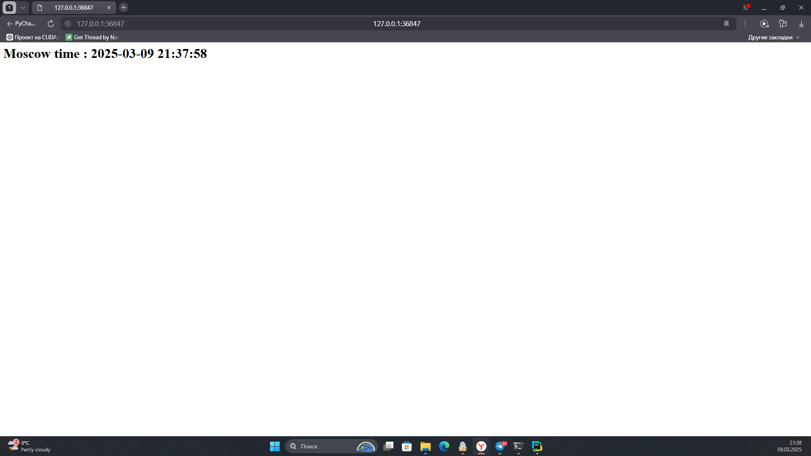

# Lab 9 Report

## Task 1: Basic Deployment

### Pods and Services Status
```bash
kubectl get pods,svc
```

```
NAME                              READY   STATUS    RESTARTS   AGE
pod/python-app-7979589d45-2h8k6   1/1     Running   0          15s
pod/python-app-7979589d45-j9qx5   1/1     Running   0          15s
pod/python-app-7979589d45-w96fn   1/1     Running   0          15s

NAME                 TYPE           CLUSTER-IP      EXTERNAL-IP   PORT(S)          AGE
service/app-python   LoadBalancer   10.110.33.61    <pending>     8000:31274/TCP   6d21h
service/kubernetes   ClusterIP      10.96.0.1       <none>        443/TCP          6d21h
service/python-app   NodePort       10.96.153.131   <none>        8080:32606/TCP   15s
```

### Service URL
```bash
minikube service python-app --url
```

```
http://127.0.0.1:45731
! Because you are using a Docker driver on linux, the terminal needs to be open to run it.
```

## Task 2: Declarative Manifests

### Applied Manifests
- [deployment.yml](deployment.yml)
- [service.yml](service.yml)

### Application Screenshot
