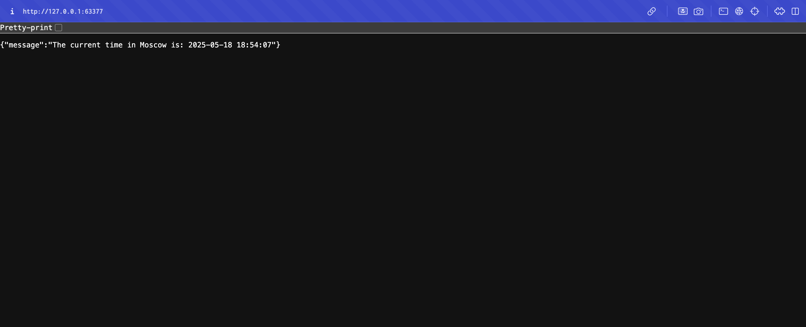

# Kubernetes Deployment for Python Application

This directory contains the Kubernetes manifests for deploying the Python application.

## Files
- `deployment.yml`: Defines the deployment configuration with 3 replicas
- `service.yml`: Defines the service to expose the application

## Deployment Steps

1. Build the Docker image:
```bash
docker build -t python-app:latest ../app_python
```

2. Load the image into minikube:
```bash
minikube image load python-app:latest
```

3. Apply the Kubernetes manifests:
```bash
kubectl apply -f deployment.yml
kubectl apply -f service.yml
```

4. Verify the deployment:
```bash
kubectl get pods,svc
```

5. Access the application:
```bash
minikube service python-app-service --url
```

## Current Status

### Pods and Services
```bash
NAME                              READY   STATUS    RESTARTS   AGE
pod/python-app-55c9b98789-gbsj5   1/1     Running   0          6m25s
pod/python-app-55c9b98789-q6kjn   1/1     Running   0          6m25s
pod/python-app-55c9b98789-qr2xb   1/1     Running   0          6m25s

NAME                         TYPE        CLUSTER-IP      EXTERNAL-IP   PORT(S)        AGE
service/kubernetes           ClusterIP   10.96.0.1       <none>        443/TCP        12m
service/python-app-service   NodePort    10.102.207.85   <none>        80:31519/TCP   6m24s
```

### Service Information
Output of `minikube service --all`:
```
|-----------|--------------------|-------------|---------------------------|
| NAMESPACE |        NAME        | TARGET PORT |            URL            |
|-----------|--------------------|-------------|---------------------------|
| default   | python-app-service |          80 | http://192.168.49.2:31519 |
|-----------|--------------------|-------------|---------------------------|
🏃  Starting tunnel for service python-app-service.
|-----------|--------------------|-------------|------------------------|
| NAMESPACE |        NAME        | TARGET PORT |          URL           |
|-----------|--------------------|-------------|------------------------|
| default   | python-app-service |             | http://127.0.0.1:63377 |
|-----------|--------------------|-------------|------------------------|
```

### Service URL
The application is accessible at: http://127.0.0.1:63377

### Screenshot of Application Access


## Cleanup
To remove the deployment and service:
```bash
kubectl delete -f deployment.yml
kubectl delete -f service.yml
```