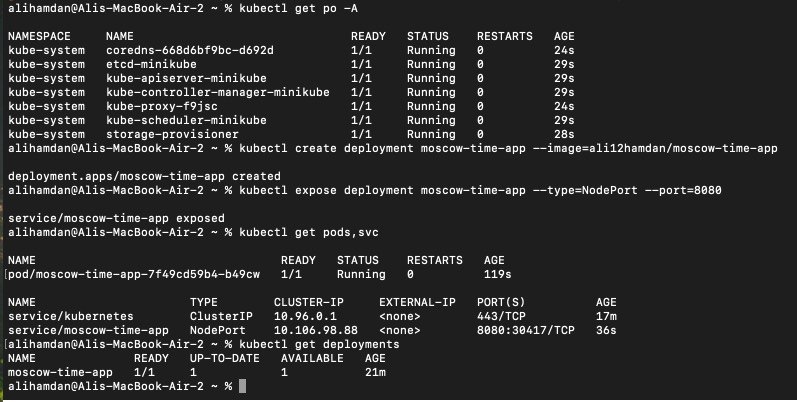
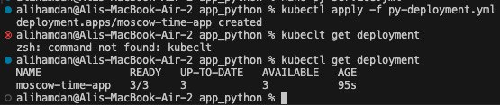
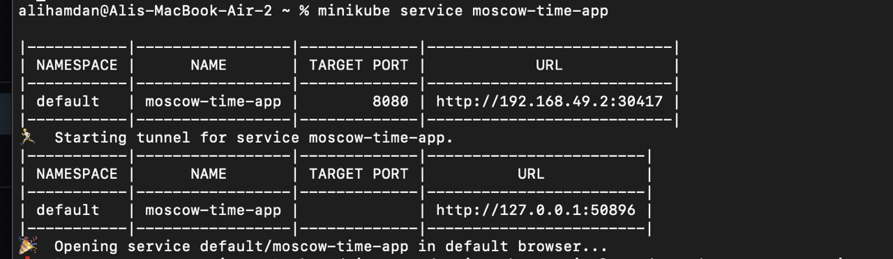
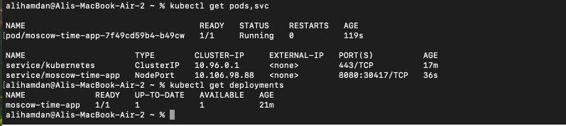
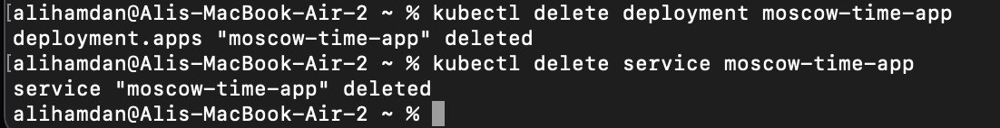
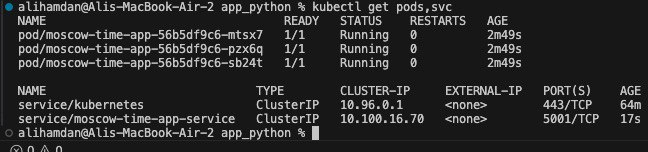
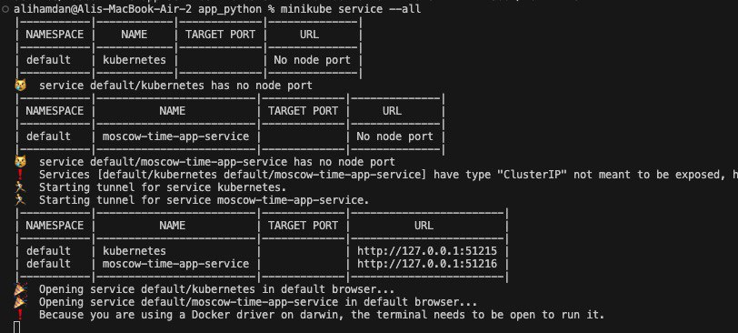
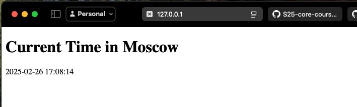
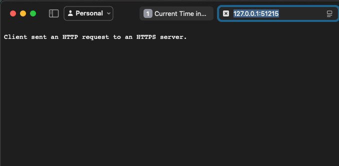

# Lab 9: Introduction to Kubernetes

This lab focuses on setting up a local Kubernetes environment using Minikube, deploying applications, and creating Kubernetes manifests. Below are the tasks completed, along with evidence and outputs.

---

## Task 1: Kubernetes Setup and Basic Deployment

### 1. Learn About Kubernetes

Studied the fundamentals of Kubernetes, including its components and architecture. Referenced the official Kubernetes documentation:

- [What is Kubernetes?](https://kubernetes.io/docs/concepts/overview/what-is-kubernetes/)
- [Kubernetes Components](https://kubernetes.io/docs/concepts/overview/components/)

### 2. Install Kubernetes Tools

Installed `kubectl` and `minikube` to manage the Kubernetes cluster locally. Followed the official guide:

- [Kubernetes Tools Installation](https://kubernetes.io/docs/tasks/tools/)

### 3. Deploy Your Application

Deployed a Python application using the following command:

```bash
kubectl create deployment moscow-time-app --image=ali12hamdan/moscow-time-app:
```

**Screenshot of Deployment Creation:**


**List of Deployments:**



### 4. Access Your Application

Exposed the application using a Service and retrieved its URL:

```bash
minikube service moscow-time-app --url
```

**Output:**

```out
http://192.168.49.2:30417
```

**Screenshot of Service URL:**



### 5. Verify Deployment and Service

Checked the status of Pods and Services:

```bash
kubectl get pods,svc
```

**Screenshots:**



### 6. Cleanup

Removed the Deployment and Service to maintain a clean environment:

```bash
kubectl delete deployment moscow-time-app
kubectl delete service moscow-time-app
```



---

## Task 2: Declarative Kubernetes Manifests

### 1. Create Deployment Manifest

Created a `deployment.yml` file to deploy the Python application with 3 replicas. Applied the manifest:

```bash
kubectl apply -f deployment.yml
```

**Screenshot of Deployment Application:**


### 2. Create Service Manifest

Created a `service.yml` file to expose the application. Applied the manifest:

```bash
kubectl apply -f service.yml
```

### 3. Verify Deployment and Service

Checked the status of Pods and Services:

```bash
kubectl get pods,svc
```

**Screenshot:**


### 4. Access Services via Minikube

Retrieved the URLs for all services:

```bash
minikube service --all
```

**Screenshots:**




---


## Bonus Task: Additional Configuration and Ingress

### 1. Deploy Additional Application

Created `go-deployment.yml` and `go-service.yml` manifests for a Go application. Applied the manifests:

```bash
kubectl apply -f go-deployment.yml
kubectl apply -f go-service.yml
```

**Screenshots:**

```bash
s/k8s$ kubectl apply -f go-deployment. yml
deployment.apps/app-go created
ali@ali: ~/Desktop/VS/s • s/k8s$ kubectl apply -f go-service. yml
service/app-go-service created
ali@ali: ~/Desktop/VS/s • s/k8s$ kubectl get deployment
NAME        READY       UP- TO-DATE     AVAILABLE       AGE
app- go     3/3         3               3               7m4s
app-python  3/3         3               3               47m
```

### 2. Verify Deployment and Service

Checked the status of Pods and Services:

```bash
kubectl get pods,svc
```

**Output:**

```out
NAME                            READY   STATUS    RESTARTS   AGE
pod/app-go-85cfd4657d-5bx7k     1/1     Running   0          69s
pod/app-go-85cfd4657d-7bcr8     1/1     Running   0          70s
pod/app-go-85cfd4657d-b69kv     1/1     Running   0          71s
pod/app-python-b4bcf684-8sr56   1/1     Running   0          63m
pod/app-python-b4bcf684-j7jgq   1/1     Running   0          63m
pod/app-python-b4bcf684-vfx4w   1/1     Running   0          63m

NAME                         TYPE        CLUSTER-IP      EXTERNAL-IP   PORT(S)    AGE
service/app-go-service       ClusterIP   10.111.53.222   <none>        3000/TCP   6m10s
service/app-python-service   ClusterIP   10.108.55.82    <none>        5000/TCP   24m
service/kubernetes           ClusterIP   10.96.0.1       <none>        443/TCP    25h
```


### 3. Access Services via Minikube

Retrieved the URLs for all services:

```bash
minikube service --all
```

**Output:**

```out

-----------|----------------|-------------|--------------|
| NAMESPACE |      NAME      | TARGET PORT |     URL      |
|-----------|----------------|-------------|--------------|
| default   | app-go-service |             | No node port |
|-----------|----------------|-------------|--------------|
😿  service default/app-go-service has no node port
|-----------|--------------------|-------------|--------------|
| NAMESPACE |        NAME        | TARGET PORT |     URL      |
|-----------|--------------------|-------------|--------------|
| default   | app-python-service |             | No node port |
|-----------|--------------------|-------------|--------------|
😿  service default/app-python-service has no node port
|-----------|------------|-------------|--------------|
| NAMESPACE |    NAME    | TARGET PORT |     URL      |
|-----------|------------|-------------|--------------|
| default   | kubernetes |             | No node port |
|-----------|------------|-------------|--------------|
😿  service default/kubernetes has no node port
❗  Services [default/app-go-service default/app-python-service default/kubernetes] have type "ClusterIP" not meant to be exposed, however for local development minikube allows you to access this !
🏃  Starting tunnel for service app-go-service.
🏃  Starting tunnel for service app-python-service.
🏃  Starting tunnel for service kubernetes.
|-----------|--------------------|-------------|------------------------|
| NAMESPACE |        NAME        | TARGET PORT |          URL           |
|-----------|--------------------|-------------|------------------------|
| default   | app-go-service     |             | http://127.0.0.1:45173 |
| default   | app-python-service |             | http://127.0.0.1:37479 |
| default   | kubernetes         |             | http://127.0.0.1:36667 |
|-----------|--------------------|-------------|------------------------|
🎉  Opening service default/app-go-service in default browser...
/snap/core20/current/lib/x86_64-linux-gnu/libstdc++.so.6: version `GLIBCXX_3.4.29' not found (required by /lib/x86_64-linux-gnu/libproxy.so.1)
Failed to load module: /home/ali/snap/code/common/.cache/gio-modules/libgiolibproxy.so
🎉  Opening service default/app-python-service in default browser...
/snap/core20/current/lib/x86_64-linux-gnu/libstdc++.so.6: version `GLIBCXX_3.4.29' not found (required by /lib/x86_64-linux-gnu/libproxy.so.1)
Failed to load module: /home/ali/snap/code/common/.cache/gio-modules/libgiolibproxy.so
🎉  Opening service default/kubernetes in default browser...
/snap/core20/current/lib/x86_64-linux-gnu/libstdc++.so.6: version `GLIBCXX_3.4.29' not found (required by /lib/x86_64-linux-gnu/libproxy.so.1)
Failed to load module: /home/ali/snap/code/common/.cache/gio-modules/libgiolibproxy.so
❗  Because you are using a Docker driver on linux, the terminal needs to be open to run it.
Opening in existing browser session.
Opening in existing browser session.
Opening in existing browser session.
```


### 4. Test Ingress with Curl

Verified application availability using `curl`:

```bash
curl --resolve "app-python.example:80:$( minikube ip )" -i http://app-python.example
curl --resolve "app-go.example:80:$( minikube ip )" -i http://app-go.example
```

**Outputs:**

- **Python Application:**

  ```out
  HTTP/1.1 200 OK
  <!DOCTYPE html>
  <html lang="en">
    <h1>Current time in Moscow: 19:27:37</h1>
  ```


- **Go Application:**

  ```out
  HTTP/1.1 200 OK
  <!DOCTYPE html>
  <html lang="en">
    <h1>Current time in Moscow: 20:27:10</h1>
  ```
