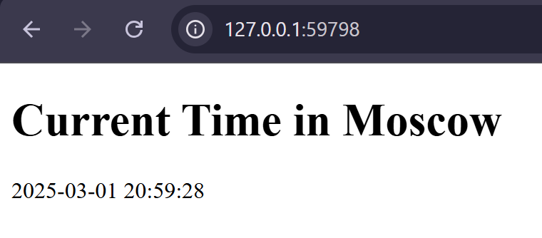

# Task 1: Kubernetes Setup and Basic Deployment

## Deploy

```bash
kubectl create deployment app-python --image=angelika2707/lab2:latest
deployment.apps/app-python create
```

```bash
kubectl get pods
NAME                         READY   STATUS    RESTARTS      AGE
app-python-848565b5c-db4qf   1/1     Running   0             11m
```

```bash
kubectl get deployments
NAME         READY   UP-TO-DATE   AVAILABLE   AGE
app-python   1/1     1            1           12m

```

## Access Application

```bash
kubectl expose deployment app-python --type=LoadBalancer --port=5000
service/app-python exposed
```

```bash
minikube service app-python
|-----------|------------|-------------|---------------------------|
| NAMESPACE |    NAME    | TARGET PORT |            URL            |
|-----------|------------|-------------|---------------------------|
| default   | app-python |        5000 | http://192.168.49.2:30281 |
|-----------|------------|-------------|---------------------------|
* Starting tunnel for service app-python.
|-----------|------------|-------------|------------------------|
| NAMESPACE |    NAME    | TARGET PORT |          URL           |
|-----------|------------|-------------|------------------------|
| default   | app-python |             | http://127.0.0.1:58948 |
|-----------|------------|-------------|------------------------|
* Opening service default/app-python in default browser...
! Because you are using a Docker driver on windows, the terminal needs to be open to run it.
```
## Output of the kubectl get pods,svc command

```bash
kubectl get pods,svc
NAME                             READY   STATUS    RESTARTS   AGE
pod/app-python-848565b5c-db4qf   1/1     Running   0          25m

NAME                 TYPE           CLUSTER-IP     EXTERNAL-IP   PORT(S)          AGE
service/app-python   LoadBalancer   10.99.149.93   <pending>     5000:30281/TCP   8m29s
service/kubernetes   ClusterIP      10.96.0.1      <none>        443/TCP          46h
```

## Cleanup

```bash
kubectl delete deployments app-python
deployment.apps "app-python" deleted
```

```bash
kubectl delete service app-python
service "app-python" deleted
```

# Task 2: Declarative Kubernetes Manifests

## Manifest Files in k8s Folder

```bash
kubectl apply -f k8s
deployment.apps/app-python created
service/app-python-service created
```

```bash
kubectl get pods,svc
NAME                              READY   STATUS    RESTARTS   AGE
pod/app-python-86bf66c9d4-kzp4z   1/1     Running   0          106s
pod/app-python-86bf66c9d4-lmkrs   1/1     Running   0          106s
pod/app-python-86bf66c9d4-vgbkm   1/1     Running   0          106s

NAME                         TYPE        CLUSTER-IP     EXTERNAL-IP   PORT(S)          AGE
service/app-python-service   NodePort    10.103.11.21   <none>        5000:30001/TCP   106s
service/kubernetes           ClusterIP   10.96.0.1      <none>        443/TCP          46h
```

```bash
minikube service --all
|-----------|--------------------|-------------|---------------------------|
| NAMESPACE |        NAME        | TARGET PORT |            URL            |
|-----------|--------------------|-------------|---------------------------|
| default   | app-python-service |        5000 | http://192.168.49.2:30001 |
|-----------|--------------------|-------------|---------------------------|
|-----------|------------|-------------|--------------|
| NAMESPACE |    NAME    | TARGET PORT |     URL      |
|-----------|------------|-------------|--------------|
| default   | kubernetes |             | No node port |
|-----------|------------|-------------|--------------|
* service default/kubernetes has no node port
! Services [default/kubernetes] have type "ClusterIP" not meant to be exposed, however for local development minikube allows you to access this !   
* Starting tunnel for service app-python-service.
* Starting tunnel for service kubernetes.
|-----------|--------------------|-------------|------------------------|
| NAMESPACE |        NAME        | TARGET PORT |          URL           |
|-----------|--------------------|-------------|------------------------|
| default   | app-python-service |             | http://127.0.0.1:59798 |
| default   | kubernetes         |             | http://127.0.0.1:59800 |
|-----------|--------------------|-------------|------------------------|
* Opening service default/app-python-service in default browser...
* Opening service default/kubernetes in default browser...
! Because you are using a Docker driver on windows, the terminal needs to be open to run it.
```

